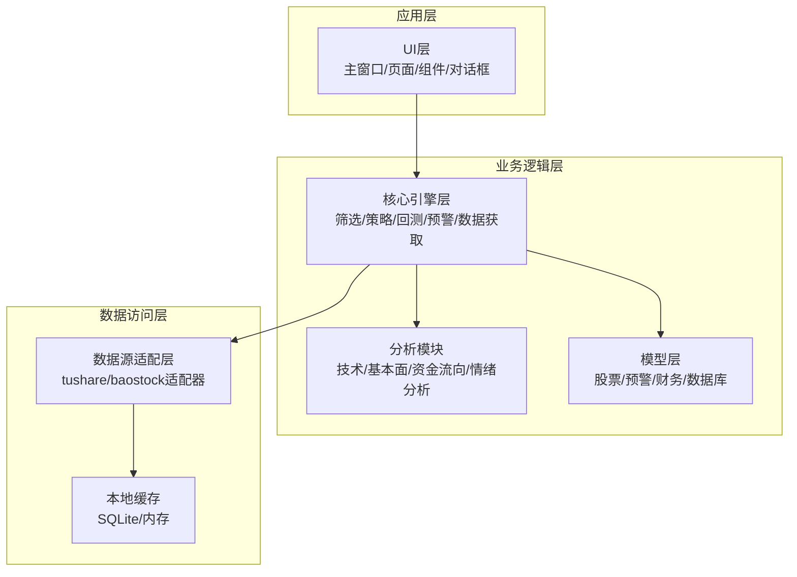
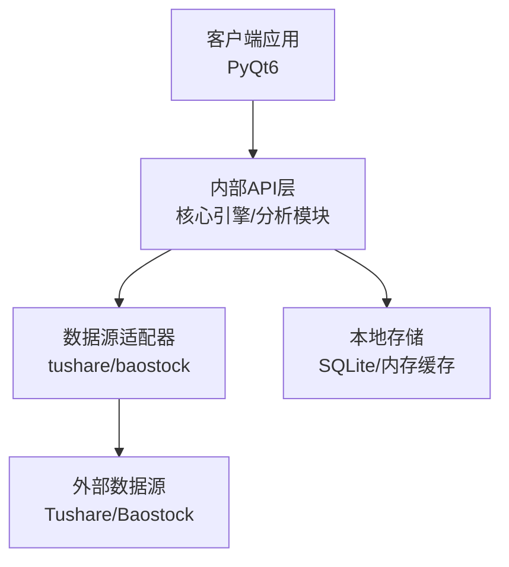
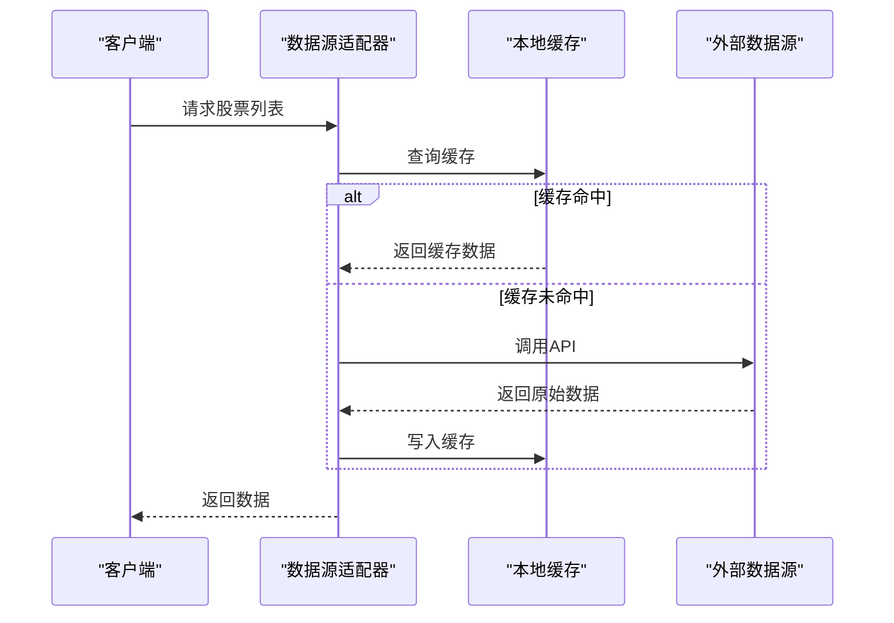
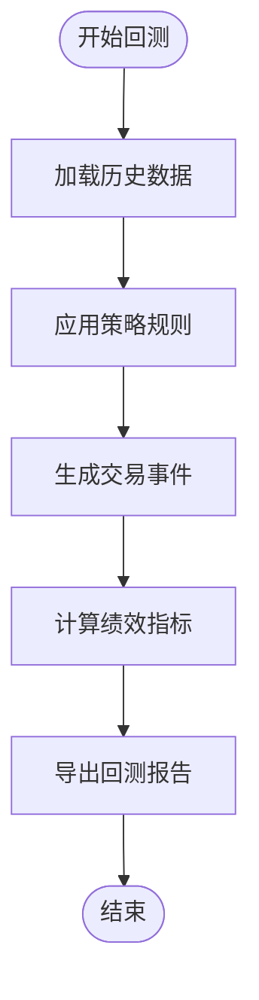
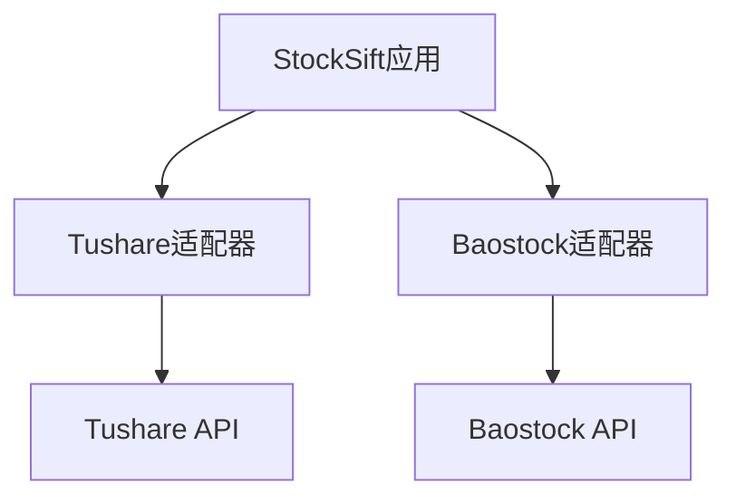
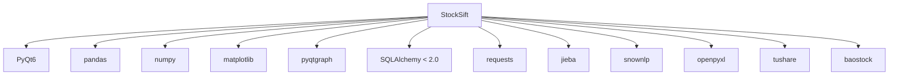

# API接口文档

<cite>
**本文引用的文件**
- [PRD.md](file://docs/PRD.md)
- [requirements.txt](file://requirements.txt)
</cite>

## 目录
1. [简介](#简介)
2. [项目结构](#项目结构)
3. [核心组件](#核心组件)
4. [架构总览](#架构总览)
5. [详细组件分析](#详细组件分析)
6. [依赖分析](#依赖分析)
7. [性能考虑](#性能考虑)
8. [故障排除指南](#故障排除指南)
9. [结论](#结论)
10. [附录](#附录)

## 简介
本文件为StockSift的API接口规范文档，面向第三方开发者与内部使用者，系统性梳理数据源API、策略引擎API与外部集成接口的设计规范与使用方法。文档基于仓库中的产品需求文档与依赖清单进行归纳总结，明确RESTful API的HTTP方法、URL模式、请求响应模式与认证方法；对内部API提供函数签名、参数定义、返回值格式与异常处理的规范说明；并给出接口版本管理、向后兼容性与迁移指南、调用示例、错误处理策略与性能优化建议。

## 项目结构
StockSift采用模块化分层架构，核心模块包括：
- 数据源适配层：支持tushare、baostock等数据源的适配器
- 核心引擎层：筛选引擎、策略管理、回测引擎、预警引擎、数据获取
- 分析模块：技术分析、基本面分析、资金流向、情绪分析
- 模型层：股票、预警、财务、数据库等数据模型
- UI层：主窗口、页面、组件与对话框
- 工具层：通用工具函数
- 资源与配置：图标、策略模板、主题资源与配置文件
- 数据与日志：本地缓存、数据库与日志目录

**章节来源**
- [PRD.md: 214-247:214-247](file://docs/PRD.md#L214-L247)

## 核心组件
- 数据源适配器：抽象基类与具体适配器（tushare、baostock），负责统一数据获取接口与错误处理
- 筛选引擎：根据多维条件组合进行股票筛选，支持基础条件、技术指标、资金流向与财务指标
- 策略管理：策略定义、参数配置与执行调度
- 回测引擎：基于历史数据验证策略表现，输出收益曲线、交易记录与绩效指标
- 预警引擎：基于阈值与技术信号触发预警
- 数据获取：统一的数据抓取与缓存策略，支持增量更新与故障转移
- 分析模块：技术指标计算、资金流向统计、财务指标分析与情绪分析
- 模型层：数据模型定义与数据库映射

**章节来源**
- [PRD.md: 219-238:219-238](file://docs/PRD.md#L219-L238)

## 架构总览
StockSift采用桌面端GUI应用架构，数据流从UI层发起，经由核心引擎与分析模块处理，通过数据源适配器访问外部数据源，并结合本地缓存与数据库实现高效的数据读写与查询。

**图表来源**
- [PRD.md: 214-247:214-247](file://docs/PRD.md#L214-L247)

## 详细组件分析

### 数据源API规范
- 设计目标：统一多数据源接口，支持API Key配置、优先级与自动切换
- 接口职责
  - 获取股票列表与日线数据
  - 实时行情与资金流向
  - 财务数据与概念板块信息
- 认证与配置
  - API Key管理与轮询策略
  - 数据源优先级与故障转移
- 缓存与更新
  - 股票列表每日缓存
  - 日线数据每日收盘后缓存
  - 实时行情内存+SQLite混合缓存
  - 财务数据按季更新
- 错误处理
  - 超时与重试策略
  - 异常降级与本地缓存兜底

**章节来源**
- [PRD.md: 251-272:251-272](file://docs/PRD.md#L251-L272)

### 策略引擎API规范
- 策略定义
  - 基于筛选条件创建策略
  - 支持多条件组合与买入/卖出规则
- 回测参数
  - 回测时间范围、初始资金、仓位管理、交易费率
- 回测结果
  - 收益曲线、交易记录、绩效指标（总收益率、年化、最大回撤、夏普比率、胜率）
- 导出
  - 回测报告导出

**章节来源**
- [PRD.md: 141-159:141-159](file://docs/PRD.md#L141-L159)

### 外部集成接口
- 第三方数据源
  - tushare：专业金融数据接口
  - baostock：开源免费数据接口
- 认证方式
  - API Key配置与轮询
- 网络与稳定性
  - requests网络请求库
  - 超时与重试、故障转移

**章节来源**
- [PRD.md: 254-257:254-257](file://docs/PRD.md#L254-L257)
- [requirements.txt: 9-10:9-10](file://requirements.txt#L9-L10)
- [requirements.txt: 24](file://requirements.txt#L24)

## 依赖分析
- GUI框架：PyQt6
- 数据处理：pandas、numpy
- 可视化：matplotlib、pyqtgraph
- 数据库：SQLAlchemy（小于2.0）+ SQLite
- 网络请求：requests
- 中文处理：jieba、snownlp
- Excel导出：openpyxl
- 数据源：tushare、baostock

**图表来源**
- [requirements.txt: 5-31:5-31](file://requirements.txt#L5-L31)

**章节来源**
- [requirements.txt: 1-32:1-32](file://requirements.txt#L1-L32)

## 性能考虑
- 筛选性能：全市场股票筛选响应时间应小于3秒
- UI流畅度：界面切换无卡顿
- 监控规模：支持同时监控100+自选股
- 内存占用：控制在500MB以内
- 缓存策略：合理利用本地SQLite与内存缓存，减少重复请求
- 并发与重试：在网络请求中实施超时与重试，避免阻塞主线程

## 故障排除指南
- 数据源异常
  - 自动重试与故障转移
  - 使用本地缓存作为降级方案
- API Key问题
  - 校验Key有效性与配额
  - 支持多Key轮询
- 网络超时
  - 设置合理的超时阈值与重试次数
- 数据不一致
  - 增量更新与缓存失效策略
- UI卡顿
  - 将耗时任务放入后台线程
  - 分批渲染与虚拟滚动

## 结论
本文档基于现有仓库信息，对StockSift的数据源API、策略引擎API与外部集成接口进行了系统化梳理。建议在后续开发中补充各模块的内部API函数签名、参数与返回值规范，并完善RESTful API的URL模式与认证细节，以满足第三方集成与二次开发的需求。

## 附录
- 术语表
  - K线：股票价格的开盘价、最高价、最低价、收盘价组成的图形
  - MACD：指数平滑异同移动平均线
  - KDJ：随机指标
  - RSI：相对强弱指标
  - PE：市盈率
  - PB：市净率
  - ROE：净资产收益率

**章节来源**
- [PRD.md: 331-341:331-341](file://docs/PRD.md#L331-L341)