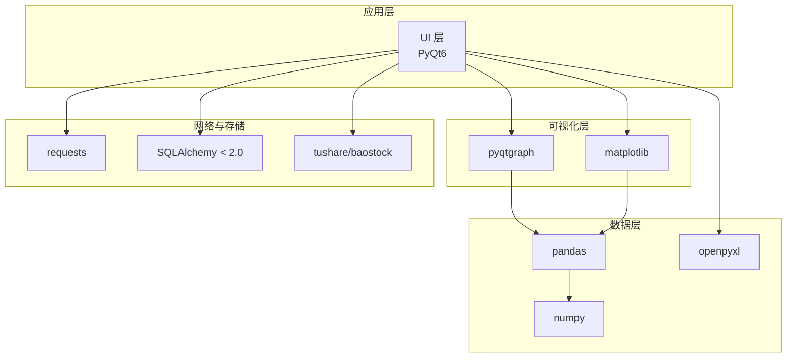
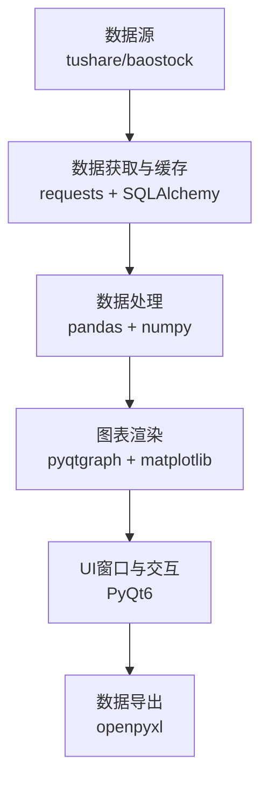
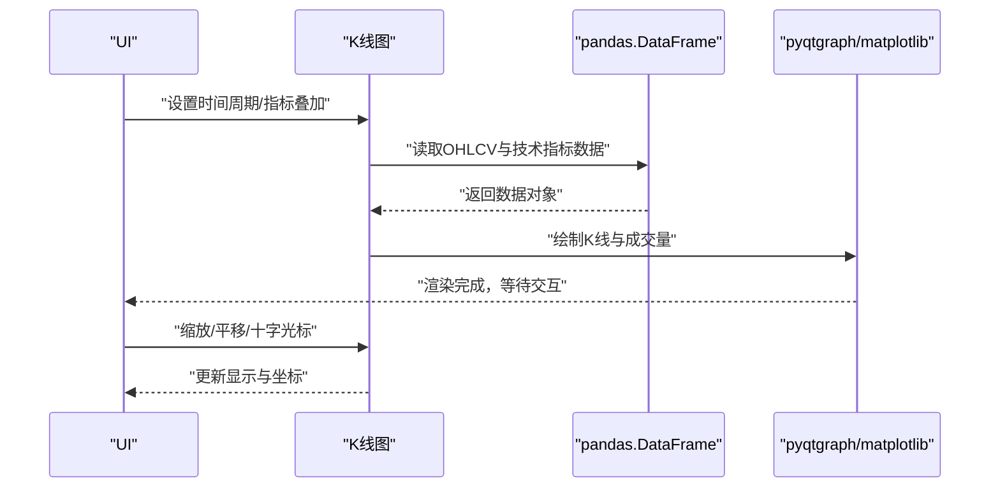
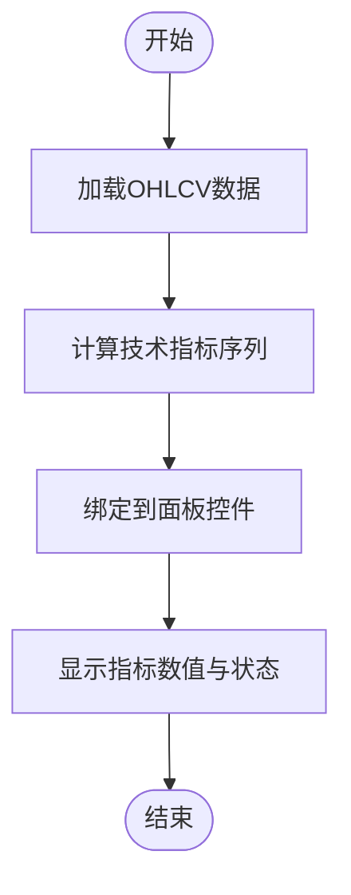
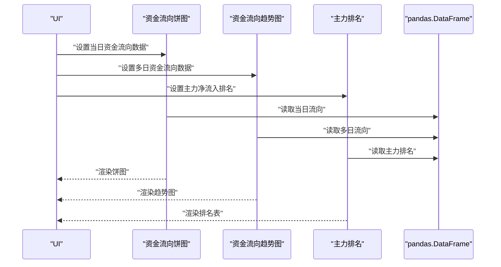
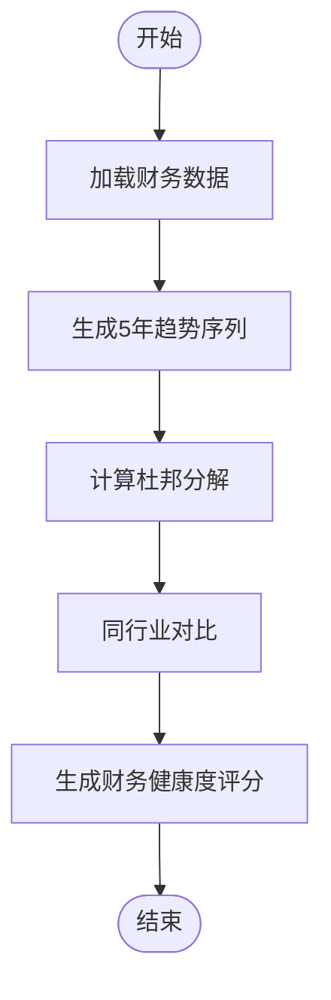
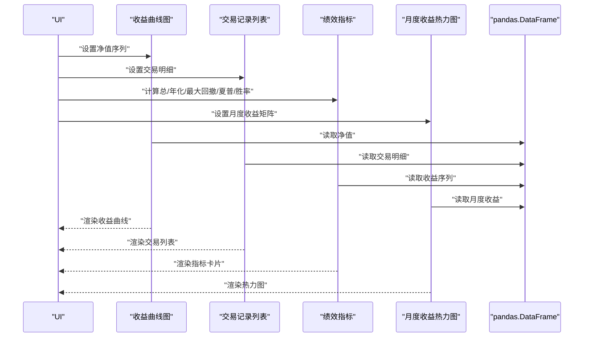
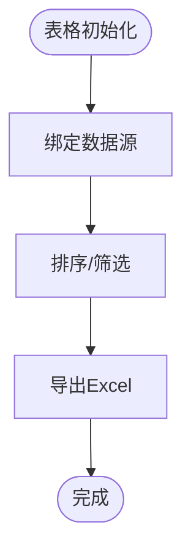
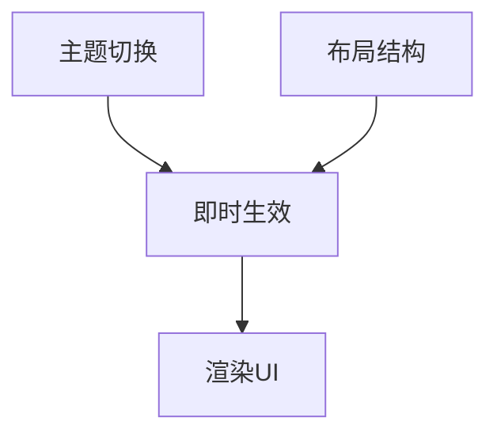
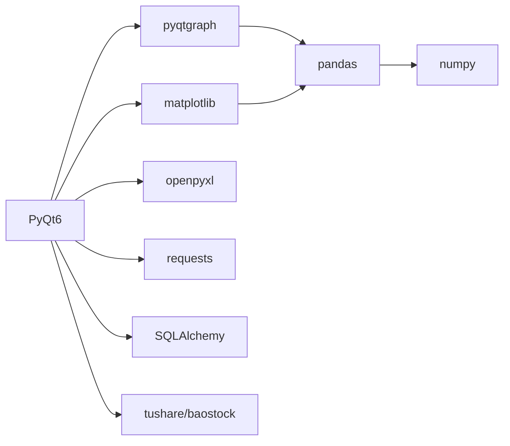

# 可视化API

<cite>
**本文引用的文件**
- [PRD.md](file://docs/PRD.md)
- [requirements.txt](file://requirements.txt)
</cite>

## 目录
1. [简介](#简介)
2. [项目结构](#项目结构)
3. [核心组件](#核心组件)
4. [架构总览](#架构总览)
5. [详细组件分析](#详细组件分析)
6. [依赖关系分析](#依赖关系分析)
7. [性能考虑](#性能考虑)
8. [故障排查指南](#故障排查指南)
9. [结论](#结论)
10. [附录](#附录)

## 简介
本文件为 StockSift 可视化API的权威说明，聚焦于图表渲染、数据展示与交互控制的接口规范。根据仓库中的产品需求文档与技术栈信息，系统采用 PyQt6 作为GUI框架，结合 pyqtgraph 与 matplotlib 实现高性能图表与可视化面板，并通过 pandas/numpy 进行数据处理，以满足A股桌面端选股分析工具对实时性与交互性的高要求。

## 项目结构
- 顶层目录包含配置、核心业务、数据源、模型、UI、工具与资源等模块。其中与可视化直接相关的关键信息来自 PRD 的功能描述与 requirements 的技术栈声明。
- UI层采用 PyQt6；图表层依赖 pyqtgraph 与 matplotlib；数据层依赖 pandas/numpy；导出功能依赖 openpyxl。

**图表来源**
- [requirements.txt:16-18](file://requirements.txt#L16-L18)
- [requirements.txt:13-14](file://requirements.txt#L13-L14)
- [requirements.txt:30-31](file://requirements.txt#L30-L31)
- [requirements.txt:23-24](file://requirements.txt#L23-L24)
- [requirements.txt:20-21](file://requirements.txt#L20-L21)
- [requirements.txt:9-10](file://requirements.txt#L9-L10)

**章节来源**
- [PRD.md:294-337](file://docs/PRD.md#L294-L337)
- [requirements.txt:1-32](file://requirements.txt#L1-L32)

## 核心组件
- 图表组件族
  - K线图：支持日线/周线/月线时间周期，叠加 MA、MACD、KDJ、RSI、布林带等技术指标，具备缩放、平移、十字光标等交互。
  - 收益曲线图：用于策略回测结果展示，包含收益曲线与绩效指标可视化。
  - 资金流向图：包含当日资金流向饼图与多日趋势图，支持主力净流入/流出排名。
  - 财务报表可视化：财务指标趋势图、杜邦分析拆解、同行业对比与财务健康度评分。
  - 市场概览图：大盘指数走势、板块热点排行、涨跌分布饼图、估值概览等。
- 表格组件
  - 自选股列表：支持排序、筛选、点击跳转详情页、实时刷新（可配置刷新间隔）。
  - 回测交易记录列表：用于展示交易明细。
  - 财务数据表格：展示主要财务指标与趋势。
- 交互控制
  - 主题切换：浅色/深色主题即时生效。
  - 响应式布局：基于 PyQt6 的主窗口布局（菜单栏/工具栏/侧边栏/主内容区/状态栏）。
  - 数据导出：支持筛选结果、自选股、回测报告、财务数据、估值分析报告等导出为Excel。

**章节来源**
- [PRD.md:110-148](file://docs/PRD.md#L110-L148)
- [PRD.md:168-194](file://docs/PRD.md#L168-L194)
- [PRD.md:195-218](file://docs/PRD.md#L195-L218)
- [PRD.md:221-238](file://docs/PRD.md#L221-L238)
- [PRD.md:246-260](file://docs/PRD.md#L246-L260)
- [PRD.md:265-291](file://docs/PRD.md#L265-L291)

## 架构总览
可视化子系统围绕“数据-图表-交互”三层展开：
- 数据层：从 tushare/baostock 获取原始行情/财务/资金流向数据，经 pandas/numpy 清洗与计算，形成图表所需的数据结构。
- 图表层：pyqtgraph 与 matplotlib 负责渲染各类图表，支持交互控件（缩放、平移、十字光标、指标叠加）。
- 交互层：PyQt6 提供窗口、菜单、工具栏、侧边栏、状态栏与对话框，承载可视化面板与表格组件。

**图表来源**
- [requirements.txt:9-10](file://requirements.txt#L9-L10)
- [requirements.txt:13-14](file://requirements.txt#L13-L14)
- [requirements.txt:16-18](file://requirements.txt#L16-L18)
- [requirements.txt:20-21](file://requirements.txt#L20-L21)
- [requirements.txt:23-24](file://requirements.txt#L23-L24)
- [requirements.txt:30-31](file://requirements.txt#L30-L31)

## 详细组件分析

### K线图组件（Stock Detail）
- 初始化参数
  - 时间周期：日线/周线/月线
  - 数据源：OHLCV（开盘/最高/最低/收盘/成交量）
  - 技术指标叠加：MA、MACD、KDJ、RSI、布林带
- 数据绑定方式
  - 输入：pandas DataFrame（索引为日期，列含开盘/最高/最低/收盘/成交量）
  - 输出：K线蜡烛图与成交量柱状图
- 交互控制
  - 缩放：X轴时间范围缩放
  - 平移：X轴时间轴拖拽
  - 十字光标：鼠标悬停显示交叉线与数值
- 样式配置
  - K线颜色：上涨/下跌区分
  - 成交量颜色：与K线一致或对比色
  - 指标线条：不同颜色与线型区分
- 使用示例路径
  - [K线图表说明:112-117](file://docs/PRD.md#L112-L117)

**图表来源**
- [PRD.md:112-117](file://docs/PRD.md#L112-L117)
- [requirements.txt:16-18](file://requirements.txt#L16-L18)

**章节来源**
- [PRD.md:112-117](file://docs/PRD.md#L112-L117)

### 技术指标面板（Stock Detail）
- 指标类型
  - MACD：金叉/死叉/多头排列/空头排列
  - KDJ：K/D/J值范围，金叉/死叉
  - RSI：6日/12日/24日 RSI 值范围
  - 均线：5/10/20/60日均线，多头排列/空头排列/突破
  - 布林带：触及上轨/下轨/中轨，开口/缩口
  - 成交量：放量/缩量，量比范围
- 数据绑定
  - 输入：pandas DataFrame（含OHLCV与计算后的指标序列）
  - 输出：指标数值与状态标签（超买/超卖/金叉/死叉等）
- 使用示例路径
  - [技术指标筛选说明:48-57](file://docs/PRD.md#L48-L57)

**图表来源**
- [PRD.md:48-57](file://docs/PRD.md#L48-L57)

**章节来源**
- [PRD.md:48-57](file://docs/PRD.md#L48-L57)

### 资金流向面板（Stock Detail）
- 图表类型
  - 当日资金流向饼图：超大单/大单/中单/小单
  - 近5/10/20日资金流向趋势图
  - 主力净流入/流出排名
- 数据绑定
  - 输入：pandas DataFrame（含当日/多日资金流向与主力净流入序列）
  - 输出：饼图与折线图
- 使用示例路径
  - [资金流向筛选说明:58-66](file://docs/PRD.md#L58-L66)

**图表来源**
- [PRD.md:58-66](file://docs/PRD.md#L58-L66)

**章节来源**
- [PRD.md:58-66](file://docs/PRD.md#L58-L66)

### 财务数据面板（Stock Detail）
- 图表类型
  - 主要财务指标一览
  - 近期财报数据（季报/年报）
  - 财务指标趋势图（近5年）
  - 杜邦分析（ROE拆解）
  - 同行业对比分析
  - 财务健康度评分
- 数据绑定
  - 输入：pandas DataFrame（财务指标与趋势序列）
  - 输出：多维图表与评分卡片
- 使用示例路径
  - [财务指标筛选说明:67-89](file://docs/PRD.md#L67-L89)
  - [价值投资指标筛选说明:90-109](file://docs/PRD.md#L90-L109)

**图表来源**
- [PRD.md:67-89](file://docs/PRD.md#L67-L89)
- [PRD.md:90-109](file://docs/PRD.md#L90-L109)

**章节来源**
- [PRD.md:67-89](file://docs/PRD.md#L67-L89)
- [PRD.md:90-109](file://docs/PRD.md#L90-L109)

### 市场概览面板（Market Overview）
- 图表类型
  - 大盘指数走势（上证/深证/创业板/科创50）
  - 板块热点排行（行业/概念）
  - 涨跌分布饼图与涨跌停统计
  - 资金流向总览（市场整体/北向）
  - 估值概览（PE/PB、行业估值分布、破净股、高股息池）
- 数据绑定
  - 输入：pandas DataFrame（指数/板块/资金/估值序列）
  - 输出：折线图、柱状图、饼图与热力图
- 使用示例路径
  - [市场概览说明:168-194](file://docs/PRD.md#L168-L194)

**图表来源**
- [PRD.md:168-194](file://docs/PRD.md#L168-L194)

**章节来源**
- [PRD.md:168-194](file://docs/PRD.md#L168-L194)

### 策略回测结果面板（Backtest）
- 图表类型
  - 收益曲线图
  - 交易记录列表
  - 绩效指标：总收益率、年化收益率、最大回撤、夏普比率、胜率等
  - 年度收益分布
  - 月度收益热力图
- 数据绑定
  - 输入：pandas DataFrame（净值序列、交易明细、年度/月度收益）
  - 输出：收益曲线与指标卡片
- 使用示例路径
  - [策略回测说明:195-218](file://docs/PRD.md#L195-L218)

**图表来源**
- [PRD.md:195-218](file://docs/PRD.md#L195-L218)

**章节来源**
- [PRD.md:195-218](file://docs/PRD.md#L195-L218)

### 价值投资分析工具（Value Investing）
- 组件类型
  - 股票对比工具：多股票财务指标对比、估值水平对比、盈利能力对比、成长性对比
  - 估值计算器：DCF、格雷厄姆、彼得林奇PEG、历史估值区间参考
  - 财报分析：财务报表可视化、财务指标趋势分析、异常指标预警、同行业排名
  - 优质股票池：高ROE、低估值、高股息、成长股、白马股池
- 数据绑定
  - 输入：pandas DataFrame（多股票财务/估值/趋势序列）
  - 输出：对比图表与筛选结果
- 使用示例路径
  - [价值投资分析说明:219-245](file://docs/PRD.md#L219-L245)

**图表来源**
- [PRD.md:219-245](file://docs/PRD.md#L219-L245)

**章节来源**
- [PRD.md:219-245](file://docs/PRD.md#L219-L245)

### 表格组件（数据展示与交互）
- 自选股列表
  - 字段：代码、名称、最新价、涨跌幅、换手率等
  - 功能：排序、筛选、点击跳转详情页、实时刷新（可配置刷新间隔）
- 回测交易记录列表
  - 字段：交易时间、标的、方向、价格、数量、手续费等
  - 功能：排序、筛选、导出
- 财务数据表格
  - 字段：财务指标、时间序列、同比/环比
  - 功能：排序、筛选、导出
- 数据导出
  - 支持导出为 Excel（openpyxl）
- 使用示例路径
  - [自选股管理说明:149-160](file://docs/PRD.md#L149-L160)
  - [数据导出说明:254-260](file://docs/PRD.md#L254-L260)

**图表来源**
- [PRD.md:149-160](file://docs/PRD.md#L149-L160)
- [PRD.md:254-260](file://docs/PRD.md#L254-L260)
- [requirements.txt:30-31](file://requirements.txt#L30-L31)

**章节来源**
- [PRD.md:149-160](file://docs/PRD.md#L149-L160)
- [PRD.md:254-260](file://docs/PRD.md#L254-L260)
- [requirements.txt:30-31](file://requirements.txt#L30-L31)

### 主题切换与响应式布局
- 主题支持
  - 浅色主题（默认）、深色主题
  - 主题切换即时生效
- 响应式布局
  - 菜单栏 + 工具栏
  - 侧边栏（导航）
  - 主内容区（动态页面）
  - 状态栏
- 使用示例路径
  - [主题支持说明:287-291](file://docs/PRD.md#L287-L291)
  - [布局说明:265-277](file://docs/PRD.md#L265-L277)

**图表来源**
- [PRD.md:287-291](file://docs/PRD.md#L287-L291)
- [PRD.md:265-277](file://docs/PRD.md#L265-L277)

**章节来源**
- [PRD.md:287-291](file://docs/PRD.md#L287-L291)
- [PRD.md:265-277](file://docs/PRD.md#L265-L277)

## 依赖关系分析
- 组件耦合
  - UI层与可视化层松耦合，通过数据接口传递数据对象（pandas DataFrame），便于替换渲染引擎。
  - 数据层与可视化层通过统一的数据结构对接，降低数据格式转换成本。
- 外部依赖
  - PyQt6：窗口与交互
  - pyqtgraph/matplotlib：图表渲染
  - pandas/numpy：数据处理与计算
  - openpyxl：Excel导出
  - requests/sqlalchemy：网络请求与数据库访问
  - tushare/baostock：数据源

**图表来源**
- [requirements.txt:5](file://requirements.txt#L5)
- [requirements.txt:16-18](file://requirements.txt#L16-L18)
- [requirements.txt:13-14](file://requirements.txt#L13-L14)
- [requirements.txt:30-31](file://requirements.txt#L30-L31)
- [requirements.txt:23-24](file://requirements.txt#L23-L24)
- [requirements.txt:20-21](file://requirements.txt#L20-L21)
- [requirements.txt:9-10](file://requirements.txt#L9-L10)

**章节来源**
- [requirements.txt:1-32](file://requirements.txt#L1-L32)

## 性能考虑
- 数据处理
  - 使用 pandas/numpy 进行批量化计算，避免逐行循环。
  - 对高频数据（如实时行情）采用内存缓存与增量更新策略。
- 图表渲染
  - pyqtgraph 适合大规模时间序列渲染；对超大数据集可启用采样或分页。
  - matplotlib 适用于静态或低频更新图表，减少重绘开销。
- 交互优化
  - 缩放/平移操作仅更新可见区域数据，避免全量重绘。
  - 十字光标查询采用索引加速与二分查找。
- 导出性能
  - Excel导出采用批量写入，避免逐单元格写入。
- 跨平台兼容
  - PyQt6 在Windows/macOS/Linux表现一致；注意字体与图标资源路径。
  - pyqtgraph/matplotlib 在不同后端下的渲染差异需测试验证。

[本节为通用性能建议，无需特定文件引用]

## 故障排查指南
- 图表空白或渲染异常
  - 检查数据是否为空或格式不正确（索引/列名）。
  - 确认pyqtgraph/matplotlib版本与依赖兼容。
- 交互无响应
  - 检查事件循环是否被阻塞（避免在主线程执行耗时任务）。
  - 确认窗口层级与焦点设置。
- 导出失败
  - 检查openpyxl版本与文件权限。
  - 确认目标文件未被其他程序占用。
- 数据源异常
  - 检查tushare/baostock API Key与网络连通性。
  - 使用requests进行超时与重试配置。

**章节来源**
- [requirements.txt:9-10](file://requirements.txt#L9-L10)
- [requirements.txt:23-24](file://requirements.txt#L23-L24)

## 结论
本可视化API以 PyQt6 为UI基础，结合 pyqtgraph 与 matplotlib 实现了覆盖K线图、技术指标、资金流向、财务分析、市场概览与策略回测的完整图表体系。通过 pandas/numpy 的高效数据处理与 openpyxl 的导出能力，满足A股桌面端选股分析工具对实时性、交互性与可扩展性的需求。建议在实际开发中遵循统一的数据接口与渲染抽象，确保跨平台一致性与长期演进空间。

[本节为总结性内容，无需特定文件引用]

## 附录
- 术语
  - K线：股票价格的开盘价、最高价、最低价、收盘价组成的图形
  - MACD：指数平滑异同移动平均线
  - KDJ：随机指标
  - RSI：相对强弱指标
  - PE/PB/PEG/PCF/PS：估值指标
  - DCF/EV/EBITDA：估值与企业价值倍数
- 参考资料
  - Tushare Pro API 文档
  - Baostock API 文档
  - PyQt6 官方文档

**章节来源**
- [PRD.md:428-449](file://docs/PRD.md#L428-L449)