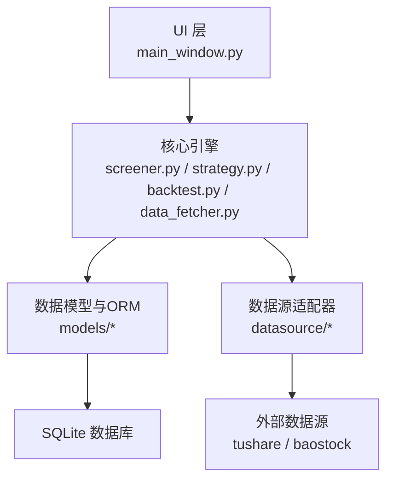
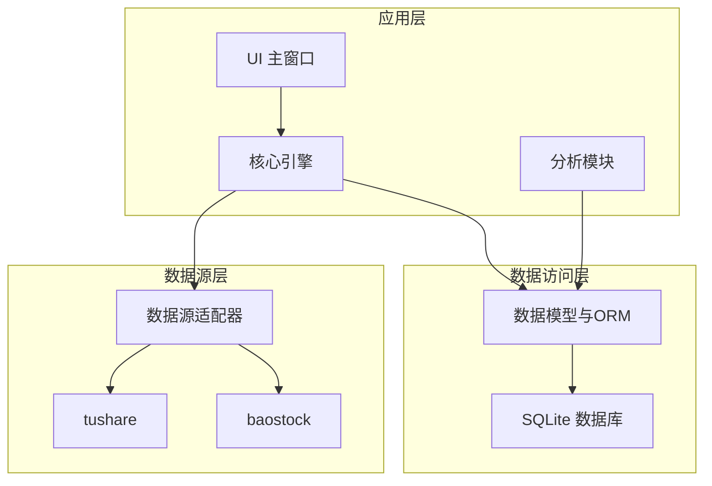
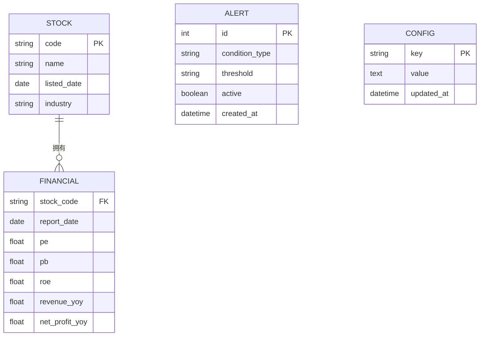
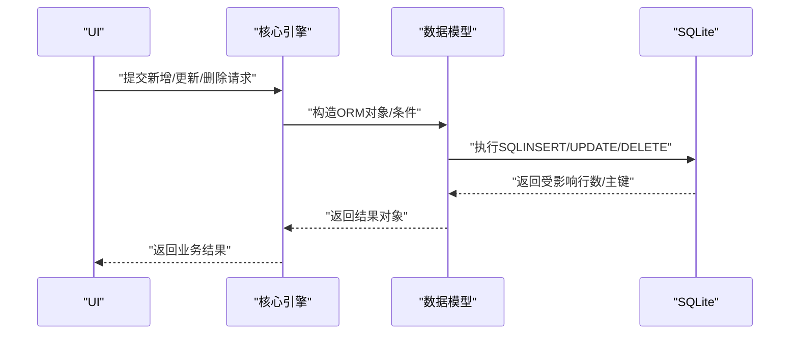
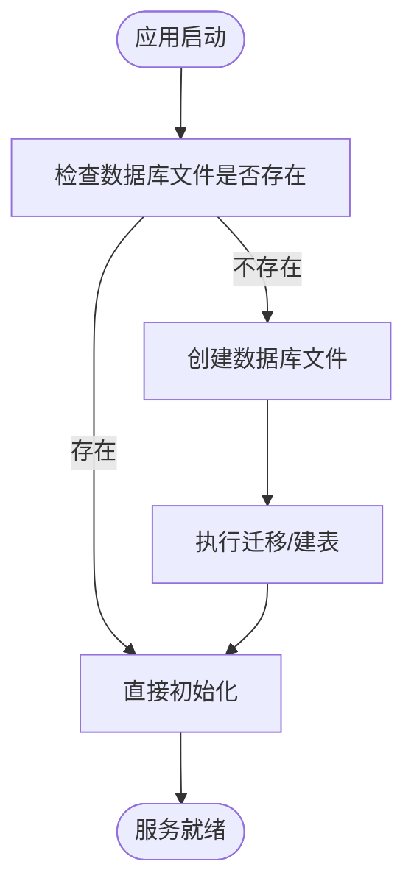
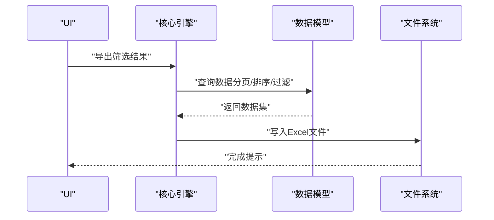
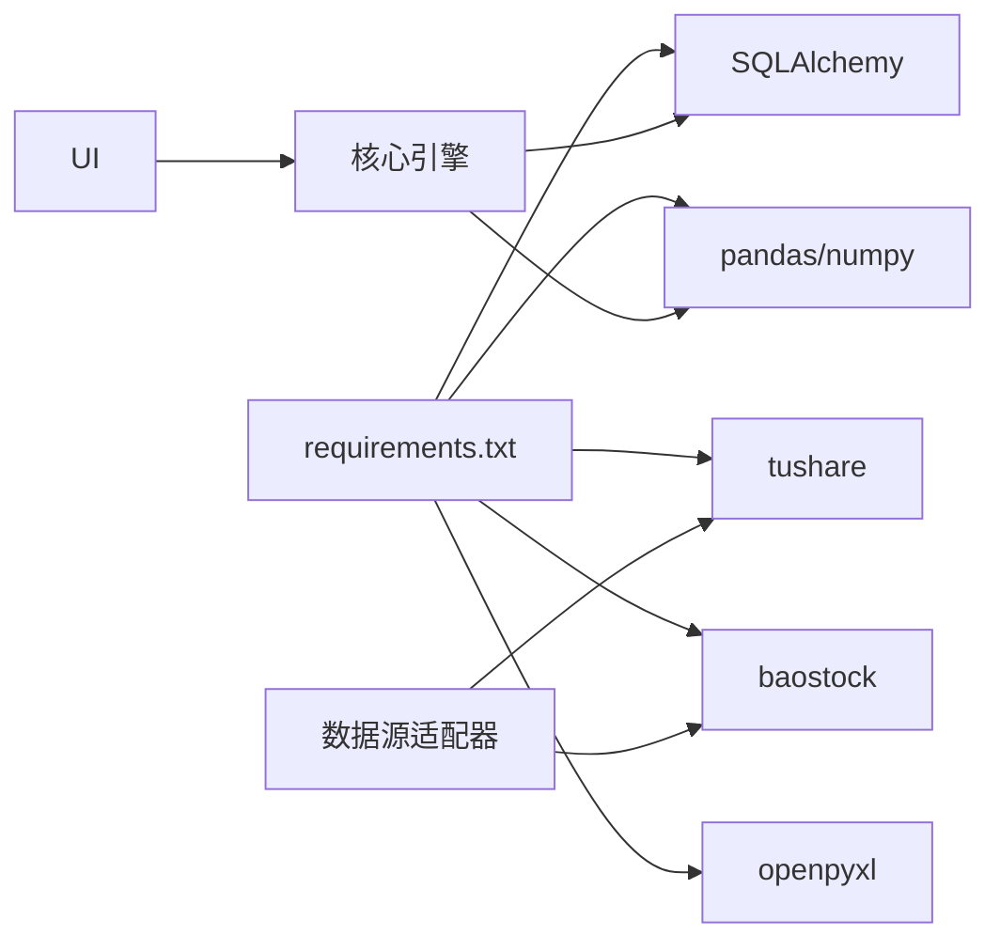
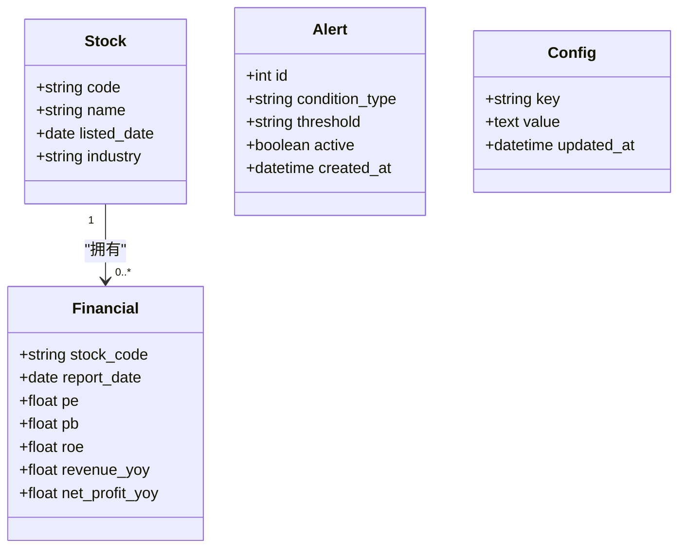

# 数据库API

<cite>
**本文引用的文件**
- [requirements.txt](file://requirements.txt)
- [PRD.md](file://docs/PRD.md)
- [main_window.py](file://src/ui/main_window.py)
- [screener.py](file://src/core/screener.py)
- [strategy.py](file://src/core/strategy.py)
- [backtest.py](file://src/core/backtest.py)
- [data_fetcher.py](file://src/core/data_fetcher.py)
- [base_adapter.py](file://src/datasource/base_adapter.py)
- [tushare_adapter.py](file://src/datasource/tushare_adapter.py)
- [baostock_adapter.py](file://src/datasource/baostock_adapter.py)
- [stock.py](file://src/models/stock.py)
- [alert.py](file://src/models/alert.py)
- [financial.py](file://src/models/financial.py)
- [database.py](file://src/models/database.py)
</cite>

## 目录
1. [简介](#简介)
2. [项目结构](#项目结构)
3. [核心组件](#核心组件)
4. [架构总览](#架构总览)
5. [详细组件分析](#详细组件分析)
6. [依赖分析](#依赖分析)
7. [性能考虑](#性能考虑)
8. [故障排除指南](#故障排除指南)
9. [结论](#结论)
10. [附录](#附录)

## 简介
本文件面向开发者，系统化梳理数据库API的设计与使用，覆盖数据持久化、查询与管理接口规范；明确数据库连接配置、表结构与索引设计；详述股票数据、用户策略、系统配置等数据模型的CRUD操作；提供批量导入导出、备份恢复与性能优化的API使用指南；阐述事务处理、并发控制与数据一致性保障机制，并给出错误处理策略与调优建议。

## 项目结构
- 技术栈与数据库选型：采用SQLite作为本地数据库，使用SQLAlchemy 1.x进行ORM映射与查询。
- 模块划分：核心引擎（筛选、策略、回测、数据获取）、数据源适配器（tushare、baostock）、分析模块、UI层、工具函数与数据模型。
- 数据存储：应用数据位于data/目录，数据库文件通常由SQLAlchemy在运行时创建或迁移。

**章节来源**
- [PRD.md: 294-337:294-337](file://docs/PRD.md#L294-L337)
- [requirements.txt: 20-21:20-21](file://requirements.txt#L20-L21)

## 核心组件
- 数据模型与ORM：通过SQLAlchemy定义股票、预警、财务等实体及关系，提供统一的CRUD接口。
- 核心引擎：筛选引擎负责条件查询与结果落库；策略引擎管理用户策略与回测；回测引擎执行历史回测并写入结果；数据获取引擎从数据源拉取增量数据并入库。
- 数据源适配器：抽象基类与具体实现（tushare、baostock）负责标准化数据格式并写入数据库。
- UI层：主窗口协调各模块，触发数据库读写与批量导出等操作。

**章节来源**
- [PRD.md: 304-337:304-337](file://docs/PRD.md#L304-L337)
- [main_window.py](file://src/ui/main_window.py)
- [screener.py](file://src/core/screener.py)
- [strategy.py](file://src/core/strategy.py)
- [backtest.py](file://src/core/backtest.py)
- [data_fetcher.py](file://src/core/data_fetcher.py)
- [base_adapter.py](file://src/datasource/base_adapter.py)
- [tushare_adapter.py](file://src/datasource/tushare_adapter.py)
- [baostock_adapter.py](file://src/datasource/baostock_adapter.py)

## 架构总览
下图展示数据库API在系统中的位置与交互关系：

**图示来源**
- [main_window.py](file://src/ui/main_window.py)
- [screener.py](file://src/core/screener.py)
- [strategy.py](file://src/core/strategy.py)
- [backtest.py](file://src/core/backtest.py)
- [data_fetcher.py](file://src/core/data_fetcher.py)
- [base_adapter.py](file://src/datasource/base_adapter.py)
- [tushare_adapter.py](file://src/datasource/tushare_adapter.py)
- [baostock_adapter.py](file://src/datasource/baostock_adapter.py)
- [stock.py](file://src/models/stock.py)
- [alert.py](file://src/models/alert.py)
- [financial.py](file://src/models/financial.py)
- [database.py](file://src/models/database.py)

## 详细组件分析

### 数据模型与表结构
- 股票基础信息：包含股票代码、名称、上市日期、行业等字段，用于筛选与回测。
- 财务数据：包含季度/年度财务指标，支持趋势分析与异常预警。
- 预警规则：包含用户自定义的预警条件与状态。
- 系统配置：用于保存应用配置、数据源密钥、更新策略等。

**图示来源**
- [stock.py](file://src/models/stock.py)
- [financial.py](file://src/models/financial.py)
- [alert.py](file://src/models/alert.py)
- [database.py](file://src/models/database.py)

**章节来源**
- [stock.py](file://src/models/stock.py)
- [financial.py](file://src/models/financial.py)
- [alert.py](file://src/models/alert.py)
- [database.py](file://src/models/database.py)

### CRUD 接口规范
- 创建（Create）
  - 新增股票：接收标准化字段，写入STOCK表。
  - 新增财务数据：按stock_code与report_date唯一约束写入FINANCIAL表。
  - 新增预警：写入ALERT表，返回自增ID。
  - 新增配置：写入CONFIG表，键唯一。
- 读取（Read）
  - 查询股票：按code精确查询或按条件过滤（行业、名称模糊匹配）。
  - 查询财务：按stock_code与时间范围查询，支持排序与分页。
  - 查询预警：按active与condition_type过滤。
  - 查询配置：按key精确查询或列出所有配置。
- 更新（Update）
  - 更新股票：按code更新名称、行业等。
  - 更新财务：按stock_code+report_date更新指标。
  - 更新预警：启用/禁用、修改阈值。
  - 更新配置：按key更新value。
- 删除（Delete）
  - 删除股票：级联删除其财务数据。
  - 删除预警：按ID删除。
  - 删除配置：按key删除。

**图示来源**
- [stock.py](file://src/models/stock.py)
- [financial.py](file://src/models/financial.py)
- [alert.py](file://src/models/alert.py)
- [database.py](file://src/models/database.py)

**章节来源**
- [stock.py](file://src/models/stock.py)
- [financial.py](file://src/models/financial.py)
- [alert.py](file://src/models/alert.py)
- [database.py](file://src/models/database.py)

### 数据库连接与配置
- 连接方式：使用SQLAlchemy创建Engine与Session，支持SQLite文件路径配置。
- 初始化流程：启动时检查数据库是否存在，不存在则执行建表与初始化数据。
- 事务管理：对批量写入与回测结果落库使用显式事务，失败回滚。
- 并发控制：SQLite在单机场景下以文件锁保证一致性；高并发写入建议使用连接池与合理事务粒度。

**图示来源**
- [database.py](file://src/models/database.py)

**章节来源**
- [database.py](file://src/models/database.py)
- [requirements.txt: 20-21:20-21](file://requirements.txt#L20-L21)

### 数据导入导出与备份恢复
- 导入
  - 批量写入：使用ORM批量插入或原生SQL批量INSERT，结合事务一次性提交。
  - 增量更新：基于时间戳或版本号识别新数据，避免重复写入。
- 导出
  - 筛选结果导出Excel：从数据库查询后写入Excel。
  - 自选股/回测报告导出：按业务维度聚合查询并导出。
- 备份与恢复
  - 备份：复制SQLite文件或使用VACUUM+备份。
  - 恢复：停止服务后替换数据库文件，必要时重建索引。

**图示来源**
- [main_window.py](file://src/ui/main_window.py)
- [screener.py](file://src/core/screener.py)

**章节来源**
- [main_window.py](file://src/ui/main_window.py)
- [screener.py](file://src/core/screener.py)
- [PRD.md: 246-260:246-260](file://docs/PRD.md#L246-L260)

### 事务处理、并发控制与一致性
- 事务：批量导入、回测结果写入、配置变更等关键路径使用事务，失败回滚。
- 并发：SQLite文件锁保证基本一致性；建议限制同时写入线程数，使用连接池。
- 一致性：通过唯一约束（如stock_code+report_date）与外键关系维护参照完整性；对高频查询建立合适索引。

**章节来源**
- [database.py](file://src/models/database.py)

### 性能优化建议
- 索引设计
  - 股票：按code建立唯一索引；按industry、listed_date建立普通索引。
  - 财务：按stock_code+report_date建立复合索引；按report_date建立索引。
  - 预警：按active与condition_type建立索引。
- 查询优化
  - 使用分页查询与LIMIT/OFFSET。
  - 避免SELECT *，仅选择必要列。
  - 对复杂条件使用EXPLAIN QUERY PLAN分析执行计划。
- 写入优化
  - 批量写入使用事务包裹。
  - 避免频繁的小事务，合并写入。
- 存储优化
  - 定期VACUUM整理数据库碎片。
  - 控制日志与临时表大小，及时清理过期数据。

**章节来源**
- [stock.py](file://src/models/stock.py)
- [financial.py](file://src/models/financial.py)
- [alert.py](file://src/models/alert.py)
- [database.py](file://src/models/database.py)

### 错误处理策略
- 连接失败：重试机制与降级策略（离线模式），记录错误日志。
- 写入冲突：捕获唯一约束冲突，回退并提示用户。
- 查询超时：设置超时时间，分页重试。
- 导出失败：检查磁盘空间与权限，提示用户修复后重试。
- 回滚与恢复：事务失败自动回滚；备份文件损坏时提示用户使用最近一次有效备份。

**章节来源**
- [database.py](file://src/models/database.py)
- [main_window.py](file://src/ui/main_window.py)

## 依赖分析
- 外部依赖：SQLAlchemy 1.x用于ORM；tushare、baostock用于数据源；pandas/numpy用于数据处理；openpyxl用于导出。
- 模块耦合：核心引擎依赖数据模型；数据源适配器依赖核心引擎的数据写入接口；UI层依赖核心引擎的业务方法。

**图示来源**
- [requirements.txt](file://requirements.txt)
- [screener.py](file://src/core/screener.py)
- [strategy.py](file://src/core/strategy.py)
- [backtest.py](file://src/core/backtest.py)
- [data_fetcher.py](file://src/core/data_fetcher.py)
- [base_adapter.py](file://src/datasource/base_adapter.py)
- [tushare_adapter.py](file://src/datasource/tushare_adapter.py)
- [baostock_adapter.py](file://src/datasource/baostock_adapter.py)

**章节来源**
- [requirements.txt](file://requirements.txt)
- [PRD.md: 294-303:294-303](file://docs/PRD.md#L294-L303)

## 性能考虑
- I/O瓶颈：SQLite适合中小规模数据；若数据量增长，建议迁移到PostgreSQL/MySQL并启用索引与分区。
- 查询优化：为高频查询字段建立索引；避免全表扫描；使用EXPLAIN分析慢查询。
- 写入吞吐：批量写入+事务；减少锁竞争；避免长时间持有事务。
- 内存与缓存：合理使用pandas进行内存计算；对热点数据可引入Redis缓存（需配合数据库一致性策略）。

## 故障排除指南
- 数据库无法打开
  - 检查数据库文件是否存在与权限。
  - 尝试VACUUM或重建数据库。
- 写入失败
  - 检查唯一约束冲突与外键约束。
  - 查看事务是否正确提交或回滚。
- 导出失败
  - 检查目标路径权限与磁盘空间。
  - 确认Excel库安装与版本兼容。
- 数据不同步
  - 检查数据源适配器是否成功写入。
  - 核对时间戳与增量更新逻辑。

**章节来源**
- [database.py](file://src/models/database.py)
- [main_window.py](file://src/ui/main_window.py)
- [base_adapter.py](file://src/datasource/base_adapter.py)

## 结论
本文档从架构、模型、接口、事务与性能等维度给出了数据库API的完整使用指南。通过标准化的CRUD接口、完善的事务与并发控制、合理的索引与查询优化，以及清晰的导入导出与备份恢复流程，可支撑从股票数据到用户策略的全生命周期数据管理需求。建议在生产环境中持续监控慢查询与资源占用，按需扩展数据库与缓存方案。

## 附录
- 数据模型类图（示意）

**图示来源**
- [stock.py](file://src/models/stock.py)
- [financial.py](file://src/models/financial.py)
- [alert.py](file://src/models/alert.py)
- [database.py](file://src/models/database.py)