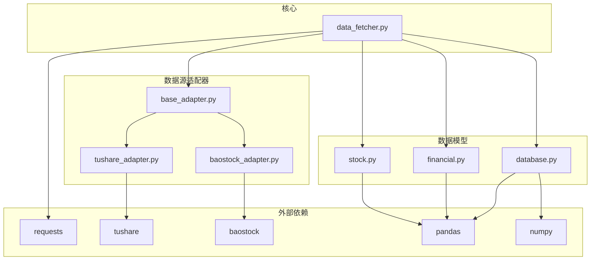
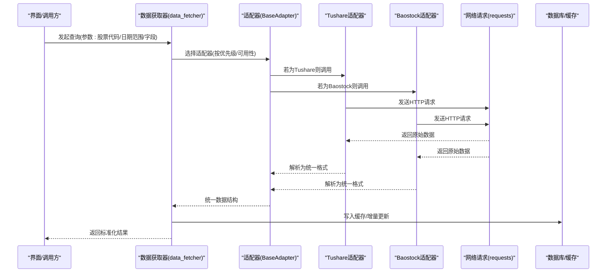
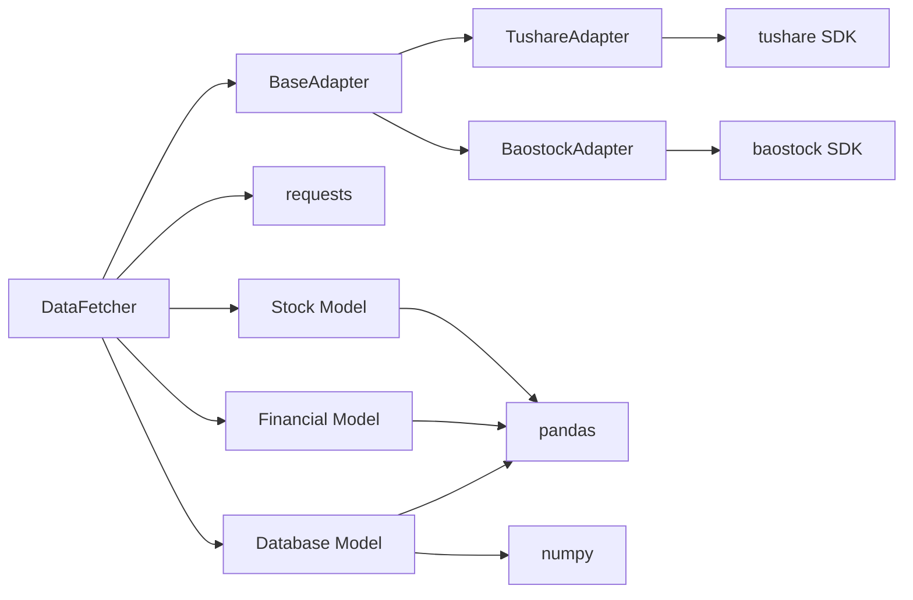

# 数据源API

<cite>
**本文引用的文件**
- [requirements.txt](file://requirements.txt)
- [PRD.md](file://docs/PRD.md)
- [data_fetcher.py](file://src/core/data_fetcher.py)
- [stock.py](file://src/models/stock.py)
- [financial.py](file://src/models/financial.py)
- [database.py](file://src/models/database.py)
- [base_adapter.py](file://src/datasource/base_adapter.py)
- [tushare_adapter.py](file://src/datasource/tushare_adapter.py)
- [baostock_adapter.py](file://src/datasource/baostock_adapter.py)
</cite>

## 目录
1. [简介](#简介)
2. [项目结构](#项目结构)
3. [核心组件](#核心组件)
4. [架构总览](#架构总览)
5. [详细组件分析](#详细组件分析)
6. [依赖关系分析](#依赖关系分析)
7. [性能考虑](#性能考虑)
8. [故障排查指南](#故障排查指南)
9. [结论](#结论)
10. [附录](#附录)

## 简介
本文件面向“数据源API”的使用者与维护者，系统化梳理项目中对Tushare与Baostock两个数据源的适配与调用方式，覆盖以下方面：
- 接口规范：数据获取方法、参数定义、返回数据格式
- 错误处理机制：异常类型、重试策略、降级方案
- 认证方式与频率限制：API Key配置、限流策略
- 数据更新策略与缓存机制：增量更新、本地缓存
- 使用示例：Python调用路径与流程说明
- 常见问题与性能优化建议

## 项目结构
项目采用模块化分层组织，数据源相关代码集中在src/datasource目录，并通过src/core/data_fetcher.py统一调度。数据模型位于src/models，用于封装股票、财务等实体。

图表来源
- [data_fetcher.py](file://src/core/data_fetcher.py)
- [base_adapter.py](file://src/datasource/base_adapter.py)
- [tushare_adapter.py](file://src/datasource/tushare_adapter.py)
- [baostock_adapter.py](file://src/datasource/baostock_adapter.py)
- [stock.py](file://src/models/stock.py)
- [financial.py](file://src/models/financial.py)
- [database.py](file://src/models/database.py)
- [requirements.txt](file://requirements.txt)

章节来源
- [PRD.md](file://docs/PRD.md)
- [requirements.txt](file://requirements.txt)

## 核心组件
- 数据获取器：负责统一调度不同数据源适配器，协调参数、合并结果、处理错误与缓存。
- 数据源适配器：分别封装Tushare与Baostock的API差异，屏蔽底层细节。
- 数据模型：封装股票基础信息、财务数据等实体，便于上层业务使用。
- 数据库模型：提供持久化与查询接口，支撑缓存与增量更新。

章节来源
- [data_fetcher.py](file://src/core/data_fetcher.py)
- [stock.py](file://src/models/stock.py)
- [financial.py](file://src/models/financial.py)
- [database.py](file://src/models/database.py)

## 架构总览
下图展示了从UI到数据源的整体调用链路与职责划分：

图表来源
- [data_fetcher.py](file://src/core/data_fetcher.py)
- [base_adapter.py](file://src/datasource/base_adapter.py)
- [tushare_adapter.py](file://src/datasource/tushare_adapter.py)
- [baostock_adapter.py](file://src/datasource/baostock_adapter.py)

## 详细组件分析

### 数据源适配器基类（BaseAdapter）
- 职责
  - 定义统一接口：如初始化、查询、错误处理钩子、是否可用检测等。
  - 提供通用能力：日志记录、超时控制、重试策略模板。
- 关键点
  - 参数标准化：将上层传入的查询参数转换为具体数据源可识别的格式。
  - 结果归一化：将不同数据源返回的字段映射到统一模型。
  - 错误分类：区分网络错误、解析错误、业务错误与限流错误。

章节来源
- [base_adapter.py](file://src/datasource/base_adapter.py)

### Tushare适配器（TushareAdapter）
- 初始化与认证
  - 读取API Key与Token配置；支持环境变量或配置文件注入。
  - 初始化客户端实例，设置超时与重试参数。
- 查询接口
  - 股票基本信息：名称、上市日期、所属市场等。
  - 历史行情：日线、分钟线、复权因子等。
  - 财务数据：资产负债表、利润表、现金流量表、业绩预告、分红等。
- 返回格式
  - 统一为DataFrame，列名与数据类型遵循模型约定。
- 错误处理
  - 限流：当触发频率限制时，等待冷却后重试。
  - 网络异常：指数退避重试，超过阈值抛出业务异常。
  - 解析失败：记录原始响应，定位字段缺失或格式异常。

章节来源
- [tushare_adapter.py](file://src/datasource/tushare_adapter.py)

### Baostock适配器（BaostockAdapter）
- 初始化与认证
  - 登录账户与密码（若需要）；设置会话参数。
- 查询接口
  - 股票列表与基本信息。
  - 日线/分钟线K线数据。
  - 财务数据：通过其提供的财务接口或第三方整合数据。
- 返回格式
  - DataFrame，列名与数据类型与模型保持一致。
- 错误处理
  - 登录失败：提示重新配置凭证。
  - 数据为空：返回空DataFrame并记录原因。
  - 网络波动：重试与熔断保护。

章节来源
- [baostock_adapter.py](file://src/datasource/baostock_adapter.py)

### 数据获取器（DataFetcher）
- 统一入口
  - 根据配置选择优先数据源；若首选不可用则回退至备选。
  - 对高频查询进行去重与合并，避免重复请求。
- 缓存与增量更新
  - 本地缓存：基于日期范围与字段集合生成缓存键，命中则直接返回。
  - 增量更新：仅拉取新增或变更的数据，减少带宽与时间消耗。
- 错误与重试
  - 逐个适配器尝试，记录失败原因。
  - 超时与限流：指数退避，最大重试次数与最大等待时间。
- 结果合并
  - 多源数据合并策略：优先级、冲突解决、缺失值填充。

章节来源
- [data_fetcher.py](file://src/core/data_fetcher.py)

### 数据模型（Stock、Financial、Database）
- 股票模型（Stock）
  - 字段：代码、名称、上市日期、所属市场、状态等。
  - 方法：序列化/反序列化、校验、与DataFrame互转。
- 财务模型（Financial）
  - 字段：报表期、收入、利润、资产、负债、现金流等。
  - 方法：同比/环比计算、异常值检测、行业对比。
- 数据库模型（Database）
  - 表结构：股票基础信息表、日线行情表、财务报表表等。
  - 查询：按日期范围、字段过滤、分页与索引优化。
  - 写入：批量插入、去重、事务保证一致性。

章节来源
- [stock.py](file://src/models/stock.py)
- [financial.py](file://src/models/financial.py)
- [database.py](file://src/models/database.py)

## 依赖关系分析
- 外部依赖
  - requests：网络请求与会话管理。
  - tushare、baostock：官方SDK或HTTP接口封装。
  - pandas、numpy：数据结构与数值计算。
  - SQLAlchemy（<2.0）：数据库ORM与连接池。
- 内部耦合
  - DataFetcher依赖适配器接口，解耦具体实现。
  - 适配器依赖requests与第三方SDK，向上提供统一接口。
  - 模型依赖pandas/numpy进行数据处理，数据库模型依赖SQLAlchemy。

图表来源
- [data_fetcher.py](file://src/core/data_fetcher.py)
- [base_adapter.py](file://src/datasource/base_adapter.py)
- [tushare_adapter.py](file://src/datasource/tushare_adapter.py)
- [baostock_adapter.py](file://src/datasource/baostock_adapter.py)
- [stock.py](file://src/models/stock.py)
- [financial.py](file://src/models/financial.py)
- [database.py](file://src/models/database.py)
- [requirements.txt](file://requirements.txt)

章节来源
- [requirements.txt](file://requirements.txt)

## 性能考虑
- 请求合并与去重
  - 将同一时间段内多次相同查询合并为一次请求。
- 缓存策略
  - 本地磁盘缓存：按日期范围与字段集生成键，命中即返回。
  - 内存缓存：短期高频访问数据驻留内存。
- 增量更新
  - 以最新已入库日期为起点，仅拉取新增数据，降低IO与网络开销。
- 并发与限流
  - 适配器内部实现指数退避与最大并发限制，避免触发第三方限流。
- 数据处理优化
  - 使用pandas向量化操作，减少循环；必要时使用numba加速。
- 数据库写入
  - 批量插入与事务提交，减少往返开销；建立合适索引提升查询效率。

## 故障排查指南
- 认证失败
  - 确认API Key/TOKEN是否正确配置；检查过期时间与权限范围。
  - 若为Baostock登录失败，确认用户名/密码与网络连通性。
- 频繁超时
  - 检查网络质量与代理设置；适当提高超时阈值或启用重试。
  - 观察第三方限流日志，调整请求节奏或切换备用数据源。
- 数据为空
  - 核对查询日期范围与股票代码是否有效。
  - 检查目标数据在该数据源是否存在（部分财务数据可能延迟）。
- 结果不一致
  - 对比不同数据源的同一批数据，确认字段映射与清洗逻辑。
  - 核对复权方式与时间精度差异。
- 缓存异常
  - 清理过期缓存文件；检查缓存键生成规则与日期边界。
- 数据库写入失败
  - 查看事务日志与唯一约束冲突；必要时重建索引或清理脏数据。

## 结论
本项目通过“适配器+统一调度+模型+缓存”的架构，实现了对Tushare与Baostock的统一接入与高效使用。建议在生产环境中：
- 明确API Key配置与轮换策略；
- 设定合理的重试与限流参数；
- 建立完善的缓存与增量更新机制；
- 对高频查询进行合并与去重；
- 持续监控错误日志与性能指标，及时优化瓶颈。

## 附录

### API认证方式
- Tushare
  - 通过配置文件或环境变量注入API Key与Token。
  - 初始化客户端时设置超时与重试参数。
- Baostock
  - 登录账户与密码（若需要），建立会话。
  - 确保网络可达与账号权限正常。

章节来源
- [tushare_adapter.py](file://src/datasource/tushare_adapter.py)
- [baostock_adapter.py](file://src/datasource/baostock_adapter.py)

### 请求频率限制与限流策略
- 适配器内部实现指数退避重试，超过最大次数后抛出业务异常。
- 当检测到限流信号时，自动延长等待时间并降低并发。
- 建议上层调用方对高频请求进行合并与节流。

章节来源
- [base_adapter.py](file://src/datasource/base_adapter.py)
- [tushare_adapter.py](file://src/datasource/tushare_adapter.py)
- [baostock_adapter.py](file://src/datasource/baostock_adapter.py)

### 数据更新策略与缓存机制
- 缓存键：由查询参数（如股票代码、日期范围、字段集）生成。
- 增量更新：以数据库中最新记录时间为起点，仅拉取新增数据。
- 缓存失效：根据配置的TTL或手动清理策略清理过期缓存。

章节来源
- [data_fetcher.py](file://src/core/data_fetcher.py)
- [database.py](file://src/models/database.py)

### Python调用示例（路径指引）
- 初始化数据源
  - 参考：[tushare_adapter.py](file://src/datasource/tushare_adapter.py)
  - 参考：[baostock_adapter.py](file://src/datasource/baostock_adapter.py)
- 执行查询
  - 参考：[data_fetcher.py](file://src/core/data_fetcher.py)
  - 参考：[base_adapter.py](file://src/datasource/base_adapter.py)
- 处理响应数据
  - 参考：[stock.py](file://src/models/stock.py)
  - 参考：[financial.py](file://src/models/financial.py)
  - 参考：[database.py](file://src/models/database.py)

### 常见错误场景与解决方案
- 场景：网络超时/不稳定
  - 方案：增加超时阈值、启用指数退避重试、切换备用数据源。
- 场景：第三方限流
  - 方案：降低请求频率、使用缓存、分时段拉取。
- 场景：数据为空/字段缺失
  - 方案：检查输入参数、确认数据源支持情况、补充默认值或告警。
- 场景：缓存未命中或脏数据
  - 方案：清理缓存、核对键生成规则、检查时间边界。