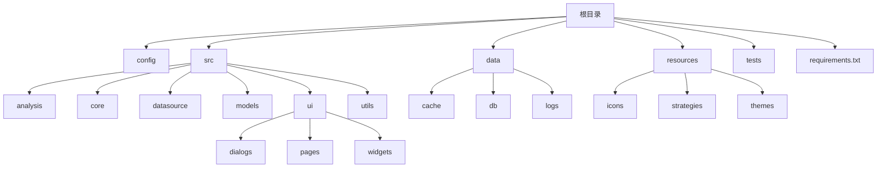
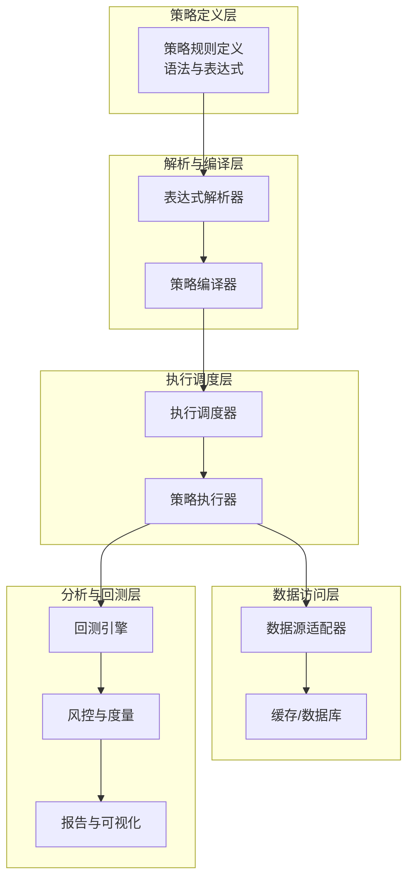
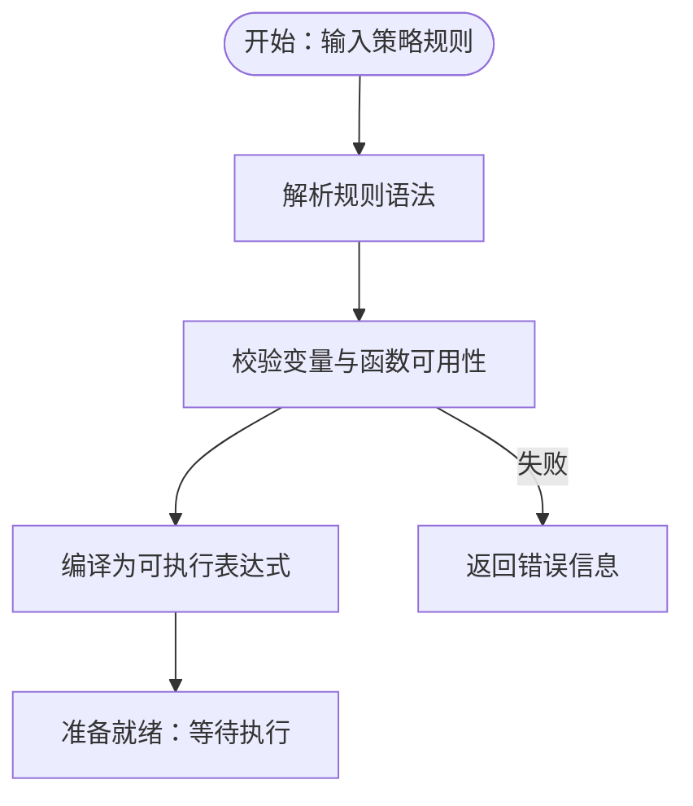
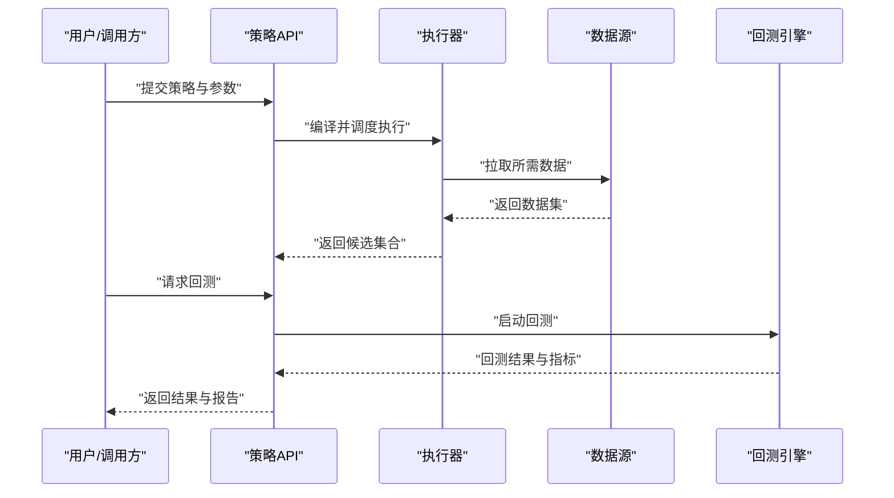
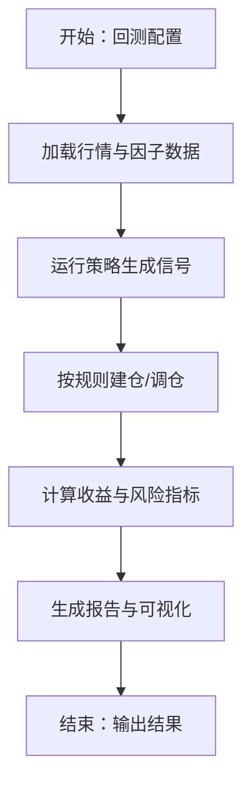
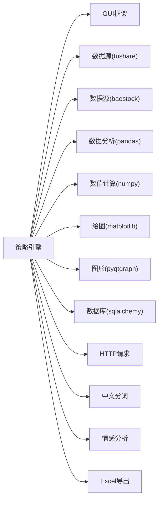

# 策略引擎API

<cite>
**本文引用的文件**
- [requirements.txt](file://requirements.txt)
- [PRD.md](file://docs/PRD.md)
- [stocksift.log](file://data/logs/stocksift.log)
</cite>

## 目录
1. [简介](#简介)
2. [项目结构](#项目结构)
3. [核心组件](#核心组件)
4. [架构总览](#架构总览)
5. [详细组件分析](#详细组件分析)
6. [依赖分析](#依赖分析)
7. [性能考虑](#性能考虑)
8. [故障排查指南](#故障排查指南)
9. [结论](#结论)
10. [附录](#附录)

## 简介
本文件旨在为策略引擎API提供一份面向开发者与使用者的综合文档，聚焦于“选股策略”的创建、执行与管理接口。根据当前仓库可见信息，策略引擎属于StockSift项目的一部分，目标是实现A股股票筛选与回测能力。由于核心源码文件尚未在仓库中直接呈现，本文基于现有文档与日志进行系统化梳理，并给出可操作的API参考、流程图与最佳实践建议，帮助策略开发者快速上手并安全扩展。

## 项目结构
仓库采用模块化分层组织，主要目录如下：
- config：配置相关（未见具体文件）
- data：数据缓存、数据库与日志（包含日志文件）
- resources：资源文件（包含策略模板目录）
- src：源代码模块
  - analysis：分析与回测相关（目录为空）
  - core：核心逻辑（目录为空）
  - datasource：数据源（目录为空）
  - models：模型定义（目录为空）
  - ui：界面模块（包含对话框、页面、控件）
  - utils：工具模块（目录为空）
- tests：测试（未见具体文件）
- requirements.txt：依赖清单

**图表来源**
- [requirements.txt](file://requirements.txt)

**章节来源**
- [requirements.txt](file://requirements.txt)

## 核心组件
基于现有仓库信息，策略引擎的关键能力与接口可抽象为以下模块：
- 策略定义与解析：负责策略规则的语法解析与表达式编译
- 条件评估：对单只或多只股票进行条件判断
- 执行调度：按时间序列或批量方式执行策略
- 结果输出：标准化返回筛选结果与统计指标
- 回测框架：支持多标的、多周期的回测与风险度量
- 可视化与报告：生成回测曲线、收益分布与风控指标
- 日志与监控：记录策略执行过程与异常

上述模块在当前仓库中以目录形式存在但源码未直接呈现，本文将基于PRD文档与日志信息，给出统一的API参考与流程设计。

**章节来源**
- [PRD.md](file://docs/PRD.md)
- [stocksift.log](file://data/logs/stocksift.log)

## 架构总览
策略引擎的整体架构围绕“策略即代码”理念构建，通过可扩展的解析器与执行器完成从规则到结果的转换，并提供回测与风险管理能力。

[此图为概念性架构示意，不直接映射到具体源码文件]

## 详细组件分析

### 组件一：策略规则定义与语法
- 规则类型
  - 单条件规则：如“价格大于X”
  - 多条件组合：AND/OR/NOT
  - 时间窗规则：如“过去N日涨幅超过M”
  - 技术指标规则：如“MACD金叉”
- 表达式格式
  - 基本语法：变量名 + 比较运算符 + 常量/变量
  - 函数调用：函数名(参数列表)
  - 分组与优先级：括号明确计算顺序
- 运算符使用规范
  - 比较运算符：>, <, >=, <=, ==, !=
  - 逻辑运算符：and, or, not
  - 成员运算符：in, not in
  - 算术运算符：+, -, *, /, //, %, **
  - 特殊运算符：跨期比较（如昨收/今开）、技术指标函数
- 示例（仅描述，不展示代码）
  - “收盘价 > 昨收 * 1.05 and 换手率 > 0.03”
  - “RSI(14) < 30 and MACD(12,26,9).signal > 0”

[此图为概念性流程示意，不直接映射到具体源码文件]

**章节来源**
- [PRD.md](file://docs/PRD.md)

### 组件二：策略执行流程
- 输入参数
  - 股票池：全市场或自定义池
  - 时间范围：T日到T+N日
  - 参数字典：阈值、周期、权重等
- 执行步骤
  - 加载数据：OHLCV、财务、技术指标
  - 应用过滤：按行业/市值/流动性过滤
  - 逐条评估：对每只股票应用策略表达式
  - 结果聚合：输出候选列表与评分
- 输出格式
  - 标准化字段：股票代码、名称、日期、评分、触发条件明细
  - 扩展字段：技术指标值、回测信号

[此图为概念性时序示意，不直接映射到具体源码文件]

**章节来源**
- [PRD.md](file://docs/PRD.md)

### 组件三：回测接口与风险管理
- 回测接口
  - 输入：策略、标的池、起止日期、初始资金、滑点、手续费
  - 输出：净值曲线、收益指标、最大回撤、胜率、夏普比率
- 风险管理
  - 止损/止盈：固定比例或ATR动态止损
  - 仓位控制：均值回归、波动率目标
  - 集中度控制：单票/行业上限
- 报告维度
  - 收益与波动：年化收益、波动率、最大回撤
  - 风险调整收益：夏普比率、索提诺比率
  - 交易行为：换手率、交易次数、持仓天数

[此图为概念性流程示意，不直接映射到具体源码文件]

**章节来源**
- [PRD.md](file://docs/PRD.md)

### 组件四：策略模板与自定义开发指南
- 模板类型
  - 价值投资：PE/PS/现金流折现
  - 动量策略：动量强度、突破通道
  - 量化中性：多因子均衡、风格轮动
- 开发步骤
  1) 明确目标与假设
  2) 设计因子与信号
  3) 编写规则表达式
  4) 单测与单元验证
  5) 多样本区间回测
  6) 风险与稳定性评估
  7) 部署与监控
- 最佳实践
  - 使用分层测试：先小样本、再扩展样本
  - 控制过拟合：交叉验证、滚动窗口
  - 记录日志：关键节点与异常
  - 参数鲁棒性：敏感性分析

**章节来源**
- [PRD.md](file://docs/PRD.md)

### 组件五：调试技巧与性能优化
- 调试技巧
  - 分步执行：先验证变量可用性，再逐步加入复杂条件
  - 小样本验证：使用最近N天数据快速定位问题
  - 日志追踪：记录中间变量与触发条件
- 性能优化
  - 向量化：优先使用向量/矩阵运算
  - 缓存：热点数据与指标结果复用
  - 并行：多进程/多线程并行评估不同股票池
  - 数据预处理：提前计算常用指标，减少重复计算

**章节来源**
- [stocksift.log](file://data/logs/stocksift.log)

## 依赖分析
策略引擎依赖外部库与数据源，用于GUI、数据处理、可视化与网络请求等。依赖清单如下：

**图表来源**
- [requirements.txt](file://requirements.txt)

**章节来源**
- [requirements.txt](file://requirements.txt)

## 性能考虑
- 数据加载
  - 优先使用本地缓存与数据库，避免频繁网络请求
  - 对高频数据进行批量化下载与增量更新
- 计算效率
  - 利用向量化与内置函数，减少循环
  - 对技术指标进行缓存与懒加载
- 内存管理
  - 分块处理大数据集，及时释放中间变量
  - 使用高效的数据类型（如category、float32）
- 并发与扩展
  - 在UI层保持主线程响应，后台任务异步执行
  - 对策略评估进行并行化，充分利用CPU核数

[本节为通用性能建议，不直接分析具体文件]

## 故障排查指南
- 常见问题
  - 表达式解析失败：检查变量名拼写、函数是否存在、括号匹配
  - 数据缺失：确认时间范围与数据源可用性
  - 回测异常：检查滑点、手续费设置与交易成本
- 日志定位
  - 查看日志文件中的错误堆栈与关键变量值
  - 关注策略执行阶段与回测阶段的日志级别
- 快速修复
  - 临时简化规则，逐步恢复复杂度
  - 使用默认参数进行最小可行验证

**章节来源**
- [stocksift.log](file://data/logs/stocksift.log)

## 结论
本文件基于现有仓库文档与日志，给出了策略引擎API的概念性架构、规则语法、执行流程、回测与风控接口以及开发与优化建议。随着核心源码的逐步完善，建议持续补充以下内容：
- 策略规则解析器与执行器的具体实现
- 回测引擎的接口定义与指标计算
- 数据源适配器与缓存策略
- UI交互与策略管理界面

[本节为总结性内容，不直接分析具体文件]

## 附录
- API参考（概念性）
  - 创建策略：POST /api/strategy
  - 执行策略：POST /api/strategy/{id}/run
  - 获取结果：GET /api/strategy/{id}/result
  - 回测：POST /api/strategy/{id}/backtest
  - 风险评估：GET /api/strategy/{id}/risk
- 配置项（示例）
  - 数据源：tushare/baostock
  - 时间范围：YYYYMMDD-YYYYMMDD
  - 滑点：0.001
  - 手续费：0.002
- 策略模板位置：resources/strategies

[本节为概念性附录，不直接分析具体文件]