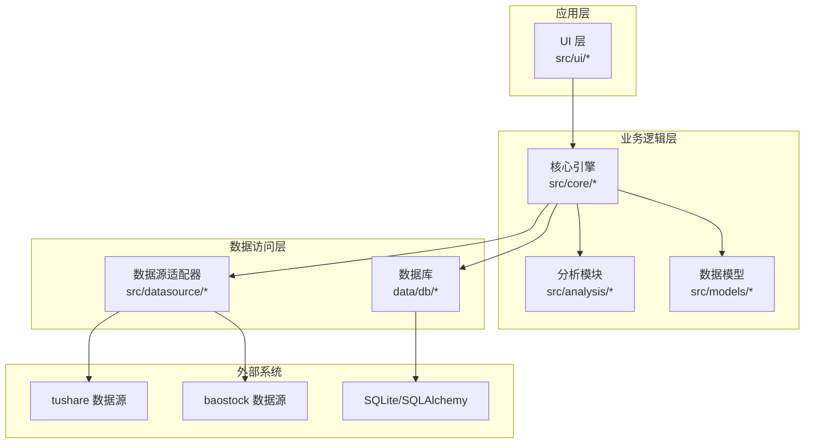
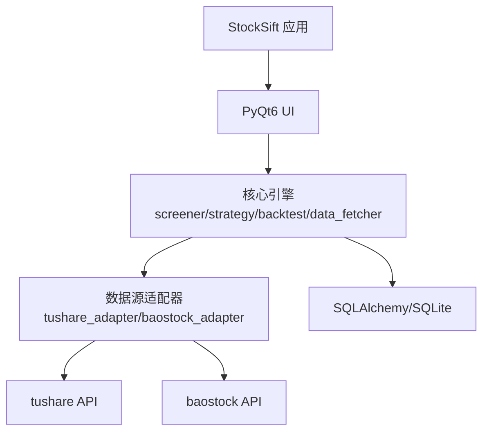
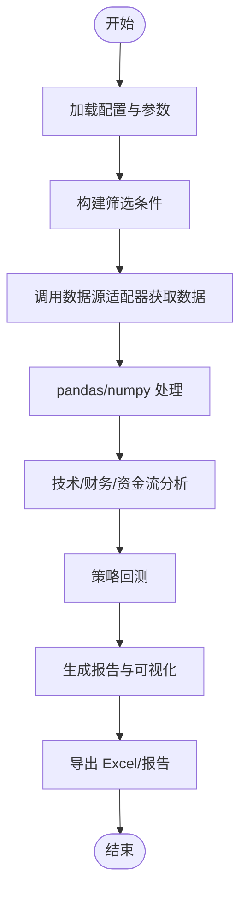
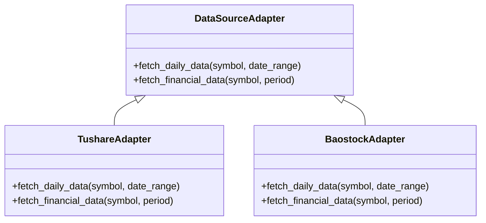
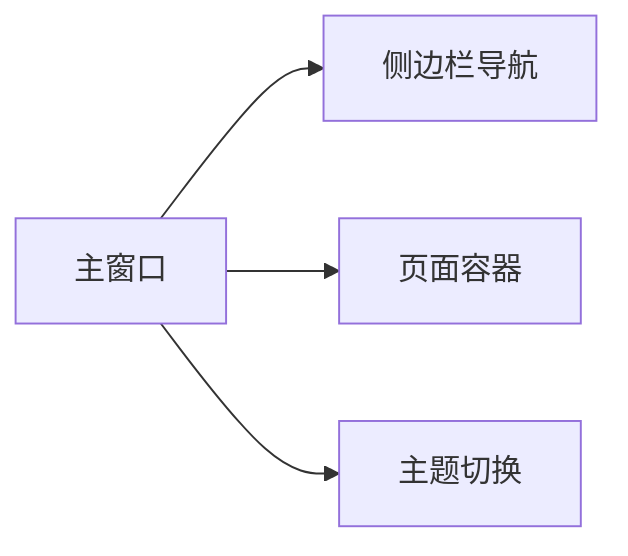
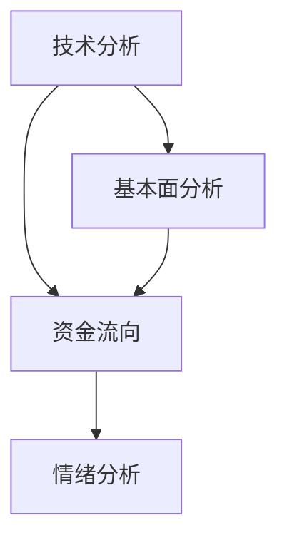
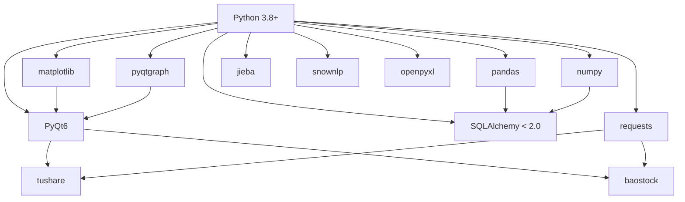

# 开发者指南

<cite>
**本文引用的文件**
- [requirements.txt](file://requirements.txt)
- [PRD.md](file://docs/PRD.md)
</cite>

## 目录
1. [简介](#简介)
2. [项目结构](#项目结构)
3. [核心组件](#核心组件)
4. [架构总览](#架构总览)
5. [详细组件分析](#详细组件分析)
6. [依赖分析](#依赖分析)
7. [性能考虑](#性能考虑)
8. [故障排查指南](#故障排查指南)
9. [结论](#结论)
10. [附录](#附录)

## 简介
本指南面向希望参与 StockSift 项目的开发者，提供从开发环境搭建到代码规范、贡献流程、版本控制与发布管理的完整指引。StockSift 是一款基于 Python 的桌面 A 股选股分析工具，采用 PyQt6 构建图形界面，结合 pandas/numpy 进行数据处理，使用 SQLAlchemy 访问本地数据库，并通过 tushare/baostock 获取行情与财务数据。

## 项目结构
仓库采用按功能域分层的组织方式，主要目录如下：
- config：配置管理
- src：源代码
  - core：核心引擎（如筛选、策略、回测、数据抓取等）
  - datasource：数据源适配器（tushare、baostock 等）
  - analysis：分析模块（技术分析、基本面分析、资金流、情绪分析等）
  - models：数据模型
  - ui：用户界面（主窗口、页面、对话框、控件）
  - utils：通用工具函数
- data：数据存储（缓存、数据库、日志）
- resources：资源文件（图标、策略模板、主题）
- tests：测试用例
- requirements.txt：Python 依赖清单

**章节来源**
- [PRD.md: 产品概述:3-21](file://docs/PRD.md#L3-L21)
- [PRD.md: 技术架构:294-337](file://docs/PRD.md#L294-L337)

## 核心组件
- 核心引擎
  - 筛选器：支持多维度条件组合，涵盖基础条件、技术指标、资金流向、财务指标与价值投资指标。
  - 策略管理：支持策略定义、参数配置与回测执行。
  - 回测引擎：提供收益曲线、绩效指标、年度/月度收益可视化与报告导出。
  - 预警引擎：用于监控与提醒。
  - 数据获取：统一接口对接多个数据源。
- 数据源适配器
  - 提供 tushare、baostock 等适配器，支持 API Key 管理与优先级设置。
- 分析模块
  - 技术分析、基本面分析、资金流向、情绪分析等子模块。
- 数据模型
  - 股票、财务、告警、数据库连接等模型。
- UI 层
  - 主窗口、页面、对话框与自定义控件，支持浅色/深色主题切换。
- 工具函数
  - 通用算法与辅助方法。

**章节来源**
- [PRD.md: 功能模块设计:23-261](file://docs/PRD.md#L23-L261)
- [PRD.md: 技术架构:294-337](file://docs/PRD.md#L294-L337)
- [PRD.md: 数据源设计:341-346](file://docs/PRD.md#L341-L346)

## 架构总览
StockSift 采用分层架构：
- 表现层：PyQt6 构建的桌面应用，负责交互与可视化。
- 业务层：核心引擎协调筛选、策略、回测与数据获取。
- 数据层：适配器层抽象不同数据源，统一输出标准化数据；使用 SQLAlchemy 访问本地数据库。
- 外部依赖：tushare、baostock 提供行情与财务数据；pandas/numpy 进行数据处理；matplotlib/pyqtgraph 进行可视化。

**图表来源**
- [PRD.md: 技术架构:294-337](file://docs/PRD.md#L294-L337)

**章节来源**
- [PRD.md: 技术架构:294-337](file://docs/PRD.md#L294-L337)

## 详细组件分析

### 组件一：核心引擎（筛选/策略/回测/数据获取）
- 筛选器：支持多条件组合，覆盖市场、行业、概念、地域、技术指标、资金流向、财务指标与价值投资指标。
- 策略管理：定义买入/卖出条件、参数配置与回测运行。
- 回测引擎：生成收益曲线、绩效指标、年度/月度收益分布与报告导出。
- 数据获取：统一接口对接多个数据源，支持增量更新与进度反馈。

**图表来源**
- [PRD.md: 功能模块设计:23-261](file://docs/PRD.md#L23-L261)

**章节来源**
- [PRD.md: 功能模块设计:23-261](file://docs/PRD.md#L23-L261)

### 组件二：数据源适配器
- 支持 tushare、baostock 等数据源。
- 提供 API Key 管理与数据源优先级设置。
- 统一接口屏蔽底层差异，便于扩展其他数据源。

**图表来源**
- [PRD.md: 数据源设计:341-346](file://docs/PRD.md#L341-L346)

**章节来源**
- [PRD.md: 数据源设计:341-346](file://docs/PRD.md#L341-L346)

### 组件三：UI 与主题
- 主窗口、页面、对话框与控件构成完整的桌面应用界面。
- 支持浅色/深色主题切换，即时生效。

**图表来源**
- [PRD.md: 用户界面设计:263-291](file://docs/PRD.md#L263-L291)

**章节来源**
- [PRD.md: 用户界面设计:263-291](file://docs/PRD.md#L263-L291)

### 组件四：分析模块
- 技术分析：MACD、KDJ、RSI、均线、布林带、成交量等。
- 基本面分析：财务指标、估值指标（PE、PB、PEG、PCF、PS）。
- 资金流向：主力净流入、超大单/大单净流入、连续净流入天数。
- 情绪分析：中文文本处理与情感分析。

**图表来源**
- [PRD.md: 功能模块设计:23-261](file://docs/PRD.md#L23-L261)

**章节来源**
- [PRD.md: 功能模块设计:23-261](file://docs/PRD.md#L23-L261)

## 依赖分析
- Python 版本：3.8+（兼容性要求）
- GUI 框架：PyQt6
- 数据处理：pandas、numpy
- 可视化：matplotlib、pyqtgraph
- 数据库：SQLAlchemy（小于 2.0）
- 网络请求：requests
- 中文处理与情感分析：jieba、snownlp
- Excel 导出：openpyxl
- 数据源：tushare、baostock

**图表来源**
- [requirements.txt: 依赖清单:1-32](file://requirements.txt#L1-L32)

**章节来源**
- [requirements.txt: 依赖清单:1-32](file://requirements.txt#L1-L32)

## 性能考虑
- 数据处理
  - 使用 pandas/numpy 进行向量化计算，避免逐行循环。
  - 对高频指标（如均线、MACD）采用滑动窗口与缓存策略。
- 可视化
  - 使用 pyqtgraph 进行大规模数据渲染，matplotlib 用于静态图表。
  - 控制刷新频率与批量绘制，减少主线程阻塞。
- 数据源
  - 实施增量更新与缓存策略，降低网络请求次数。
  - 在适配器层实现并发抓取与失败重试。
- UI 响应
  - 将耗时任务放入后台线程，避免阻塞事件循环。
  - 使用异步加载与分页展示，提升交互流畅度。

[本节为通用建议，无需列出章节来源]

## 故障排查指南
- 环境问题
  - 确认 Python 版本满足 3.8+ 要求。
  - 安装依赖后若出现兼容性问题，检查 SQLAlchemy 版本是否低于 2.0。
- 数据源问题
  - 若 tushare/baostock 请求失败，检查 API Key 配置与网络连通性。
  - 关注数据源限流与返回码，必要时增加重试与退避策略。
- 可视化问题
  - 若图表渲染异常，确认 PyQt6 与 pyqtgraph 版本匹配。
  - 大数据量场景下优先使用 pyqtgraph 的高效渲染模式。
- 导出问题
  - Excel 导出失败时检查 openpyxl 版本与文件权限。
- 日志与诊断
  - 查看 data/logs 目录中的日志文件，定位错误堆栈。
  - 在 UI 中启用详细日志模式，复现问题并收集上下文。

**章节来源**
- [requirements.txt: 依赖清单:1-32](file://requirements.txt#L1-L32)
- [PRD.md: 数据源设计:341-346](file://docs/PRD.md#L341-L346)

## 结论
StockSift 以清晰的分层架构与模块化设计实现了从数据获取、处理、分析到可视化的完整链路。开发者可依据本文档完成环境搭建、遵循代码与文档规范、参与贡献流程，并在保证性能与稳定性的同时持续迭代功能。

[本节为总结性内容，无需列出章节来源]

## 附录

### A. 开发环境搭建步骤
- Python 环境
  - 安装 Python 3.8 或更高版本。
  - 建议使用虚拟环境隔离依赖。
- 依赖安装
  - 使用 pip 安装 requirements.txt 中声明的包。
- 数据源准备
  - 在 tushare/baostock 注册账号并配置 API Key。
- IDE 配置
  - 推荐使用 PyCharm：启用 pylint/pytest 插件，配置单元测试框架。
  - 设置断点与调试器，开启“在终端中运行”以便查看日志。
- 运行与调试
  - 从入口脚本启动应用，逐步断点验证核心流程（数据获取 → 处理 → 可视化）。
  - 使用单元测试与集成测试验证关键路径。

**章节来源**
- [requirements.txt: 依赖清单:1-32](file://requirements.txt#L1-L32)
- [PRD.md: 数据源设计:341-346](file://docs/PRD.md#L341-L346)

### B. 代码规范与命名约定
- 文件与模块
  - 模块名使用小写与下划线，避免混用驼峰。
  - 每个模块职责单一，尽量保持高内聚低耦合。
- 类与方法
  - 类名使用 PascalCase；方法与变量使用 snake_case。
  - 方法长度控制在合理范围内，必要时拆分为私有辅助方法。
- 常量与配置
  - 常量使用 UPPER_CASE；配置项集中于 config 目录。
- 文档与注释
  - 公共接口提供 docstring；复杂逻辑补充注释说明。
  - 重要决策与边界条件需在注释中记录原因。

[本节为通用规范，无需列出章节来源]

### C. 贡献流程与代码审查
- 分支策略
  - 主分支保护，功能开发在 feature/* 分支进行。
  - Bug 修复在 bugfix/* 分支进行。
- 提交规范
  - 提交信息包含类型（feat/fix/docs/chore）与简要描述。
  - 每次提交聚焦单一变更，避免“把多个改动塞进一次提交”。
- 代码审查
  - 发起 Pull Request 前先运行本地测试与静态检查。
  - 至少一名维护者审查，确保通过 CI 与测试。
- 合并与发布
  - 合并前确保无冲突、测试全部通过、文档同步更新。
  - 版本号遵循语义化版本，发布前更新变更日志。

[本节为通用流程，无需列出章节来源]

### D. 版本控制与发布管理
- 标签与版本
  - 使用 Git 标签标记发布版本，配合变更日志。
- 发布渠道
  - 可根据需要打包为可执行程序或提供源码发布。
- 回滚策略
  - 保留最近几个版本的构建产物，必要时快速回滚。

[本节为通用流程，无需列出章节来源]

### E. 新功能开发最佳实践
- 设计先行
  - 明确需求背景与用户场景，绘制流程图与类图草稿。
- 模块化实现
  - 将新功能拆分为独立模块，复用现有适配器与分析工具。
- 可观测性
  - 为新功能添加日志与指标，便于后续优化。
- 兼容性
  - 避免破坏既有接口；新增功能提供可选开关。

[本节为通用实践，无需列出章节来源]

### F. Bug 修复与性能优化
- Bug 修复
  - 使用最小复现步骤定位问题，编写针对性测试用例。
  - 修复后回归测试，确保未引入新问题。
- 性能优化
  - 使用性能剖析工具识别瓶颈，优先优化热点路径。
  - 对大数据集采用分批处理与缓存策略。

[本节为通用实践，无需列出章节来源]