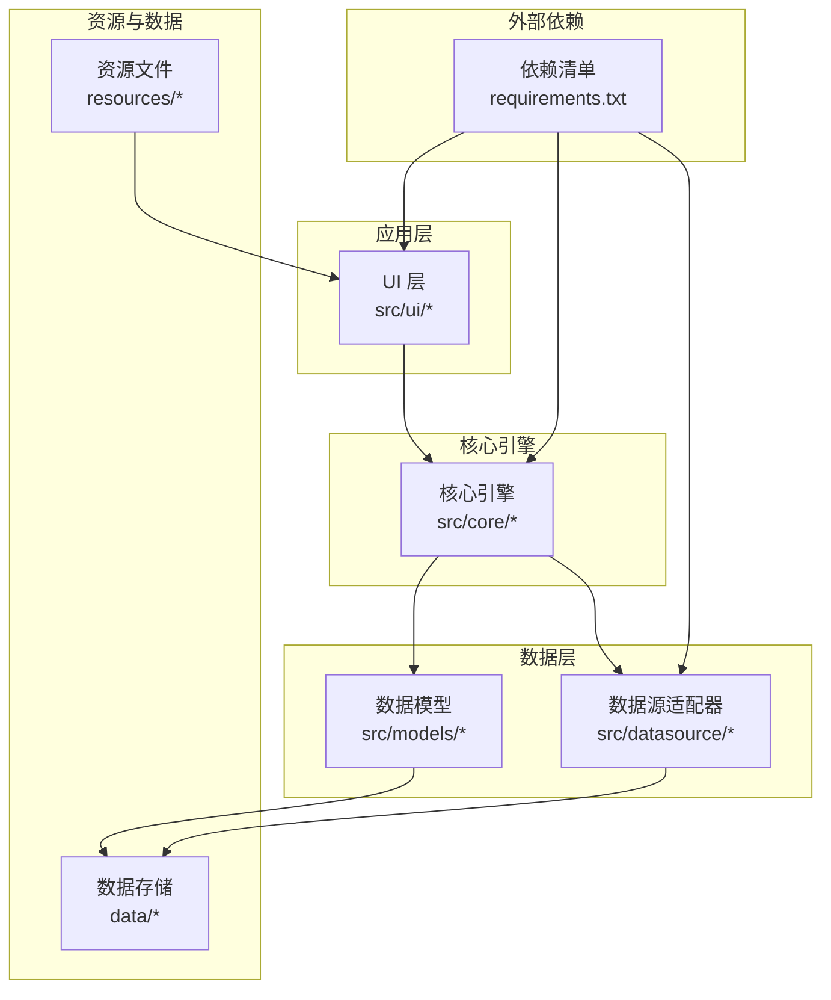
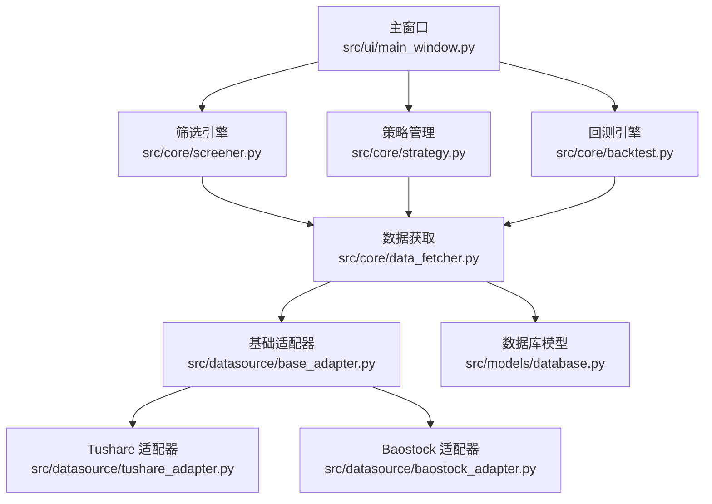
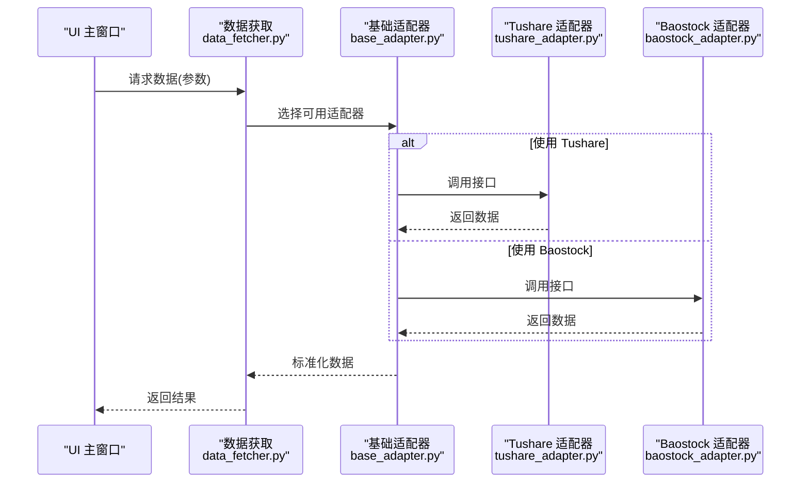
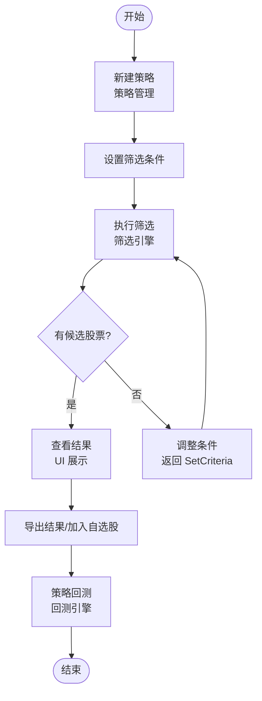
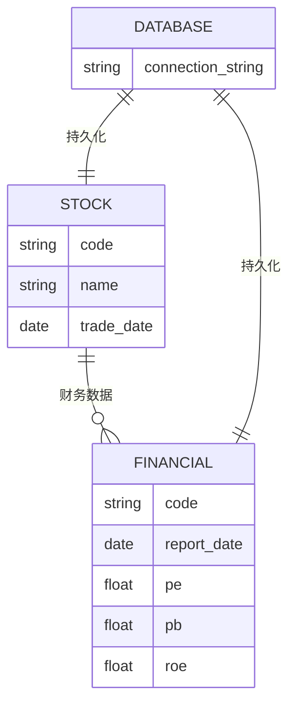
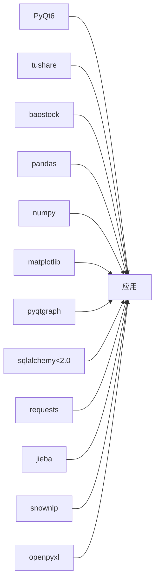

# 快速开始

<cite>
**本文引用的文件**
- [requirements.txt](file://requirements.txt)
- [PRD.md](file://docs/PRD.md)
- [screener.py](file://src/core/screener.py)
- [strategy.py](file://src/core/strategy.py)
- [backtest.py](file://src/core/backtest.py)
- [data_fetcher.py](file://src/core/data_fetcher.py)
- [base_adapter.py](file://src/datasource/base_adapter.py)
- [tushare_adapter.py](file://src/datasource/tushare_adapter.py)
- [baostock_adapter.py](file://src/datasource/baostock_adapter.py)
- [stock.py](file://src/models/stock.py)
- [financial.py](file://src/models/financial.py)
- [main_window.py](file://src/ui/main_window.py)
- [database.py](file://src/models/database.py)
</cite>

## 目录
1. [简介](#简介)
2. [项目结构](#项目结构)
3. [核心组件](#核心组件)
4. [架构总览](#架构总览)
5. [详细组件分析](#详细组件分析)
6. [依赖关系分析](#依赖关系分析)
7. [性能考虑](#性能考虑)
8. [故障排除指南](#故障排除指南)
9. [结论](#结论)
10. [附录](#附录)

## 简介
StockSift 是一款基于 Python 3.8+ 的 A 股智能选股软件，采用 PyQt6 构建图形界面，支持多数据源（Tushare、Baostock）、技术分析与回测功能。本“快速开始”旨在帮助新用户在最短时间内完成环境准备、依赖安装、数据源配置与首次运行，掌握基本的选股与策略设置流程。

## 项目结构
仓库采用按功能域分层的组织方式：核心引擎位于 src/core，数据源适配器位于 src/datasource，UI 层位于 src/ui，数据模型位于 src/models，资源与策略模板位于 resources，数据缓存与日志位于 data，依赖声明在根目录 requirements.txt。

图表来源
- [PRD.md: 214-247:214-247](file://docs/PRD.md#L214-L247)
- [requirements.txt: 1-32:1-32](file://requirements.txt#L1-L32)

章节来源
- [PRD.md: 214-247:214-247](file://docs/PRD.md#L214-L247)

## 核心组件
- 筛选引擎：负责执行用户定义的筛选条件，输出候选股票集合。
- 策略管理：维护策略模板与参数，支持策略的保存、加载与编辑。
- 回测引擎：基于历史数据对策略进行回测评估。
- 数据获取：统一从多个数据源抓取行情与财务数据。
- 数据模型：封装股票、财务、数据库等实体与持久化逻辑。
- UI 主窗口：提供菜单、工具栏、侧边栏与主内容区的交互界面。

章节来源
- [PRD.md: 204-247:204-247](file://docs/PRD.md#L204-L247)
- [screener.py](file://src/core/screener.py)
- [strategy.py](file://src/core/strategy.py)
- [backtest.py](file://src/core/backtest.py)
- [data_fetcher.py](file://src/core/data_fetcher.py)
- [stock.py](file://src/models/stock.py)
- [financial.py](file://src/models/financial.py)
- [main_window.py](file://src/ui/main_window.py)

## 架构总览
下图展示了从 UI 到核心引擎再到数据源的整体调用链路，以及数据在各层之间的流转。

图表来源
- [main_window.py](file://src/ui/main_window.py)
- [screener.py](file://src/core/screener.py)
- [strategy.py](file://src/core/strategy.py)
- [backtest.py](file://src/core/backtest.py)
- [data_fetcher.py](file://src/core/data_fetcher.py)
- [base_adapter.py](file://src/datasource/base_adapter.py)
- [tushare_adapter.py](file://src/datasource/tushare_adapter.py)
- [baostock_adapter.py](file://src/datasource/baostock_adapter.py)
- [database.py](file://src/models/database.py)

## 详细组件分析

### 环境准备与安装
- Python 版本要求：3.8+（兼容性说明见依赖清单注释）。
- 推荐开发环境：虚拟环境隔离依赖，避免系统 Python 被污染。
- 安装依赖：使用 pip 安装 requirements.txt 中声明的所有包。
- 运行入口：启动 UI 主窗口以进入应用界面。

章节来源
- [requirements.txt: 1-32:1-32](file://requirements.txt#L1-L32)
- [PRD.md: 206-213:206-213](file://docs/PRD.md#L206-L213)
- [main_window.py](file://src/ui/main_window.py)

### 数据源配置
- 支持的数据源：Tushare、Baostock。
- 配置要点：在数据源适配器中设置 API Key 与参数；可配置优先级与自动切换。
- 数据获取：通过统一的数据获取接口从适配器读取行情与财务数据。

图表来源
- [data_fetcher.py](file://src/core/data_fetcher.py)
- [base_adapter.py](file://src/datasource/base_adapter.py)
- [tushare_adapter.py](file://src/datasource/tushare_adapter.py)
- [baostock_adapter.py](file://src/datasource/baostock_adapter.py)

章节来源
- [PRD.md: 251-266:251-266](file://docs/PRD.md#L251-L266)
- [base_adapter.py](file://src/datasource/base_adapter.py)
- [tushare_adapter.py](file://src/datasource/tushare_adapter.py)
- [baostock_adapter.py](file://src/datasource/baostock_adapter.py)

### 基本策略设置与选股流程
- 创建策略：在策略管理中新建策略，设置筛选条件（如市盈率、成交量等）。
- 执行筛选：通过筛选引擎对全市场股票池执行条件过滤。
- 查看结果：在 UI 中查看候选列表，导出为 Excel 或加入自选股。
- 回测验证：对策略进行历史回测，评估收益与风险指标。

图表来源
- [strategy.py](file://src/core/strategy.py)
- [screener.py](file://src/core/screener.py)
- [backtest.py](file://src/core/backtest.py)

章节来源
- [PRD.md: 167-171:167-171](file://docs/PRD.md#L167-L171)
- [strategy.py](file://src/core/strategy.py)
- [screener.py](file://src/core/screener.py)
- [backtest.py](file://src/core/backtest.py)

### 数据模型与持久化
- 股票与财务模型：封装股票基本信息与财务指标。
- 数据库模型：使用 SQLAlchemy（小于 2.0）进行 ORM 映射与查询。
- 缓存与日志：数据目录下的缓存与日志用于加速访问与追踪问题。

图表来源
- [stock.py](file://src/models/stock.py)
- [financial.py](file://src/models/financial.py)
- [database.py](file://src/models/database.py)

章节来源
- [PRD.md: 234-238:234-238](file://docs/PRD.md#L234-L238)
- [stock.py](file://src/models/stock.py)
- [financial.py](file://src/models/financial.py)
- [database.py](file://src/models/database.py)

## 依赖关系分析
- GUI 框架：PyQt6 提供界面与事件循环。
- 数据处理：pandas、numpy 用于数据清洗与计算。
- 可视化：pyqtgraph、matplotlib 用于图表绘制。
- 网络与数据库：requests、SQLAlchemy（< 2.0）。
- 中文处理：jieba、snownlp 用于文本分析。
- 导出：openpyxl 用于 Excel 导出。

图表来源
- [requirements.txt: 4-31:4-31](file://requirements.txt#L4-L31)

章节来源
- [requirements.txt: 4-31:4-31](file://requirements.txt#L4-L31)
- [PRD.md: 206-213:206-213](file://docs/PRD.md#L206-L213)

## 性能考虑
- 数据缓存：利用 data/cache 目录减少重复网络请求，提升响应速度。
- 批量处理：筛选与回测时尽量批量计算，避免逐条处理。
- 可视化优化：图表数据量大时启用采样或分页展示。
- 数据库索引：为常用查询字段建立索引，降低查询延迟。
- 多数据源冗余：合理配置数据源优先级与故障转移，保证稳定性。

## 故障排除指南
- Python 版本不匹配
  - 症状：安装依赖时报错或运行时报错。
  - 处理：确认使用 Python 3.8+，建议使用虚拟环境隔离。
  - 参考：依赖清单注释明确 Python 兼容性。
- 数据源 API Key 无效
  - 症状：无法获取行情或财务数据。
  - 处理：检查数据源适配器中的密钥配置，确保网络可达。
  - 参考：数据源适配器与数据获取接口。
- 依赖安装失败
  - 症状：pip 安装报错或部分包缺失。
  - 处理：使用 requirements.txt 一次性安装；若网络受限，可配置镜像源。
- 图表显示异常
  - 症状：图表空白或渲染缓慢。
  - 处理：减少一次性绘制的数据量，启用缓存；检查 PyQt6 与绘图库版本兼容性。
- 回测耗时过长
  - 症状：回测时间过长。
  - 处理：缩小回测区间、减少指标计算复杂度、启用缓存与批处理。

章节来源
- [requirements.txt: 1-32:1-32](file://requirements.txt#L1-L32)
- [base_adapter.py](file://src/datasource/base_adapter.py)
- [tushare_adapter.py](file://src/datasource/tushare_adapter.py)
- [baostock_adapter.py](file://src/datasource/baostock_adapter.py)
- [data_fetcher.py](file://src/core/data_fetcher.py)

## 结论
通过本快速开始指南，您已了解 StockSift 的环境要求、安装步骤、数据源配置与基本使用流程。建议先完成依赖安装与数据源配置，再进行一次简单的筛选与回测，逐步熟悉策略编辑与结果导出。遇到问题时，优先检查 Python 版本、数据源密钥与网络连通性，并结合缓存与批处理优化性能。

## 附录
- 首次使用建议流程
  1) 准备 Python 3.8+ 环境并创建虚拟环境。
  2) 安装 requirements.txt 中所有依赖。
  3) 在数据源适配器中配置 API Key。
  4) 启动 UI 主窗口，创建并运行一个简单策略。
  5) 导出筛选结果到 Excel 并进行回测验证。
- 常用路径参考
  - UI 主窗口：src/ui/main_window.py
  - 策略管理：src/core/strategy.py
  - 筛选引擎：src/core/screener.py
  - 回测引擎：src/core/backtest.py
  - 数据获取：src/core/data_fetcher.py
  - 数据源适配器：src/datasource/*
  - 数据模型：src/models/*

章节来源
- [PRD.md: 174-201:174-201](file://docs/PRD.md#L174-L201)
- [main_window.py](file://src/ui/main_window.py)
- [strategy.py](file://src/core/strategy.py)
- [screener.py](file://src/core/screener.py)
- [backtest.py](file://src/core/backtest.py)
- [data_fetcher.py](file://src/core/data_fetcher.py)
- [base_adapter.py](file://src/datasource/base_adapter.py)
- [tushare_adapter.py](file://src/datasource/tushare_adapter.py)
- [baostock_adapter.py](file://src/datasource/baostock_adapter.py)
- [stock.py](file://src/models/stock.py)
- [financial.py](file://src/models/financial.py)
- [database.py](file://src/models/database.py)