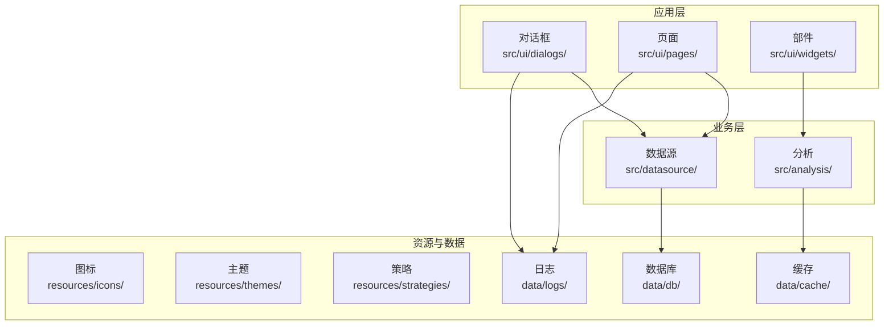
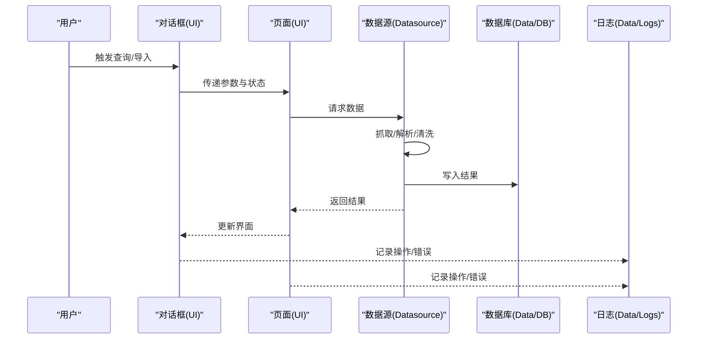
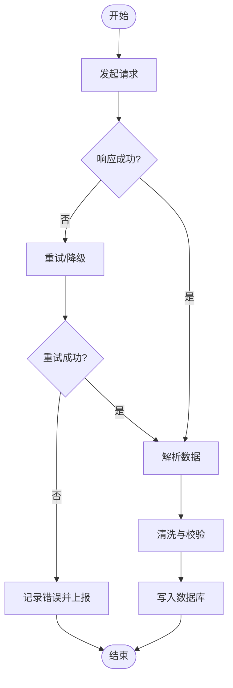
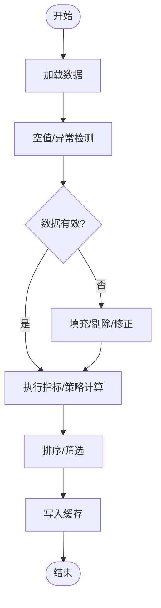
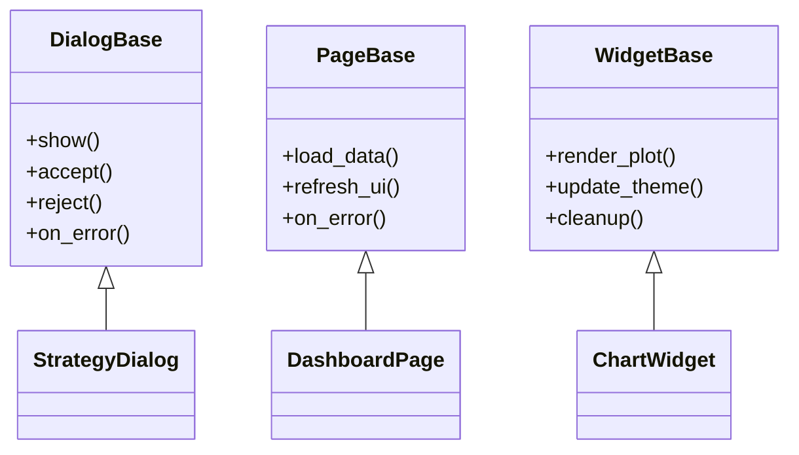
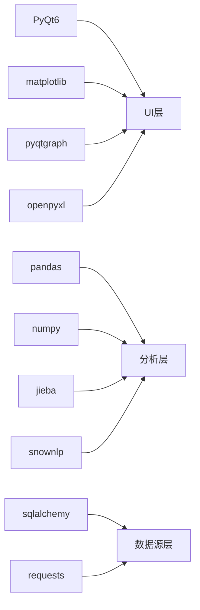

# 故障排除

<cite>
**本文引用的文件**
- [requirements.txt](file://requirements.txt)
- [data/logs/](file://data/logs/)
- [data/db/](file://data/db/)
- [data/cache/](file://data/cache/)
- [src/](file://src/)
- [src/datasource/](file://src/datasource/)
- [src/analysis/](file://src/analysis/)
- [src/ui/](file://src/ui/)
- [src/ui/dialogs/](file://src/ui/dialogs/)
- [src/ui/pages/](file://src/ui/pages/)
- [src/ui/widgets/](file://src/ui/widgets/)
- [resources/strategies/](file://resources/strategies/)
- [resources/themes/](file://resources/themes/)
- [resources/icons/](file://resources/icons/)
</cite>

## 目录
1. [简介](#简介)
2. [项目结构](#项目结构)
3. [核心组件](#核心组件)
4. [架构总览](#架构总览)
5. [详细组件分析](#详细组件分析)
6. [依赖关系分析](#依赖关系分析)
7. [性能考虑](#性能考虑)
8. [故障排除指南](#故障排除指南)
9. [结论](#结论)
10. [附录](#附录)

## 简介
本指南面向技术支持人员与高级用户，提供StockSift系统的系统化故障排除方法。内容覆盖系统性能问题、数据异常、界面显示问题与网络连接问题的诊断与解决流程；同时给出日志分析技巧、错误代码解读与调试工具使用建议，并包含预防性维护与性能优化清单，帮助快速定位与恢复服务。

## 项目结构
StockSift采用模块化分层组织：数据源层负责行情与新闻等外部数据接入；分析层对数据进行加工与策略计算；UI层提供对话框、页面与部件；资源与配置位于独立目录；运行时数据（缓存、数据库、日志）位于data目录。

图表来源
- [src/ui/](file://src/ui/)
- [src/datasource/](file://src/datasource/)
- [src/analysis/](file://src/analysis/)
- [resources/](file://resources/)
- [data/](file://data/)

章节来源
- [src/:1-200](file://src/#L1-L200)
- [data/:1-200](file://data/#L1-L200)
- [resources/:1-200](file://resources/#L1-L200)

## 核心组件
- 数据源层：对接tushare、baostock等行情数据源，负责数据抓取与清洗。
- 分析层：基于pandas/numpy进行技术指标计算与策略评估。
- UI层：基于PyQt6构建对话框、页面与部件，提供交互入口。
- 资源与配置：主题、图标、策略模板等静态资源；运行时日志、缓存与数据库文件。
- 外部依赖：requests、matplotlib、pyqtgraph、sqlalchemy、openpyxl等。

章节来源
- [requirements.txt:1-32](file://requirements.txt#L1-L32)
- [src/datasource/:1-200](file://src/datasource/#L1-L200)
- [src/analysis/:1-200](file://src/analysis/#L1-L200)
- [src/ui/:1-200](file://src/ui/#L1-L200)
- [resources/:1-200](file://resources/#L1-L200)
- [data/:1-200](file://data/#L1-L200)

## 架构总览
下图展示从UI触发到数据落库与日志输出的关键路径，便于定位问题环节。

图表来源
- [src/ui/dialogs/:1-200](file://src/ui/dialogs/#L1-L200)
- [src/ui/pages/:1-200](file://src/ui/pages/#L1-L200)
- [src/datasource/:1-200](file://src/datasource/#L1-L200)
- [data/db/:1-200](file://data/db/#L1-L200)
- [data/logs/:1-200](file://data/logs/#L1-L200)

## 详细组件分析

### 数据源层（Datasource）
- 职责：封装行情/新闻等外部数据接口，统一返回格式，处理异常与重试。
- 关键点：网络超时、数据为空、字段缺失、编码问题。
- 常见错误类型：HTTP 4xx/5xx、解析失败、速率限制、证书/代理问题。
- 排查要点：检查请求URL、headers、代理设置、超时阈值；确认返回数据结构与字段映射。

图表来源
- [src/datasource/:1-200](file://src/datasource/#L1-L200)

章节来源
- [src/datasource/:1-200](file://src/datasource/#L1-L200)

### 分析层（Analysis）
- 职责：对原始数据进行指标计算、策略评分与排序。
- 关键点：空值处理、数值溢出、索引错位、内存占用。
- 常见错误类型：NaN传播、除零、类型不匹配、内存不足。
- 排查要点：检查输入数据形状与列名；验证计算逻辑与边界条件；监控内存峰值。

图表来源
- [src/analysis/:1-200](file://src/analysis/#L1-L200)

章节来源
- [src/analysis/:1-200](file://src/analysis/#L1-L200)

### UI层（UI）
- 职责：提供对话框、页面与部件，承载用户交互与结果展示。
- 关键点：事件绑定、线程安全、异常捕获、资源释放。
- 常见错误类型：未捕获异常导致崩溃、界面卡顿、资源泄漏、主题/图标缺失。
- 排查要点：启用全局异常钩子；检查信号槽连接；确认资源路径与权限。

图表来源
- [src/ui/dialogs/:1-200](file://src/ui/dialogs/#L1-L200)
- [src/ui/pages/:1-200](file://src/ui/pages/#L1-L200)
- [src/ui/widgets/:1-200](file://src/ui/widgets/#L1-L200)

章节来源
- [src/ui/dialogs/:1-200](file://src/ui/dialogs/#L1-L200)
- [src/ui/pages/:1-200](file://src/ui/pages/#L1-L200)
- [src/ui/widgets/:1-200](file://src/ui/widgets/#L1-L200)

### 资源与配置
- 主题与图标：确保resources/themes与resources/icons存在且可读。
- 策略模板：resources/strategies用于存放策略脚本或规则文件。
- 运行时数据：data/cache、data/db、data/logs需具备读写权限。

章节来源
- [resources/themes/:1-200](file://resources/themes/#L1-L200)
- [resources/icons/:1-200](file://resources/icons/#L1-L200)
- [resources/strategies/:1-200](file://resources/strategies/#L1-L200)
- [data/cache/:1-200](file://data/cache/#L1-L200)
- [data/db/:1-200](file://data/db/#L1-L200)
- [data/logs/:1-200](file://data/logs/#L1-L200)

## 依赖关系分析
- GUI框架：PyQt6
- 数据处理：pandas、numpy
- 可视化：matplotlib、pyqtgraph
- 数据库：sqlalchemy（版本约束）
- 网络：requests
- 文本处理：jieba、snownlp
- 导出：openpyxl

图表来源
- [requirements.txt:1-32](file://requirements.txt#L1-L32)

章节来源
- [requirements.txt:1-32](file://requirements.txt#L1-L32)

## 性能考虑
- 数据源层
  - 合理设置超时与并发；对高频接口增加限速与退避。
  - 对大块数据分页/分批处理，避免一次性拉取过多。
- 分析层
  - 使用向量化操作减少循环；及时清理中间变量；避免重复计算。
  - 对大型DataFrame进行内存映射或分块计算。
- UI层
  - 异步任务与后台线程分离；避免主线程阻塞。
  - 图表渲染按需刷新，减少重绘频率。
- 资源与存储
  - 定期清理data/cache与data/logs；控制日志级别与轮转。
  - 数据库文件定期维护与压缩。

[本节为通用指导，无需列出章节来源]

## 故障排除指南

### 一、系统性能问题
- 症状
  - 界面卡顿、响应慢、CPU/内存飙升。
- 诊断步骤
  - 使用系统监控工具观察CPU/内存/IO；定位高占用线程。
  - 检查UI是否在主线程执行耗时任务；确认异步队列是否堆积。
  - 分析分析层是否产生大量中间对象或重复计算。
- 解决方案
  - 将耗时逻辑移至后台线程；拆分大数据批次；启用缓存。
  - 优化算法复杂度，减少不必要的数据复制。
- 预防措施
  - 设定任务超时与取消机制；定期进行性能回归测试。

章节来源
- [src/ui/pages/:1-200](file://src/ui/pages/#L1-L200)
- [src/analysis/:1-200](file://src/analysis/#L1-L200)

### 二、数据异常
- 症状
  - 查询无结果、指标异常、图表空白、导出失败。
- 诊断步骤
  - 核对数据源接口返回结构与字段映射；检查日期范围与股票池。
  - 查看分析层输入数据形状与缺失值分布；确认计算顺序。
  - 检查数据库文件完整性与权限；确认缓存一致性。
- 解决方案
  - 补充缺失字段默认值；修复时间序列对齐；重建缓存。
  - 对异常数据进行隔离与告警，避免污染后续流程。
- 预防措施
  - 增加数据质量检查与断言；建立数据版本管理。

章节来源
- [src/datasource/:1-200](file://src/datasource/#L1-L200)
- [src/analysis/:1-200](file://src/analysis/#L1-L200)
- [data/db/:1-200](file://data/db/#L1-L200)
- [data/cache/:1-200](file://data/cache/#L1-L200)

### 三、界面显示问题
- 症状
  - 窗口无法打开、控件不显示、图表渲染异常、主题/图标缺失。
- 诊断步骤
  - 捕获UI异常堆栈；检查资源路径与权限；确认主题与图标文件是否存在。
  - 验证部件初始化顺序与事件绑定；检查布局与尺寸更新。
- 解决方案
  - 修复资源路径；回退到默认主题；确保部件生命周期正确。
- 预防措施
  - 在启动阶段做资源可用性检查；对异常进行降级渲染。

章节来源
- [src/ui/dialogs/:1-200](file://src/ui/dialogs/#L1-L200)
- [src/ui/pages/:1-200](file://src/ui/pages/#L1-L200)
- [src/ui/widgets/:1-200](file://src/ui/widgets/#L1-L200)
- [resources/themes/:1-200](file://resources/themes/#L1-L200)
- [resources/icons/:1-200](file://resources/icons/#L1-L200)

### 四、网络连接问题
- 症状
  - 请求超时、连接失败、返回空数据、频繁重试。
- 诊断步骤
  - 检查代理与证书；确认DNS与防火墙策略；验证目标服务可达性。
  - 查看请求头与参数；核对速率限制与配额。
- 解决方案
  - 配置稳定代理；增加指数退避与熔断；必要时切换备用数据源。
- 预防措施
  - 建立网络连通性自检；设置健康检查与告警。

章节来源
- [src/datasource/:1-200](file://src/datasource/#L1-L200)

### 五、日志分析技巧
- 日志位置
  - data/logs/下按日期/模块分类的日志文件。
- 分析要点
  - 关注ERROR/WARNING级别；定位异常堆栈与上下文。
  - 结合时间戳与线程ID关联UI事件与后台任务。
- 工具建议
  - 使用tail/follow模式实时查看；结合grep过滤关键词。
  - 对关键流程埋点，记录输入输出与耗时。

章节来源
- [data/logs/:1-200](file://data/logs/#L1-L200)

### 六、错误代码解读
- UI层
  - 对话框关闭码：区分accept/reject；异常时统一走on_error回调。
- 数据源层
  - 网络错误：HTTP状态码、超时、连接复位；解析错误：JSON/XML结构不符。
- 分析层
  - 数值错误：NaN、Inf、除零；类型错误：dtype不匹配。
- 数据库层
  - 文件损坏：SQLite文件完整性；权限不足：读写权限。
- 解决思路
  - 将底层异常包装为可读信息；提供重试/降级策略。

章节来源
- [src/ui/dialogs/:1-200](file://src/ui/dialogs/#L1-L200)
- [src/datasource/:1-200](file://src/datasource/#L1-L200)
- [src/analysis/:1-200](file://src/analysis/#L1-L200)
- [data/db/:1-200](file://data/db/#L1-L200)

### 七、调试工具使用
- UI调试
  - 启用开发者模式；使用事件追踪；截图关键帧。
- 数据流调试
  - 打印中间结果形状与统计摘要；对比预期与实际。
- 网络调试
  - 使用抓包工具验证请求/响应；模拟慢网络与断网场景。
- 性能剖析
  - 使用性能分析器定位热点函数；关注内存分配与GC。

章节来源
- [src/ui/pages/:1-200](file://src/ui/pages/#L1-L200)
- [src/datasource/:1-200](file://src/datasource/#L1-L200)
- [src/analysis/:1-200](file://src/analysis/#L1-L200)

### 八、预防性维护与健康检查清单
- 日常
  - 清理data/cache与data/logs；检查磁盘空间与权限。
  - 备份data/db中的关键文件。
- 周期性
  - 校验资源文件完整性；验证UI主题与图标加载。
  - 自动化健康检查：网络连通、数据库可读写、UI可启动。
- 优化
  - 调整日志级别与轮转策略；优化缓存命中率。
  - 升级依赖前进行兼容性测试。

章节来源
- [data/cache/:1-200](file://data/cache/#L1-L200)
- [data/db/:1-200](file://data/db/#L1-L200)
- [data/logs/:1-200](file://data/logs/#L1-L200)
- [resources/themes/:1-200](file://resources/themes/#L1-L200)
- [resources/icons/:1-200](file://resources/icons/#L1-L200)

## 结论
通过分层排查与工具配合，大多数问题可在短时间内定位并解决。建议将健康检查与日志规范纳入日常运维流程，持续优化数据流与UI性能，提升系统稳定性与用户体验。

## 附录
- 快速定位路径
  - UI相关：src/ui/dialogs、src/ui/pages、src/ui/widgets
  - 数据相关：src/datasource、src/analysis、data/db、data/cache、data/logs
  - 资源相关：resources/themes、resources/icons、resources/strategies
  - 依赖相关：requirements.txt

章节来源
- [src/ui/:1-200](file://src/ui/#L1-L200)
- [src/datasource/:1-200](file://src/datasource/#L1-L200)
- [src/analysis/:1-200](file://src/analysis/#L1-L200)
- [data/:1-200](file://data/#L1-L200)
- [resources/:1-200](file://resources/#L1-L200)
- [requirements.txt:1-32](file://requirements.txt#L1-L32)