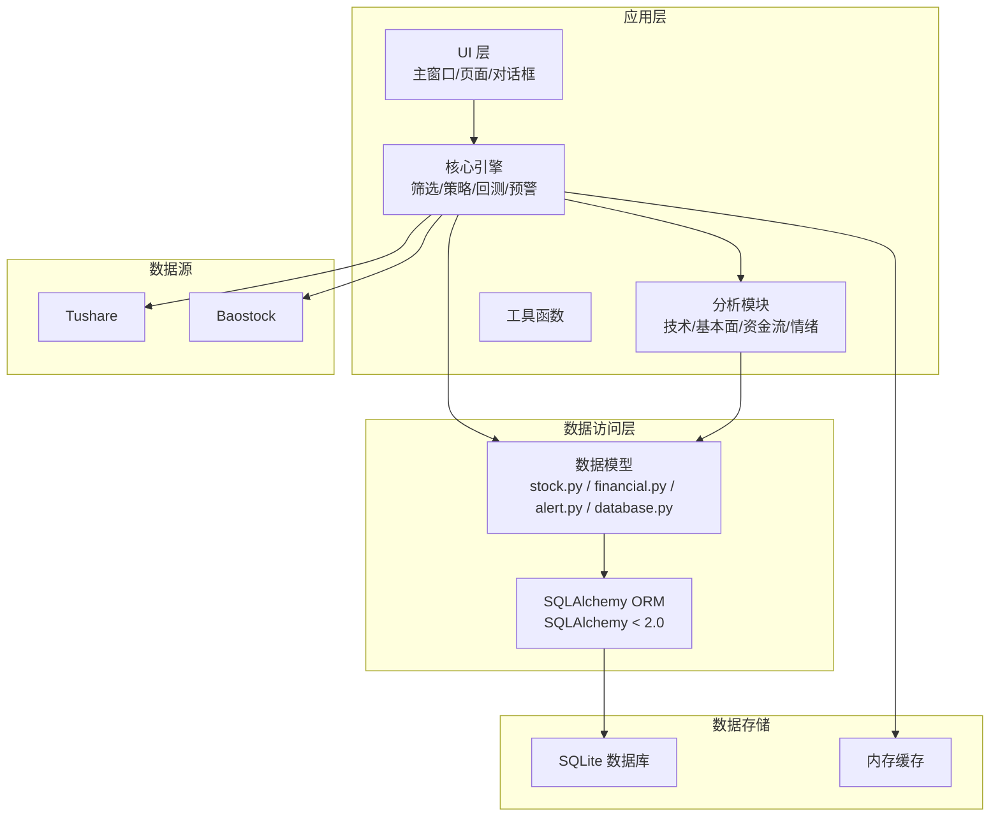
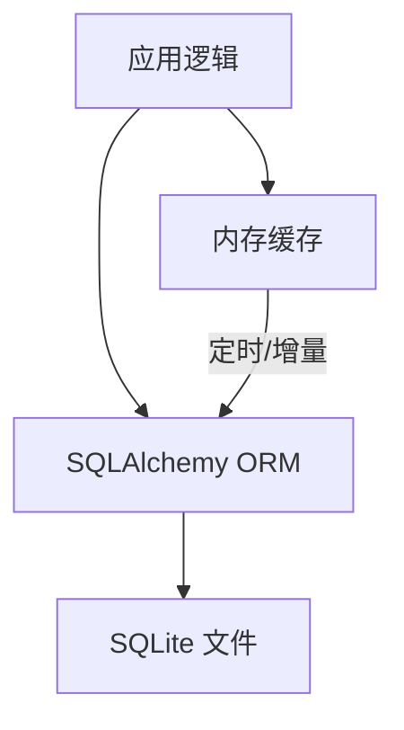
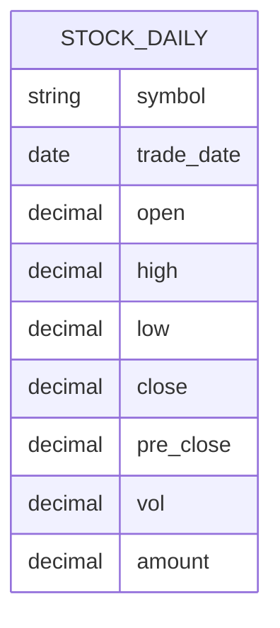
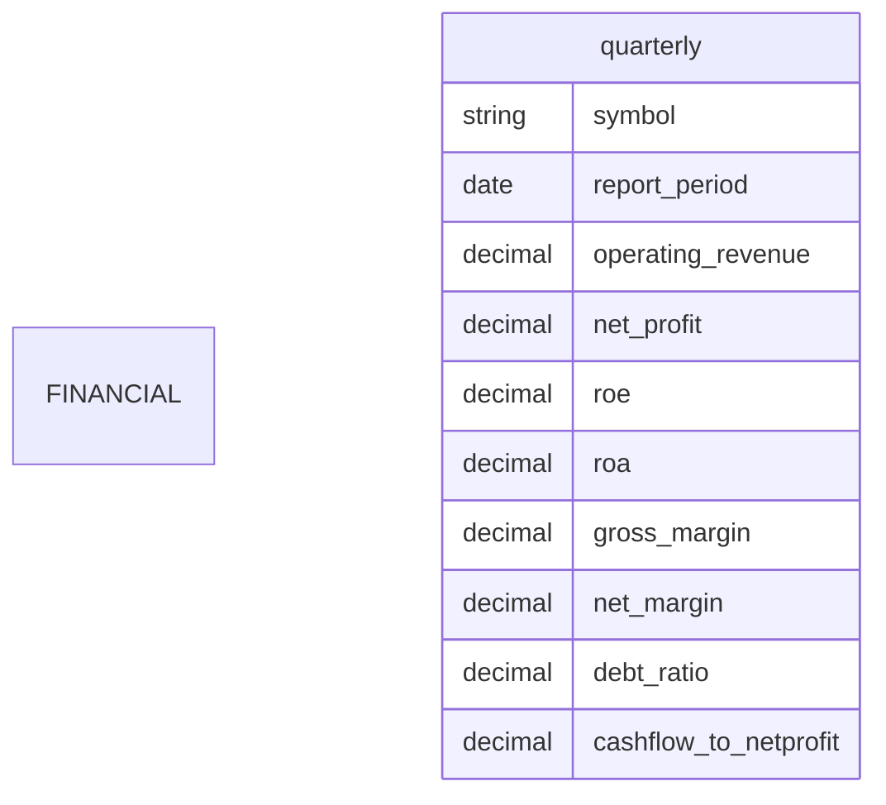
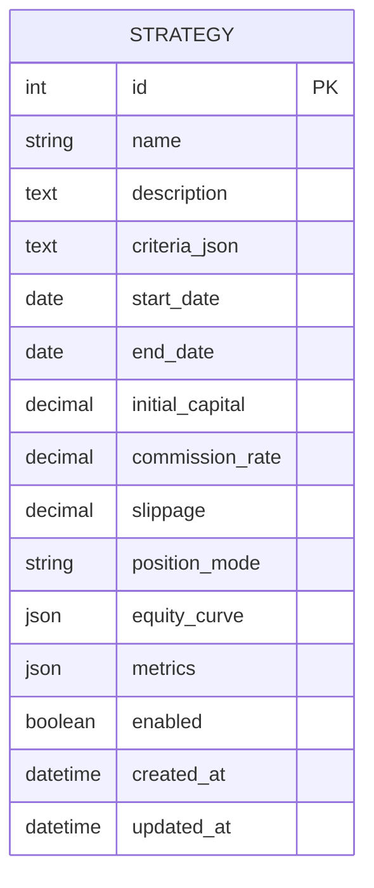
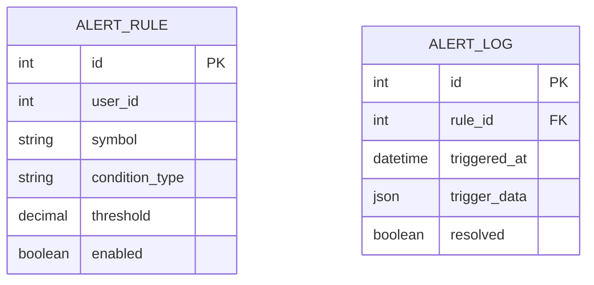
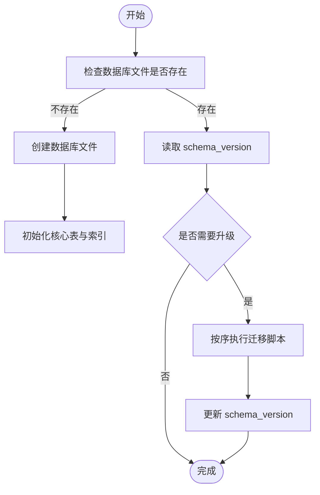
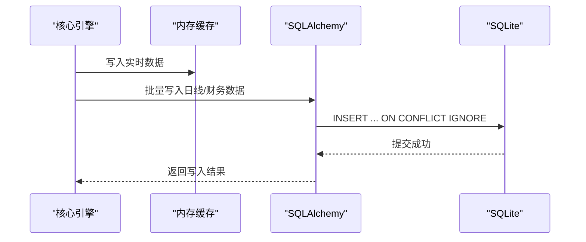
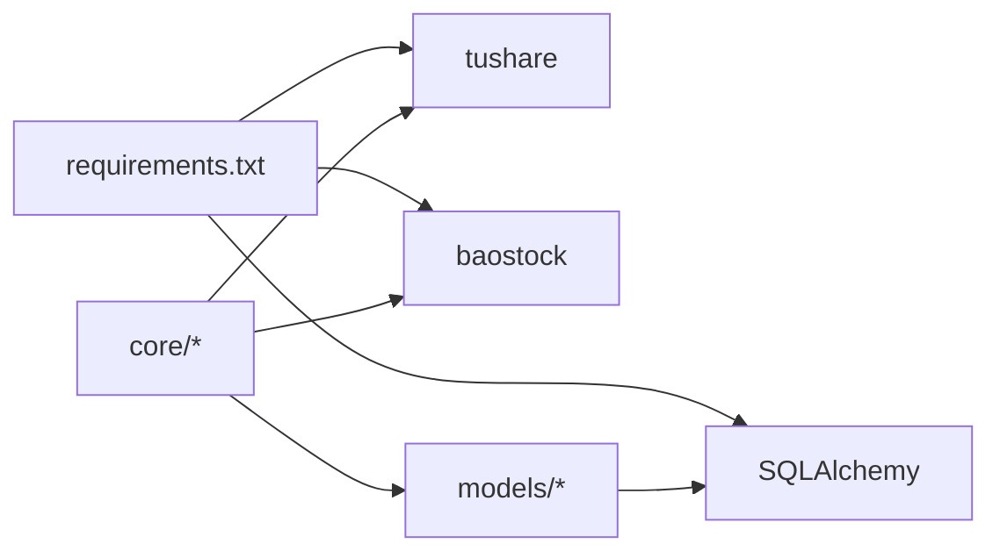
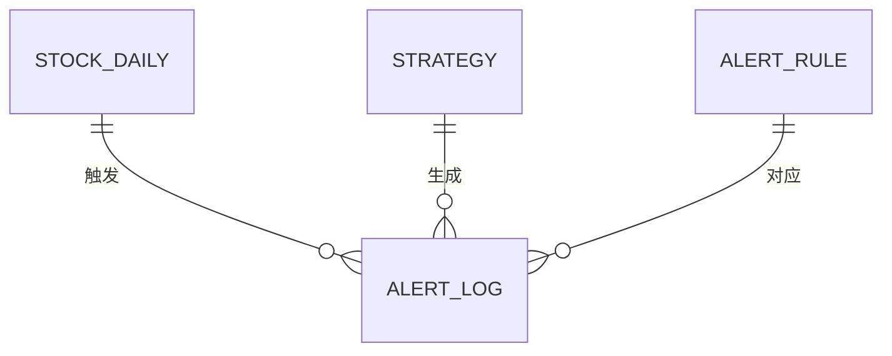

# 数据库设计

<cite>
**本文引用的文件**
- [PRD.md](file://docs/PRD.md)
- [requirements.txt](file://requirements.txt)
</cite>

## 目录
1. [简介](#简介)
2. [项目结构](#项目结构)
3. [核心组件](#核心组件)
4. [架构总览](#架构总览)
5. [详细组件分析](#详细组件分析)
6. [依赖分析](#依赖分析)
7. [性能考虑](#性能考虑)
8. [故障排查指南](#故障排查指南)
9. [结论](#结论)
10. [附录](#附录)

## 简介
本文件围绕 StockSift 的数据库设计进行系统化说明，目标包括：
- 解释数据库架构设计原则、表结构设计与关系映射
- 说明股票数据表、财务数据表、用户策略表等核心数据模型的设计思路
- 文档化字段定义、数据类型选择、索引策略与约束条件
- 说明数据完整性检查、事务处理与并发控制机制
- 提供数据库初始化脚本、表结构变更管理与版本升级策略
- 解释数据规范化与反规范化决策，以及查询性能优化技巧

说明：仓库中未包含实际的数据库建模与迁移脚本文件，本文基于 PRD 中的数据库与数据源描述进行设计层面的推导与建议。

章节来源
- [PRD.md:300-302](file://docs/PRD.md#L300-L302)

## 项目结构
从技术架构与模块组织看，StockSift 使用 SQLite 作为本地数据库，并通过 SQLAlchemy（小于 2.0）进行 ORM 访问。数据模型位于 src/models 目录，PRD 描述了数据源与缓存策略，明确了数据类型与更新频率。

图表来源
- [PRD.md:300-302](file://docs/PRD.md#L300-L302)
- [PRD.md:314-328](file://docs/PRD.md#L314-L328)
- [PRD.md:349-362](file://docs/PRD.md#L349-L362)

章节来源
- [PRD.md:300-302](file://docs/PRD.md#L300-L302)
- [PRD.md:314-328](file://docs/PRD.md#L314-L328)
- [PRD.md:349-362](file://docs/PRD.md#L349-L362)

## 核心组件
- 数据库与ORM
  - 数据库：SQLite
  - ORM：SQLAlchemy（版本小于 2.0）
- 数据模型
  - stock.py：股票基础信息与行情数据
  - financial.py：财务数据与指标
  - alert.py：预警规则与记录
  - database.py：数据库连接与初始化
- 数据源与缓存
  - 数据源：tushare、baostock
  - 缓存：股票列表（每日）、日线数据（本地）、实时数据（内存+SQLite）

章节来源
- [PRD.md:300-302](file://docs/PRD.md#L300-L302)
- [PRD.md:314-328](file://docs/PRD.md#L314-L328)
- [PRD.md:349-362](file://docs/PRD.md#L349-L362)

## 架构总览
StockSift 的数据库层采用“本地 SQLite + 内存缓存”的混合架构：
- SQLite 存放结构化数据（股票基础信息、日线行情、财务数据、策略与预警）
- 内存缓存存放高频实时数据（如实时行情），定期落库或增量合并
- ORM 层统一访问接口，确保跨平台一致性

图表来源
- [PRD.md:349-362](file://docs/PRD.md#L349-L362)
- [PRD.md:300-302](file://docs/PRD.md#L300-L302)

## 详细组件分析

### 股票数据表（日线/分钟线/实时）
- 设计目标
  - 存放日/分钟级行情与基础信息，支撑筛选、回测与图表绘制
- 推荐字段（示例）
  - 基础标识：symbol（股票代码）、trade_date（交易日/时间戳）
  - 价格序列：open、high、low、close、pre_close（前收盘）
  - 成交量：vol（手）、amount（元）
  - 指标派生：涨跌幅、换手率等（可按需派生）
- 数据类型选择
  - 数值型：decimal/pack（精度保留到小数点后若干位）
  - 时间型：date/timestamp
  - 字符串：symbol、名称等
- 索引策略
  - 主键：(symbol, trade_date)
  - 辅助索引：symbol、trade_date（用于范围查询）
- 约束与完整性
  - 非空：symbol、trade_date、open、close、vol
  - 唯一性：(symbol, trade_date)
  - 检查约束：price >= 0、vol >= 0
- 并发与事务
  - 写入采用批量事务提交，避免频繁 fsync
  - 读取使用只读事务，必要时开启 WAL 模式提升并发

图表来源
- [PRD.md:354-362](file://docs/PRD.md#L354-L362)

章节来源
- [PRD.md:354-362](file://docs/PRD.md#L354-L362)

### 财务数据表（季报/年报）
- 设计目标
  - 存放财务报表与关键指标，支持财务筛选与趋势分析
- 推荐字段（示例）
  - 基础标识：symbol、report_period（报告期）
  - 财务指标：营业总收入、归母净利润、ROE、ROA、毛利率、净利率、资产负债率、经营现金流/净利润等
- 数据类型选择
  - 数值型：decimal（注意单位一致性，如“万元”）
  - 时间型：report_period（YYYYqN 或 YYYY-MM-DD）
- 索引策略
  - 主键：(symbol, report_period)
  - 辅助索引：symbol、report_period
- 约束与完整性
  - 非空：symbol、report_period
  - 唯一性：(symbol, report_period)
  - 检查约束：财务指标非负（视业务而定）
- 并发与事务
  - 财报更新采用批处理事务，避免频繁写入

图表来源
- [PRD.md:354-362](file://docs/PRD.md#L354-L362)

章节来源
- [PRD.md:354-362](file://docs/PRD.md#L354-L362)

### 用户策略表（策略定义与回测）
- 设计目标
  - 存放用户策略定义、参数与回测结果，支持策略复用与对比
- 推荐字段（示例）
  - 策略元信息：id、name、description、created_at、updated_at
  - 筛选条件：json/文本（存储筛选表达式）
  - 回测参数：start_date、end_date、initial_capital、commission_rate、slippage、position_mode
  - 回测结果：equity_curve（序列化）、绩效指标（json）
  - 状态：enabled、deleted
- 数据类型选择
  - 文本/JSON：筛选条件与结果序列化
  - 时间型：created_at、updated_at、start_date、end_date
  - 数值型：资金、费率、滑点
- 索引策略
  - 主键：id
  - 辅助索引：name、created_at、enabled
- 约束与完整性
  - 非空：name、筛选条件、回测参数
  - 默认值：enabled=true
- 并发与事务
  - 策略保存与回测执行采用独立事务，避免相互阻塞

图表来源
- [PRD.md:195-217](file://docs/PRD.md#L195-L217)

章节来源
- [PRD.md:195-217](file://docs/PRD.md#L195-L217)

### 预警规则与记录表
- 设计目标
  - 存放用户设定的预警规则与触发记录，支持价格、涨跌幅、成交量、技术指标等
- 推荐字段（示例）
  - 规则元信息：id、user_id、symbol、condition_type、threshold、enabled
  - 触发记录：triggered_at、trigger_data（序列化）、resolved（布尔）
- 数据类型选择
  - 文本/JSON：condition_type、trigger_data
  - 时间型：triggered_at
  - 布尔：enabled、resolved
- 索引策略
  - 主键：id
  - 辅助索引：user_id、symbol、triggered_at
- 约束与完整性
  - 非空：user_id、symbol、condition_type
  - 默认值：enabled=true
- 并发与事务
  - 规则写入与触发记录采用短事务，避免阻塞

图表来源
- [PRD.md:161-166](file://docs/PRD.md#L161-L166)

章节来源
- [PRD.md:161-166](file://docs/PRD.md#L161-L166)

### 数据库初始化流程（建议）
- 初始化步骤
  - 创建数据库文件（若不存在）
  - 建立核心表（股票日线、财务季度、策略、预警规则与日志）
  - 创建索引（主键与常用查询字段）
  - 写入默认配置与版本号
- 版本管理
  - 在数据库中维护 schema_version 字段
  - 升级脚本按版本号顺序执行，记录已执行的迁移

图表来源
- [PRD.md:300-302](file://docs/PRD.md#L300-L302)

章节来源
- [PRD.md:300-302](file://docs/PRD.md#L300-L302)

### 数据更新与增量同步（建议）
- 股票列表与日线：每日增量更新，基于 trade_date 去重插入
- 财务数据：按季/年报更新，基于 report_period 去重
- 实时数据：内存缓存，定时批量写入 SQLite
- 冲突处理：按主键冲突忽略或更新（ON CONFLICT IGNORE/REPLACE）

图表来源
- [PRD.md:349-362](file://docs/PRD.md#L349-L362)

章节来源
- [PRD.md:349-362](file://docs/PRD.md#L349-L362)

## 依赖分析
- 外部依赖
  - SQLAlchemy（< 2.0）：ORM 访问 SQLite
  - tushare/baostock：数据源
- 内部耦合
  - models 与 ORM 强耦合，通过类映射表
  - 核心引擎依赖 models 与缓存，实现数据读写与计算

图表来源
- [requirements.txt:21](file://requirements.txt#L21)
- [requirements.txt:9-10](file://requirements.txt#L9-L10)
- [PRD.md:300-302](file://docs/PRD.md#L300-L302)

章节来源
- [requirements.txt:21](file://requirements.txt#L21)
- [requirements.txt:9-10](file://requirements.txt#L9-L10)
- [PRD.md:300-302](file://docs/PRD.md#L300-L302)

## 性能考虑
- 表设计
  - 将高频查询字段建立索引；避免过度索引导致写入变慢
  - 使用合适的数据类型，减少存储与 IO
- 查询优化
  - 使用 LIMIT 与分页；避免 SELECT *
  - 对日期范围查询使用覆盖索引
- 写入优化
  - 批量写入（INSERT OR IGNORE/REPLACE INTO ... VALUES (...),(...),...）
  - 使用事务包裹多次写入
- 并发控制
  - 启用 WAL 模式，提高读写并发
  - 写入端使用短事务，避免长事务锁表
- 缓存策略
  - 实时数据优先内存缓存，定时批量落库
  - 日线/财务数据按天/按季增量更新

[本节为通用性能建议，无需特定文件引用]

## 故障排查指南
- 常见问题
  - 写入失败：检查唯一约束与冲突处理策略（ON CONFLICT）
  - 查询缓慢：确认索引是否命中；避免全表扫描
  - 数据不一致：检查事务边界与 WAL 模式配置
- 排查步骤
  - 查看 schema_version 与迁移记录
  - 检查主键与外键约束
  - 使用 EXPLAIN QUERY PLAN 分析慢查询
- 建议
  - 对关键路径增加日志与重试
  - 对大表分片或分区（按时间维度）

[本节为通用排障建议，无需特定文件引用]

## 结论
StockSift 的数据库设计以 SQLite 为核心，结合内存缓存与 ORM 抽象，满足本地化、高性能与易维护的需求。通过合理的表结构、索引与事务策略，可在保证数据一致性的同时，支撑筛选、回测与分析等核心功能。后续建议补充实际的建模与迁移脚本，并持续完善性能与可靠性。

[本节为总结，无需特定文件引用]

## 附录

### 数据模型总览（ER）

图表来源
- [PRD.md:161-166](file://docs/PRD.md#L161-L166)
- [PRD.md:195-217](file://docs/PRD.md#L195-L217)

### 字段命名与类型规范（建议）
- 命名规范：下划线分隔，避免保留字
- 类型规范：数值统一为 decimal，时间统一为 date/timestamp，文本统一为 text/json
- 约束规范：非空、唯一、检查约束明确

[本节为通用规范建议，无需特定文件引用]