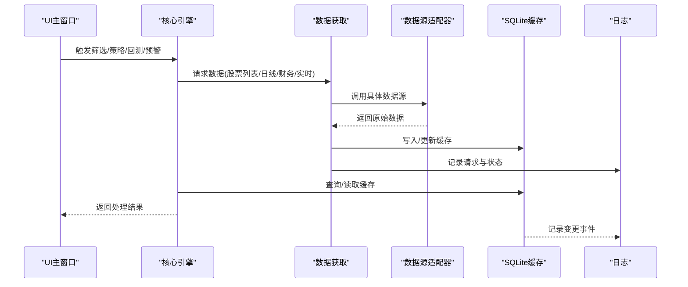
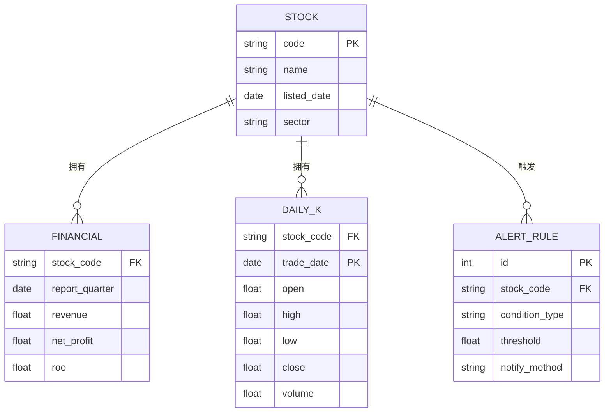
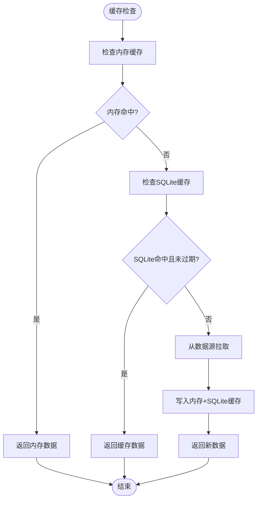
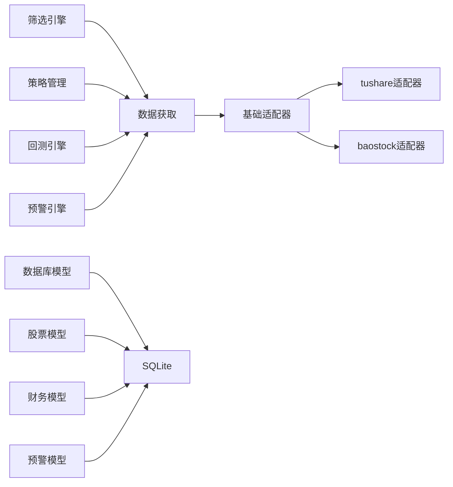

# 数据管理

<cite>
**本文引用的文件**
- [PRD.md](file://docs/PRD.md)
- [main_window.py](file://src/ui/main_window.py)
- [pages目录](file://src/ui/pages/)
- [widgets目录](file://src/ui/widgets/)
- [dialogs目录](file://src/ui/dialogs/)
- [analysis技术分析](file://src/analysis/technical.py)
- [analysis基本面分析](file://src/analysis/fundamental.py)
- [analysis资金流向](file://src/analysis/capital_flow.py)
- [analysis情绪分析](file://src/analysis/sentiment.py)
- [datasource基础适配器](file://src/datasource/base_adapter.py)
- [datasourcetushare适配器](file://src/datasource/tushare_adapter.py)
- [datasourcebaostock适配器](file://src/datasource/baostock_adapter.py)
- [core筛选引擎](file://src/core/screener.py)
- [core策略管理](file://src/core/strategy.py)
- [core回测引擎](file://src/core/backtest.py)
- [core预警引擎](file://src/core/alert_engine.py)
- [core数据获取](file://src/core/data_fetcher.py)
- [utils工具函数](file://src/utils/)
- [data/db目录](file://data/db/)
- [data/cache目录](file://data/cache/)
- [data/logs目录](file://data/logs/)
- [config目录](file://config/)
- [resources资源目录](file://resources/)
</cite>

## 目录
1. [简介](#简介)
2. [项目结构](#项目结构)
3. [核心组件](#核心组件)
4. [架构总览](#架构总览)
5. [详细组件分析](#详细组件分析)
6. [依赖分析](#依赖分析)
7. [性能考量](#性能考量)
8. [故障排查指南](#故障排查指南)
9. [结论](#结论)
10. [附录](#附录)

## 简介
本文件面向StockSift的数据管理系统，围绕数据库设计、缓存策略与日志管理展开，系统性阐述数据模型结构、字段定义与关系映射；说明数据存储方案、数据同步机制与一致性保障；覆盖缓存策略的实现原理、失效机制与性能优化；提供数据导入导出、备份恢复与迁移的操作指南；并从数据安全、隐私保护与合规性角度给出建议，为数据管理员提供完整的数据治理参考。

## 项目结构
StockSift采用模块化分层架构，数据管理相关的关键目录与职责如下：
- data：存放数据库、缓存与日志等持久化与运行时数据
  - data/db：SQLite数据库文件与初始化脚本
  - data/cache：缓存配置与临时缓存数据
  - data/logs：应用运行日志
- src：核心业务逻辑与UI
  - src/core：核心引擎（筛选、策略、回测、预警、数据获取）
  - src/datasource：数据源适配器（tushare、baostock等）
  - src/analysis：分析模块（技术、基本面、资金流向、情绪）
  - src/models：数据模型（股票、预警、财务、数据库）
  - src/ui：用户界面（主窗口、页面、组件、对话框）
  - src/utils：通用工具函数
- config：配置管理
- resources：图标、策略模板、主题等资源

```mermaid
graph TB
subgraph "数据层(data)"
DB["SQLite 数据库<br/>data/db"]
CACHE["缓存目录<br/>data/cache"]
LOGS["日志目录<br/>data/logs"]
end
subgraph "核心引擎(src/core)"
CORE_SCREENER["筛选引擎"]
CORE_STRATEGY["策略管理"]
CORE_BACKTEST["回测引擎"]
CORE_ALERT["预警引擎"]
CORE_FETCHER["数据获取"]
end
subgraph "数据源(src/datasource)"
ADAPTER_BASE["基础适配器"]
ADAPTER_TUSHARE["tushare 适配器"]
ADAPTER_BAOSTOCK["baostock 适配器"]
end
subgraph "分析(src/analysis)"
TECH["技术分析"]
FUND["基本面分析"]
CAPF["资金流向"]
SENT["情绪分析"]
end
subgraph "模型(src/models)"
MODELS_STOCK["股票模型"]
MODELS_ALERT["预警模型"]
MODELS_FIN["财务模型"]
MODELS_DB["数据库模型"]
end
subgraph "界面(src/ui)"
UI_MAIN["主窗口"]
UI_PAGES["页面"]
UI_WIDGETS["组件"]
UI_DIALOGS["对话框"]
end
subgraph "工具与配置(src/utils, config)"
UTILS["工具函数"]
CONFIG["配置管理"]
end
ADAPTER_BASE --> CORE_FETCHER
ADAPTER_TUSHARE --> CORE_FETCHER
ADAPTER_BAOSTOCK --> CORE_FETCHER
CORE_FETCHER --> DB
CORE_FETCHER --> CACHE
CORE_SCREENER --> DB
CORE_STRATEGY --> DB
CORE_BACKTEST --> DB
CORE_ALERT --> DB
TECH --> DB
FUND --> DB
CAPF --> DB
SENT --> DB
MODELS_STOCK --> DB
MODELS_ALERT --> DB
MODELS_FIN --> DB
MODELS_DB --> DB
UI_MAIN --> CORE_SCREENER
UI_MAIN --> CORE_STRATEGY
UI_MAIN --> CORE_BACKTEST
UI_MAIN --> CORE_ALERT
UI_MAIN --> CORE_FETCHER
UTILS --> CORE_SCREENER
UTILS --> CORE_STRATEGY
UTILS --> CORE_BACKTEST
UTILS --> CORE_ALERT
UTILS --> CORE_FETCHER
CONFIG --> CORE_FETCHER
CONFIG --> CORE_SCREENER
CONFIG --> CORE_STRATEGY
CONFIG --> CORE_BACKTEST
CONFIG --> CORE_ALERT
```

**图表来源**
- [PRD.md:214-247](file://docs/PRD.md#L214-L247)
- [main_window.py](file://src/ui/main_window.py)
- [datasource基础适配器](file://src/datasource/base_adapter.py)
- [datasourcetushare适配器](file://src/datasource/tushare_adapter.py)
- [datasourcebaostock适配器](file://src/datasource/baostock_adapter.py)
- [core筛选引擎](file://src/core/screener.py)
- [core策略管理](file://src/core/strategy.py)
- [core回测引擎](file://src/core/backtest.py)
- [core预警引擎](file://src/core/alert_engine.py)
- [core数据获取](file://src/core/data_fetcher.py)
- [analysis技术分析](file://src/analysis/technical.py)
- [analysis基本面分析](file://src/analysis/fundamental.py)
- [analysis资金流向](file://src/analysis/capital_flow.py)
- [analysis情绪分析](file://src/analysis/sentiment.py)

**章节来源**
- [PRD.md:214-247](file://docs/PRD.md#L214-L247)

## 核心组件
- 数据源适配器：统一抽象不同数据源接口，支持tushare与baostock等，具备自动切换与故障转移能力
- 数据获取与缓存：负责从数据源抓取数据，写入本地SQLite缓存，并按策略进行过期更新
- 数据模型：定义股票、财务、预警等实体模型，支撑筛选、策略、回测与分析
- 分析引擎：技术分析、基本面分析、资金流向与情绪分析模块
- 核心引擎：筛选、策略、回测、预警四大引擎协同工作
- UI层：主窗口与页面承载数据展示与交互，对话框用于配置与确认
- 工具与配置：提供通用工具函数与配置管理，贯穿数据流程

**章节来源**
- [PRD.md:251-272](file://docs/PRD.md#L251-L272)
- [PRD.md:214-247](file://docs/PRD.md#L214-L247)

## 架构总览
数据流从UI触发，经由核心引擎调度，通过数据获取模块访问数据源适配器，将结果写入本地SQLite缓存；分析模块基于缓存数据进行计算；日志记录贯穿各环节，确保可观测性与可追溯性。

**图表来源**
- [PRD.md:251-272](file://docs/PRD.md#L251-L272)
- [core数据获取](file://src/core/data_fetcher.py)
- [datasource基础适配器](file://src/datasource/base_adapter.py)
- [datasourcetushare适配器](file://src/datasource/tushare_adapter.py)
- [datasourcebaostock适配器](file://src/datasource/baostock_adapter.py)
- [data/db目录](file://data/db/)
- [data/logs目录](file://data/logs/)

## 详细组件分析

### 数据库设计与数据模型
- 数据存储方案
  - 本地SQLite：作为主要缓存与持久化存储，支持股票列表、日线数据、财务数据、实时行情等
  - 缓存策略：股票列表每日更新、日线数据每日收盘后入库、财务数据季报发布时入库、实时行情内存+SQLite双写
- 数据模型结构
  - 股票模型：包含股票代码、名称、上市日期、所属板块等基础信息
  - 财务模型：包含季度财务指标、资产负债表、利润表等关键字段
  - 预警模型：包含预警规则、触发条件、通知方式等
  - 数据库模型：封装连接、事务、索引与约束定义
- 关系映射
  - 股票与财务：一对多（一个股票对应多个季度财务数据）
  - 股票与日线：一对多（一个股票对应多日K线）
  - 股票与预警：一对多（一个股票可关联多个预警规则）

**图表来源**
- [PRD.md:251-272](file://docs/PRD.md#L251-L272)
- [models目录](file://src/models/)

**章节来源**
- [PRD.md:251-272](file://docs/PRD.md#L251-L272)

### 缓存策略与失效机制
- 缓存层次
  - 内存缓存：实时行情与短期高频数据
  - 本地SQLite缓存：股票列表、日线、财务等结构化数据
- 失效与更新
  - 按数据类型设定过期策略：股票列表每日刷新、日线收盘后入库、财务数据按季更新
  - 异常时自动重试与数据源切换，保证缓存新鲜度与可用性
- 性能优化
  - 合理索引与查询优化，避免全表扫描
  - 批量写入与事务提交，降低I/O开销
  - 内存缓存命中率优先，热点数据驻留

**图表来源**
- [PRD.md:259-262](file://docs/PRD.md#L259-L262)
- [core数据获取](file://src/core/data_fetcher.py)
- [data/db目录](file://data/db/)
- [data/cache目录](file://data/cache/)

**章节来源**
- [PRD.md:259-262](file://docs/PRD.md#L259-L262)

### 日志管理与可观测性
- 日志落盘位置：data/logs
- 日志内容：请求参数、响应状态、错误堆栈、缓存命中/失效、数据源切换、关键操作审计
- 日志轮转与保留策略：按大小/时间轮转，保留最近N天或M份文件
- 建议：区分DEBUG/INFO/WARN/ERROR级别，生产环境默认INFO以上

**章节来源**
- [PRD.md:259-262](file://docs/PRD.md#L259-L262)
- [data/logs目录](file://data/logs/)

### 数据同步机制与一致性保证
- 同步策略
  - 批量同步：日线、财务等结构化数据在固定时间窗口批量入库
  - 增量同步：实时行情按周期增量写入
- 一致性保障
  - 事务包裹写入，失败回滚
  - 幂等写入：重复请求不产生重复数据
  - 版本控制：为关键表增加版本号字段，防止并发覆盖

**章节来源**
- [PRD.md:264-271](file://docs/PRD.md#L264-L271)

### 数据导入导出、备份恢复与迁移
- 导入
  - 支持CSV/Excel格式导入股票池、财务数据、回测结果
  - 导入前进行字段校验与去重处理
- 导出
  - 支持导出筛选结果、策略报告、回测明细、预警记录
- 备份
  - 定期备份SQLite数据库文件
  - 增量备份结合全量备份，确保RPO/RTO目标
- 恢复
  - 快速定位最近可用备份，按时间点恢复
- 迁移
  - 版本升级时执行迁移脚本，兼容旧表结构
  - 迁移前后进行完整性校验

**章节来源**
- [PRD.md:323-326](file://docs/PRD.md#L323-L326)

### 数据安全、隐私保护与合规
- 数据加密
  - 敏感配置（如API Key）采用加密存储或环境变量注入
- 访问控制
  - 限制对data/db与data/logs的文件系统权限
- 隐私保护
  - 不收集个人身份信息；若涉及用户行为数据，遵循最小化原则
- 合规性
  - 遵循数据留存与销毁期限要求
  - 提供数据删除与导出功能，满足用户权利请求

**章节来源**
- [PRD.md:283-286](file://docs/PRD.md#L283-L286)

## 依赖分析
- 组件耦合
  - 数据获取模块与数据源适配器松耦合，通过统一接口扩展新数据源
  - 核心引擎与数据模型解耦，通过接口契约交互
- 外部依赖
  - SQLite作为嵌入式数据库，无需额外服务
  - 数据源SDK（如tushare）用于外部数据获取
- 循环依赖
  - 通过模块拆分与接口抽象避免循环依赖

**图表来源**
- [PRD.md:214-247](file://docs/PRD.md#L214-L247)
- [datasource基础适配器](file://src/datasource/base_adapter.py)
- [datasourcetushare适配器](file://src/datasource/tushare_adapter.py)
- [datasourcebaostock适配器](file://src/datasource/baostock_adapter.py)
- [core数据获取](file://src/core/data_fetcher.py)
- [core筛选引擎](file://src/core/screener.py)
- [core策略管理](file://src/core/strategy.py)
- [core回测引擎](file://src/core/backtest.py)
- [core预警引擎](file://src/core/alert_engine.py)
- [models数据库模型](file://src/models/database.py)
- [models股票模型](file://src/models/stock.py)
- [models财务模型](file://src/models/financial.py)
- [models预警模型](file://src/models/alert.py)
- [data/db目录](file://data/db/)

**章节来源**
- [PRD.md:214-247](file://docs/PRD.md#L214-L247)

## 性能考量
- 查询优化
  - 为常用查询字段建立索引，避免隐式转换导致的索引失效
- 写入优化
  - 使用事务批量写入，减少磁盘I/O
- 缓存优化
  - 热点数据驻留内存，冷数据定期淘汰
- 并发控制
  - 读写分离或队列化写入，避免锁竞争
- 监控告警
  - 建立慢查询与高延迟告警，持续优化

[本节为通用指导，无需列出章节来源]

## 故障排查指南
- 数据源异常
  - 检查API Key与网络连通性，查看日志中数据源切换与重试记录
- 缓存异常
  - 校验SQLite文件是否损坏，必要时重建缓存
- 性能问题
  - 分析慢查询日志，优化索引与SQL
- 备份恢复
  - 确认备份文件完整性，按时间点恢复并验证数据一致性

**章节来源**
- [PRD.md:283-286](file://docs/PRD.md#L283-L286)
- [data/logs目录](file://data/logs/)

## 结论
StockSift的数据管理以本地SQLite为核心，结合内存缓存与数据源适配器，形成高效、可靠的数据体系。通过明确的数据模型、缓存策略与日志管理，配合完善的导入导出、备份恢复与迁移机制，能够满足数据治理与运营需求。建议在后续版本中进一步完善缓存一致性、自动化运维与合规审计能力。

[本节为总结性内容，无需列出章节来源]

## 附录
- 目录结构速览
  - data/db：数据库文件与初始化脚本
  - data/cache：缓存配置与临时缓存
  - data/logs：运行日志
  - src/core：核心引擎
  - src/datasource：数据源适配器
  - src/analysis：分析模块
  - src/models：数据模型
  - src/ui：用户界面
  - src/utils：工具函数
  - config：配置管理
  - resources：资源文件

**章节来源**
- [PRD.md:214-247](file://docs/PRD.md#L214-L247)