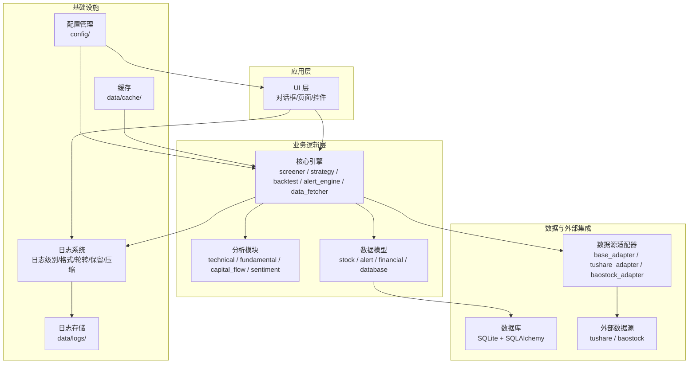
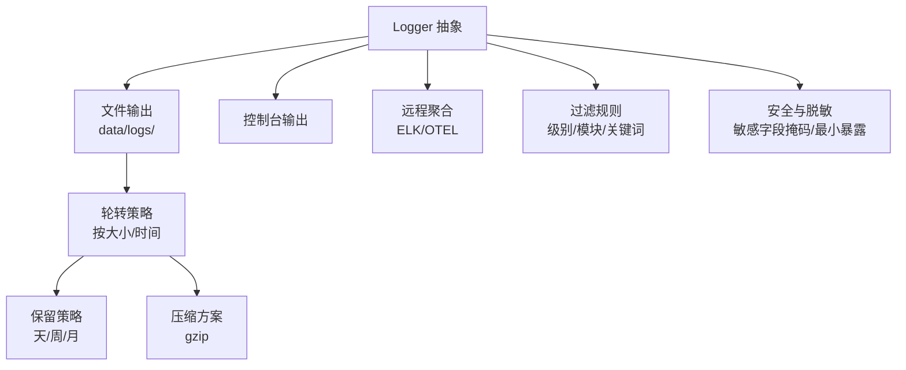
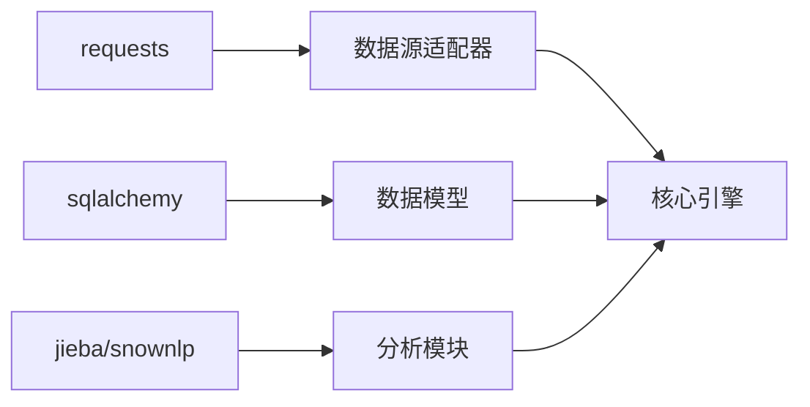

# 日志管理

<cite>
**本文引用的文件**
- [PRD.md](file://docs/PRD.md)
- [requirements.txt](file://requirements.txt)
</cite>

## 目录
1. [引言](#引言)
2. [项目结构](#项目结构)
3. [核心组件](#核心组件)
4. [架构总览](#架构总览)
5. [详细组件分析](#详细组件分析)
6. [依赖分析](#依赖分析)
7. [性能考虑](#性能考虑)
8. [故障排查指南](#故障排查指南)
9. [结论](#结论)
10. [附录](#附录)

## 引言
本文件围绕StockSift的日志管理进行系统化文档化，目标是：
- 解释日志架构设计、日志级别分类与日志格式标准
- 明确应用日志、错误日志、访问日志与调试日志的记录策略
- 文档化日志轮转、保留与压缩方案
- 提供日志聚合、分析与异常监控的实现思路
- 定义日志配置管理、输出格式定制与过滤规则
- 讨论日志安全、敏感信息脱敏与合规性要求
- 给出日志性能影响分析、写入优化与故障排查建议

说明：当前仓库未包含具体日志实现代码，本文基于现有工程结构与模块职责，结合通用日志最佳实践给出可落地的设计与实施建议。

## 项目结构
StockSift采用模块化分层组织，核心模块包括：
- 核心引擎：screener（筛选）、strategy（策略）、backtest（回测）、alert_engine（预警）、data_fetcher（数据获取）
- 数据源适配器：base_adapter、tushare_adapter、baostock_adapter
- 分析模块：technical（技术分析）、fundamental（基本面分析）、capital_flow（资金流向）、sentiment（情绪分析）
- 数据模型：stock、alert、financial、database
- 工具与实用模块：utils（待完善）

**章节来源**
- [PRD.md: 304-328:304-328](file://docs/PRD.md#L304-L328)

## 核心组件
- 核心引擎：负责筛选、策略、回测、预警与数据获取，是日志记录的关键入口
- 数据源适配器：封装外部数据接口调用，适合在调用前后记录访问日志
- 分析模块：技术与基本面分析，适合记录分析过程与中间结果
- 数据模型：数据库交互与实体操作，适合记录关键事务与异常
- UI层：用户交互事件与状态变更，适合记录访问日志与调试信息

日志系统应与上述组件解耦，通过统一的Logger抽象接入，避免侵入式硬编码。

**章节来源**
- [PRD.md: 304-328:304-328](file://docs/PRD.md#L304-L328)

## 架构总览
日志架构建议采用“集中式Logger + 多输出通道”的模式：
- Logger抽象：统一日志级别、格式与上下文
- 输出通道：控制台、文件、远程聚合（如ELK/OTEL）
- 轮转与保留：按大小/时间轮转，保留策略与压缩
- 过滤与采样：按级别、模块、关键词过滤；对高频事件采样
- 安全与合规：敏感字段脱敏、最小暴露原则、审计轨迹

## 详细组件分析

### 日志级别分类与格式标准
- 级别建议
  - TRACE：极细粒度调试（仅开发环境启用）
  - DEBUG：调试信息（参数、中间结果）
  - INFO：常规运行信息（启动、完成、状态变更）
  - WARN：潜在问题（配置不当、降级行为）
  - ERROR：错误事件（异常、失败）
  - FATAL：致命错误（系统不可恢复）
- 格式建议
  - 时间戳（UTC或本地时区，含毫秒）
  - 日志级别
  - 模块/组件名
  - 请求/会话标识（可选）
  - 用户标识（可选）
  - 消息正文
  - 关键字/标签（便于检索）
  - 结构化字段（JSON），便于解析与聚合

### 应用日志记录策略
- 核心引擎
  - 筛选开始/结束、策略执行、回测初始化/完成、预警触发
  - 关键参数与阈值
- 数据源适配器
  - 请求发起、响应状态、耗时、错误码
- 分析模块
  - 分析步骤、中间指标、异常分支
- 数据模型
  - 数据库事务开始/提交/回滚、慢查询、重复键冲突
- UI层
  - 页面切换、按钮点击、导出开始/完成、错误提示

### 错误日志记录策略
- 捕获所有异常并记录上下文
- 包含堆栈跟踪（生产环境可按需裁剪）
- 对外部依赖错误区分网络超时、认证失败、限流等
- 记录重试次数与退避策略

### 访问日志记录策略
- 记录用户行为与系统交互
- 包含用户标识、IP、UA、时间、路径、方法、状态码、耗时
- 对敏感URL与参数进行脱敏

### 调试日志记录策略
- 开发/测试环境启用TRACE/DEBUG
- 仅记录必要细节，避免泄露敏感信息
- 使用异步写入降低开销

### 日志轮转机制
- 基于大小轮转：当日志达到阈值（如100MB）自动切割
- 基于时间轮转：每日/每周轮转
- 保留策略：最近N份副本，超过保留期删除
- 压缩方案：轮转后文件压缩（gzip），节省空间

### 日志聚合、分析与异常监控
- 聚合：集中收集到日志中心（如Filebeat + Logstash/Fluentd）
- 分析：基于关键字/正则表达式、结构化字段进行统计与告警
- 异常监控：阈值告警（ERROR/FATAL频率）、趋势异常、下游依赖异常
- 可视化：仪表板展示错误趋势、Top异常、响应时间分布

### 日志配置管理、格式定制与过滤规则
- 配置管理：独立配置文件，支持热加载
- 格式定制：支持文本/JSON两种格式，JSON便于机器解析
- 过滤规则：按模块、级别、关键词、用户/租户维度过滤
- 采样：高频接口按百分比采样，降低噪声

### 日志安全性、敏感信息脱敏与合规
- 脱敏：密码、令牌、手机号、身份证号、地址等字段掩码
- 最小暴露：仅记录必要字段，避免冗余敏感信息
- 合规：遵循GDPR/CCPA等法规，提供删除与访问控制
- 审计：记录管理员操作与敏感动作

## 依赖分析
- 外部依赖与日志相关性
  - requests：网络请求日志（URL、状态码、耗时、错误）
  - sqlalchemy：数据库操作日志（SQL语句、参数、耗时、异常）
  - jieba/snownlp：文本处理日志（输入长度、处理耗时、异常）
- 模块间耦合
  - 核心引擎与数据源适配器：需要在调用前后记录访问日志
  - 分析模块与核心引擎：记录分析过程与结果
  - 数据模型与数据库：记录事务与异常

**章节来源**
- [requirements.txt: 23-28:23-28](file://requirements.txt#L23-L28)
- [PRD.md: 304-328:304-328](file://docs/PRD.md#L304-L328)

## 性能考虑
- 异步写入：使用队列缓冲与后台线程/进程写入磁盘
- 批量刷盘：合并写入减少系统调用
- 结构化日志：JSON便于解析与传输，但注意序列化开销
- 过滤与采样：减少无效日志量
- 轮转与压缩：避免I/O阻塞，合理设置轮转阈值
- 磁盘空间：预留足够空间，监控使用率并告警

## 故障排查指南
- 常见问题
  - 日志丢失：检查轮转配置、磁盘空间、权限
  - 性能下降：检查同步写入、批量策略、过滤规则
  - 敏感信息泄露：核查脱敏规则与输出格式
- 排查步骤
  - 确认日志级别与过滤规则
  - 查看最近轮转文件与当前文件
  - 搜索关键字/错误码/异常堆栈
  - 对比上游依赖日志（网络/数据库）
- 工具建议
  - 文件监控：tail/less/vim
  - 搜索：grep/ripgrep/ack
  - 可视化：ELK/OTEL/Grafana

## 结论
通过建立统一的Logger抽象、明确的日志级别与格式、完善的轮转与保留策略，以及安全与合规约束，StockSift可以在保证性能的前提下获得高质量的日志体系。建议优先实现文件输出与基础轮转，再逐步引入远程聚合与智能分析能力。

## 附录
- 建议的目录与文件
  - data/logs/：存放日志文件
  - config/logging.yaml：日志配置（级别、格式、轮转、过滤）
  - scripts/logrotate.sh：轮转脚本（可选）
- 快速落地清单
  - 在核心引擎与数据源适配器中注入Logger
  - 实现文件输出与按大小/时间轮转
  - 配置保留策略与压缩
  - 建立错误与异常监控
  - 实施敏感信息脱敏
  - 编写运维手册与故障排查流程