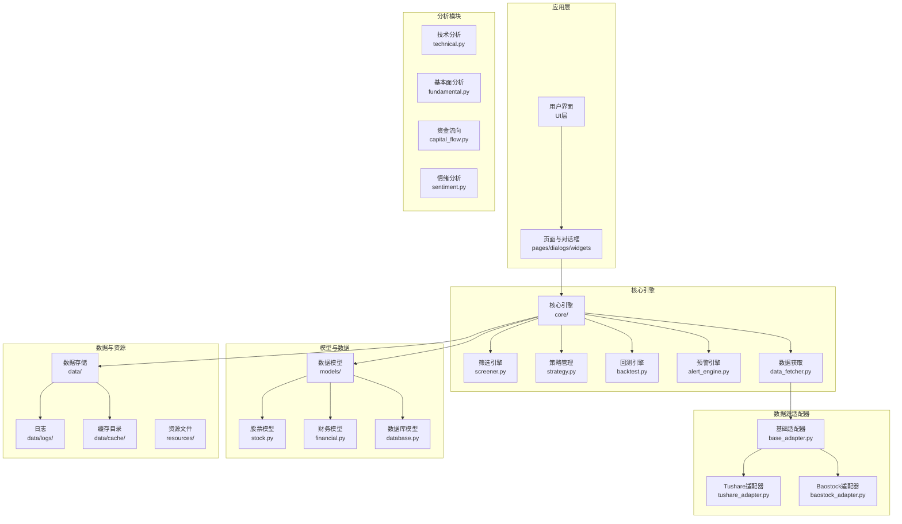
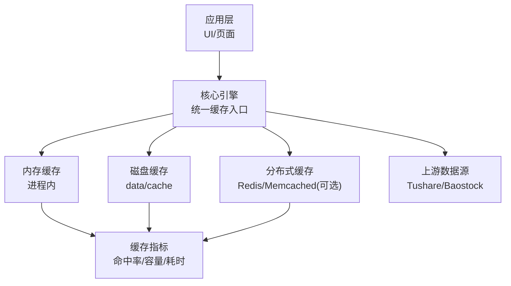

# 缓存策略

<cite>
**本文引用的文件**
- [PRD.md](file://docs/PRD.md)
- [requirements.txt](file://requirements.txt)
</cite>

## 目录
1. [引言](#引言)
2. [项目结构](#项目结构)
3. [核心组件](#核心组件)
4. [架构总览](#架构总览)
5. [详细组件分析](#详细组件分析)
6. [依赖分析](#依赖分析)
7. [性能考虑](#性能考虑)
8. [故障排查指南](#故障排查指南)
9. [结论](#结论)
10. [附录](#附录)

## 引言
本文件围绕StockSift的缓存系统进行系统化梳理与文档化，目标是阐明缓存架构设计、缓存层次结构与缓存策略实现；解释内存缓存、磁盘缓存与分布式缓存的应用场景；文档化缓存键设计、缓存失效机制与缓存更新策略；覆盖LRU、LFU等常见淘汰算法的选择与实现要点；并提供缓存性能监控、命中率统计与容量管理方法，以及缓存一致性、缓存穿透与缓存雪崩的防护措施与优化建议。

## 项目结构
从仓库结构看，StockSift采用模块化组织方式，核心业务位于src目录下，数据与资源分别位于data与resources目录。根据PRD文档，系统包含“核心引擎”“数据源适配器”“分析模块”“模型层”“UI层”“工具函数”等模块。缓存策略应贯穿数据获取、计算与展示各环节，以提升筛选、回测、图表渲染与数据导出等高频操作的响应速度与稳定性。

**图表来源**
- [PRD.md:304-337](file://docs/PRD.md#L304-L337)

**章节来源**
- [PRD.md:304-337](file://docs/PRD.md#L304-L337)

## 核心组件
- 筛选引擎：负责多维条件组合与全市场股票筛选，涉及大量数据读取与计算，适合引入多级缓存以加速筛选过程。
- 回测引擎：历史数据回测与指标计算密集，适合缓存中间结果与计算片段。
- 预警引擎：实时监控与阈值判断，适合短期内存缓存与热点数据驻留。
- 数据获取：对接tushare与baostock等外部数据源，适合缓存接口响应与解析后的结构化数据。
- 分析模块：技术分析、资金流向、情绪分析等，适合缓存指标序列与中间态结果。
- 模型层：股票与财务模型，适合缓存查询结果与计算缓存键。
- 数据存储：data/cache用于缓存目录，data/logs用于日志输出。

**章节来源**
- [PRD.md:310-323](file://docs/PRD.md#L310-L323)
- [PRD.md:324-328](file://docs/PRD.md#L324-L328)
- [PRD.md:334-336](file://docs/PRD.md#L334-L336)

## 架构总览
缓存体系建议采用“多级缓存 + 统一键空间 + 可观测性”的设计思路：

- 应用层（UI）：仅感知缓存命中/未命中，不直接操作底层细节。
- 核心引擎：统一接入缓存服务，按模块职责划分缓存域。
- 数据源适配器：对上游数据进行幂等封装，避免重复抓取。
- 分析模块：对计算结果进行缓存，减少重复计算。
- 存储层：data/cache作为本地磁盘缓存根目录，配合内存缓存与可选分布式缓存。

[此图为概念性架构示意，无需图表来源]

## 详细组件分析

### 策略与键设计
- 键空间设计原则
  - 唯一键：由“模块域 + 请求参数 + 版本号/时间戳”构成，确保不同参数组合不冲突。
  - 命名规范：采用“模块域:类型:标识符”或“模块域:参数哈希”的形式，便于检索与清理。
  - 版本控制：当数据结构或计算规则变更时，通过版本号使旧键失效。
- 典型键域
  - 筛选条件键：包含市场、行业、概念、地域、指标范围等参数哈希。
  - 回测参数键：包含策略参数、时间窗口、指标集合等。
  - 预警条件键：包含阈值、周期、过滤条件等。
  - 数据获取键：包含数据类型、日期范围、频率、数据源标识等。
  - 分析结果键：包含指标类型、周期、标的集合等。

**章节来源**
- [PRD.md:25-109](file://docs/PRD.md#L25-L109)
- [PRD.md:110-148](file://docs/PRD.md#L110-L148)
- [PRD.md:149-165](file://docs/PRD.md#L149-L165)
- [PRD.md:214-218](file://docs/PRD.md#L214-L218)

### 失效机制与更新策略
- 失效策略
  - 绝对过期：为不同类型数据设定固定TTL，到期后强制失效。
  - 懒加载失效：访问时检查是否过期，过期则重建并写回。
  - 主动失效：当数据源更新或规则变更时，主动删除相关键。
- 更新策略
  - 增量更新：仅更新发生变化的数据片段，降低全量重算成本。
  - 双写策略：先写新值，再删除旧键，避免读到旧数据。
  - 渐进式替换：在后台异步生成新缓存，完成后再切换。

**章节来源**
- [PRD.md:248-253](file://docs/PRD.md#L248-L253)

### 淘汰算法选择与实现
- LRU（最近最少使用）
  - 适用场景：热点数据频繁访问但总量有限，追求命中率与冷数据及时回收。
  - 实现要点：维护双向链表 + 哈希表，O(1)插入/删除/查找。
- LFU（最不经常使用）
  - 适用场景：访问频率差异较大，希望保留高频率数据。
  - 实现要点：维护频率计数 + 分桶链表，注意频率衰减与计数溢出。
- 选择建议
  - 若以“时间局部性”为主，优先LRU；
  - 若以“访问频次”为主，优先LFU；
  - 在内存紧张时，可结合TTL与容量上限综合淘汰。

[本节为通用算法讨论，无需章节来源]

### 缓存层次结构与应用场景
- 内存缓存（进程内）
  - 场景：高频读取、短生命周期数据（如实时预警、短期指标）。
  - 优势：延迟最低；劣势：进程重启丢失、无法跨进程共享。
- 磁盘缓存（data/cache）
  - 场景：中长期数据、可持久化的中间结果（如回测片段、筛选结果）。
  - 优势：持久化、容量大；劣势：IO开销、并发访问需加锁。
- 分布式缓存（可选）
  - 场景：多实例部署、跨节点共享热点数据（如公共指标、策略模板）。
  - 优势：横向扩展、强一致（可选）；劣势：网络延迟、一致性成本。

**章节来源**
- [PRD.md:334-336](file://docs/PRD.md#L334-L336)

### 性能监控与容量管理
- 监控指标
  - 命中率：命中次数 / 总请求次数，建议按模块域分别统计。
  - 命中延迟：缓存命中与未命中的平均耗时差异。
  - 容量与淘汰：当前条目数、内存占用、淘汰次数。
  - 失效与重建：过期触发次数、重建耗时分布。
- 容量管理
  - 基于LRU/LFU的容量上限与TTL双约束；
  - 分模块域独立容量配额，避免互相挤占；
  - 定期清理过期与冷数据，保持热数据占比。

**章节来源**
- [PRD.md:248-253](file://docs/PRD.md#L248-L253)

### 一致性、穿透与雪崩防护
- 一致性
  - 读写一致性：主从数据源存在延迟时，采用“读缓存+弱一致读”或“读数据库+写缓存”策略。
  - 版本化键：通过版本号隔离不同版本数据，避免脏读。
- 缓存穿透
  - 空值缓存：对不存在的结果也写入空值，并设置短TTL，防止持续穿透。
  - 布隆过滤器：在进入核心引擎前过滤明显不存在的键。
- 缓存雪崩
  - TTL随机化：为同一键增加随机抖动，避免同时过期。
  - 多级降级：磁盘/数据库作为后备，必要时降级为只读模式。

[本节为通用工程实践，无需章节来源]

### 配置参数与优化建议
- TTL与容量
  - 不同模块域设置差异化TTL与容量上限；
  - 对热点模块启用更大容量与更短TTL，平衡命中率与新鲜度。
- 并发与锁
  - 读多写少场景使用无锁或细粒度锁；
  - 写路径采用单飞队列或批处理，降低阻塞。
- IO与序列化
  - 使用高效序列化格式（如msgpack/protobuf），压缩热点数据；
  - 磁盘缓存采用分片目录与预分配策略，减少碎片。
- 观测与告警
  - 命中率低于阈值时触发告警；
  - 定期巡检淘汰率与重建耗时，动态调整策略。

[本节为通用工程实践，无需章节来源]

## 依赖分析
- 技术栈与外部依赖
  - GUI与数据处理：PyQt6、pandas、numpy；
  - 可视化：matplotlib、pyqtgraph；
  - 数据库：SQLAlchemy（<2.0）；
  - 网络请求：requests；
  - 中文处理：jieba、snownlp；
  - Excel导出：openpyxl；
  - 数据源：tushare、baostock。
- 与缓存的关系
  - GUI与可视化依赖数据的快速可用性，缓存可显著降低渲染等待；
  - 数据库与网络请求依赖缓存降低重复IO与请求压力；
  - 分析模块依赖缓存中间结果，提高回测与技术分析效率。

**章节来源**
- [requirements.txt:1-32](file://requirements.txt#L1-L32)

## 性能考虑
- 计算密集型任务（回测、技术指标）优先缓存中间序列与聚合结果；
- I/O密集型任务（数据获取）优先缓存解析后的结构化数据；
- 高频交互（筛选、预警）优先内存缓存，结合磁盘缓存作为持久化；
- 对热点键实施预热与预计算，缩短首屏时间；
- 控制缓存膨胀：定期清理过期与冷数据，限制单键大小与条目数量。

[本节为通用性能建议，无需章节来源]

## 故障排查指南
- 现象：命中率异常偏低
  - 排查：确认键空间是否正确、TTL是否过短、是否被频繁主动失效；
  - 处理：增加模块域命中率统计，定位问题键域。
- 现象：缓存重建耗时过高
  - 排查：检查上游数据源延迟、序列化开销、磁盘IO瓶颈；
  - 处理：拆分重建任务、引入异步预热、优化序列化格式。
- 现象：内存/磁盘占用异常升高
  - 排查：核对容量上限与淘汰策略、是否存在未清理的冷数据；
  - 处理：收紧容量、增加TTL、批量清理历史键。
- 现象：缓存穿透导致上游压力增大
  - 排查：确认空值缓存与布隆过滤器是否启用；
  - 处理：开启空值缓存与布隆过滤器，限制穿透窗口。

[本节为通用排障建议，无需章节来源]

## 结论
StockSift的缓存体系应以“模块域隔离 + 多级缓存 + 统一键空间 + 可观测性”为核心，结合LRU/LFU等淘汰算法与TTL、容量双约束，实现高性能与高可靠。通过命中率、重建耗时、淘汰率等指标持续优化，辅以穿透与雪崩防护，确保系统在高并发与大数据量场景下的稳定运行。

## 附录
- 建议的模块域缓存清单
  - 筛选域：条件键、结果集键、中间过滤键；
  - 回测域：策略参数键、指标序列键、回测报告键；
  - 预警域：阈值键、状态键、通知键；
  - 数据域：行情键、财务键、公告键；
  - 分析域：技术指标键、资金流向键、情绪指数键。

[本节为通用建议，无需章节来源]