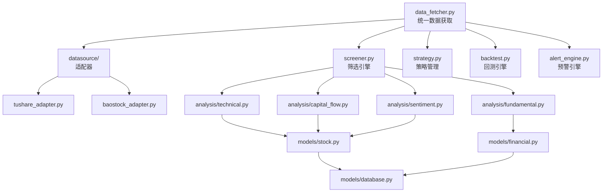
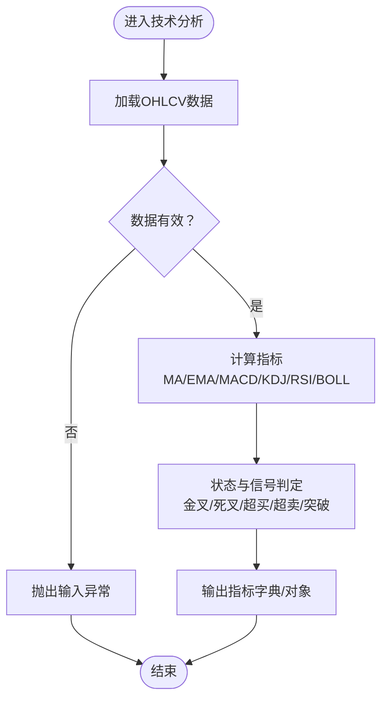
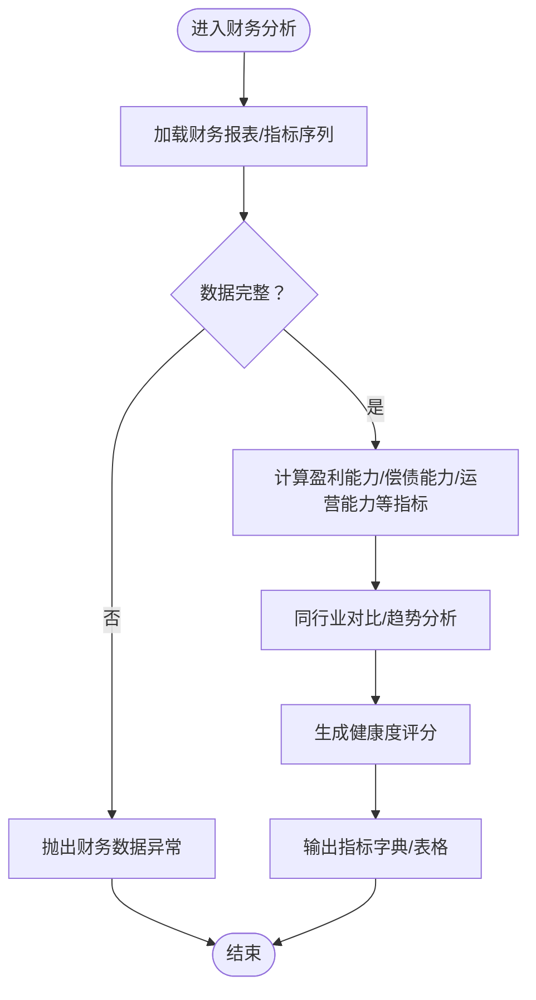
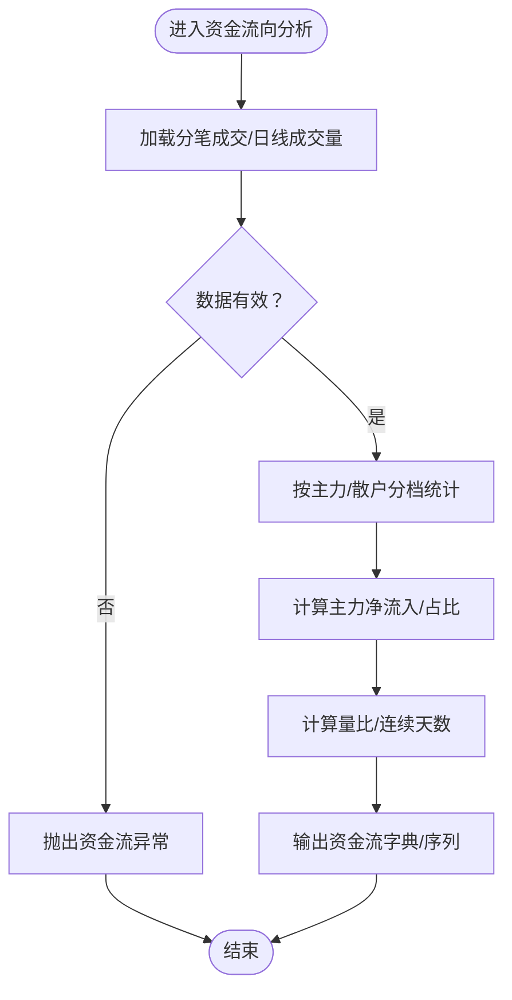
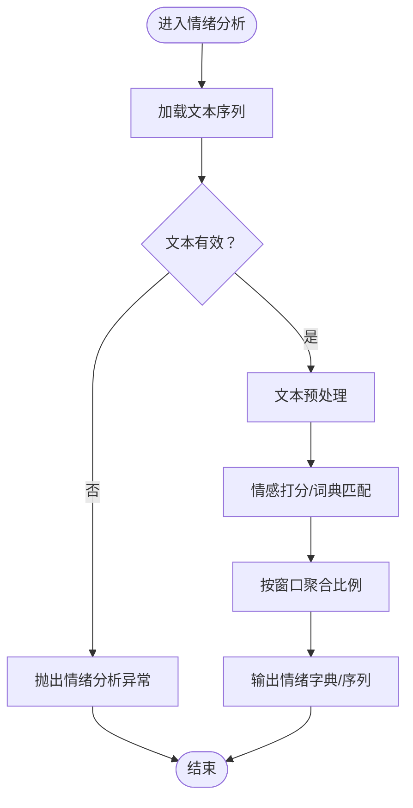
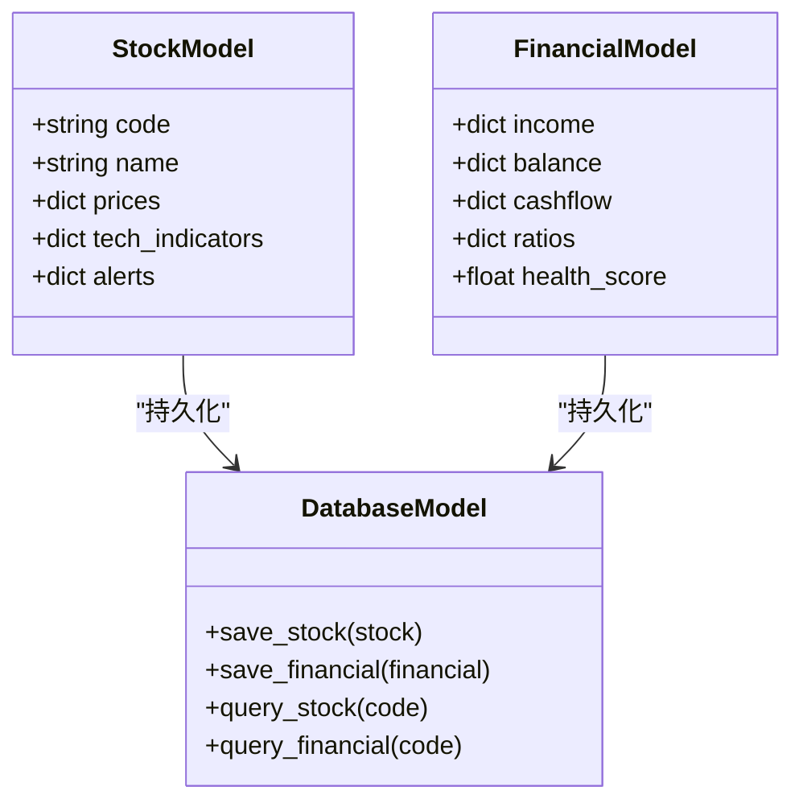
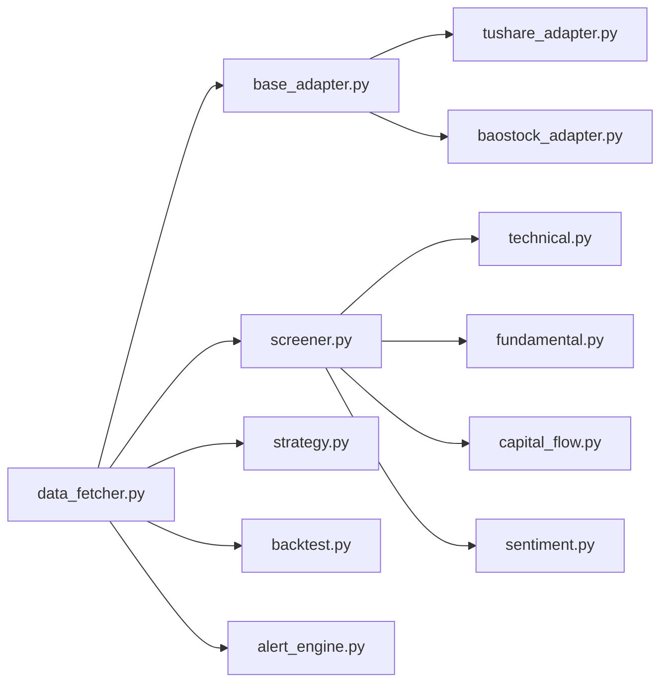
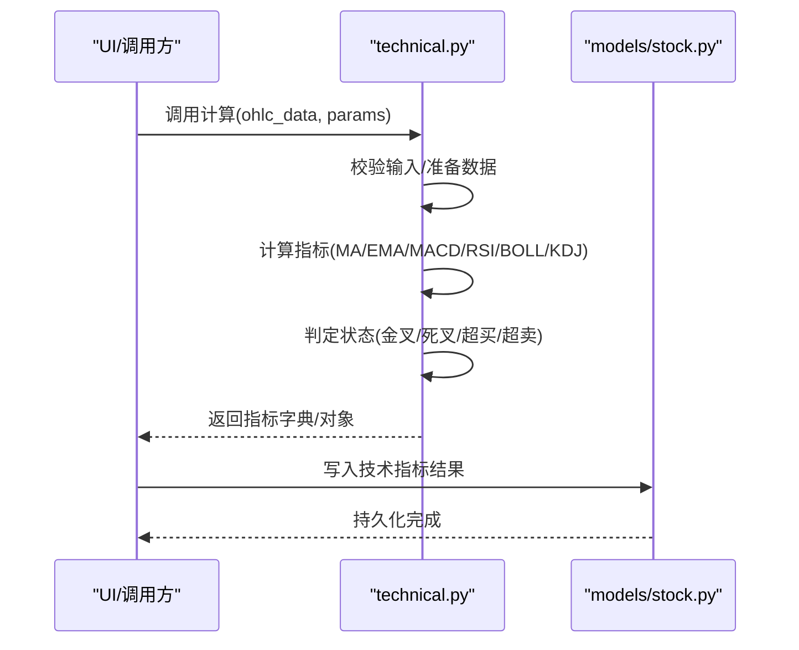

# 分析引擎模块

<cite>
**本文引用的文件**
- [PRD.md](file://docs/PRD.md)
- [screener.py](file://src/core/screener.py)
- [strategy.py](file://src/core/strategy.py)
- [backtest.py](file://src/core/backtest.py)
- [alert_engine.py](file://src/core/alert_engine.py)
- [data_fetcher.py](file://src/core/data_fetcher.py)
- [technical.py](file://src/analysis/technical.py)
- [fundamental.py](file://src/analysis/fundamental.py)
- [capital_flow.py](file://src/analysis/capital_flow.py)
- [sentiment.py](file://src/analysis/sentiment.py)
- [stock.py](file://src/models/stock.py)
- [financial.py](file://src/models/financial.py)
- [database.py](file://src/models/database.py)
- [base_adapter.py](file://src/datasource/base_adapter.py)
- [tushare_adapter.py](file://src/datasource/tushare_adapter.py)
- [baostock_adapter.py](file://src/datasource/baostock_adapter.py)
</cite>

## 目录
1. [引言](#引言)
2. [项目结构](#项目结构)
3. [核心组件](#核心组件)
4. [架构总览](#架构总览)
5. [详细组件分析](#详细组件分析)
6. [依赖关系分析](#依赖关系分析)
7. [性能考虑](#性能考虑)
8. [故障排查指南](#故障排查指南)
9. [结论](#结论)
10. [附录](#附录)

## 引言
本文件面向“分析引擎模块”的技术文档，聚焦于技术分析指标计算、财务数据分析与市场情绪分析的实现原理与使用方式。根据项目PRD，系统支持MACD、RSI、布林带、KDJ等技术指标，资金流向、财务指标（ROE、ROA、毛利率、资产负债率、营运能力等）、以及价值投资相关指标；同时具备回测、预警、自选股管理等功能。本文将结合PRD中的指标定义与模块组织，给出可落地的实现思路、调用接口与参数说明、错误处理建议、性能优化策略与缓存机制。

## 项目结构
分析引擎位于src/analysis目录，包含四大子模块：
- technical.py：技术分析指标计算（MACD、RSI、布林带、KDJ、均线等）
- fundamental.py：基本面财务指标计算（盈利能力、偿债能力、运营能力等）
- capital_flow.py：资金流向分析（主力净流入、量比等）
- sentiment.py：市场情绪分析（基于新闻/评论的情感倾向）

此外，核心引擎与数据模型如下：
- src/core/ 下的screener.py、strategy.py、backtest.py、alert_engine.py、data_fetcher.py
- src/models/ 下的stock.py、financial.py、database.py
- src/datasource/ 下的base_adapter.py、tushare_adapter.py、baostock_adapter.py

```mermaid
graph TB
subgraph "分析引擎"
T["technical.py"]
F["fundamental.py"]
CF["capital_flow.py"]
S["sentiment.py"]
end
subgraph "核心引擎"
SCR["screener.py"]
STR["strategy.py"]
BT["backtest.py"]
AE["alert_engine.py"]
DF["data_fetcher.py"]
end
subgraph "数据模型"
ST["stock.py"]
FN["financial.py"]
DB["database.py"]
end
subgraph "数据源适配"
BA["base_adapter.py"]
TS["tushare_adapter.py"]
BS["baostock_adapter.py"]
end
SCR --> DF
STR --> DF
BT --> DF
AE --> DF
DF --> BA
BA --> TS
BA --> BS
T --> ST
F --> FN
CF --> ST
S --> ST
T --> FN
F --> ST
```

**图示来源**
- [PRD.md:319-328](file://docs/PRD.md#L319-L328)
- [technical.py](file://src/analysis/technical.py)
- [fundamental.py](file://src/analysis/fundamental.py)
- [capital_flow.py](file://src/analysis/capital_flow.py)
- [sentiment.py](file://src/analysis/sentiment.py)
- [screener.py](file://src/core/screener.py)
- [strategy.py](file://src/core/strategy.py)
- [backtest.py](file://src/core/backtest.py)
- [alert_engine.py](file://src/core/alert_engine.py)
- [data_fetcher.py](file://src/core/data_fetcher.py)
- [stock.py](file://src/models/stock.py)
- [financial.py](file://src/models/financial.py)
- [database.py](file://src/models/database.py)
- [base_adapter.py](file://src/datasource/base_adapter.py)
- [tushare_adapter.py](file://src/datasource/tushare_adapter.py)
- [baostock_adapter.py](file://src/datasource/baostock_adapter.py)

**章节来源**
- [PRD.md:304-328](file://docs/PRD.md#L304-L328)

## 核心组件
- 技术分析模块（technical.py）
  - 计算指标：MA、EMA、MACD、KDJ、RSI、布林带（BOLL）、成交量相关（量比、放量/缩量）
  - 输入：时间序列OHLCV数据（日期、开盘、最高、最低、收盘、成交量）
  - 输出：各指标的最新值与状态（金叉/死叉、超买/超卖、突破/回落等）
- 财务分析模块（fundamental.py）
  - 计算指标：ROE、ROA、毛利率、净利率、资产负债率、流动比率、速动比率、利息保障倍数、营业周期、存货/应收账款/总资产周转率、经营现金流/净利润、自由现金流、股息率、分红率、连续分红年数等
  - 输入：财务报表（利润表、资产负债表、现金流量表）或财务指标序列
  - 输出：指标数值与趋势、同行业对比、健康度评分
- 资金流向模块（capital_flow.py）
  - 计算指标：主力净流入、主力净流入占比、超大单/大单/中单/小单净流入、连续净流入天数、量比
  - 输入：当日/历史分笔成交明细或汇总资金流
  - 输出：资金流向饼图、趋势图、主力排名
- 情绪分析模块（sentiment.py）
  - 方法：基于文本分类或情感词典，对新闻、公告、评论进行情感打分
  - 输入：文本序列（标题、正文、评论）
  - 输出：积极/消极/中性比例、情绪趋势、热点事件标注

**章节来源**
- [PRD.md:48-99](file://docs/PRD.md#L48-L99)
- [PRD.md:114-116](file://docs/PRD.md#L114-L116)
- [PRD.md:127-131](file://docs/PRD.md#L127-L131)
- [PRD.md:132-147](file://docs/PRD.md#L132-L147)

## 架构总览
分析引擎通过数据获取层从多个数据源拉取数据，经过核心引擎的筛选、策略、回测与预警模块，最终将分析结果与可视化集成到UI层。财务与技术分析模块分别对接数据模型与数据源适配器，形成闭环的数据处理链路。

**图示来源**
- [data_fetcher.py](file://src/core/data_fetcher.py)
- [screener.py](file://src/core/screener.py)
- [strategy.py](file://src/core/strategy.py)
- [backtest.py](file://src/core/backtest.py)
- [alert_engine.py](file://src/core/alert_engine.py)
- [technical.py](file://src/analysis/technical.py)
- [fundamental.py](file://src/analysis/fundamental.py)
- [capital_flow.py](file://src/analysis/capital_flow.py)
- [sentiment.py](file://src/analysis/sentiment.py)
- [stock.py](file://src/models/stock.py)
- [financial.py](file://src/models/financial.py)
- [database.py](file://src/models/database.py)
- [base_adapter.py](file://src/datasource/base_adapter.py)
- [tushare_adapter.py](file://src/datasource/tushare_adapter.py)
- [baostock_adapter.py](file://src/datasource/baostock_adapter.py)

## 详细组件分析

### 技术分析模块（technical.py）
- 指标清单与用途
  - 移动平均线（MA/EMA）：趋势判断、支撑阻力识别
  - MACD：多空力量对比、金叉/死叉信号
  - KDJ：随机震荡、超买/超卖
  - RSI：相对强弱、超买/超卖
  - 布林带（BOLL）：波动率与突破
  - 成交量：量比、放量/缩量确认突破
- 典型参数
  - EMA/MA：短期（如5/12）、中期（如20/60）、长期（如120/250）
  - MACD：快线、慢线、信号线周期（如12,26,9）
  - RSI：周期（如6/12/24）
  - KDJ：N日、M日（如9日）、平滑参数
  - 布林带：周期（如20）、标准差倍数（如2）
- 返回值结构
  - 字典或命名元组，包含“指标名”、“当前值”、“状态”、“信号”、“时间戳”
- 调用示例（路径）
  - [technical.py](file://src/analysis/technical.py)
- 参数与异常处理
  - 输入校验：OHLCV长度、缺失值处理、时间顺序
  - 异常：抛出InvalidInput、InsufficientData等

**图示来源**
- [technical.py](file://src/analysis/technical.py)

**章节来源**
- [PRD.md:48-57](file://docs/PRD.md#L48-L57)
- [PRD.md:114-116](file://docs/PRD.md#L114-L116)

### 财务分析模块（fundamental.py）
- 指标清单与用途
  - 盈利能力：ROE、ROA、毛利率、净利率、盈利收益率
  - 偿债能力：资产负债率、流动比率、速动比率、利息保障倍数
  - 运营能力：营业周期、存货/应收账款/总资产周转率
  - 现金流：经营现金流/净利润、自由现金流
  - 估值与价值：市盈率（PE）、市净率（PB）、PEG、市销率（PS）、市现率（PCF）、股息率、分红率、连续分红年数
- 计算方法（依据PRD）
  - ROE、ROA、毛利率、净利率：按财务报表直接计算
  - 资产负债率：总负债/总资产
  - 流动比率、速动比率：流动资产/流动负债等
  - 利息保障倍数：息税前利润/利息费用
  - 营业周期：存货周转天数+应收账款周转天数
  - 存货/应收账款/总资产周转率：相应公式
  - 经营现金流/净利润、自由现金流：按现金流量表计算
  - 股息率、分红率：按年度分红与股价/净利润计算
- 返回值结构
  - 字典或DataFrame，包含指标名称、数值、同比/环比、趋势、行业对比、健康度评分
- 调用示例（路径）
  - [fundamental.py](file://src/analysis/fundamental.py)
- 参数与异常处理
  - 输入校验：财务报表完整性、字段存在性、单位一致性
  - 异常：抛出FinancialDataError、MissingField等

**图示来源**
- [fundamental.py](file://src/analysis/fundamental.py)

**章节来源**
- [PRD.md:67-89](file://docs/PRD.md#L67-L89)
- [PRD.md:90-109](file://docs/PRD.md#L90-L109)

### 资金流向模块（capital_flow.py）
- 指标清单与用途
  - 主力净流入、主力净流入占比、超大单/大单/中单/小单净流入
  - 连续净流入天数、量比
- 计算方法
  - 以分笔成交为基础，按买卖方向归类主力/散户，累加得到净流入
  - 量比：当日均量与前几日均量的比值
- 返回值结构
  - 字典或序列，包含“时间”、“主力净流入”、“量比”、“分档分布”、“连续天数”
- 调用示例（路径）
  - [capital_flow.py](file://src/analysis/capital_flow.py)
- 参数与异常处理
  - 输入校验：分笔数据完整性、时间粒度
  - 异常：抛出CapitalFlowError、InsufficientVolume等

**图示来源**
- [capital_flow.py](file://src/analysis/capital_flow.py)

**章节来源**
- [PRD.md:58-66](file://docs/PRD.md#L58-L66)
- [PRD.md:127-131](file://docs/PRD.md#L127-L131)

### 情绪分析模块（sentiment.py）
- 方法与流程
  - 文本预处理（分词、去停用词）
  - 情感词典匹配或分类模型打分
  - 聚合：按时间窗口统计积极/消极/中性比例
- 返回值结构
  - 字典或序列，包含“时间”、“积极/消极/中性比例”、“置信度”、“热点事件”
- 调用示例（路径）
  - [sentiment.py](file://src/analysis/sentiment.py)
- 参数与异常处理
  - 输入校验：文本编码、长度限制
  - 异常：抛出SentimentError、TextTooShort等

**图示来源**
- [sentiment.py](file://src/analysis/sentiment.py)

**章节来源**
- [PRD.md:140-147](file://docs/PRD.md#L140-L147)

### 数据模型与交互
- models/stock.py：封装股票基础信息、行情、技术指标结果
- models/financial.py：封装财务报表、财务指标、健康度评分
- models/database.py：SQLite持久化、查询接口
- 交互方式
  - 技术/财务/资金/情绪模块将结果写入对应模型对象，再由数据库模型持久化
  - 核心引擎（screener/strategy/backtest/alert_engine）读取模型数据进行后续处理

**图示来源**
- [stock.py](file://src/models/stock.py)
- [financial.py](file://src/models/financial.py)
- [database.py](file://src/models/database.py)

**章节来源**
- [stock.py](file://src/models/stock.py)
- [financial.py](file://src/models/financial.py)
- [database.py](file://src/models/database.py)

### 接口调用与参数说明
以下为典型调用路径与参数约定（不展示具体代码，仅提供路径与说明）：
- 技术分析
  - 路径：[technical.py](file://src/analysis/technical.py)
  - 参数：ohlc_data（OHLCV序列）、params（周期、参数集合）
  - 返回：指标字典/对象
  - 异常：InvalidInput、InsufficientData
- 财务分析
  - 路径：[fundamental.py](file://src/analysis/fundamental.py)
  - 参数：income/balance/cashflow（财务报表）、params（计算口径）
  - 返回：指标字典/DataFrame
  - 异常：FinancialDataError、MissingField
- 资金流向
  - 路径：[capital_flow.py](file://src/analysis/capital_flow.py)
  - 参数：trade_detail（分笔成交）、params（量比窗口、分档阈值）
  - 返回：资金流字典/序列
  - 异常：CapitalFlowError、InsufficientVolume
- 情绪分析
  - 路径：[sentiment.py](file://src/analysis/sentiment.py)
  - 参数：texts（文本列表）、window（聚合窗口）
  - 返回：情绪字典/序列
  - 异常：SentimentError、TextTooShort

**章节来源**
- [technical.py](file://src/analysis/technical.py)
- [fundamental.py](file://src/analysis/fundamental.py)
- [capital_flow.py](file://src/analysis/capital_flow.py)
- [sentiment.py](file://src/analysis/sentiment.py)

## 依赖关系分析
- 模块内聚与耦合
  - technical/fundamental/capital_flow/sentiment各自职责清晰，内部耦合低
  - 与models层通过数据模型对象交互，避免直接依赖具体数据库实现
- 外部依赖
  - 数据源：tushare_adapter与baostock_adapter继承base_adapter
  - 数据获取：data_fetcher统一调度适配器
  - 核心引擎：screener/strategy/backtest/alert_engine依赖data_fetcher与models

**图示来源**
- [base_adapter.py](file://src/datasource/base_adapter.py)
- [tushare_adapter.py](file://src/datasource/tushare_adapter.py)
- [baostock_adapter.py](file://src/datasource/baostock_adapter.py)
- [data_fetcher.py](file://src/core/data_fetcher.py)
- [screener.py](file://src/core/screener.py)
- [strategy.py](file://src/core/strategy.py)
- [backtest.py](file://src/core/backtest.py)
- [alert_engine.py](file://src/core/alert_engine.py)
- [technical.py](file://src/analysis/technical.py)
- [fundamental.py](file://src/analysis/fundamental.py)
- [capital_flow.py](file://src/analysis/capital_flow.py)
- [sentiment.py](file://src/analysis/sentiment.py)

**章节来源**
- [PRD.md:341-346](file://docs/PRD.md#L341-L346)

## 性能考虑
- 计算优化
  - 使用向量化库（pandas/numpy）进行批量计算，减少循环
  - 指标计算采用滑动窗口与增量更新，避免重复计算
- I/O优化
  - 数据获取层统一缓存最近N日数据，降低重复请求
  - 文件缓存：将中间结果写入本地cache目录，避免重复计算
- 内存管理
  - 分批处理长序列（如多年日线），滚动窗口计算
  - 及时释放临时变量，使用生成器/迭代器
- 并发与异步
  - 多股票并行分析时，使用进程池或线程池
  - UI与计算分离，避免阻塞主线程
- 缓存策略
  - 指标结果缓存：key=股票代码+指标名+参数组合+时间范围
  - 财务数据缓存：按季度/年度缓存，跨版本失效
  - 情绪分析缓存：按窗口聚合结果缓存

[本节为通用性能指导，无需特定文件引用]

## 故障排查指南
- 输入数据问题
  - 症状：InvalidInput/InsufficientData/FinancialDataError/CapitalFlowError/SentimentError
  - 排查：检查OHLCV长度、财务字段是否存在、分笔数据完整性、文本编码
- 计算异常
  - 症状：除零、负数开方、NaN传播
  - 排查：增加保护性判断、填充缺失值、设置合理阈值
- 性能瓶颈
  - 症状：长时间无响应、内存飙升
  - 排查：启用分批处理、开启缓存、减少不必要的重算
- 数据源异常
  - 症状：网络超时、API限流
  - 排查：切换备用数据源、增加重试与退避策略

**章节来源**
- [technical.py](file://src/analysis/technical.py)
- [fundamental.py](file://src/analysis/fundamental.py)
- [capital_flow.py](file://src/analysis/capital_flow.py)
- [sentiment.py](file://src/analysis/sentiment.py)

## 结论
分析引擎模块围绕技术分析、财务分析、资金流向与情绪分析四条主线构建，配合核心引擎与数据模型形成完整的数据处理闭环。通过明确的接口规范、参数约定与异常处理策略，能够稳定地支撑筛选、策略、回测与预警等上层应用。建议在生产环境中强化缓存与并发控制，确保大规模数据场景下的稳定性与性能。

## 附录
- 关键流程时序（以技术分析为例）

**图示来源**
- [technical.py](file://src/analysis/technical.py)
- [stock.py](file://src/models/stock.py)