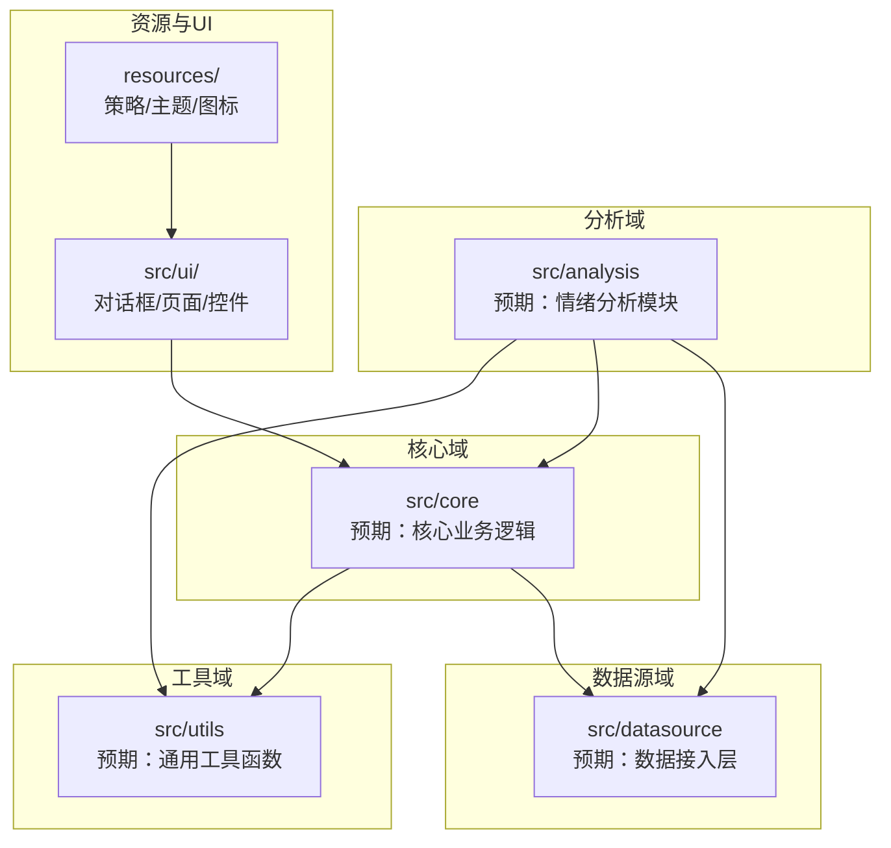
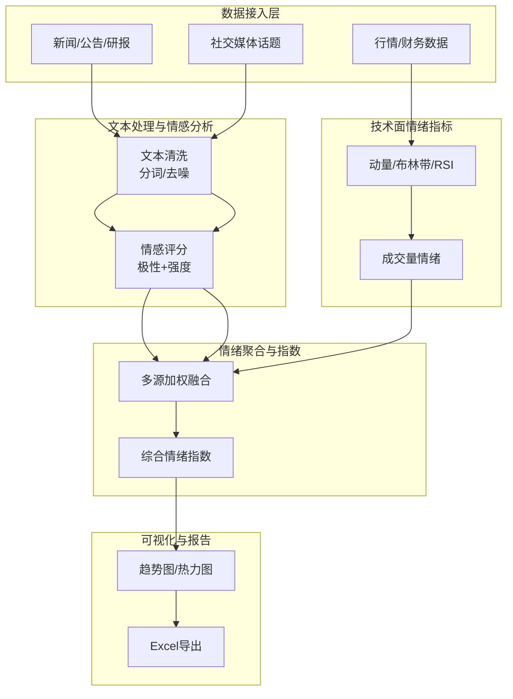
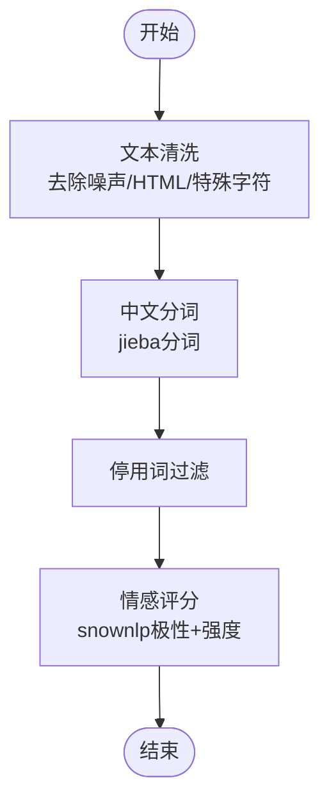
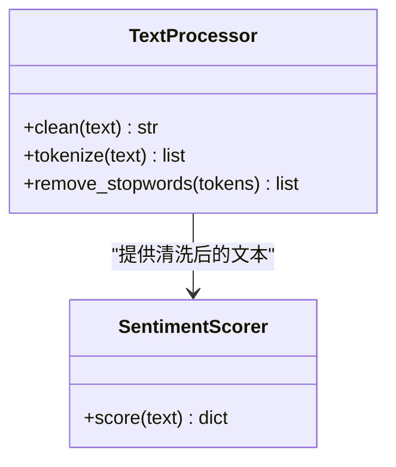
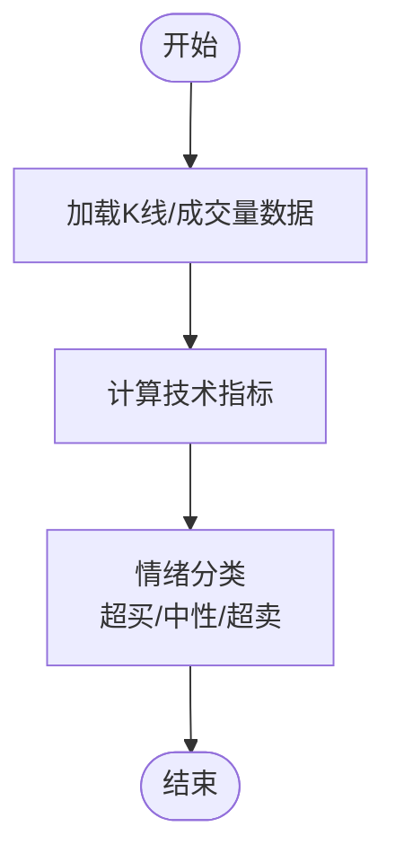
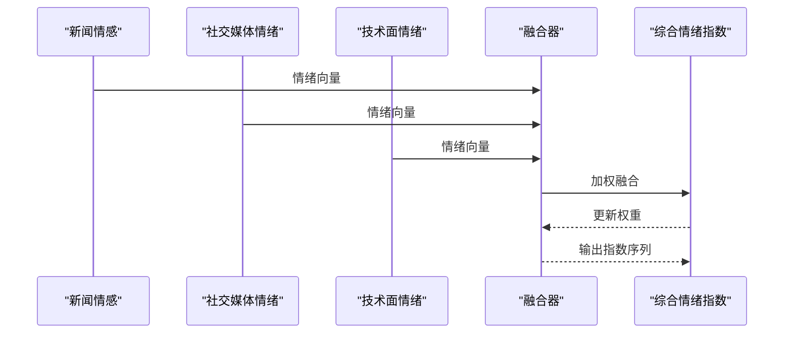
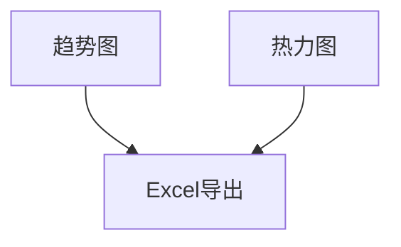
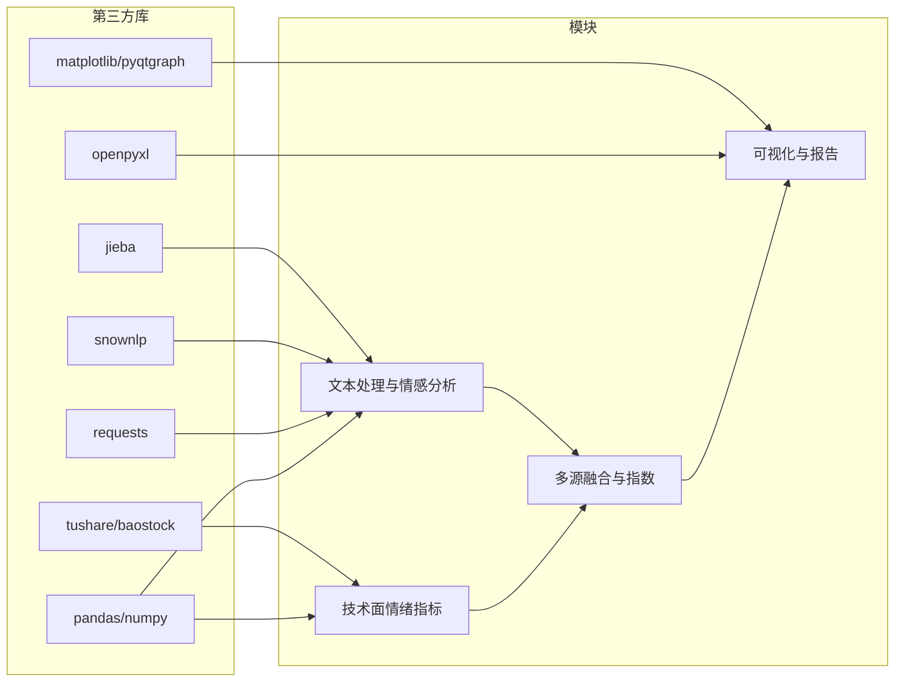

# 市场情绪分析模块

<cite>
**本文档引用的文件**
- [requirements.txt](file://requirements.txt)
</cite>

## 目录
1. [引言](#引言)
2. [项目结构](#项目结构)
3. [核心组件](#核心组件)
4. [架构总览](#架构总览)
5. [详细组件分析](#详细组件分析)
6. [依赖关系分析](#依赖关系分析)
7. [性能考虑](#性能考虑)
8. [故障排除指南](#故障排除指南)
9. [结论](#结论)
10. [附录](#附录)

## 引言
本文件面向“市场情绪分析模块”的技术文档需求，结合当前仓库中可用的信息，系统化阐述市场情绪分析的理论基础、技术实现路径与工程化落地要点。由于当前仓库未包含具体的情感分析实现代码文件，本文以现有依赖与模块组织为依据，给出可扩展的实现蓝图与最佳实践，帮助读者在现有框架下快速构建新闻情感分析、社交媒体情绪监测与技术面情绪指标等能力。

## 项目结构
从仓库可见的目录组织看，项目采用按功能域划分的模块化结构，其中与情绪分析直接相关的关键点包括：
- 分析域：src/analysis（预期用于存放情绪分析相关模块）
- 数据源域：src/datasource（预期用于接入新闻、社交媒体、行情等外部数据）
- 核心域：src/core（预期用于核心业务逻辑与数据模型）
- 工具域：src/utils（预期用于通用工具函数，如文本清洗、特征提取等）
- 资源与UI：resources/ 与 src/ui/（用于策略配置、主题与界面交互）

**章节来源**
- [requirements.txt:1-32](file://requirements.txt#L1-L32)

## 核心组件
基于现有依赖与模块组织，市场情绪分析模块的核心组件建议如下：

- 文本处理与情感分析引擎
  - 依赖：jieba（中文分词）、snownlp（情感倾向评分）
  - 功能：文本清洗、分词、停用词过滤、情感极性与强度评分
- 数据接入层
  - 依赖：tushare、baostock（行情/概念数据）、requests（网络请求）
  - 功能：统一的数据拉取接口，支持新闻、公告、社交媒体话题等多源数据
- 技术面情绪指标
  - 功能：基于价格行为与成交量的动量、超买超卖等技术指标，映射为情绪状态
- 情绪聚合与指数计算
  - 功能：对多源情绪进行加权融合，输出综合情绪指数与时间序列
- 可视化与报告
  - 依赖：matplotlib、pyqtgraph（图表）、openpyxl（导出）
  - 功能：情绪趋势图、热力图、导出Excel报告

**章节来源**
- [requirements.txt:26-28](file://requirements.txt#L26-L28)
- [requirements.txt:9-10](file://requirements.txt#L9-L10)
- [requirements.txt:24](file://requirements.txt#L24)
- [requirements.txt:17-18](file://requirements.txt#L17-L18)
- [requirements.txt:31](file://requirements.txt#L31)

## 架构总览
下图展示了市场情绪分析模块的高层架构：数据接入层负责采集多源数据；文本处理与情感分析引擎对文本进行清洗与评分；技术面情绪指标对价格与交易数据进行加工；情绪聚合模块将多源结果融合为综合情绪指数；最终通过可视化与报告呈现给用户。

## 详细组件分析

### 组件A：文本处理与情感分析引擎
该组件负责对新闻、公告、社交媒体内容进行预处理与情感评分，核心流程如下：

- 文本清洗：移除URL、表情符号、标点冗余，保留有效语义信息
- 分词与过滤：利用中文分词提升语义边界识别，过滤高频无意义词汇
- 情感评分：基于snownlp返回的极性值与强度值，映射到[-1,1]区间，作为情绪强度

**图示来源**
- [requirements.txt:27-28](file://requirements.txt#L27-L28)

**章节来源**
- [requirements.txt:27-28](file://requirements.txt#L27-L28)

### 组件B：技术面情绪指标
技术面情绪指标通过价格与成交量的行为特征量化市场情绪，常见指标包括：
- 动量类：价格动量、成交量动量
- 超买超卖类：RSI、MACD背离
- 波动率类：布林带宽度、ATR

- 指标计算：基于pandas/numpy进行向量化计算
- 情绪映射：将指标值映射到[-1,1]区间，正向为乐观，负向为悲观

**章节来源**
- [requirements.txt:13-14](file://requirements.txt#L13-L14)

### 组件C：多源情绪融合与指数计算
将文本情感与技术面情绪进行加权融合，形成综合情绪指数。融合策略可采用：
- 等权平均：适用于各源质量相近
- 基于置信度加权：根据模型置信度或历史回测表现赋权
- 时间衰减加权：近期消息权重更高

- 指数计算：对多维情绪向量进行加权求和，归一化至[-1,1]
- 权重更新：可采用滑动窗口统计或在线学习策略

**章节来源**
- [requirements.txt:13-14](file://requirements.txt#L13-L14)

### 组件D：可视化与报告
- 趋势图：展示情绪指数的时间序列与阈值线
- 热力图：按行业/概念/个股维度展示情绪分布
- 报告导出：使用openpyxl生成Excel报告，包含原始数据与计算过程

**章节来源**
- [requirements.txt:17-18](file://requirements.txt#L17-L18)
- [requirements.txt:31](file://requirements.txt#L31)

## 依赖关系分析
下图展示了市场情绪分析模块与第三方库的依赖关系，以及模块间的耦合方向。

**图示来源**
- [requirements.txt:9-10](file://requirements.txt#L9-L10)
- [requirements.txt:13-14](file://requirements.txt#L13-L14)
- [requirements.txt:17-18](file://requirements.txt#L17-L18)
- [requirements.txt:24](file://requirements.txt#L24)
- [requirements.txt:27-28](file://requirements.txt#L27-L28)
- [requirements.txt:31](file://requirements.txt#L31)

**章节来源**
- [requirements.txt:9-10](file://requirements.txt#L9-L10)
- [requirements.txt:13-14](file://requirements.txt#L13-L14)
- [requirements.txt:17-18](file://requirements.txt#L17-L18)
- [requirements.txt:24](file://requirements.txt#L24)
- [requirements.txt:27-28](file://requirements.txt#L27-L28)
- [requirements.txt:31](file://requirements.txt#L31)

## 性能考虑
- 向量化计算：优先使用pandas/numpy进行批量处理，避免Python循环
- 缓存策略：对高频查询（如分词、情感评分）引入本地缓存，减少重复计算
- 并行化：对多源数据接入与多文本情感评分采用并发策略
- 内存管理：对长序列数据采用分块处理，控制内存峰值
- 可视化优化：图表渲染采用增量更新，避免全量重绘

## 故障排除指南
- 情感评分异常
  - 现象：部分文本返回极性或强度异常
  - 排查：确认文本是否经过清洗与分词；检查停用词表是否完整
  - 参考：文本处理与情感分析组件
- 数据接入失败
  - 现象：tushare/baostock请求超时或返回空数据
  - 排查：检查网络连通性与API配额；确认参数格式正确
  - 参考：数据接入层
- 指数波动异常
  - 现象：综合情绪指数出现尖峰或跳变
  - 排查：检查权重更新策略与阈值设置；核对多源数据时间对齐
  - 参考：多源融合与指数组件
- 可视化卡顿
  - 现象：图表渲染缓慢或内存占用过高
  - 排查：减少绘制点数、启用增量刷新；优化数据结构
  - 参考：可视化与报告组件

**章节来源**
- [requirements.txt:9-10](file://requirements.txt#L9-L10)
- [requirements.txt:13-14](file://requirements.txt#L13-L14)
- [requirements.txt:17-18](file://requirements.txt#L17-L18)
- [requirements.txt:24](file://requirements.txt#L24)
- [requirements.txt:27-28](file://requirements.txt#L27-L28)
- [requirements.txt:31](file://requirements.txt#L31)

## 结论
市场情绪分析模块以“文本处理与情感分析”“技术面情绪指标”“多源融合与指数”“可视化与报告”为主线，结合仓库现有的中文处理与数据处理依赖，可在现有架构上快速落地。建议优先完成文本处理与情感分析引擎的实现，并逐步扩展到技术面指标与融合策略，最终形成稳定可复用的情绪分析能力。

## 附录
- 术语说明
  - 情绪指数：对多源情绪进行加权融合后得到的标准化数值序列
  - 情绪阈值：用于判断乐观/中性/悲观的分界线
- 参考实现路径
  - 文本处理与情感分析：参考snownlp与jieba的官方文档与示例
  - 数据接入：参考tushare/baostock的接口文档与示例
  - 可视化：参考matplotlib/pyqtgraph的图表绘制示例