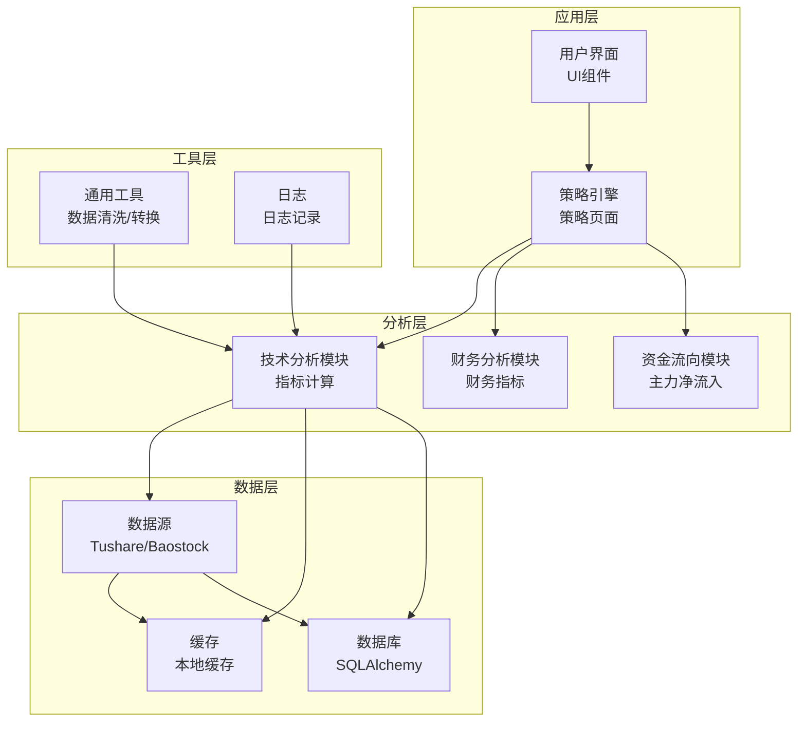
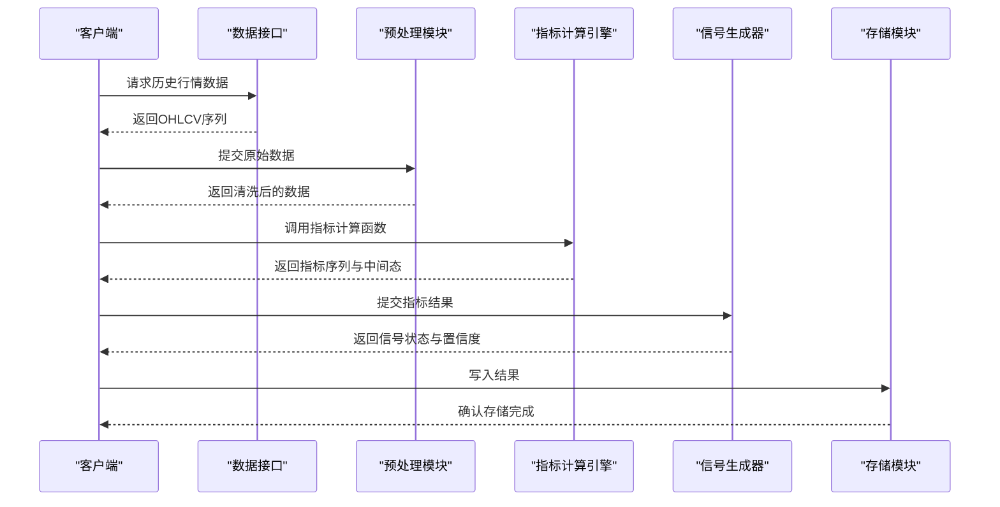
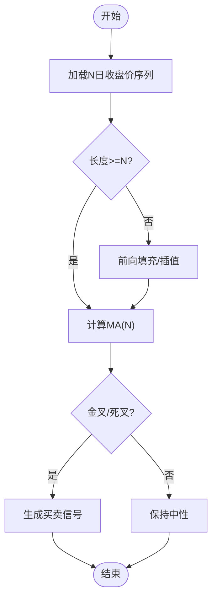
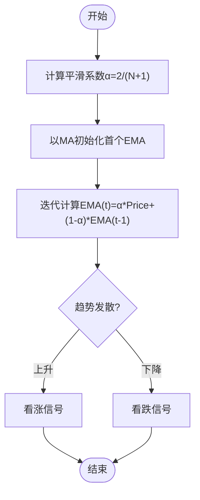
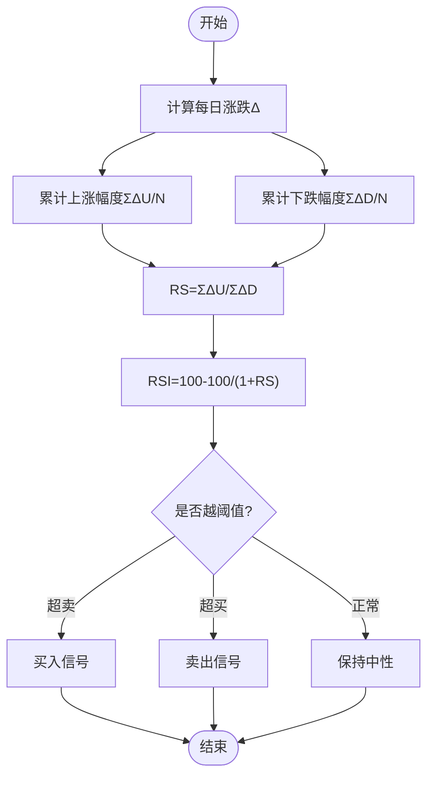
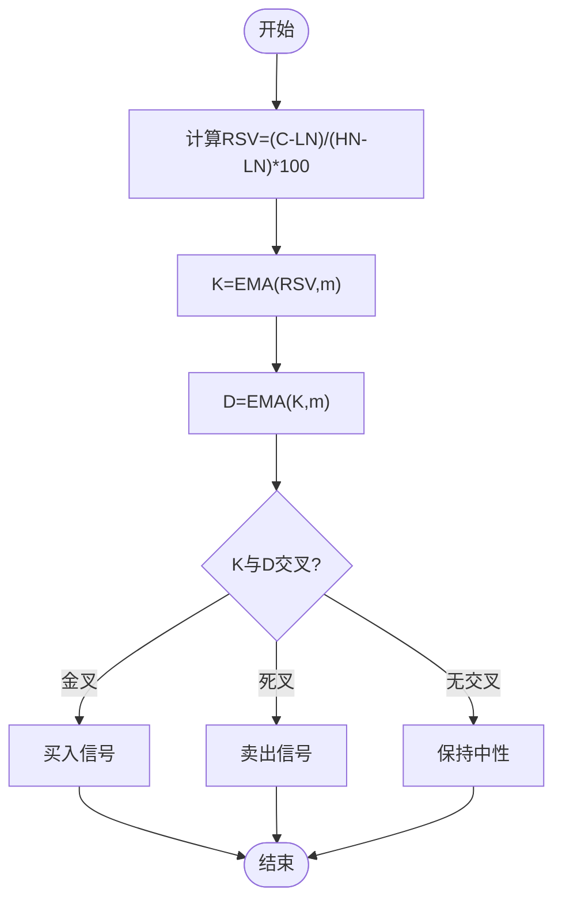
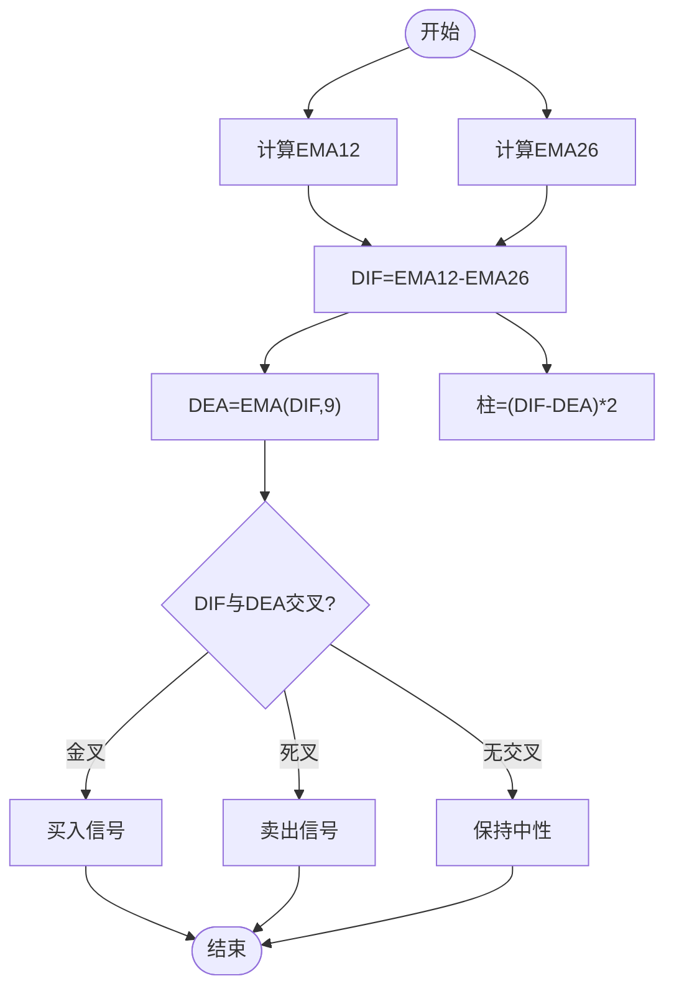
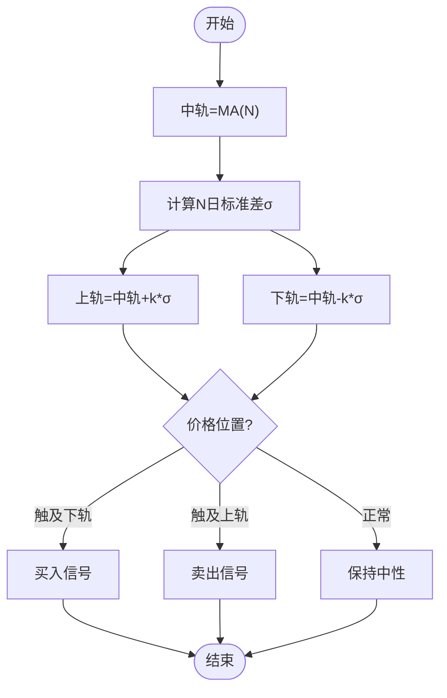
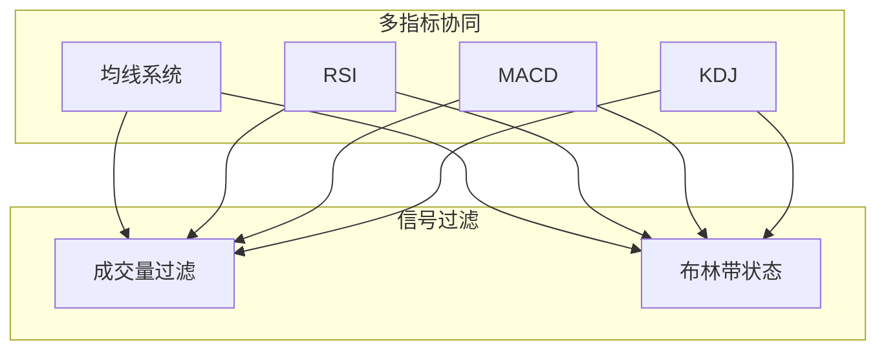
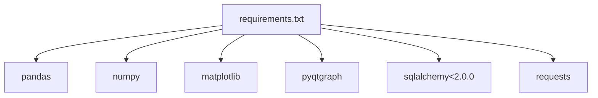

# 技术分析模块

<cite>
**本文档引用的文件**
- [PRD.md](file://docs/PRD.md)
- [requirements.txt](file://requirements.txt)
</cite>

## 目录
1. [简介](#简介)
2. [项目结构](#项目结构)
3. [核心组件](#核心组件)
4. [架构概览](#架构概览)
5. [详细组件分析](#详细组件分析)
6. [依赖分析](#依赖分析)
7. [性能考虑](#性能考虑)
8. [故障排除指南](#故障排除指南)
9. [结论](#结论)
10. [附录](#附录)

## 简介
本技术分析模块旨在为A股市场提供全面的技术指标计算与信号识别能力，支持多种主流技术分析指标，包括移动平均线（MA）、指数平滑移动平均线（EMA）、相对强弱指数（RSI）、随机指标（KDJ）、MACD、布林带（BOLL）等。该模块通过标准化的数据接口接收历史行情数据，经过统一的预处理流程后，输出各指标的计算结果与信号状态，便于后续的选股策略构建与回测验证。

模块设计遵循以下原则：
- 指标计算的数学一致性：严格依据标准公式实现，确保不同时间周期与数据样本下的可比性。
- 参数配置的灵活性：允许用户自定义周期、权重、阈值等参数，以适配不同的市场环境与交易风格。
- 信号判定的明确性：提供清晰的买入/卖出/中性信号规则，减少歧义并便于策略集成。
- 性能与扩展性：采用向量化计算与缓存机制，支持大规模数据集的高效处理。

## 项目结构
仓库采用分层与功能域结合的组织方式，技术分析模块位于src/analysis目录（当前为空），但其功能与数据流已在需求文档中明确。核心依赖通过requirements.txt进行管理，主要涉及数据处理（pandas、numpy）、可视化（matplotlib、pyqtgraph）与网络请求（requests）等。

**章节来源**
- [PRD.md:46-95](file://docs/PRD.md#L46-L95)
- [requirements.txt:1-32](file://requirements.txt#L1-L32)

## 核心组件
本模块的核心职责是接收标准化的历史行情数据，执行各类技术指标的批量计算，并输出包含信号状态的结果集。关键组件包括：

- 数据输入与预处理
  - 接收OHLCV（开盘价、最高价、最低价、收盘价、成交量）序列，确保数据完整性与时间对齐。
  - 执行缺失值填充、异常值检测与归一化处理，保证指标计算的稳定性。
- 指标计算引擎
  - 实现MA、EMA、RSI、KDJ、MACD、布林带等指标的向量化计算，支持多周期并行处理。
  - 提供参数校验与边界条件处理，避免数值溢出与除零错误。
- 信号生成器
  - 基于指标交叉、超买超卖阈值、轨道突破等规则生成买卖信号。
  - 输出信号类型（买入/卖出/中性）与置信度评分，便于风控与组合优化。
- 结果输出与缓存
  - 将计算结果写入数据库或缓存，支持增量更新与历史回溯。
  - 提供查询接口，按股票代码、日期范围与指标类型检索结果。

**章节来源**
- [PRD.md:46-95](file://docs/PRD.md#L46-L95)

## 架构概览
技术分析模块的整体架构围绕“数据-计算-信号-输出”四阶段展开，通过清晰的接口与中间态数据结构实现高内聚低耦合的设计。

**图表来源**
- [PRD.md:46-95](file://docs/PRD.md#L46-L95)

## 详细组件分析

### 移动平均线（MA）
- 数学原理
  - 简单移动平均：对N个周期的收盘价求算术平均，平滑价格波动，识别趋势方向。
  - 计算公式：MA(N) = (P1 + P2 + ... + PN) / N
- 参数配置
  - 周期N：常用5、10、20、60日；根据交易频率与市场波动性调整。
  - 数据窗口：需确保至少N个有效交易日，否则返回空值或前值填充。
- 适用场景
  - 趋势跟踪：多头排列（短期均线上穿长期均线）视为上涨趋势确认。
  - 支撑阻力：价格回踩MA时可作为支撑或阻力位参考。
- 信号规则
  - 买入：短期MA从下向上穿越长期MA（金叉）。
  - 卖出：短期MA从上向下穿越长期MA（死叉）。
- 异常处理
  - 缺失值：使用前向填充或插值法补全。
  - 边界值：首N-1个周期无有效MA，标记为无效。

**章节来源**
- [PRD.md:46-56](file://docs/PRD.md#L46-L56)

### 指数平滑移动平均线（EMA）
- 数学原理
  - EMA对近期价格赋予更高权重，响应速度优于MA，适合捕捉快速趋势变化。
  - 平滑系数α = 2 / (N + 1)，EMA(t) = α * Price(t) + (1 - α) * EMA(t-1)
- 参数配置
  - 周期N：常用12、26日；与MACD快线/慢线配合使用。
  - 初始值：通常以对应周期的简单平均作为首个EMA值。
- 适用场景
  - 快速趋势跟踪：EMA曲线的斜率变化反映动能强弱。
  - 与MACD联动：作为MACD的输入基础。
- 信号规则
  - 买入：EMA曲线向上发散且价格站稳其上。
  - 卖出：EMA曲线向下发散且价格跌破其下。
- 异常处理
  - 初始值：使用MA初始化，避免漂移。
  - 数值溢出：对极值价格进行截断处理。

**章节来源**
- [PRD.md:46-56](file://docs/PRD.md#L46-L56)

### 相对强弱指数（RSI）
- 数学原理
  - RSI衡量一定周期内价格上涨天数与下跌天数的比例，用于判断超买/超卖状态。
  - ΔU = ΣΔPrice_up / N，ΔD = ΣΔPrice_down / N，RSI = 100 - 100 / (1 + RS)
- 参数配置
  - 周期N：常用6、12、24日；短周期更敏感，长周期更稳健。
  - 超买/超卖阈值：一般取80/20，可根据品种调整。
- 适用场景
  - 超买超卖：RSI进入极端区域时可能出现反转。
  - 背离信号：价格创新高而RSI未创新高，潜在顶部背离。
- 信号规则
  - 买入：RSI从超卖区上穿阈值，形成底背离。
  - 卖出：RSI从超买区下穿阈值，形成顶背离。
- 异常处理
  - 极端值：当ΔU或ΔD为0时，RSI固定为50或0/100。
  - 边界：首N天无有效RSI，标记为无效。

**章节来源**
- [PRD.md:46-56](file://docs/PRD.md#L46-L56)

### 随机指标（KDJ）
- 数学原理
  - KDJ基于未成熟随机值（RSV）与K、D的指数平滑，反映价格在周期内的相对位置。
  - RSV = (C - L(N)) / (H(N) - L(N)) * 100，K = EMA(RSV, m)，D = EMA(K, m)
- 参数配置
  - 周期N：常用9日；N越大，曲线越平滑。
  - 平滑参数m：常用3，控制K、D的响应速度。
  - 超买/超卖阈值：一般取80/20。
- 适用场景
  - 超买超卖：K、D进入极端区域时考虑反转向。
  - 金叉/死叉：K上穿D为买入信号，K下穿D为卖出信号。
- 信号规则
  - 买入：K从下向上穿越D，且处于超卖区域。
  - 卖出：K从上向下穿越D，且处于超买区域。
- 异常处理
  - 无波动：H(N)=L(N)时，RSV=0或100，需特殊处理。
  - 初始值：K、D以简单平均初始化，随后EMA平滑。

**章节来源**
- [PRD.md:46-56](file://docs/PRD.md#L46-L56)

### MACD
- 数学原理
  - MACD由快线（DIF）、慢线（DEA）与柱状图（MACD Histogram）组成，反映价格动能变化。
  - DIF = EMA12 - EMA26，DEA = EMA(DIF, 9)，柱 = (DIF - DEA) * 2
- 参数配置
  - 快线周期：12日（EMA12）
  - 慢线周期：26日（EMA26）
  - 柱平滑周期：9日（DEA）
- 适用场景
  - 动能变化：DIF与DEA的发散/收敛反映趋势强度。
  - 金叉/死叉：DIF上穿DEA为买入，下穿为卖出。
- 信号规则
  - 买入：DIF从下向上穿越DEA，且柱由负转正。
  - 卖出：DIF从上向下穿越DEA，且柱由正转负。
- 异常处理
  - 初始值：DIF与DEA以EMA初始化。
  - 柱计算：注意乘数2的含义与单位换算。

**章节来源**
- [PRD.md:46-56](file://docs/PRD.md#L46-L56)

### 布林带（BOLL）
- 数学原理
  - BOLL由中轨（MA）、上轨（中轨 + kσ）与下轨（中轨 - kσ）构成，反映价格波动区间。
  - 中轨 = MA(N)，上轨/下轨 = 中轨 ± k * σ(N)
- 参数配置
  - 周期N：常用20日；决定中轨的平滑程度。
  - 标准差倍数k：常用2；k增大则通道变宽，反之变窄。
- 适用场景
  - 区间震荡：价格在上下轨之间运行，突破时考虑反向。
  - 开口/缩口：通道开口扩大表示波动加剧，缩口表示波动收敛。
- 信号规则
  - 买入：价格触及下轨并出现K线反抽形态。
  - 卖出：价格触及上轨并出现K线冲高回落。
- 异常处理
  - 标准差为0：价格恒定，上下轨重合，需特殊处理。
  - 边界：首N-1天无有效BOLL，标记为无效。

**章节来源**
- [PRD.md:46-56](file://docs/PRD.md#L46-L56)

### 指标组合使用策略
- 多周期共振
  - 在日线、周线同时出现多头排列，增强趋势可靠性。
- 指标协同
  - MA与RSI结合：趋势确认+超买超卖过滤。
  - MACD与KDJ结合：动能+超买超卖综合判断。
- 信号过滤
  - 成交量放大：确认突破有效性。
  - 布林带缩口后突破：识别突破方向与强度。

**章节来源**
- [PRD.md:46-56](file://docs/PRD.md#L46-L56)

## 依赖分析
技术分析模块的实现依赖于以下外部库与工具：
- pandas/numpy：提供高性能数组与DataFrame操作，支持向量化计算与时间序列处理。
- matplotlib/pyqtgraph：支持图表绘制与交互式可视化，便于指标结果展示。
- SQLAlchemy：提供数据库访问抽象，支持结果持久化与查询。
- requests：用于网络请求与数据源对接（如Tushare/Baostock）。

**图表来源**
- [requirements.txt:1-32](file://requirements.txt#L1-L32)

**章节来源**
- [requirements.txt:1-32](file://requirements.txt#L1-L32)

## 性能考虑
- 向量化计算
  - 使用pandas/numpy的内置函数替代循环，显著提升计算效率。
  - 对EMA、MACD等递归公式采用滚动窗口与累积和优化。
- 内存管理
  - 分块读取与批处理：对超大数据集分批计算，避免内存峰值过高。
  - 及时释放中间变量与临时数组，降低GC压力。
- 缓存策略
  - 指标结果缓存至本地文件或数据库，支持增量更新与快速回溯。
  - 时间索引与列索引优化，加速查询与切片。
- 并行化
  - 多进程/多线程并行处理不同股票或不同周期，充分利用CPU资源。
  - I/O密集型任务与计算任务分离，避免阻塞。

## 故障排除指南
- 数据质量问题
  - 缺失值：使用前向填充或线性插值，确保连续性。
  - 异常值：基于统计方法（如3σ原则）识别并剔除。
- 计算异常
  - 除零错误：对分母为0的情况设置保护分支。
  - 数值溢出：对极值进行截断或对数变换。
- 信号误判
  - 参数调优：根据品种与周期调整阈值与平滑参数。
  - 多指标验证：结合成交量、布林带等指标过滤噪音。

**章节来源**
- [PRD.md:46-56](file://docs/PRD.md#L46-L56)

## 结论
技术分析模块通过标准化的数据接口与严谨的指标实现，为A股市场的技术分析提供了可靠的基础能力。模块支持多指标并行计算、信号协同过滤与性能优化，能够满足从日频到分钟级的多样化需求。建议在实际应用中结合业务场景对参数进行动态调优，并持续完善异常处理与监控体系。

## 附录
- 数据输入格式
  - 字段：date、open、high、low、close、volume
  - 时间：升序排列，无重复与缺失
- 参数设置
  - 周期：N（日线）、M（分钟线）
  - 阈值：超买/超卖百分位
  - 权重：平滑系数α
- 返回值结构
  - 指标序列：包含每根K线对应的指标值
  - 信号状态：买入/卖出/中性
  - 置信度：0-1之间的概率评分
- 异常处理
  - 输入校验：字段完整性、数值范围
  - 计算保护：边界条件、数值稳定性
  - 输出校验：NaN填充、异常信号过滤