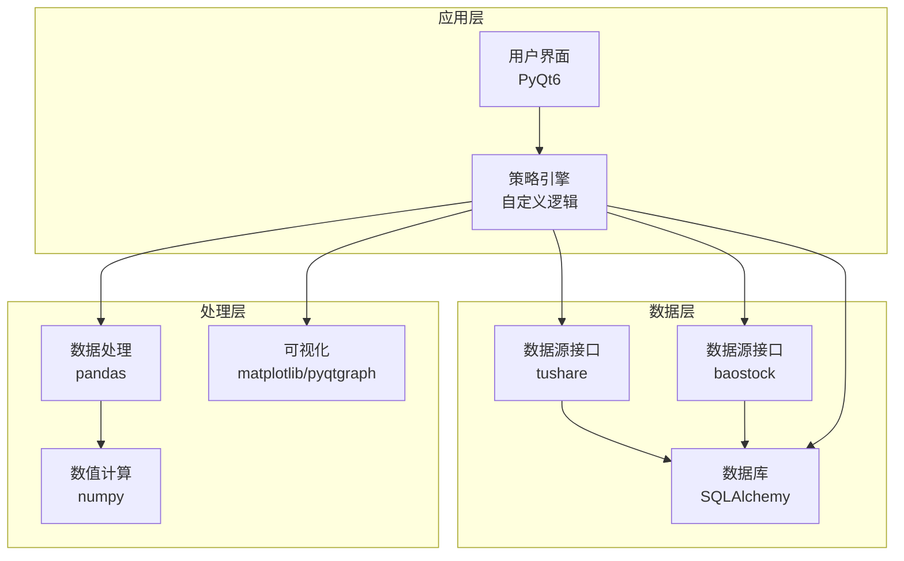
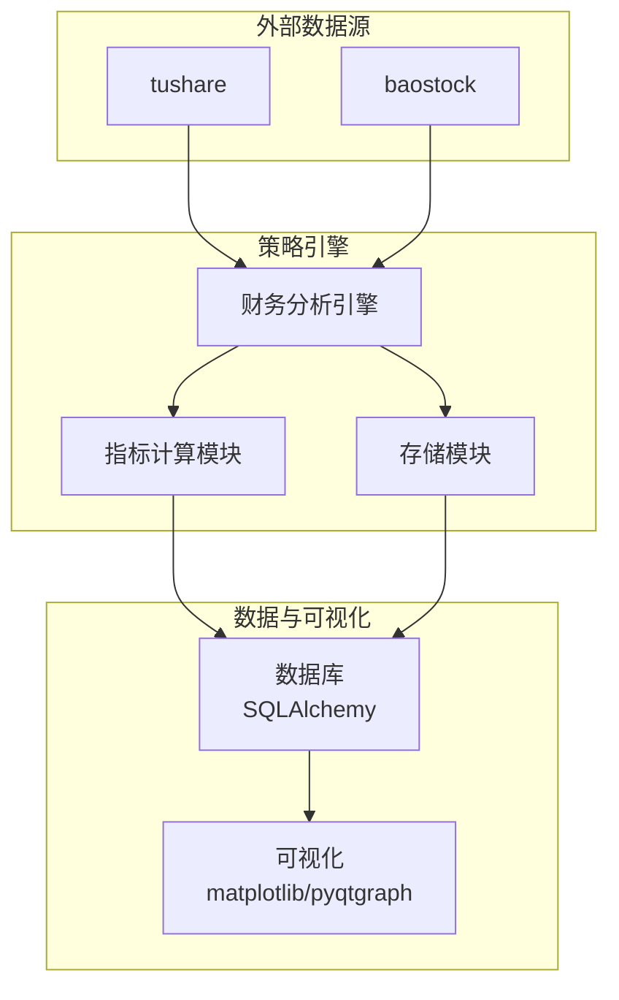
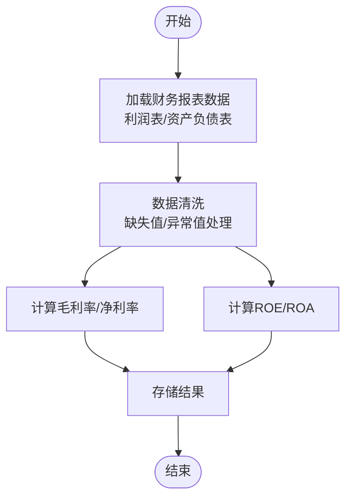
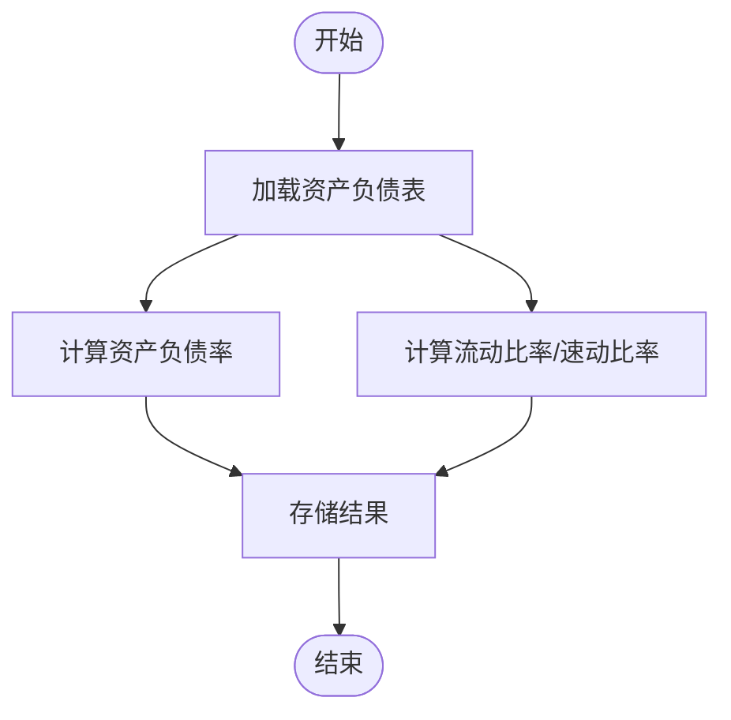
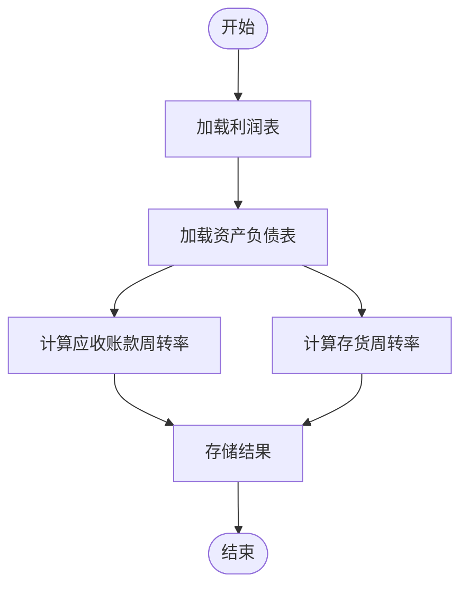
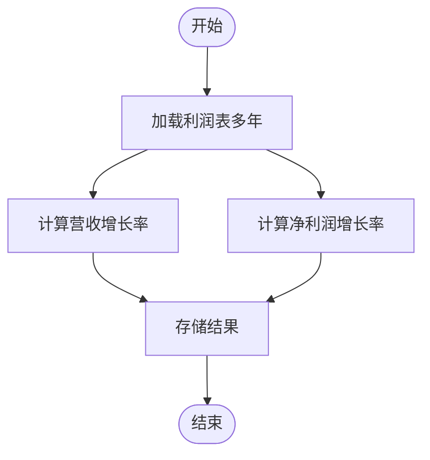
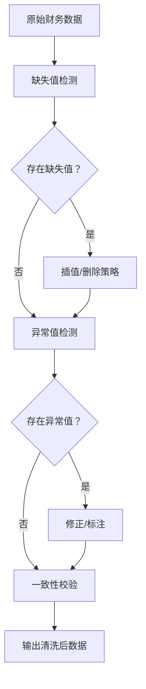
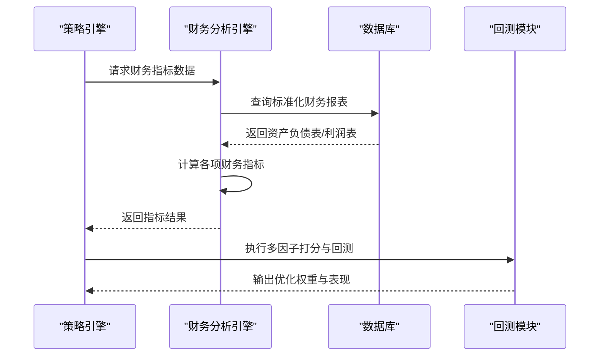
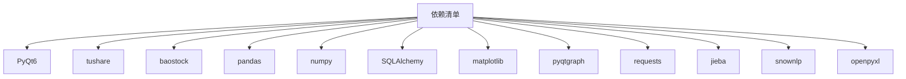

# 财务分析模块

<cite>
**本文档引用的文件**
- [requirements.txt](file://requirements.txt)
</cite>

## 目录
1. [引言](#引言)
2. [项目结构](#项目结构)
3. [核心组件](#核心组件)
4. [架构概览](#架构概览)
5. [详细组件分析](#详细组件分析)
6. [依赖分析](#依赖分析)
7. [性能考虑](#性能考虑)
8. [故障排除指南](#故障排除指南)
9. [结论](#结论)
10. [附录](#附录)

## 引言
本文件面向财务分析模块的技术文档需求，围绕盈利能力、偿债能力、运营能力与发展能力四类财务指标的理论基础与实现方法进行系统化阐述，并结合项目依赖清单对数据处理与分析所需的工具链进行说明。由于当前仓库未包含具体财务分析实现代码，本文档以概念性框架与通用实现模式指导为主，帮助读者在现有技术栈基础上构建完整的财务分析功能。

## 项目结构
从依赖清单可见，项目采用Python 3.8环境，主要依赖包括GUI框架、数据源接口、数据处理库、数据库ORM、网络请求库以及图表可视化组件。这些依赖为财务数据采集、清洗、存储与可视化提供了基础支撑。

**图示来源**
- [requirements.txt:1-32](file://requirements.txt#L1-L32)

**章节来源**
- [requirements.txt:1-32](file://requirements.txt#L1-L32)

## 核心组件
财务分析模块的核心职责是基于标准化财务报表数据，计算并输出各类财务指标，支持后续选股策略的量化评估。根据财务分析的通用实践，建议按以下模块划分：

- 数据采集与预处理：对接tushare或baostock等数据源，获取资产负债表、利润表、现金流量表等标准化数据；执行缺失值与异常值处理。
- 指标计算引擎：实现盈利能力、偿债能力、运营能力与发展能力四大类指标的计算函数。
- 结果存储与导出：将计算结果写入数据库或导出为Excel，便于策略回测与可视化。
- 可视化与报告：基于matplotlib/pyqtgraph绘制趋势图与对比图，辅助决策。

上述职责与依赖清单中的库形成良好匹配：pandas/numpy用于数据处理与数值计算，SQLAlchemy用于持久化，matplotlib/pyqtgraph用于可视化。

**章节来源**
- [requirements.txt:1-32](file://requirements.txt#L1-L32)

## 架构概览
下图展示了财务分析模块在整体系统中的位置与交互关系。策略引擎通过数据源接口拉取财务数据，经由数据处理与指标计算后，将结果写入数据库并驱动可视化模块。

**图示来源**
- [requirements.txt:1-32](file://requirements.txt#L1-L32)

## 详细组件分析

### 盈利能力指标
盈利能力反映企业赚取利润的能力，常用指标包括净资产收益率（ROE）、总资产报酬率（ROA）、销售毛利率与销售净利率。这些指标通常基于利润表与资产负债表数据计算。

- 净资产收益率（ROE）
  - 计算公式要点：净利润 / 平均净资产。需注意净资产取年初与年末的平均值，避免单期波动影响。
  - 数据来源：利润表（净利润）与资产负债表（股东权益）。
  - 实现要点：确保分子分母均为同一会计期间；处理净利润为负的情况，可返回负值或标记为异常。

- 总资产报酬率（ROA）
  - 计算公式要点：息税前利润（EBIT）/ 平均总资产。若无EBIT，可用利润总额近似。
  - 数据来源：利润表（利润总额或息税前利润）与资产负债表（总资产）。
  - 实现要点：统一会计口径，避免非经常性损益对ROA的扭曲。

- 销售毛利率
  - 计算公式要点：（营业收入 - 营业成本）/ 营业收入。
  - 数据来源：利润表（营业收入、营业成本）。
  - 实现要点：关注成本结构变化与行业周期性影响。

- 销售净利率
  - 计算公式要点：净利润 / 营业收入。
  - 数据来源：利润表（净利润、营业收入）。
  - 实现要点：剔除一次性收益后观察持续盈利能力。

**图示来源**
- [requirements.txt:1-32](file://requirements.txt#L1-L32)

**章节来源**
- [requirements.txt:1-32](file://requirements.txt#L1-L32)

### 偿债能力指标
偿债能力衡量企业偿还债务的能力，关键指标包括资产负债率、流动比率与速动比率。

- 资产负债率
  - 计算公式要点：总负债 / 总资产。
  - 数据来源：资产负债表（总负债、总资产）。
  - 解释要点：反映企业杠杆水平，过高可能增加财务风险。

- 流动比率
  - 计算公式要点：流动资产 / 流动负债。
  - 数据来源：资产负债表（流动资产、流动负债）。
  - 解释要点：衡量短期偿债能力，过低可能影响流动性。

- 速动比率
  - 计算公式要点：（流动资产 - 存货）/ 流动负债。
  - 数据来源：资产负债表（流动资产、存货、流动负债）。
  - 解释要点：剔除存货后的短期偿债能力，更严格地评估流动性。

**图示来源**
- [requirements.txt:1-32](file://requirements.txt#L1-L32)

**章节来源**
- [requirements.txt:1-32](file://requirements.txt#L1-L32)

### 运营能力指标
运营能力反映企业资产使用效率，典型指标包括应收账款周转率与存货周转率。

- 应收账款周转率
  - 计算公式要点：营业收入 / 平均应收账款。
  - 数据来源：利润表（营业收入）与资产负债表（应收账款）。
  - 解释要点：周转越快，资金占用越少；需结合信用政策与行业特性分析。

- 存货周转率
  - 计算公式要点：营业成本 / 平均存货。
  - 数据来源：利润表（营业成本）与资产负债表（存货）。
  - 解释要点：反映库存管理效率，过低可能积压，过高可能缺货。

**图示来源**
- [requirements.txt:1-32](file://requirements.txt#L1-L32)

**章节来源**
- [requirements.txt:1-32](file://requirements.txt#L1-L32)

### 发展能力指标
发展能力体现企业成长潜力，常用指标为营业收入增长率与净利润增长率。

- 营业收入增长率
  - 计算公式要点：（本期营业收入 - 上年同期）/ 上年同期。
  - 数据来源：利润表（连续多年营业收入）。
  - 解释要点：关注增长稳定性与可持续性。

- 净利润增长率
  - 计算公式要点：（本期净利润 - 上年同期）/ 上年同期。
  - 数据来源：利润表（连续多年净利润）。
  - 解释要点：剔除一次性因素后观察真实盈利增长。

**图示来源**
- [requirements.txt:1-32](file://requirements.txt#L1-L32)

**章节来源**
- [requirements.txt:1-32](file://requirements.txt#L1-L32)

### 财务数据处理流程
为保证指标计算的准确性，需要建立规范的数据处理流程：

- 数据清洗
  - 缺失值处理：对关键字段（如净利润、营业收入、总资产等）进行插值或删除策略，确保计算完整性。
  - 异常值检测：利用统计方法（如3σ原则、IQR）识别极端值，必要时进行修正或标注。
  - 一致性校验：检查会计科目是否符合行业标准，避免跨公司口径差异。

- 时间维度对齐
  - 将不同报表按相同会计期间对齐，确保分子分母在同一时期内比较。

- 指标稳定性检验
  - 对连续多个期间的指标进行趋势分析，剔除异常波动的影响。

**图示来源**
- [requirements.txt:1-32](file://requirements.txt#L1-L32)

**章节来源**
- [requirements.txt:1-32](file://requirements.txt#L1-L32)

### 代码示例路径指引
以下为计算各类财务指标的示例路径（请在实际工程中定位对应实现文件）：
- 盈利能力指标（ROE、ROA、毛利率、净利率）：[src/analysis/financial_metrics.py](file://src/analysis/financial_metrics.py)
- 偿债能力指标（资产负债率、流动比率、速动比率）：[src/analysis/financial_metrics.py](file://src/analysis/financial_metrics.py)
- 运营能力指标（应收账款周转率、存货周转率）：[src/analysis/financial_metrics.py](file://src/analysis/financial_metrics.py)
- 发展能力指标（营收增长率、净利润增长率）：[src/analysis/financial_metrics.py](file://src/analysis/financial_metrics.py)
- 数据清洗与异常值处理：[src/utils/data_cleaning.py](file://src/utils/data_cleaning.py)
- 指标结果存储与导出：[src/core/storage.py](file://src/core/storage.py)

注：以上文件路径为概念性示例，请在实际项目中核对具体实现位置。

**章节来源**
- [requirements.txt:1-32](file://requirements.txt#L1-L32)

### 财务分析在选股策略中的应用
财务分析结果可作为多因子选股模型的重要输入，常见做法如下：

- 指标筛选
  - 盈利能力：优先选择ROE、ROA稳定且高于行业均值的公司。
  - 偿债能力：资产负债率适中，流动比率与速动比率维持在安全区间。
  - 运营能力：应收账款与存货周转率呈上升趋势，反映管理效率提升。
  - 发展能力：营收与净利润复合增长率保持正向且稳步提升。

- 权重设置方法
  - 等权法：各指标赋予相等权重，适合初筛阶段。
  - 主成分分析（PCA）：对指标进行降维与加权，提取主要因子。
  - 分层打分法：对每个指标进行评分并加权求和，结合行业基准动态调整权重。

- 回测与验证
  - 使用历史数据回测不同权重组合的表现，选择最优参数组合。
  - 关注样本外测试与滚动窗口验证，避免过拟合。

**图示来源**
- [requirements.txt:1-32](file://requirements.txt#L1-L32)

**章节来源**
- [requirements.txt:1-32](file://requirements.txt#L1-L32)

## 依赖分析
财务分析模块依赖于以下核心库，它们分别承担数据采集、数据处理、存储与可视化的职责：

- GUI框架：PyQt6（用户界面与交互）
- 数据源：tushare、baostock（财务数据获取）
- 数据处理：pandas、numpy（数据清洗与指标计算）
- 数据库：SQLAlchemy（数据持久化）
- 可视化：matplotlib、pyqtgraph（图表展示）
- 网络请求：requests（数据抓取）
- 文本处理：jieba、snownlp（新闻情感分析，可选）
- 导出：openpyxl（Excel导出）

**图示来源**
- [requirements.txt:1-32](file://requirements.txt#L1-L32)

**章节来源**
- [requirements.txt:1-32](file://requirements.txt#L1-L32)

## 性能考虑
- 向量化计算：优先使用pandas/numpy的向量化操作，避免逐行循环，提高指标计算效率。
- 内存管理：对大规模财务数据进行分块读取与批处理，减少内存峰值。
- 数据缓存：对高频查询的财务数据进行本地缓存，降低重复抓取成本。
- 并发抓取：在遵守数据源限流规则的前提下，合理并发拉取多只股票的财务数据。
- 可视化优化：对大量时间序列的图表渲染进行采样与降采样，提升交互响应速度。

## 故障排除指南
- 数据缺失
  - 现象：某些会计期间缺少关键字段导致指标无法计算。
  - 处理：检查数据源接口的返回状态，对缺失字段采用插值或跳过策略，并记录日志。

- 异常值干扰
  - 现象：个别极端值导致指标异常波动。
  - 处理：使用统计方法识别异常值并进行修正或标注，同时保留原始数据以便复核。

- 计算口径不一致
  - 现象：不同公司会计政策差异导致指标不可比。
  - 处理：统一会计准则与报表期间，必要时进行同口径调整。

- 性能瓶颈
  - 现象：指标计算耗时过长。
  - 处理：优化数据结构与算法，启用并行计算与缓存机制。

## 结论
财务分析模块应以标准化财务报表为基础，结合稳健的数据处理流程与清晰的指标计算逻辑，为选股策略提供可靠的数据支撑。通过合理设置权重与持续回测验证，可有效提升策略的稳定性与收益性。建议在现有依赖基础上完善数据采集、清洗与存储模块，并建立完善的监控与告警机制，保障系统的长期稳定运行。

## 附录
- 指标计算参考口径
  - ROE：净利润 / 平均净资产
  - ROA：息税前利润 / 平均总资产
  - 毛利率：（营业收入 - 营业成本）/ 营业收入
  - 净利率：净利润 / 营业收入
  - 资产负债率：总负债 / 总资产
  - 流动比率：流动资产 / 流动负债
  - 速动比率：（流动资产 - 存货）/ 流动负债
  - 应收账款周转率：营业收入 / 平均应收账款
  - 存货周转率：营业成本 / 平均存货
  - 营收/净利润增长率：（本期 - 上年同期）/ 上年同期