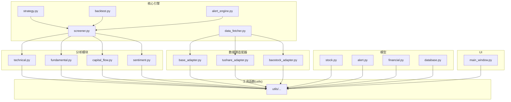
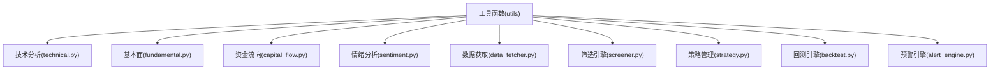
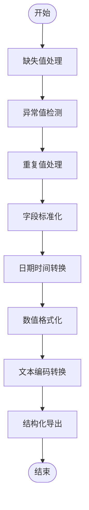
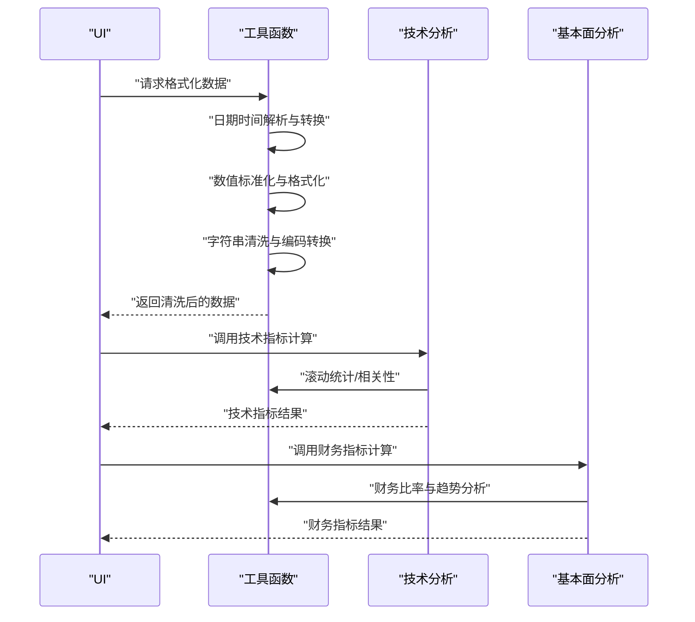
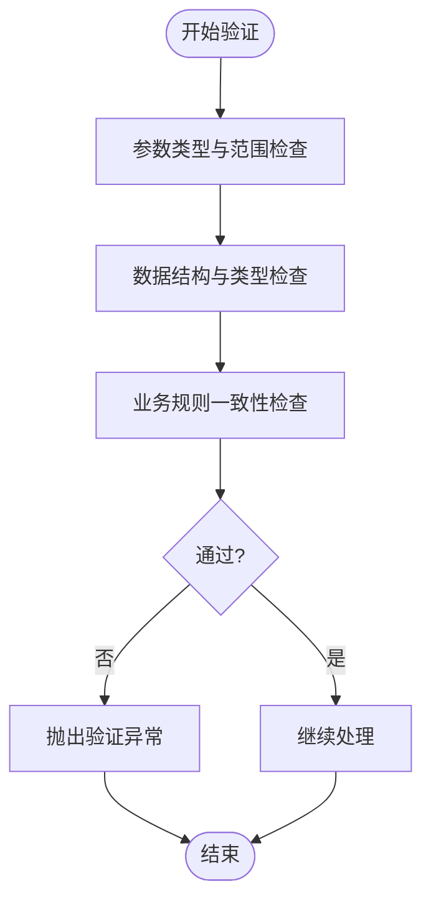
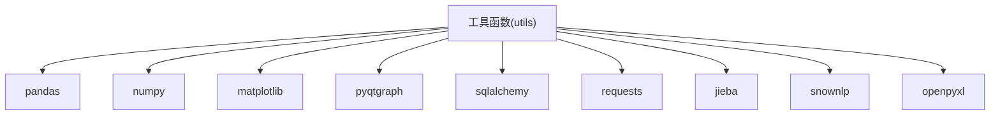

# 工具函数模块

<cite>
**本文引用的文件**
- [PRD.md](file://docs/PRD.md)
- [screener.py](file://src/core/screener.py)
- [strategy.py](file://src/core/strategy.py)
- [backtest.py](file://src/core/backtest.py)
- [alert_engine.py](file://src/core/alert_engine.py)
- [data_fetcher.py](file://src/core/data_fetcher.py)
- [base_adapter.py](file://src/datasource/base_adapter.py)
- [tushare_adapter.py](file://src/datasource/tushare_adapter.py)
- [baostock_adapter.py](file://src/datasource/baostock_adapter.py)
- [technical.py](file://src/analysis/technical.py)
- [fundamental.py](file://src/analysis/fundamental.py)
- [capital_flow.py](file://src/analysis/capital_flow.py)
- [sentiment.py](file://src/analysis/sentiment.py)
- [stock.py](file://src/models/stock.py)
- [alert.py](file://src/models/alert.py)
- [financial.py](file://src/models/financial.py)
- [database.py](file://src/models/database.py)
- [main_window.py](file://src/ui/main_window.py)
- [requirements.txt](file://requirements.txt)
</cite>

## 目录
1. [简介](#简介)
2. [项目结构](#项目结构)
3. [核心组件](#核心组件)
4. [架构总览](#架构总览)
5. [详细组件分析](#详细组件分析)
6. [依赖分析](#依赖分析)
7. [性能考虑](#性能考虑)
8. [故障排查指南](#故障排查指南)
9. [结论](#结论)
10. [附录](#附录)

## 简介
本文件为工具函数模块的详细参考文档，聚焦于数据处理、格式转换、标准化、日期时间处理、数学计算与字符串操作等实用工具的实现与使用建议。结合项目的技术架构与模块划分，文档将给出工具函数的设计原则、性能考量、扩展方法以及错误处理策略，并通过序列图与类图展示关键流程与关系。

## 项目结构
根据产品需求文档，项目采用模块化分层架构，工具函数位于 src/utils 目录，配合核心引擎、分析模块、数据源适配器、模型与UI组件协同工作。下图展示了与工具函数相关的核心模块关系：

**图表来源**
- [PRD.md:304-337](file://docs/PRD.md#L304-L337)

**章节来源**
- [PRD.md:304-337](file://docs/PRD.md#L304-L337)

## 核心组件
- 数据获取与缓存：数据获取器负责从多个数据源抓取数据并进行缓存，为后续分析与筛选提供统一的数据接口。
- 筛选引擎：基于多种技术、财务、资金流与情绪指标，执行多维条件筛选。
- 策略管理：定义与管理交易策略，支持技术策略、价值策略与混合策略。
- 回测引擎：对策略进行历史回测，输出收益曲线、绩效指标与可视化报告。
- 预警引擎：监控市场与个股动态，触发价格、涨跌幅、成交量与技术指标预警。
- 分析模块：提供技术分析、基本面分析、资金流向与情绪分析的算法与工具。
- 模型层：封装股票、预警、财务与数据库访问的实体与接口。
- UI 层：主窗口与页面组件，承载工具函数在界面中的应用。

**章节来源**
- [PRD.md:304-337](file://docs/PRD.md#L304-L337)

## 架构总览
工具函数模块作为横切关注点，贯穿数据获取、分析计算、策略执行与结果呈现的全流程。其职责包括但不限于：
- 数据清洗与标准化：统一字段命名、缺失值处理、异常值检测与修正、单位与精度规范化。
- 格式转换：时间戳与日期格式互转、数值格式化、字符串编码与编码转换、Excel/CSV 导出格式化。
- 数学计算：滚动统计、归一化、Z-score、波动率、相关系数、回归分析等。
- 字符串与文本处理：关键词提取、正则匹配、中文分词与情感分析、标题与描述标准化。
- 输入验证与业务规则校验：参数类型与范围校验、业务约束检查、数据一致性与完整性校验。

**图表来源**
- [PRD.md:304-337](file://docs/PRD.md#L304-L337)

## 详细组件分析

### 数据处理工具函数
- 数据清洗
  - 缺失值处理：提供填充策略（前向填充、后向填充、中位数/均值填充）与删除策略。
  - 异常值检测：基于分位数、标准差或箱线图方法识别并处理异常值。
  - 重复值处理：去重与合并策略，保留最新或最早记录。
  - 字段标准化：统一列名大小写、去除多余空白、统一枚举值映射。
- 格式转换
  - 日期时间：支持多种输入格式解析、时区转换、周期重采样（日/周/月）、格式化输出。
  - 数值格式：千分位分隔符、百分比、科学计数法、精度控制。
  - 文本编码：UTF-8/GBK/GB2312 互转，HTML实体解码，URL解码。
  - 结构化导出：DataFrame 转 Excel/CSV，列宽与样式自动调整。
- 标准化处理
  - Min-Max 归一化、Z-Score 标准化、Robust 标准化。
  - 分箱与离散化：等频、等距、聚类分箱。
  - 类别编码：One-Hot、Label Encoding、Target Encoding（谨慎使用）。

**图表来源**
- [technical.py](file://src/analysis/technical.py)
- [fundamental.py](file://src/analysis/fundamental.py)
- [capital_flow.py](file://src/analysis/capital_flow.py)
- [sentiment.py](file://src/analysis/sentiment.py)

**章节来源**
- [technical.py](file://src/analysis/technical.py)
- [fundamental.py](file://src/analysis/fundamental.py)
- [capital_flow.py](file://src/analysis/capital_flow.py)
- [sentiment.py](file://src/analysis/sentiment.py)

### 辅助函数库（日期时间、数学、字符串）
- 日期时间处理
  - 解析与格式化：兼容多种输入格式，输出统一 ISO 或本地化格式。
  - 周期重采样：日线、周线、月线的对齐与填充。
  - 工作日与节假日：支持 A 股交易日历，计算自然日与交易日差异。
- 数学计算
  - 滚动统计：窗口大小可配置，支持均值、标准差、偏度、峰度。
  - 相关性与协整：皮尔逊/斯皮尔曼相关系数、滚动相关。
  - 回归分析：线性回归与残差分析，用于技术指标拟合。
- 字符串与文本处理
  - 中文分词与关键词提取：基于结巴分词，支持停用词过滤。
  - 情感分析：基于 SnowNLP 的情感极性评分。
  - 正则表达式：清洗与提取特定模式（如代码、名称、URL）。

**图表来源**
- [technical.py](file://src/analysis/technical.py)
- [fundamental.py](file://src/analysis/fundamental.py)
- [sentiment.py](file://src/analysis/sentiment.py)

**章节来源**
- [technical.py](file://src/analysis/technical.py)
- [fundamental.py](file://src/analysis/fundamental.py)
- [sentiment.py](file://src/analysis/sentiment.py)

### 验证工具（输入参数、数据格式、业务规则）
- 输入参数验证
  - 类型与范围：确保数值在合理区间，字符串非空且符合长度限制。
  - 枚举与集合：限定取值集合，避免非法枚举值。
- 数据格式检查
  - 结构完整性：字段存在性、嵌套结构一致性。
  - 类型一致性：各列数据类型与期望一致。
- 业务规则校验
  - 逻辑一致性：PE/PB/PEG 等指标的内在关系检查。
  - 时间序列连续性：日线数据的缺失与断层检测。
  - 资金流向合理性：主力净流入与成交量、涨跌幅的匹配度。

**图表来源**
- [screener.py](file://src/core/screener.py)
- [strategy.py](file://src/core/strategy.py)
- [backtest.py](file://src/core/backtest.py)
- [alert_engine.py](file://src/core/alert_engine.py)

**章节来源**
- [screener.py](file://src/core/screener.py)
- [strategy.py](file://src/core/strategy.py)
- [backtest.py](file://src/core/backtest.py)
- [alert_engine.py](file://src/core/alert_engine.py)

### 使用示例与最佳实践
- 数据清洗与导出
  - 在数据入库前统一清洗，减少下游计算的不确定性。
  - 将清洗后的数据以 Excel/CSV 导出，便于人工复核与审计。
- 格式转换与标准化
  - 对日期时间进行统一转换，避免跨模块的时间偏差。
  - 对数值进行标准化，提升聚类与回归的稳定性。
- 验证前置
  - 在筛选与回测前执行严格验证，降低异常数据导致的误判风险。
- 可视化与报告
  - 将清洗与标准化结果纳入报告，标注处理步骤与参数。

### 设计原则与性能考虑
- 设计原则
  - 单一职责：每个工具函数聚焦一个明确任务。
  - 可组合性：函数之间通过清晰的输入输出接口组合使用。
  - 可测试性：提供最小可测试单元，覆盖边界与异常场景。
  - 可扩展性：预留钩子与配置项，支持新增算法与数据源。
- 性能考虑
  - 向量化优先：优先使用 pandas/numpy 向量化操作，避免显式循环。
  - 内存优化：分块读取、延迟计算、及时释放中间变量。
  - 缓存策略：对重复计算结果进行缓存，减少二次计算开销。
  - I/O 优化：批量写入、压缩导出、索引优化。

### 扩展方法与自定义工具添加流程
- 新增工具函数
  - 在 utils 目录下创建独立模块，按功能分组组织。
  - 提供清晰的函数签名与文档字符串，标注输入输出与异常。
  - 编写单元测试，覆盖正常与异常路径。
- 集成到现有模块
  - 在对应模块（如 technical.py、fundamental.py）中引入工具函数。
  - 通过配置或工厂模式注册新工具，保持接口一致。
- 版本与兼容
  - 为工具函数提供版本号与变更日志。
  - 保持向后兼容，必要时提供迁移脚本。

### 错误处理与异常情况
- 常见异常
  - 数据缺失：提供默认值或跳过策略，并记录日志。
  - 类型不匹配：在转换前进行类型检查，失败时抛出明确异常。
  - 计算溢出：对极值进行截断或警告，避免 NaN 泛滥。
- 异常传播
  - 工具函数内部捕获并包装异常，向上抛出带有上下文的异常对象。
  - 在 UI 层统一捕获并提示用户，避免程序崩溃。
- 日志与可观测性
  - 记录关键步骤与耗时，便于性能分析与问题定位。
  - 对异常场景输出详细上下文，包括输入参数与中间状态。

**章节来源**
- [main_window.py](file://src/ui/main_window.py)
- [stock.py](file://src/models/stock.py)
- [alert.py](file://src/models/alert.py)
- [financial.py](file://src/models/financial.py)
- [database.py](file://src/models/database.py)

## 依赖分析
工具函数模块依赖于 pandas、numpy、matplotlib、pyqtgraph、SQLAlchemy、requests、jieba、snownlp、openpyxl 等库，用于数据处理、可视化、网络请求、中文处理与导出。下图展示了工具函数与外部依赖的关系：

**图表来源**
- [requirements.txt:12-31](file://requirements.txt#L12-L31)

**章节来源**
- [requirements.txt:1-32](file://requirements.txt#L1-L32)

## 性能考虑
- 向量化与并行化：优先使用 pandas/numpy 的向量化操作；对独立任务进行并行化（注意 GIL 限制）。
- 内存管理：避免在内存中累积大量中间结果；及时清理不再使用的变量。
- I/O 优化：批量读写文件，启用压缩；对大型 DataFrame 使用分块处理。
- 缓存与索引：对高频查询建立索引；对重复计算结果进行缓存。
- 可视化性能：减少不必要的重绘，延迟计算与渲染。

## 故障排查指南
- 数据异常
  - 现象：计算结果出现 NaN、无穷大或明显偏离预期。
  - 排查：检查缺失值与异常值处理流程，确认数据清洗步骤。
- 时间序列问题
  - 现象：时间对齐错误或周期重采样后出现空洞。
  - 排查：确认日期格式统一与交易日历配置。
- 性能瓶颈
  - 现象：筛选或回测响应缓慢。
  - 排查：分析日志耗时，定位慢查询与内存峰值；优化向量化与缓存策略。
- 导出失败
  - 现象：Excel/CSV 导出报错或内容异常。
  - 排查：检查编码、列宽与特殊字符处理，确认 openpyxl 版本兼容性。

**章节来源**
- [backtest.py](file://src/core/backtest.py)
- [technical.py](file://src/analysis/technical.py)
- [requirements.txt:30-31](file://requirements.txt#L30-L31)

## 结论
工具函数模块是项目数据处理与分析的基础设施，承担着数据清洗、格式转换、标准化、验证与辅助计算等关键职责。通过遵循单一职责、可组合、可测试与可扩展的设计原则，并结合向量化、缓存与 I/O 优化等性能策略，工具函数能够高效支撑筛选、分析与回测等核心业务流程。建议在新增工具时严格遵循本文的扩展流程与最佳实践，确保系统的稳定性与可维护性。

## 附录
- 相关模块路径参考
  - 筛选引擎：[screener.py](file://src/core/screener.py)
  - 策略管理：[strategy.py](file://src/core/strategy.py)
  - 回测引擎：[backtest.py](file://src/core/backtest.py)
  - 预警引擎：[alert_engine.py](file://src/core/alert_engine.py)
  - 数据获取器：[data_fetcher.py](file://src/core/data_fetcher.py)
  - 技术分析：[technical.py](file://src/analysis/technical.py)
  - 基本面分析：[fundamental.py](file://src/analysis/fundamental.py)
  - 资金流向：[capital_flow.py](file://src/analysis/capital_flow.py)
  - 情绪分析：[sentiment.py](file://src/analysis/sentiment.py)
  - 数据源适配器：[base_adapter.py](file://src/datasource/base_adapter.py)、[tushare_adapter.py](file://src/datasource/tushare_adapter.py)、[baostock_adapter.py](file://src/datasource/baostock_adapter.py)
  - 模型：[stock.py](file://src/models/stock.py)、[alert.py](file://src/models/alert.py)、[financial.py](file://src/models/financial.py)、[database.py](file://src/models/database.py)
  - UI：[main_window.py](file://src/ui/main_window.py)
  - 依赖：[requirements.txt:1-32](file://requirements.txt#L1-L32)