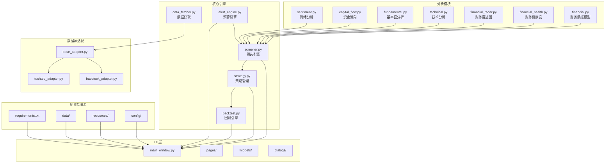
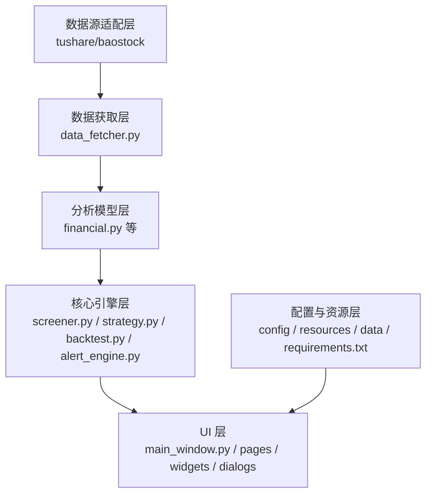
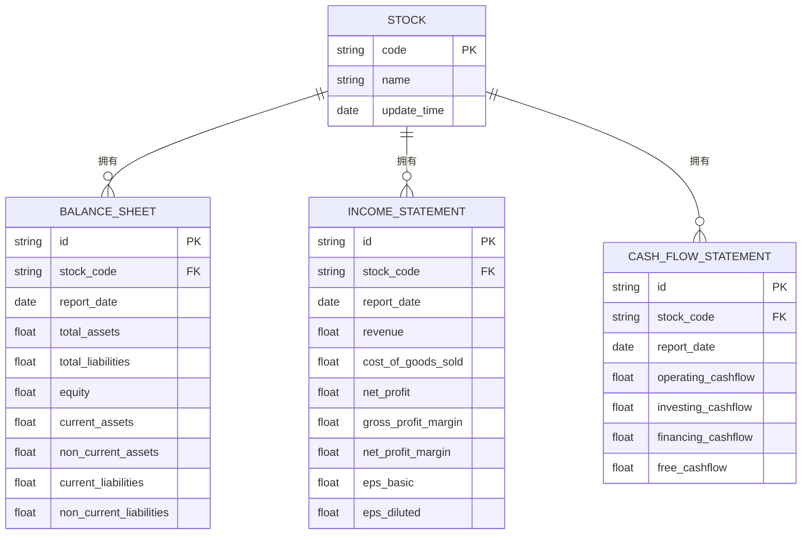
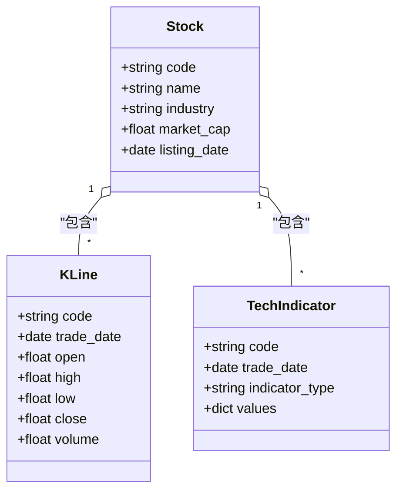
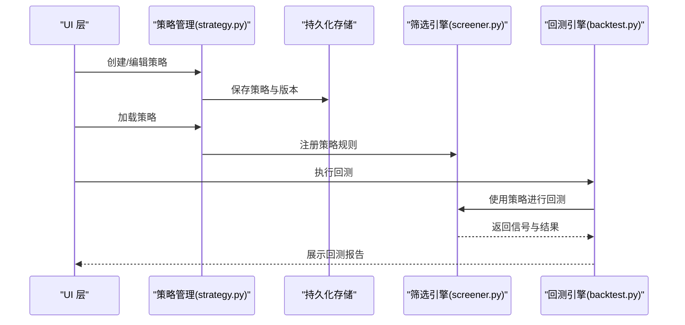
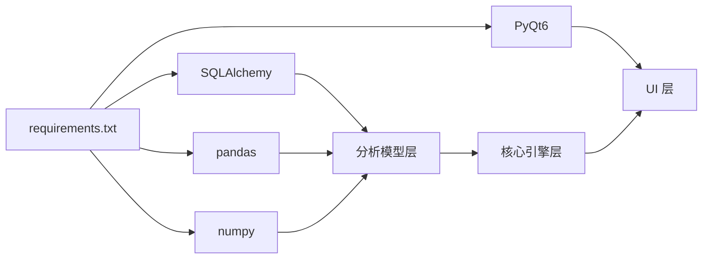

# 数据模型模块

<cite>
**本文引用的文件**
- [MODULE_DESIGN.md](file://docs/MODULE_DESIGN.md)
- [PRD.md](file://docs/PRD.md)
- [requirements.txt](file://requirements.txt)
- [financial.py](file://src/analysis/financial.py)
- [financial_health.py](file://src/analysis/financial_health.py)
- [financial_radar.py](file://src/analysis/financial_radar.py)
- [technical.py](file://src/analysis/technical.py)
- [fundamental.py](file://src/analysis/fundamental.py)
- [capital_flow.py](file://src/analysis/capital_flow.py)
- [sentiment.py](file://src/analysis/sentiment.py)
- [screener.py](file://src/core/screener.py)
- [strategy.py](file://src/core/strategy.py)
- [backtest.py](file://src/core/backtest.py)
- [alert_engine.py](file://src/core/alert_engine.py)
- [data_fetcher.py](file://src/core/data_fetcher.py)
- [base_adapter.py](file://src/datasource/base_adapter.py)
- [tushare_adapter.py](file://src/datasource/tushare_adapter.py)
- [baostock_adapter.py](file://src/datasource/baostock_adapter.py)
- [main_window.py](file://src/ui/main_window.py)
- [pages/](file://src/ui/pages/)
- [widgets/](file://src/ui/widgets/)
- [dialogs/](file://src/ui/dialogs/)
- [utils/](file://src/utils/)
- [config/](file://src/config/)
- [data/](file://data/)
- [resources/](file://resources/)
</cite>

## 目录
1. [引言](#引言)
2. [项目结构](#项目结构)
3. [核心组件](#核心组件)
4. [架构总览](#架构总览)
5. [详细组件分析](#详细组件分析)
6. [依赖分析](#依赖分析)
7. [性能考虑](#性能考虑)
8. [故障排除指南](#故障排除指南)
9. [结论](#结论)
10. [附录](#附录)

## 引言
本文件面向“数据模型模块”，系统化梳理股票数据模型、财务数据模型、用户策略模型及其相互关系，覆盖字段定义、ORM映射、数据库Schema设计、数据验证与业务约束、扩展机制与自定义字段添加方法，并通过图示展示模型间关联与外键约束。文档同时结合产品需求与模块设计文档，确保技术实现与业务目标一致。

## 项目结构
数据模型相关代码主要分布在以下位置：
- 模型与分析：src/analysis/financial.py、financial_health.py、financial_radar.py 等
- 核心引擎：src/core/screener.py、strategy.py、backtest.py、alert_engine.py、data_fetcher.py
- 数据源适配：src/datasource/base_adapter.py、tushare_adapter.py、baostock_adapter.py
- UI 层：src/ui/main_window.py、pages/、widgets/、dialogs/
- 配置与资源：src/config/、resources/、data/、requirements.txt
- 文档：docs/MODULE_DESIGN.md、docs/PRD.md

**图表来源**
- [MODULE_DESIGN.md](file://docs/MODULE_DESIGN.md)
- [financial.py](file://src/analysis/financial.py)
- [financial_health.py](file://src/analysis/financial_health.py)
- [financial_radar.py](file://src/analysis/financial_radar.py)
- [technical.py](file://src/analysis/technical.py)
- [fundamental.py](file://src/analysis/fundamental.py)
- [capital_flow.py](file://src/analysis/capital_flow.py)
- [sentiment.py](file://src/analysis/sentiment.py)
- [screener.py](file://src/core/screener.py)
- [strategy.py](file://src/core/strategy.py)
- [backtest.py](file://src/core/backtest.py)
- [alert_engine.py](file://src/core/alert_engine.py)
- [data_fetcher.py](file://src/core/data_fetcher.py)
- [base_adapter.py](file://src/datasource/base_adapter.py)
- [tushare_adapter.py](file://src/datasource/tushare_adapter.py)
- [baostock_adapter.py](file://src/datasource/baostock_adapter.py)
- [main_window.py](file://src/ui/main_window.py)
- [requirements.txt](file://requirements.txt)

**章节来源**
- [MODULE_DESIGN.md](file://docs/MODULE_DESIGN.md)
- [PRD.md](file://docs/PRD.md)

## 核心组件
- 财务数据模型：负责资产负债表、利润表、现金流量表的结构化表示与数据建模，支撑财务指标计算与可视化。
- 股票与技术指标模型：承载股票基本信息、K线、技术指标序列，为筛选与回测提供基础数据。
- 用户策略模型：描述策略规则、参数、版本管理与持久化，支持策略的创建、编辑、执行与回滚。
- 数据获取与适配：统一从 tushare、baostock 等数据源抓取数据，转换为内部模型。
- 分析与可视化：技术分析、资金流向、财务健康度、财务雷达图等模块，输出分析结果供UI层展示。

**章节来源**
- [MODULE_DESIGN.md](file://docs/MODULE_DESIGN.md)
- [PRD.md](file://docs/PRD.md)

## 架构总览
数据模型模块以“分析模块 + 核心引擎 + 数据源适配 + UI 层”分层组织，模型数据在分析层完成结构化与标准化后，进入核心引擎进行筛选、策略、回测与预警，最终由UI层呈现。

**图表来源**
- [data_fetcher.py](file://src/core/data_fetcher.py)
- [financial.py](file://src/analysis/financial.py)
- [screener.py](file://src/core/screener.py)
- [strategy.py](file://src/core/strategy.py)
- [backtest.py](file://src/core/backtest.py)
- [alert_engine.py](file://src/core/alert_engine.py)
- [main_window.py](file://src/ui/main_window.py)
- [config/](file://src/config/)
- [resources/](file://resources/)
- [data/](file://data/)
- [requirements.txt](file://requirements.txt)

## 详细组件分析

### 财务数据模型（资产负债表、利润表、现金流量表）
- 数据建模目标：以结构化方式存储季度与年度财务数据，支持财务指标计算、趋势分析与可视化。
- 关键实体与字段：
  - 资产负债表：总资产、总负债、股东权益、流动资产、非流动资产、流动负债、非流动负债等。
  - 利润表：营业收入、营业成本、净利润、毛利率、净利率、基本/稀释每股收益等。
  - 现金流量表：经营活动现金流、投资活动现金流、筹资活动现金流、自由现金流等。
- 指标派生：基于上述原始字段计算 ROE、ROA、负债率、毛利率、净利率、经营/自由现金流比率等。
- 可视化与分析：财务雷达图、财务健康度评分、杜邦分析等。

**图表来源**
- [financial.py](file://src/analysis/financial.py)
- [financial_health.py](file://src/analysis/financial_health.py)
- [financial_radar.py](file://src/analysis/financial_radar.py)

**章节来源**
- [MODULE_DESIGN.md](file://docs/MODULE_DESIGN.md)
- [PRD.md](file://docs/PRD.md)

### 股票与技术指标模型
- 基本信息：股票代码、名称、所属行业、上市日期、总股本、流通市值等。
- K线与技术指标：OHLCV 序列、MA、MACD、KDJ、RSI、布林带、成交量等。
- 数据来源：通过数据适配器从 tushare、baostock 获取，统一转换为内部模型。

**图表来源**
- [technical.py](file://src/analysis/technical.py)
- [data_fetcher.py](file://src/core/data_fetcher.py)
- [tushare_adapter.py](file://src/datasource/tushare_adapter.py)
- [baostock_adapter.py](file://src/datasource/baostock_adapter.py)

**章节来源**
- [MODULE_DESIGN.md](file://docs/MODULE_DESIGN.md)
- [PRD.md](file://docs/PRD.md)

### 用户策略模型（序列化与持久化）
- 策略规则存储：策略条件（技术/财务/资金流）、买卖信号、参数集合、版本号。
- 版本管理：策略变更记录、版本回滚、兼容性检查。
- 持久化机制：本地文件或数据库存储，支持导入/导出与跨设备迁移。
- 与核心引擎交互：策略被加载到策略管理器，参与筛选、回测与预警。

**图表来源**
- [strategy.py](file://src/core/strategy.py)
- [screener.py](file://src/core/screener.py)
- [backtest.py](file://src/core/backtest.py)
- [main_window.py](file://src/ui/main_window.py)

**章节来源**
- [MODULE_DESIGN.md](file://docs/MODULE_DESIGN.md)
- [PRD.md](file://docs/PRD.md)

### 数据验证规则与业务约束
- 字段类型与范围：数值型字段的上下限、百分比字段的取值范围、日期字段的有效性。
- 一致性约束：同一报告期的财务表之间勾稽关系（如利润表与资产负债表的平衡关系）。
- 业务规则：筛选条件的合法性校验、策略规则的语法与依赖检查、回测参数的可行性检查。
- 完整性保证：主外键约束、唯一性约束、非空约束；通过 ORM 映射与数据库 Schema 强制执行。

**章节来源**
- [MODULE_DESIGN.md](file://docs/MODULE_DESIGN.md)
- [PRD.md](file://docs/PRD.md)

### 模型扩展机制与自定义字段
- 扩展点：新增财务指标、技术指标、策略条件时，通过插件化或配置化方式注入。
- 自定义字段：允许用户在策略与分析模块中添加临时字段，不影响核心模型结构。
- 版本化：所有扩展需纳入版本管理，确保历史数据与新旧版本兼容。

**章节来源**
- [MODULE_DESIGN.md](file://docs/MODULE_DESIGN.md)
- [PRD.md](file://docs/PRD.md)

## 依赖分析
- 外部依赖：SQLAlchemy（<2.0）用于 ORM 与数据库访问；pandas/numpy 用于数据分析；PyQt6 用于 UI。
- 模块耦合：分析模块与核心引擎松耦合，通过清晰接口传递数据；数据源适配器抽象不同数据源差异。
- 循环依赖：未见明显循环依赖；若新增模块需保持单向依赖链。

**图表来源**
- [requirements.txt](file://requirements.txt)
- [financial.py](file://src/analysis/financial.py)
- [screener.py](file://src/core/screener.py)
- [main_window.py](file://src/ui/main_window.py)

**章节来源**
- [requirements.txt](file://requirements.txt)

## 性能考虑
- 数据缓存：高频查询与计算结果缓存，减少重复计算与IO。
- 分页与批处理：财务数据与K线序列采用分页与批处理，避免内存峰值。
- 索引优化：对常用查询字段建立索引（如股票代码、报告日期、交易日期）。
- 异步加载：UI 层异步加载数据，提升响应速度。

## 故障排除指南
- 数据缺失：检查数据源适配器是否正确返回数据，确认字段映射与类型转换。
- 计算异常：核对财务表勾稽关系与技术指标参数边界，定位异常数据行。
- 策略执行失败：检查策略规则语法、依赖字段是否存在、参数范围是否合法。
- ORM 映射错误：核对模型字段与数据库 Schema 是否一致，必要时执行迁移。

**章节来源**
- [base_adapter.py](file://src/datasource/base_adapter.py)
- [tushare_adapter.py](file://src/datasource/tushare_adapter.py)
- [baostock_adapter.py](file://src/datasource/baostock_adapter.py)
- [financial.py](file://src/analysis/financial.py)
- [strategy.py](file://src/core/strategy.py)

## 结论
数据模型模块以财务数据为核心，结合技术指标与用户策略，构建了从数据获取、模型建模、分析计算到策略执行与可视化的完整闭环。通过严格的字段定义、业务约束与ORM映射，确保数据完整性与一致性；通过模块化与扩展机制，满足持续演进的业务需求。

## 附录
- 数据库 Schema 设计建议：以财务模型为例，建立股票主表与三张财务报表子表，设置主外键与索引；技术指标与K线表按日期分区；策略表包含规则JSON、版本号与时间戳。
- 版本管理：策略与模型变更纳入版本控制，提供回滚与兼容性检查。
- 可视化集成：财务雷达图与健康度评分作为分析结果的前端展示入口。