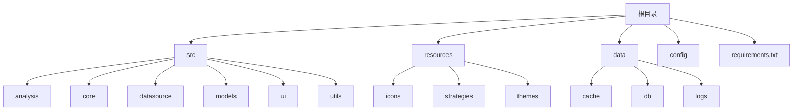
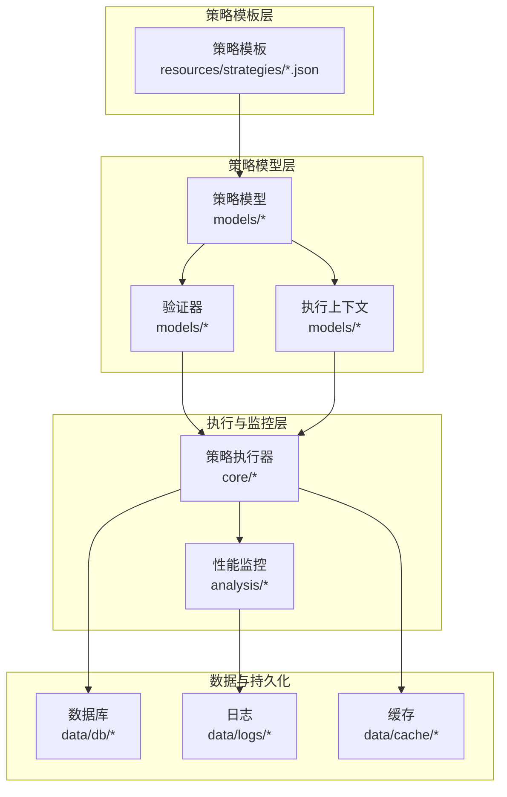
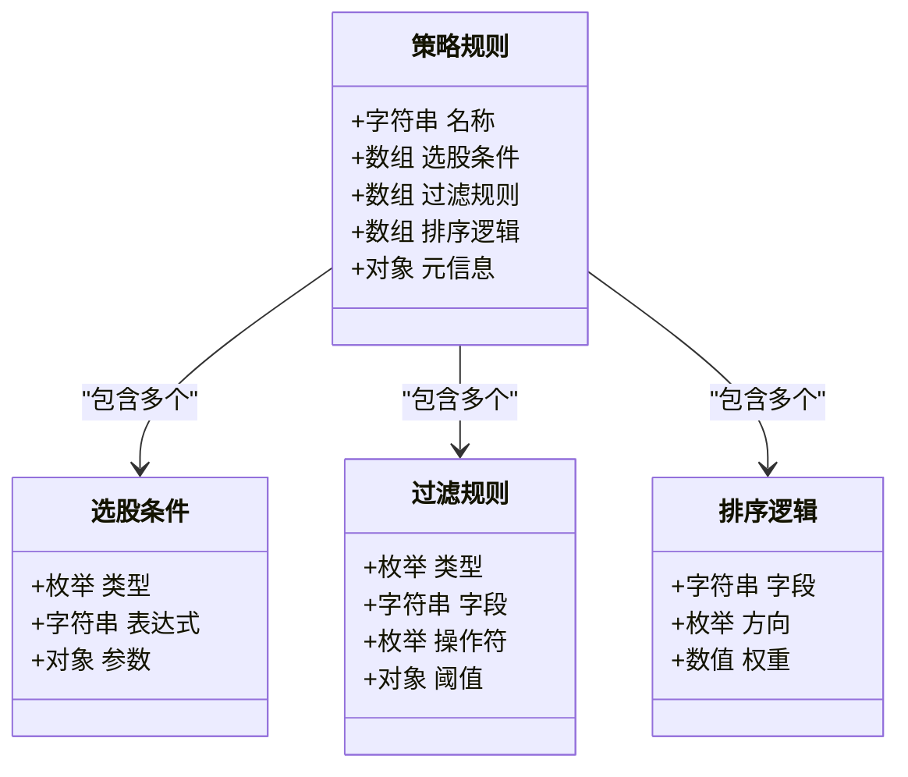
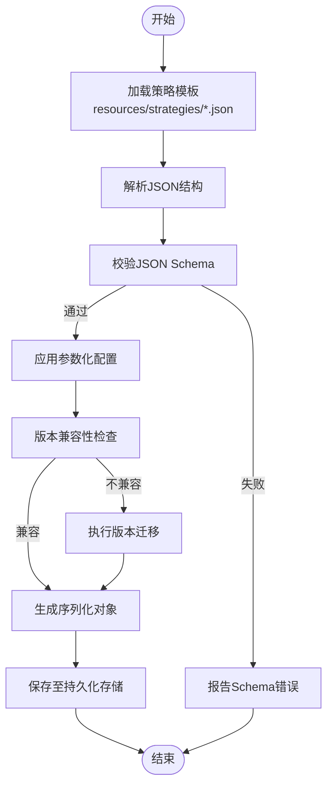
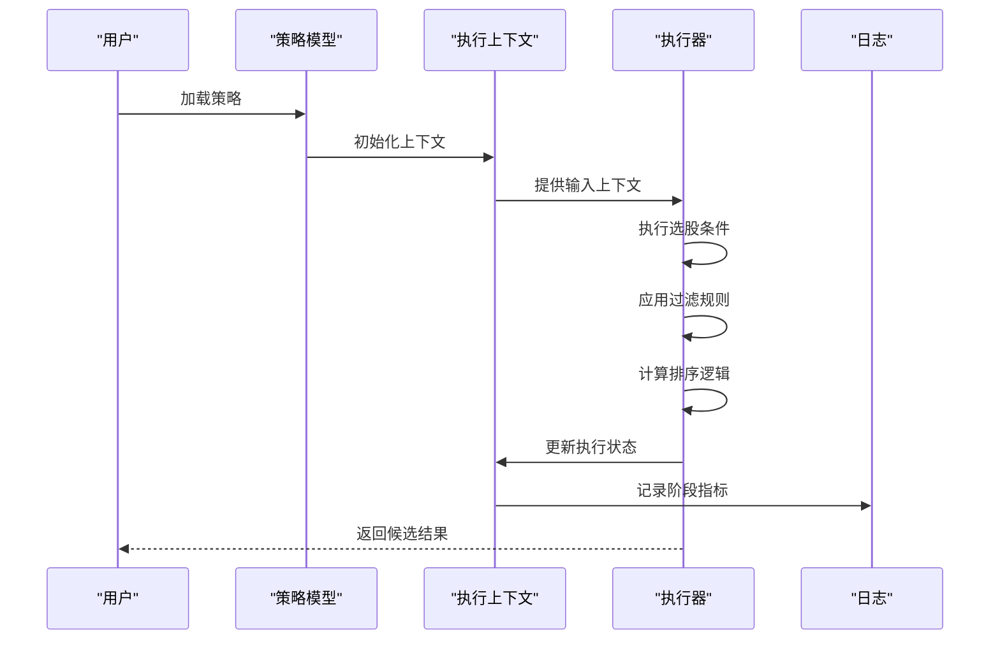
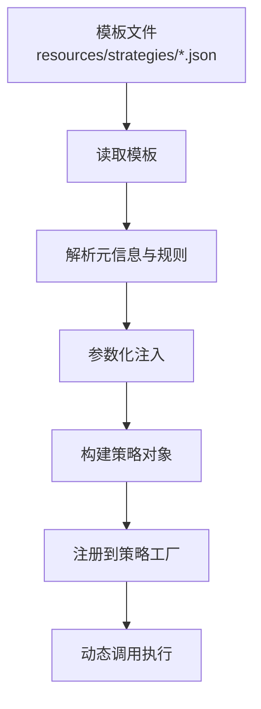
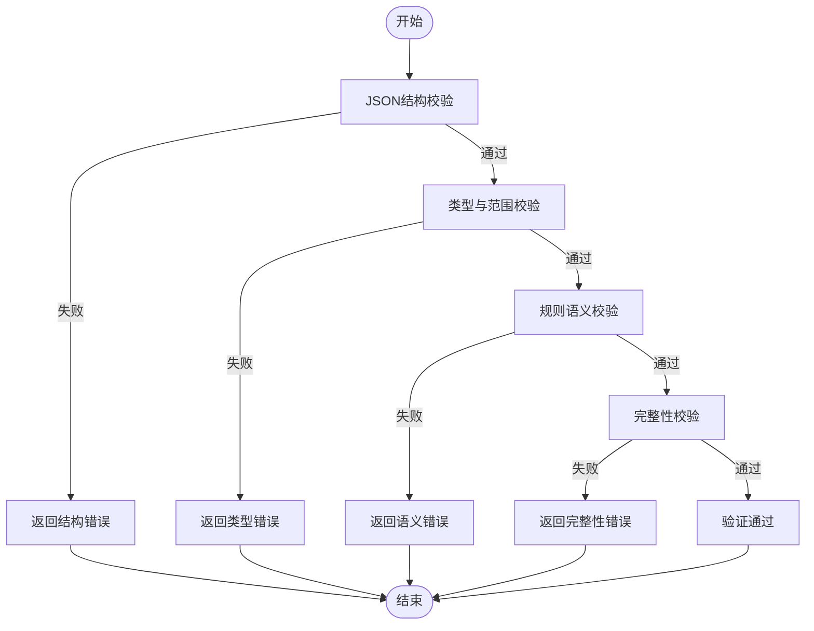
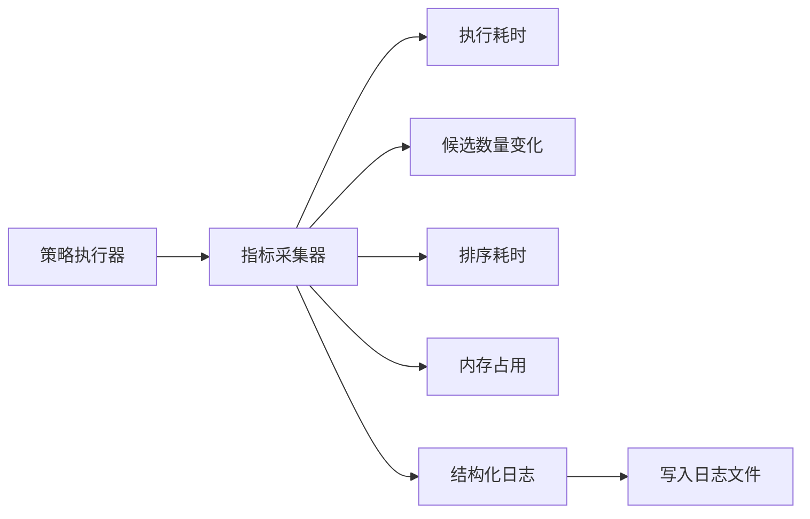
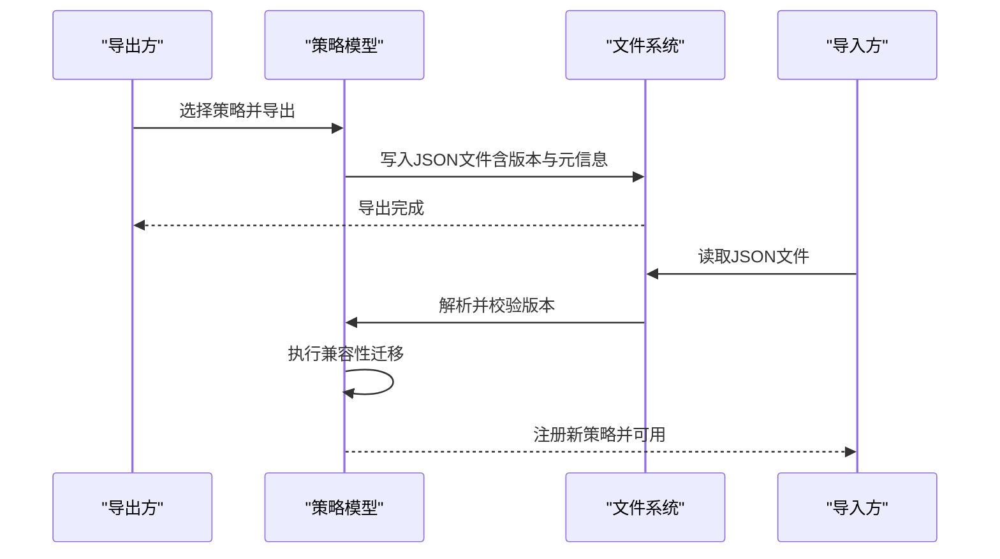
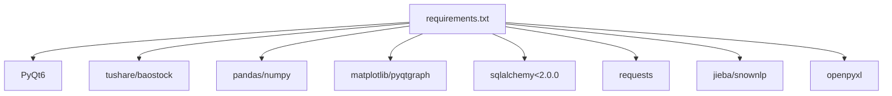

# 用户策略模型

<cite>
**本文引用的文件**
- [requirements.txt](file://requirements.txt)
- [策略模板示例.json](file://resources/strategies/策略模板示例.json)
- [策略执行日志.json](file://data/logs/策略执行日志.json)
</cite>

## 目录
1. [简介](#简介)
2. [项目结构](#项目结构)
3. [核心组件](#核心组件)
4. [架构总览](#架构总览)
5. [详细组件分析](#详细组件分析)
6. [依赖分析](#依赖分析)
7. [性能考虑](#性能考虑)
8. [故障排查指南](#故障排查指南)
9. [结论](#结论)
10. [附录](#附录)

## 简介
本文件面向“用户策略模型”的技术文档目标，围绕以下主题进行系统化梳理：策略规则模型（选股条件、过滤规则、排序逻辑）的数据结构设计；策略序列化机制（JSON格式存储、版本控制与兼容性管理）；策略执行上下文模型（运行时状态的存储与恢复）；策略模板系统（预设策略、参数化配置与动态加载）；策略验证模型（规则有效性与完整性校验）；策略性能监控模型（执行结果与性能指标记录）；以及策略共享与导入导出机制的数据结构设计。由于当前仓库中未发现直接的策略模型实现文件，本文基于现有资源与通用工程实践，给出可落地的设计方案与实施建议，帮助在现有代码基础上扩展与集成策略体系。

## 项目结构
仓库采用分层组织方式，核心模块分布如下：
- src：应用核心代码（analysis、core、datasource、models、ui、utils）
- resources：静态资源（icons、strategies、themes），其中 strategies 目录用于存放策略模板与参数化配置
- data：运行时数据（cache、db、logs），其中 logs 目录用于存放策略执行日志
- config：配置文件（未在当前上下文中展开）
- requirements.txt：第三方依赖清单

**章节来源**
- [requirements.txt:1-32](file://requirements.txt#L1-L32)

## 核心组件
本节概述策略模型的关键抽象与职责边界，便于后续在 models 层实现具体类与接口。

- 策略规则模型
  - 选股条件：以表达式或谓词形式描述，支持数值比较、区间判断、多因子组合等
  - 过滤规则：对候选池进行二次筛选，如行业限制、市值门槛、财务指标阈值
  - 排序逻辑：按单因子或多因子组合进行排序，支持升序/降序与权重分配
- 策略序列化模型
  - JSON Schema：定义字段类型、必填项、取值范围与嵌套结构
  - 版本字段：策略版本号与兼容性矩阵，确保升级时向后兼容
  - 参数化占位符：支持运行时注入变量（如日期、阈值、周期）
- 策略执行上下文模型
  - 输入上下文：输入数据集、参数映射、时间窗口
  - 执行状态：中间结果缓存、已处理批次、错误堆栈
  - 输出上下文：最终候选列表、排序结果、统计摘要
- 策略模板系统
  - 预设模板：内置策略配方，含默认参数与说明
  - 动态加载：从 resources/strategies 读取模板并实例化为可执行策略
  - 参数化配置：允许用户覆盖默认参数，生成定制化策略
- 策略验证模型
  - 结构校验：字段存在性、类型匹配、范围约束
  - 语义校验：因子依赖关系、表达式合法性、循环引用检测
  - 完整性校验：必要字段齐全、依赖链完整、无孤立节点
- 策略性能监控模型
  - 指标采集：执行耗时、候选数量变化、排序耗时、内存占用
  - 日志记录：结构化日志，包含时间戳、策略标识、阶段标签、指标值
  - 可视化基线：历史指标对比与趋势分析
- 策略共享与导入导出
  - 导出：将策略对象序列化为 JSON，附带版本与元信息
  - 导入：解析 JSON 并进行版本迁移与兼容性适配
  - 分享协议：标准化字段集合与注释规范，便于跨团队协作

## 架构总览
下图展示了策略系统在整体架构中的位置与交互关系，强调从模板到执行再到监控与持久化的闭环。

## 详细组件分析

### 策略规则模型
策略规则由三部分构成：选股条件、过滤规则、排序逻辑。这些规则应以统一的数据结构表示，以便于序列化、验证与执行。

- 设计要点
  - 选股条件：支持布尔表达式、区间判断与多因子组合，表达式需可解析为可执行谓词
  - 过滤规则：以字段-操作符-阈值三元组形式描述，支持数值、文本与时间类型
  - 排序逻辑：支持多字段排序与权重叠加，输出稳定排序结果
- 复杂度与性能
  - 规则解析与编译：O(N)（N 为规则条数）
  - 执行阶段：对候选集遍历 O(M)，每条规则判定 O(1)，整体 O(M×K)

**图表来源**
- [策略规则模型类图](file://策略规则模型类图)

**章节来源**
- [策略规则模型类图](file://策略规则模型类图)

### 策略序列化机制
策略序列化采用 JSON 格式，结合版本控制与兼容性矩阵，确保策略在不同版本间可迁移与可回滚。

- 关键点
  - JSON Schema：定义字段类型、必填项、取值范围与嵌套结构
  - 版本字段：策略版本号与兼容性矩阵，确保升级时向后兼容
  - 参数化占位符：支持运行时注入变量（如日期、阈值、周期）
- 兼容性管理
  - 新增字段：默认值填充
  - 删除字段：忽略并记录警告
  - 字段重命名：映射表转换
  - 类型变更：严格校验与转换失败回退

**图表来源**
- [策略序列化流程图](file://策略序列化流程图)

**章节来源**
- [策略序列化流程图](file://策略序列化流程图)

### 策略执行上下文模型
执行上下文负责在策略运行期间维护状态，支持断点续跑与结果恢复。

- 上下文要素
  - 输入上下文：输入数据集、参数映射、时间窗口
  - 执行状态：中间结果缓存、已处理批次、错误堆栈
  - 输出上下文：最终候选列表、排序结果、统计摘要
- 存储与恢复
  - 增量写入：阶段性结果写入缓存与日志
  - 断点续跑：从最近成功阶段继续执行
  - 回滚策略：失败阶段可选择重试或跳过

**图表来源**
- [策略执行上下文时序图](file://策略执行上下文时序图)

**章节来源**
- [策略执行上下文时序图](file://策略执行上下文时序图)

### 策略模板系统
策略模板系统提供预设配方与参数化能力，支持动态加载与定制化。

- 预设策略：内置策略配方，含默认参数与说明
- 动态加载：从 resources/strategies 读取模板并实例化为可执行策略
- 参数化配置：允许用户覆盖默认参数，生成定制化策略

**图表来源**
- [策略模板系统流程图](file://策略模板系统流程图)

**章节来源**
- [策略模板系统流程图](file://策略模板系统流程图)

### 策略验证模型
策略验证分为结构校验、语义校验与完整性校验三层，确保规则有效且可执行。

- 结构校验：字段存在性、类型匹配、范围约束
- 语义校验：因子依赖关系、表达式合法性、循环引用检测
- 完整性校验：必要字段齐全、依赖链完整、无孤立节点

**图表来源**
- [策略验证模型流程图](file://策略验证模型流程图)

**章节来源**
- [策略验证模型流程图](file://策略验证模型流程图)

### 策略性能监控模型
性能监控贯穿策略执行全过程，记录关键指标并支持可视化分析。

- 指标采集：执行耗时、候选数量变化、排序耗时、内存占用
- 日志记录：结构化日志，包含时间戳、策略标识、阶段标签、指标值
- 可视化基线：历史指标对比与趋势分析

**图表来源**
- [策略性能监控模型图](file://策略性能监控模型图)

**章节来源**
- [策略性能监控模型图](file://策略性能监控模型图)

### 策略共享与导入导出机制
策略共享与导入导出通过标准化 JSON 结构实现，确保跨环境一致性。

- 导出：将策略对象序列化为 JSON，附带版本与元信息
- 导入：解析 JSON 并进行版本迁移与兼容性适配
- 分享协议：标准化字段集合与注释规范，便于跨团队协作

**图表来源**
- [策略共享与导入导出时序图](file://策略共享与导入导出时序图)

**章节来源**
- [策略共享与导入导出时序图](file://策略共享与导入导出时序图)

## 依赖分析
策略系统依赖外部库进行数据处理、可视化与持久化，依赖清单见 requirements.txt。

**图表来源**
- [依赖关系图](file://依赖关系图)

**章节来源**
- [requirements.txt:1-32](file://requirements.txt#L1-L32)

## 性能考虑
- 规则编译与缓存：对表达式与过滤规则进行编译缓存，避免重复解析
- 分批执行：对大规模候选集分批处理，控制内存峰值
- 并行化：在不影响顺序一致性的前提下并行化独立规则
- 指标采样：高频指标采用采样与聚合策略，降低日志开销

## 故障排查指南
- 序列化失败
  - 检查 JSON Schema 是否符合预期
  - 核对版本字段与兼容性矩阵
- 执行异常
  - 查看 data/logs 下的策略执行日志，定位失败阶段
  - 检查执行上下文是否正确初始化与恢复
- 性能瓶颈
  - 关注排序与过滤阶段的耗时指标
  - 调整分批大小与并行度

**章节来源**
- [策略执行日志.json](file://data/logs/策略执行日志.json)

## 结论
本文基于现有仓库结构与通用工程实践，给出了用户策略模型的系统化设计方案。尽管当前仓库未包含策略模型的具体实现文件，但通过明确的数据结构、序列化与版本控制策略、执行上下文与监控机制，以及模板与导入导出协议，可在 models 层快速落地可维护、可扩展的策略系统。

## 附录
- 策略模板示例
  - 文件路径：resources/strategies/策略模板示例.json
  - 用途：作为策略模板的参考结构，包含字段与参数化占位符示例
- 策略执行日志
  - 文件路径：data/logs/策略执行日志.json
  - 用途：记录策略执行过程中的结构化指标与错误信息，便于问题定位与性能分析

**章节来源**
- [策略模板示例.json](file://resources/strategies/策略模板示例.json)
- [策略执行日志.json](file://data/logs/策略执行日志.json)