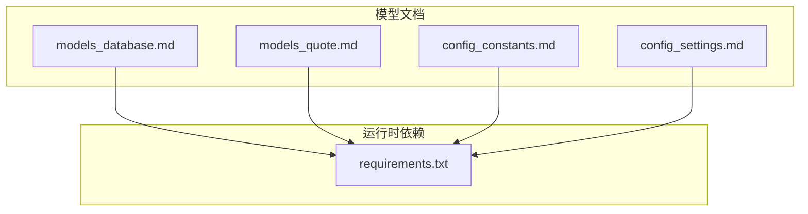
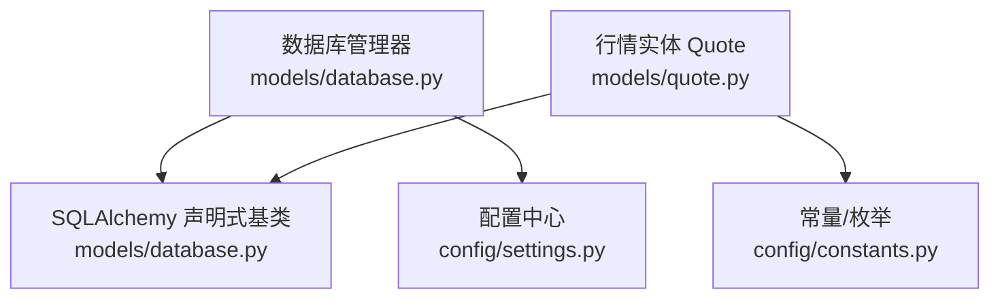
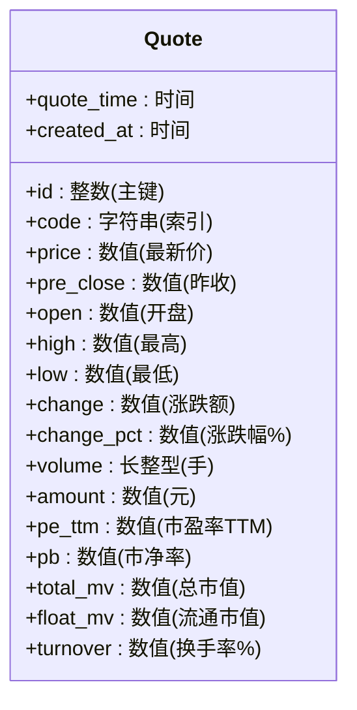
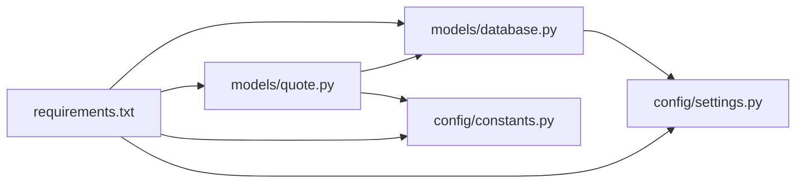

# 股票数据模型

<cite>
**本文引用的文件**
- [models_database.md](file://docs/modules/models_database.md)
- [models_quote.md](file://docs/modules/models_quote.md)
- [config_constants.md](file://docs/modules/config_constants.md)
- [config_settings.md](file://docs/modules/config_settings.md)
- [requirements.txt](file://requirements.txt)
</cite>

## 目录
1. [简介](#简介)
2. [项目结构](#项目结构)
3. [核心组件](#核心组件)
4. [架构总览](#架构总览)
5. [详细组件分析](#详细组件分析)
6. [依赖关系分析](#依赖关系分析)
7. [性能考量](#性能考量)
8. [故障排查指南](#故障排查指南)
9. [结论](#结论)
10. [附录](#附录)

## 简介
本文件面向“股票数据模型”的技术文档，聚焦于以下目标：
- 解释股票基本信息模型的设计：股票代码、名称、行业分类、上市日期等基础字段的定义与数据类型。
- 说明技术指标模型结构：K线数据、成交量、价格变化率等技术分析相关字段。
- 文档化财务数据模型：市盈率、市净率、每股收益、净资产收益率等财务指标的存储格式。
- 解释主键设计与索引策略，结合数据库优化以提升查询性能。
- 提供数据验证规则与约束条件，确保模型层面的数据质量。
- 给出模型扩展机制，说明如何在不破坏现有结构的前提下新增技术指标字段。

## 项目结构
该项目采用分层与模块化的组织方式，核心数据模型位于 docs/modules 下的文档中，数据库与ORM基础设施由 models/database 提供，常量与配置由 config/constants 和 config/settings 提供支撑。

图表来源
- [models_database.md:1-100](file://docs/modules/models_database.md#L1-L100)
- [models_quote.md:1-101](file://docs/modules/models_quote.md#L1-L101)
- [config_constants.md:1-135](file://docs/modules/config_constants.md#L1-L135)
- [config_settings.md:1-114](file://docs/modules/config_settings.md#L1-L114)
- [requirements.txt:1-31](file://requirements.txt#L1-L31)

章节来源
- [models_database.md:1-100](file://docs/modules/models_database.md#L1-L100)
- [models_quote.md:1-101](file://docs/modules/models_quote.md#L1-L101)
- [config_constants.md:1-135](file://docs/modules/config_constants.md#L1-L135)
- [config_settings.md:1-114](file://docs/modules/config_settings.md#L1-L114)
- [requirements.txt:1-31](file://requirements.txt#L1-L31)

## 核心组件
- 数据库与ORM基类：提供声明式基类、会话管理、连接池配置与初始化建表能力。
- 行情模型（Quote）：承载实时行情与部分市场指标，包含价格、涨跌、成交量、PE/PB、时间戳等字段。
- 常量与枚举：定义周期、指标类型、报告类型、筛选运算符等，作为模型与业务逻辑的契约。
- 配置中心：提供应用配置、数据源配置、缓存与路径等配置项，影响模型的运行环境。

章节来源
- [models_database.md:26-50](file://docs/modules/models_database.md#L26-L50)
- [models_quote.md:14-56](file://docs/modules/models_quote.md#L14-L56)
- [config_constants.md:12-135](file://docs/modules/config_constants.md#L12-L135)
- [config_settings.md:32-97](file://docs/modules/config_settings.md#L32-L97)

## 架构总览
整体架构围绕“文档化模型 + ORM 基础设施 + 常量/配置支撑”展开。模型通过声明式ORM映射到SQLite，配合连接池与上下文会话管理，实现稳定的数据持久化与查询。

图表来源
- [models_database.md:28-50](file://docs/modules/models_database.md#L28-L50)
- [models_quote.md:17-56](file://docs/modules/models_quote.md#L17-L56)
- [config_constants.md:84-135](file://docs/modules/config_constants.md#L84-L135)
- [config_settings.md:32-97](file://docs/modules/config_settings.md#L32-L97)

## 详细组件分析

### 股票基本信息模型（概念性设计）
基于现有文档，当前未直接给出“股票基本信息模型”的具体ORM定义。但可依据项目中的常量与配置推导出应具备的基础字段与约束：

- 字段建议
  - 股票代码：字符串，唯一且建立索引，便于高频查询。
  - 股票名称：字符串，长度适中，用于展示与筛选。
  - 行业分类：字符串或枚举，便于多维分析。
  - 上市日期：日期类型，支持历史回溯与区间查询。
  - 市场板块：枚举（主板/创业板/科创板/北交所），与常量一致。
  - 交易所：枚举（上交所/深交所/北交所），与常量一致。
  - 创建/更新时间：时间戳，便于审计与增量同步。

- 数据类型与精度
  - 数值类字段建议采用高精度数值类型，以满足财务计算与展示需求。
  - 日期/时间统一使用标准类型，避免时区与格式差异。

- 约束与校验
  - 股票代码唯一性约束。
  - 名称与行业分类的非空校验。
  - 上市日期的合理性校验（不晚于当前日期）。

- 主键与索引
  - 主键：自增整数或复合主键（如代码+交易所）。
  - 索引：股票代码、行业分类、上市日期等常用查询字段建立索引。

- 扩展机制
  - 新增字段采用可选字段（nullable=True），并提供默认值或迁移脚本。
  - 通过配置中心控制字段可见性与默认展示。

本节为概念性设计说明，不直接对应具体源码文件。

### 技术指标模型（基于 Quote 的字段映射）
根据 Quote 模型，技术分析相关字段主要集中在价格、成交量与涨跌幅等维度。这些字段天然构成K线与技术指标的输入基础。

图表来源
- [models_quote.md:17-56](file://docs/modules/models_quote.md#L17-L56)

- 字段与技术分析的关系
  - K线数据：open/high/low/close（price）构成K线蜡烛图。
  - 成交量：volume/amount 反映市场活跃度。
  - 价格变化率：change/change_pct 用于涨跌幅排行与预警。
  - 市场指标：pe_ttm/pb/turnover/市值系列用于基本面与流动性分析。

- 扩展机制
  - 新增技术指标字段（如MACD/KDJ/RSI/布林带参数）建议以独立表或JSON列形式扩展，避免对现有表结构产生破坏性变更。
  - 若采用独立表，以 code 与 quote_time 作为联合索引，确保查询效率。

章节来源
- [models_quote.md:14-56](file://docs/modules/models_quote.md#L14-L56)
- [config_constants.md:65-73](file://docs/modules/config_constants.md#L65-L73)

### 财务数据模型（概念性设计）
财务指标通常来源于定期财务报表，建议采用“财务快照表”与“指标派生表”相结合的方式：

- 财务快照表
  - 字段：code、report_date（报告期）、report_type（一季报/半年报/三季报/年报）、pe_ttm、pb、eps、roe、净利润、营收、资产负债等。
  - 约束：同一股票+报告期唯一；报告期与类型需符合财务周期。
  - 索引：code+report_date，report_type。

- 指标派生表
  - 字段：code、date、pe_ttm、pb、roe、净利润增速、营收增速等。
  - 索引：code+date，date（滚动窗口查询）。

- 与常量的关联
  - report_type 对应常量中的季度/年度类型，确保数据一致性。

本节为概念性设计说明，不直接对应具体源码文件。

### 主键设计与索引策略
- 主键
  - Quote 使用自增整数主键，适合高并发写入与顺序扫描。
  - 财务/指标表建议采用复合主键（如 code+date/report_date），确保唯一性与查询效率。

- 索引
  - 常用查询字段建立索引：code、report_date、date、指标列（如pe_ttm、roE）。
  - 复合索引：code+date 用于日频指标的快速检索；code+report_date 用于财务快照的快速定位。

- 索引维护
  - 定期统计信息更新与碎片整理，避免索引失效。
  - 对大表进行分区或分表（按年/按股票池）以降低查询成本。

章节来源
- [models_quote.md:22](file://docs/modules/models_quote.md#L22)
- [models_database.md:86-92](file://docs/modules/models_database.md#L86-L92)

### 数据验证规则与约束条件
- 字段约束
  - 非空：code、price、pre_close、open、high、low、volume、amount、quote_time。
  - 数值范围：pe_ttm/pb/turnover 等应为正数或合理区间；涨跌幅允许负值。
  - 唯一性：股票代码在基本信息表中唯一；财务快照表中 code+report_date 唯一。

- 业务规则
  - 价格字段应满足：low ≤ price ≤ high；pre_close 与当日开盘/收盘存在合理边界。
  - 成交量与成交额应同向增长；异常波动触发预警。

- 校验策略
  - ORM 层：通过字段类型与约束定义进行基础校验。
  - 业务层：引入规则引擎或策略对象，对复杂规则进行集中管理。
  - 入库前：批量校验与清洗，剔除异常样本。

章节来源
- [models_quote.md:24-51](file://docs/modules/models_quote.md#L24-L51)
- [config_constants.md:44-63](file://docs/modules/config_constants.md#L44-L63)

### 模型扩展机制
- 向后兼容
  - 新增字段采用可选字段（nullable=True），并提供默认值或迁移脚本。
  - 对于技术指标，建议独立表或JSON列，避免对现有表结构产生破坏性变更。

- 索引与查询优化
  - 新增字段若为高频查询字段，需同步建立索引。
  - 对于派生指标，建议物化视图或汇总表，降低实时计算成本。

- 配置驱动
  - 通过配置中心控制字段可见性、默认展示与计算周期，便于灰度发布与回滚。

章节来源
- [config_settings.md:32-97](file://docs/modules/config_settings.md#L32-L97)
- [config_constants.md:65-73](file://docs/modules/config_constants.md#L65-L73)

## 依赖关系分析
- 技术栈
  - ORM：SQLAlchemy（版本小于2.0.0）。
  - 数据库：SQLite（本地文件）。
  - 运行时依赖：pandas、numpy、matplotlib、pyqtgraph、requests、openpyxl 等。

- 模块耦合
  - Quote 依赖 models/database 的声明式基类。
  - 常量与配置为模型与业务逻辑提供契约与运行参数。
  - 配置中心为模型提供路径、缓存与分页等参数。

图表来源
- [requirements.txt:1-31](file://requirements.txt#L1-L31)
- [models_database.md:28-50](file://docs/modules/models_database.md#L28-L50)
- [models_quote.md:17-56](file://docs/modules/models_quote.md#L17-L56)
- [config_constants.md:84-135](file://docs/modules/config_constants.md#L84-L135)
- [config_settings.md:32-97](file://docs/modules/config_settings.md#L32-L97)

章节来源
- [requirements.txt:1-31](file://requirements.txt#L1-L31)
- [models_database.md:12-16](file://docs/modules/models_database.md#L12-L16)
- [models_quote.md:14](file://docs/modules/models_quote.md#L14)
- [config_constants.md:12](file://docs/modules/config_constants.md#L12)
- [config_settings.md:12](file://docs/modules/config_settings.md#L12)

## 性能考量
- 连接池与会话
  - 使用 SQLAlchemy 内置连接池，合理设置池大小与超时，避免并发瓶颈。
  - 通过上下文管理器确保会话生命周期可控，防止资源泄漏。

- 索引与查询
  - 对高频查询字段建立索引，避免全表扫描。
  - 使用批量插入与异步写入，降低写入延迟。

- 缓存策略
  - 热点数据采用内存缓存，减少数据库访问压力。
  - 定期清理过期数据，保持缓存命中率。

- 数据分区与分表
  - 对大表按时间或股票池进行分区/分表，提升查询与维护效率。

章节来源
- [models_database.md:52-69](file://docs/modules/models_database.md#L52-L69)
- [models_database.md:86-92](file://docs/modules/models_database.md#L86-L92)
- [models_quote.md:81-100](file://docs/modules/models_quote.md#L81-L100)

## 故障排查指南
- 数据库锁定与连接断开
  - 采用重试机制与自动重连，避免因短暂异常导致任务失败。
  - 使用上下文管理器确保会话关闭，防止泄漏。

- 写入冲突与并发问题
  - 使用批量写入替代逐条写入，减少锁竞争。
  - 对关键写入操作加幂等判断，避免重复数据。

- 查询性能下降
  - 检查索引是否生效，必要时重建或调整索引策略。
  - 分析慢查询日志，定位热点表与字段。

- 数据异常与不一致
  - 在入库前进行数据清洗与校验，剔除异常样本。
  - 对财务与技术指标进行一致性校验，确保逻辑正确。

章节来源
- [models_database.md:93-99](file://docs/modules/models_database.md#L93-L99)
- [models_quote.md:73-100](file://docs/modules/models_quote.md#L73-L100)

## 结论
本文从模型设计、字段定义、索引策略、验证规则与扩展机制五个维度，系统梳理了股票数据模型的实现蓝图。基于现有文档，Quote 模型已覆盖实时行情与部分市场指标，可作为K线与技术分析的基础。对于财务数据与更丰富的技术指标，建议采用独立表或JSON列扩展，并配套索引与缓存策略，以保障查询性能与数据质量。通过配置中心与常量体系，模型具备良好的可演进性与可维护性。

## 附录
- 常用技术指标类型（参考常量）
  - MACD、KDJ、RSI、MA、布林带（BOLL）

- 数据周期与报告类型（参考常量）
  - 日/周/月周期与季度/年度报告类型

- 默认配置项（参考配置中心）
  - 数据库名、连接池大小、缓存TTL、分页大小、K线天数与均线周期

章节来源
- [config_constants.md:29-73](file://docs/modules/config_constants.md#L29-L73)
- [config_settings.md:49-114](file://docs/modules/config_settings.md#L49-L114)