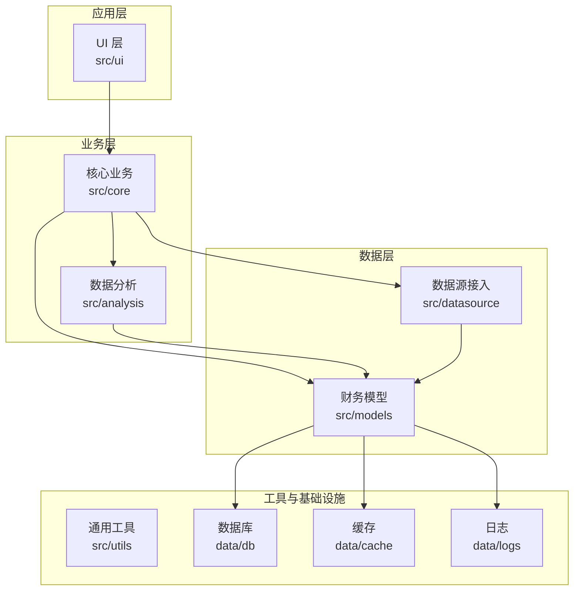
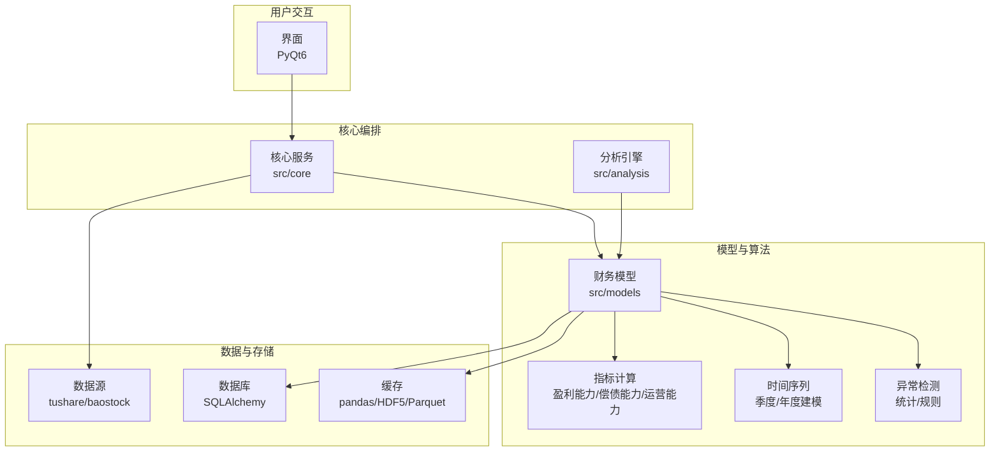
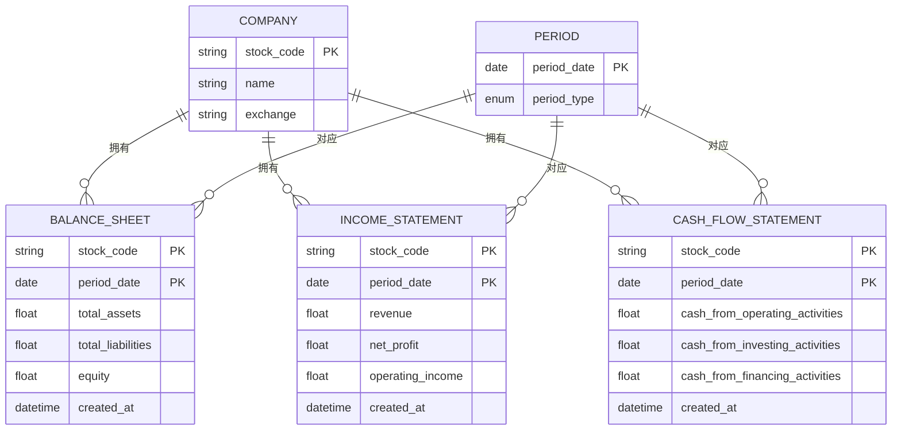
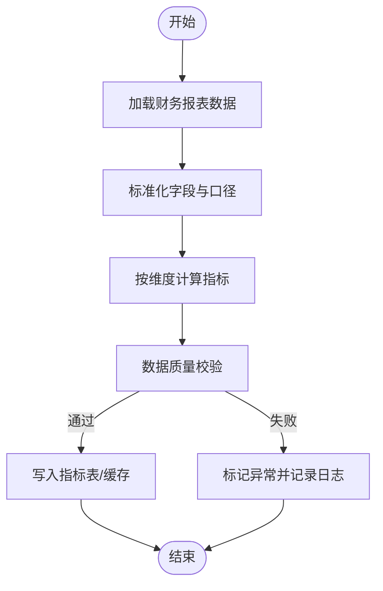
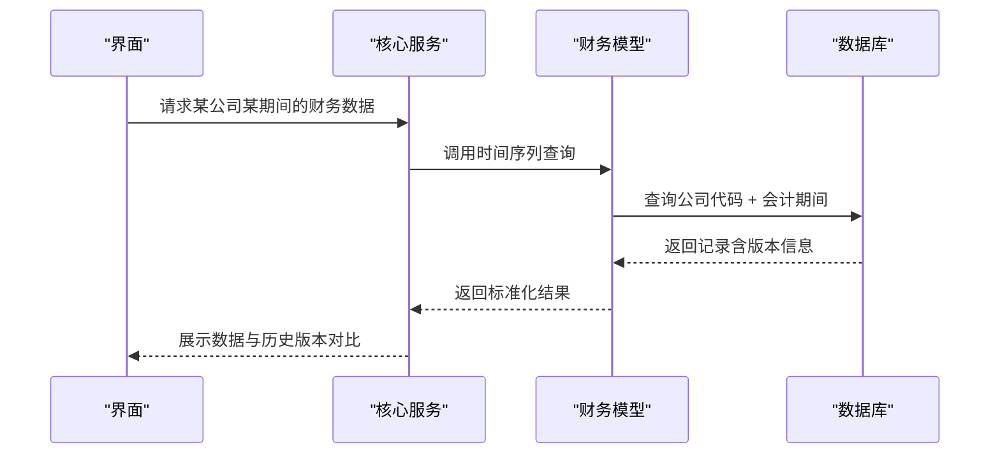
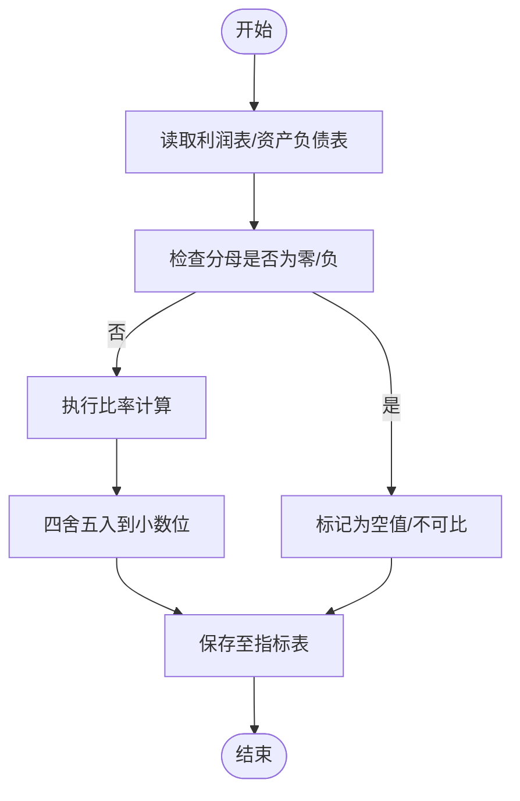
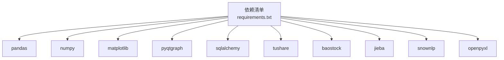

# 财务数据模型

<cite>
**本文引用的文件**
- [requirements.txt](file://requirements.txt)
</cite>

## 目录
1. [简介](#简介)
2. [项目结构](#项目结构)
3. [核心组件](#核心组件)
4. [架构总览](#架构总览)
5. [详细组件分析](#详细组件分析)
6. [依赖分析](#依赖分析)
7. [性能考虑](#性能考虑)
8. [故障排查指南](#故障排查指南)
9. [结论](#结论)
10. [附录](#附录)

## 简介
本文件旨在为“财务数据模型”提供一份系统化、可操作的技术文档。当前仓库中尚未包含财务模型的具体实现文件（如财务报表模型、指标计算、时间序列建模、异常检测等），但已具备支撑财务数据处理与可视化的基础依赖与模块化结构。本文基于现有依赖与模块布局，给出财务数据模型的分层设计建议、实体关系映射、计算流程与标准化策略，帮助后续在 src/models 目录下落地实现。

## 项目结构
从仓库结构看，项目采用典型的分层组织：UI 层（ui）、核心业务逻辑（core）、数据分析（analysis）、数据源接入（datasource）、通用工具（utils）以及模型层（models）。财务数据模型应作为独立模块在 models 下实现，并与 core/analysis/datasource 形成清晰的依赖边界。

**章节来源**
- [requirements.txt:1-31](file://requirements.txt#L1-L31)

## 核心组件
财务数据模型的核心组件建议如下（概念性设计，非现有实现）：

- 报表实体层
  - 资产负债表（Balance Sheet）
  - 利润表（Income Statement）
  - 现金流量表（Cash Flow Statement）
- 指标计算层
  - 盈利能力指标（如 ROE、ROA、毛利率、净利率）
  - 偿债能力指标（如资产负债率、流动比率、速动比率）
  - 运营能力指标（如应收账款周转率、存货周转率）
- 时间序列层
  - 季度/年度财务数据存储与版本化
  - 历史数据回溯与一致性校验
- 异常检测层
  - 基于统计与规则的异常识别
  - 数据质量与一致性校验

上述组件将在后续在 src/models 下逐步实现，并通过 sqlalchemy 与数据库交互，通过 pandas/numpy 进行数值计算，通过 PyQt6/PyQtGraph 进行可视化。

## 架构总览
财务数据模型的整体架构建议如下：UI 触发查询或分析任务；核心层协调数据源与模型；模型层负责数据标准化、指标计算与异常检测；分析层提供可视化与报告生成；数据源层负责外部数据接入与本地缓存。

## 详细组件分析

### 报表实体关系映射（资产负债表、利润表、现金流量表）
- 实体设计要点
  - 统一主键：公司代码（如股票代码）、会计期间（年/季）、数据来源标识
  - 字段命名：采用统一的英文字段名与中文注释，便于跨语言协作与文档化
  - 关系约束：同一公司同一期间仅允许一条记录；支持历史版本与修订标记
- 关系图（概念性）

### 财务指标计算模型（盈利能力、偿债能力、运营能力）
- 盈利能力
  - ROE（净资产收益率）= 净利润 / 平均净资产
  - ROA（总资产报酬率）= 净利润 / 平均总资产
  - 毛利率 =（营业收入 - 营业成本）/ 营业收入
  - 净利率 = 净利润 / 营业收入
- 偿债能力
  - 资产负债率 = 总负债 / 总资产
  - 流动比率 = 流动资产 / 流动负债
  - 速动比率 =（流动资产 - 存货）/ 流动负债
- 运营能力
  - 应收账款周转率 = 营业收入 / 平均应收账款
  - 存货周转率 = 营业成本 / 平均存货
- 计算流程（概念性）

### 时间序列建模（季度/年度）
- 存储策略
  - 以“公司代码 + 会计期间”为主键，支持季度与年度两种周期
  - 历史版本：新增字段记录修订版本号与生效日期，保证历史可追溯
  - 分区策略：按年/季分区，提升查询与归档效率
- 版本控制与一致性
  - 同一期间同一公司仅允许一条有效记录
  - 修订时保留旧版本，新版本生效后旧版本标记失效

### 财务比率计算模型（ROE、ROA、负债率等）
- 计算公式与存储
  - ROE = 净利润 / 平均净资产（按季度/年度分别计算）
  - ROA = 净利润 / 平均总资产
  - 资产负债率 = 总负债 / 总资产
  - 存储：指标值 + 计算期间 + 计算来源 + 备注（异常标记）
- 异常处理
  - 分母为零或负数时返回空值或特殊标记
  - 跨期比较时缺失期间补零或标注“不可比”

### 财务数据标准化处理机制
- 统一字段命名与口径
  - 采用一致的英文字段名与中文注释，避免多义词
  - 对不同来源（Tushare/Baostock）进行字段映射与对齐
- 类型与精度
  - 数值字段统一为浮点型，保留合理小数位
  - 日期字段统一为日期类型，会计期间规范化为季度末或年末
- 缺失与异常
  - 缺失值填充策略：前向/后向填充或零值标记
  - 异常值检测：基于3σ或IQR方法识别离群点

### 财务异常检测模型
- 统计方法
  - 单变量异常：3σ、Z-Score、IQR
  - 多变量异常：孤立森林、One-Class SVM
- 规则方法
  - 会计恒等式校验：资产 = 负债 + 所有者权益
  - 比率合理性范围：如资产负债率超过行业上限一定阈值
- 结果输出
  - 标记异常记录并生成审计日志
  - 提供可视化图表辅助人工复核

## 依赖分析
项目当前依赖主要集中在数据处理、可视化与数据库访问方面，为财务模型提供基础能力。

**章节来源**
- [requirements.txt:1-31](file://requirements.txt#L1-L31)

## 性能考虑
- 数据加载
  - 使用分块读取与延迟计算，避免一次性加载全量数据
  - 对大表进行分区与索引优化（按公司代码、期间、来源）
- 计算优化
  - 向量化计算优先（pandas/numpy）
  - 指标计算采用批处理与缓存中间结果
- 可视化
  - 图表渲染采用增量更新与懒加载
- 存储
  - 使用列式存储（Parquet/HDF5）提升压缩与查询效率
  - 定期清理过期版本与冗余缓存

## 故障排查指南
- 常见问题
  - 数据缺失：检查数据源连接与字段映射，确认缺失值填充策略
  - 计算异常：验证分母是否为零或负数，检查口径一致性
  - 可视化异常：确认数据类型与绘图参数设置
- 日志与审计
  - 记录异常条目与处理结果，便于回溯与复盘
  - 对关键指标计算过程进行审计留痕

## 结论
当前仓库尚未包含财务模型的具体实现，但已具备良好的模块化结构与关键依赖。建议尽快在 src/models 下完成财务报表实体、指标计算、时间序列与异常检测的实现，并结合现有依赖形成完整的财务数据处理链路。后续可根据业务需求扩展更多分析维度与可视化能力。

## 附录
- 术语表
  - ROE：净资产收益率
  - ROA：总资产报酬率
  - 资产负债率：总负债 / 总资产
  - 季度/年度：会计期间的两种粒度
- 参考资料
  - 财务报表三张表的会计恒等式与勾稽关系
  - 行业基准与合理区间参考