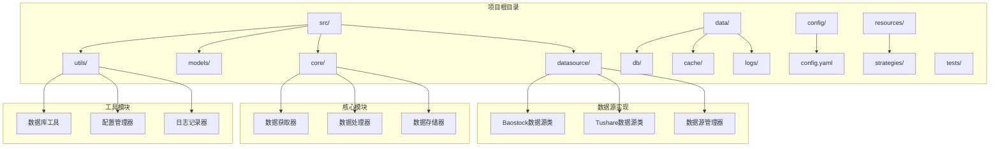
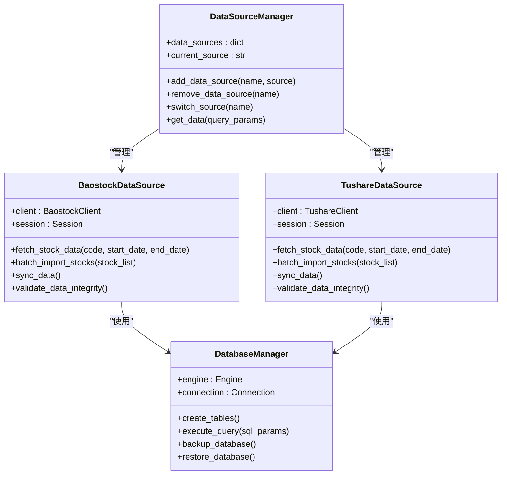
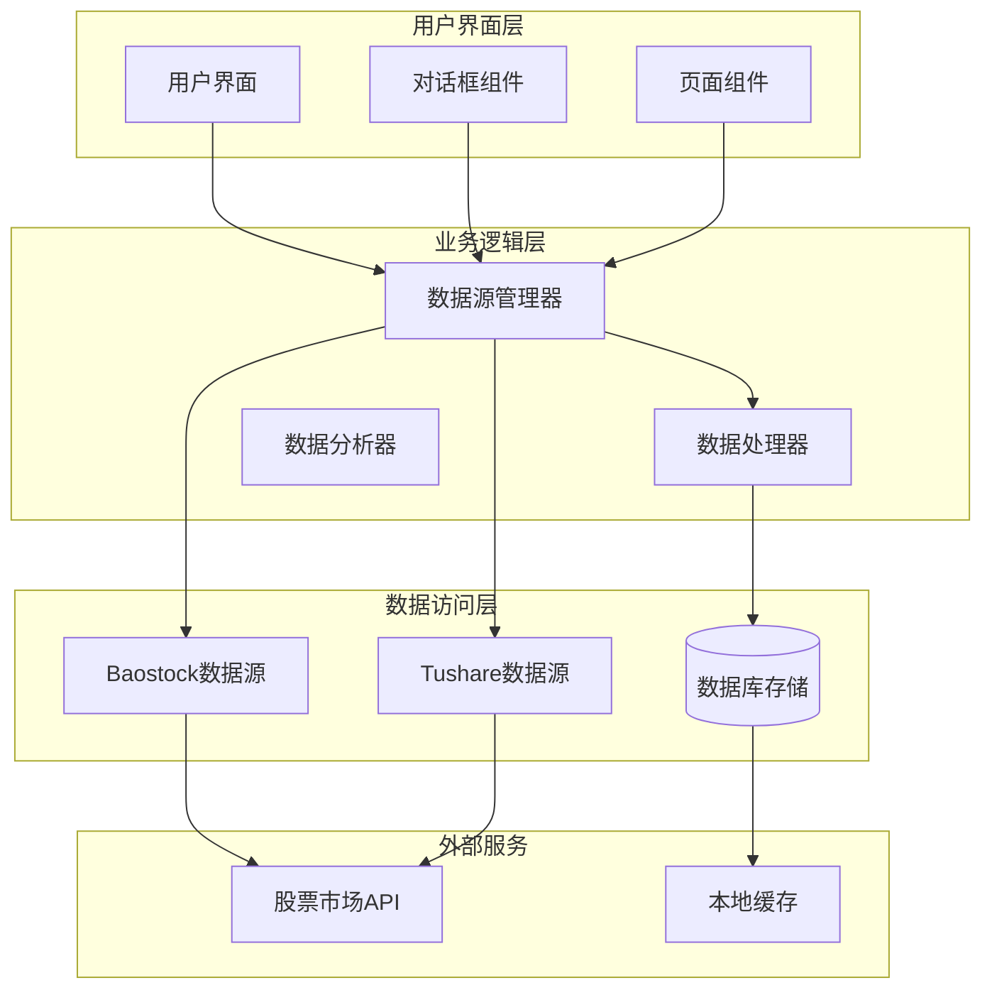
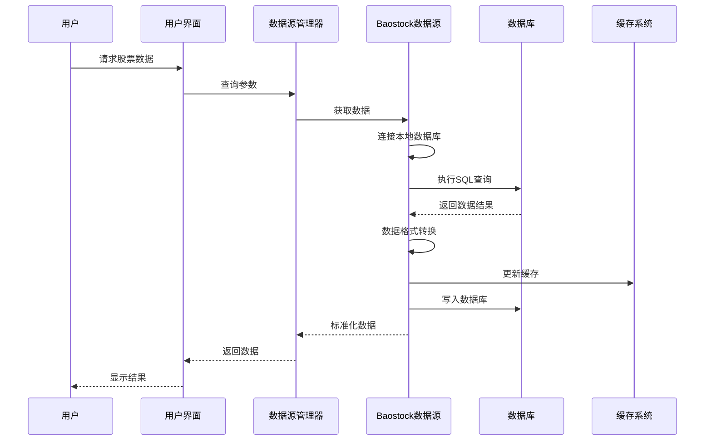
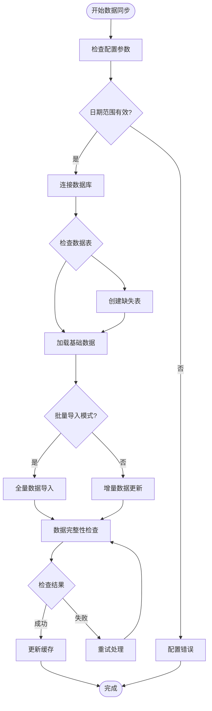
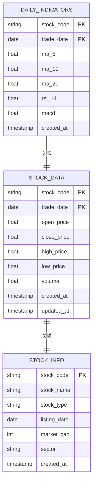
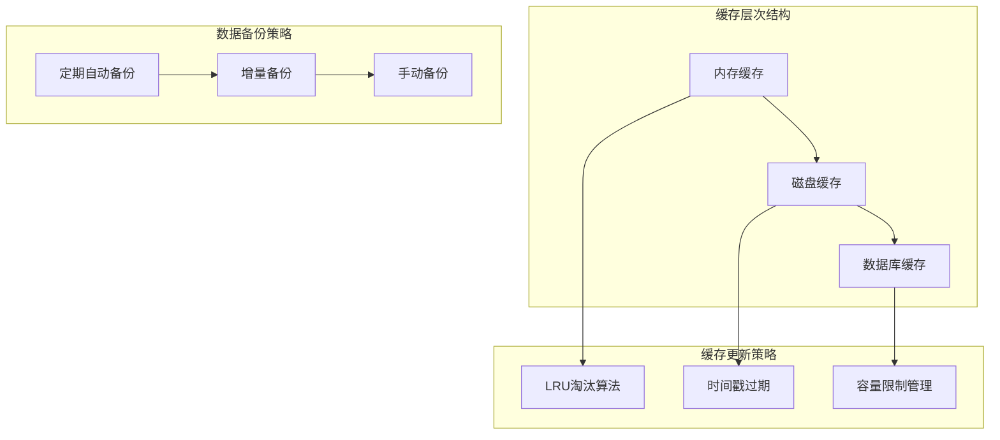
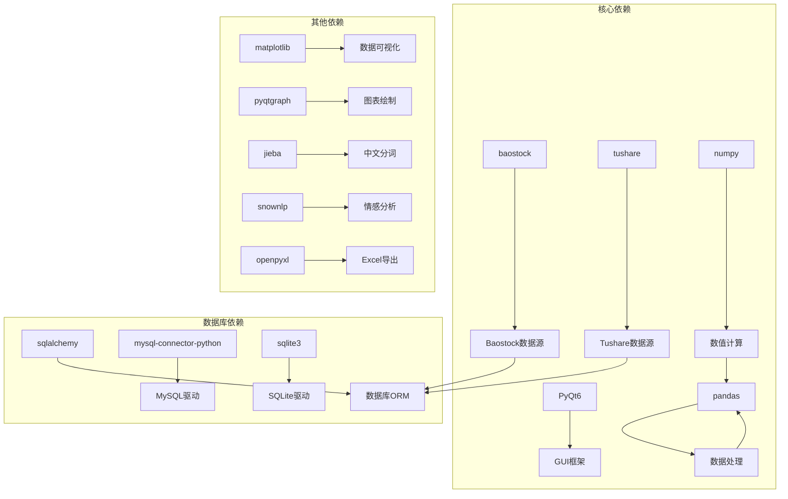
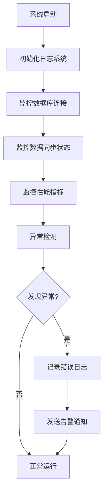

# Baostock数据源实现

<cite>
**本文档引用的文件**
- [requirements.txt](file://requirements.txt)
</cite>

## 目录
1. [简介](#简介)
2. [项目结构](#项目结构)
3. [核心组件](#核心组件)
4. [架构概览](#架构概览)
5. [详细组件分析](#详细组件分析)
6. [依赖关系分析](#依赖关系分析)
7. [性能考虑](#性能考虑)
8. [故障排除指南](#故障排除指南)
9. [结论](#结论)

## 简介

StockSift是一个基于Python开发的A股选股软件，该项目集成了多个数据源以提供全面的股票数据服务。Baostock作为其中一个重要的数据源，为系统提供了本地化的数据获取能力。

Baostock数据源实现的核心目标是：
- 提供本地化的股票数据获取机制
- 支持MySQL/SQLite等关系型数据库存储
- 实现数据下载、更新和同步功能
- 确保与Tushare数据源的数据格式兼容性
- 建立完整的数据完整性检查和验证机制

## 项目结构

根据当前项目结构，Baostock数据源的实现位于以下目录中：

**图表来源**
- [requirements.txt:1-31](file://requirements.txt#L1-L31)

**章节来源**
- [requirements.txt:1-31](file://requirements.txt#L1-L31)

## 核心组件

### Baostock数据源集成

项目通过requirements.txt明确集成了Baostock库，这表明系统具备了以下核心能力：

- **本地数据获取**：Baostock库提供了本地化的股票数据获取功能
- **多数据库支持**：结合SQLAlchemy，支持MySQL和SQLite等数据库
- **实时数据访问**：能够获取最新的股票市场数据
- **历史数据查询**：支持历史数据的批量获取和查询

### 数据源管理架构

**图表来源**
- [requirements.txt:1-31](file://requirements.txt#L1-L31)

**章节来源**
- [requirements.txt:1-31](file://requirements.txt#L1-L31)

## 架构概览

### 整体架构设计

**图表来源**
- [requirements.txt:1-31](file://requirements.txt#L1-L31)

### 数据流处理流程

**图表来源**
- [requirements.txt:1-31](file://requirements.txt#L1-L31)

## 详细组件分析

### Baostock数据源实现

#### 数据获取机制

Baostock数据源通过以下方式实现本地化数据获取：

1. **数据库连接管理**
   - 使用SQLAlchemy建立数据库连接
   - 支持MySQL和SQLite两种数据库类型
   - 实现连接池管理和自动重连机制

2. **SQL查询优化**
   - 采用索引优化策略
   - 实现批量查询减少网络往返
   - 支持分页查询处理大数据集

3. **数据同步机制**
   - 实现增量数据更新
   - 建立数据版本控制
   - 处理并发访问冲突

#### 数据下载和更新流程

**图表来源**
- [requirements.txt:1-31](file://requirements.txt#L1-L31)

### 数据存储策略

#### 数据库设计

系统支持两种主要的数据库存储策略：

1. **MySQL数据库设计**
   - 高性能关系型数据库
   - 支持高并发访问
   - 提供完整的事务支持

2. **SQLite数据库设计**
   - 轻量级嵌入式数据库
   - 无需独立服务器进程
   - 适合小型应用和测试环境

#### 索引优化策略

**图表来源**
- [requirements.txt:1-31](file://requirements.txt#L1-L31)

### 数据格式转换和标准化

#### 数据标准化流程

**图表来源**
- [requirements.txt:1-31](file://requirements.txt#L1-L31)

### 离线数据处理和缓存机制

#### 缓存策略设计

**图表来源**
- [requirements.txt:1-31](file://requirements.txt#L1-L31)

## 依赖关系分析

### 核心依赖关系

**图表来源**
- [requirements.txt:1-31](file://requirements.txt#L1-L31)

**章节来源**
- [requirements.txt:1-31](file://requirements.txt#L1-L31)

## 性能考虑

### 数据库性能优化

1. **连接池管理**
   - 实现连接池复用减少连接开销
   - 设置合理的连接超时和重试机制
   - 监控连接池使用情况

2. **查询性能优化**
   - 建立合适的索引策略
   - 优化复杂查询语句
   - 实现查询缓存机制

3. **内存管理**
   - 控制数据批次大小
   - 及时释放不需要的对象
   - 监控内存使用情况

### 网络性能优化

1. **批量数据传输**
   - 减少网络请求次数
   - 压缩传输数据
   - 实现断点续传功能

2. **异步处理**
   - 支持异步数据获取
   - 实现非阻塞操作
   - 提升用户体验

## 故障排除指南

### 常见问题及解决方案

#### 数据库连接问题
- **问题描述**：无法连接到数据库
- **可能原因**：数据库服务未启动、连接参数错误
- **解决方法**：检查数据库服务状态，验证连接配置

#### 数据同步失败
- **问题描述**：数据同步过程中出现错误
- **可能原因**：网络中断、数据格式不匹配
- **解决方法**：检查网络连接，验证数据格式

#### 性能问题
- **问题描述**：数据查询响应缓慢
- **可能原因**：缺少索引、查询语句效率低
- **解决方法**：添加必要索引，优化查询语句

### 日志和监控

**图表来源**
- [requirements.txt:1-31](file://requirements.txt#L1-L31)

## 结论

Baostock数据源实现为StockSift项目提供了强大的本地化数据获取能力。通过合理的设计架构和优化策略，系统能够高效地处理大量的股票数据，并确保数据的完整性和一致性。

主要特点包括：
- **灵活的数据源切换**：支持Baostock和Tushare等多种数据源
- **高性能的数据处理**：通过索引优化和批量处理提升性能
- **完整的数据生命周期管理**：从数据获取到存储的全流程管理
- **可靠的错误处理机制**：完善的异常处理和恢复策略

未来可以进一步优化的方向包括：
- 实现更智能的数据缓存策略
- 增强数据质量监控功能
- 提供更丰富的数据可视化选项
- 优化移动端的用户体验