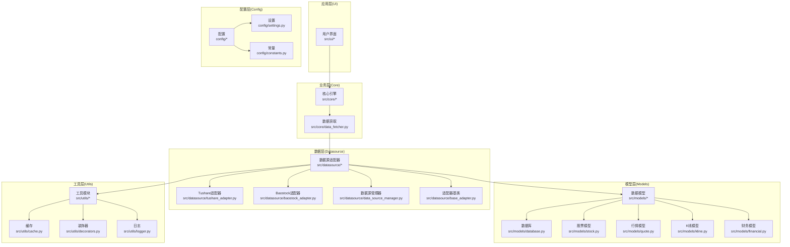
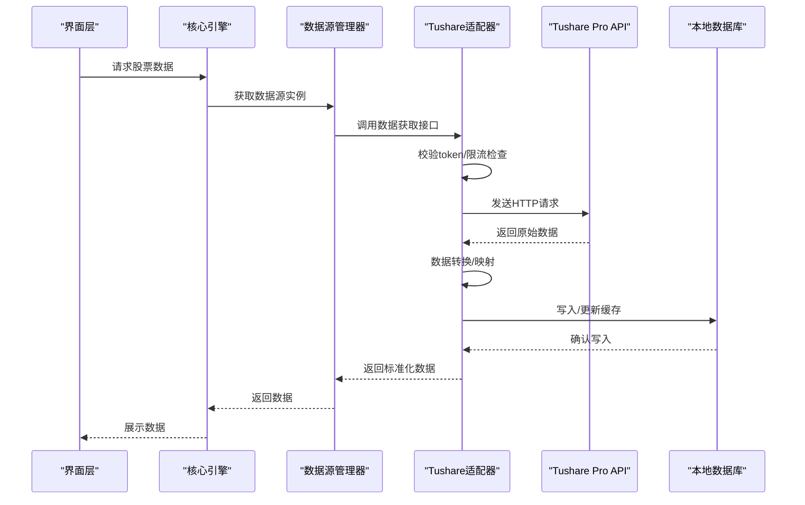
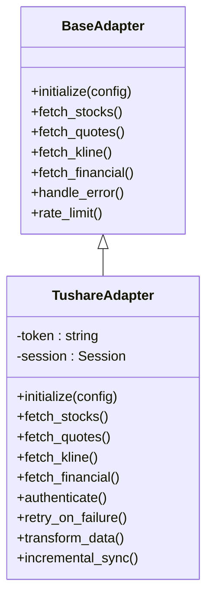
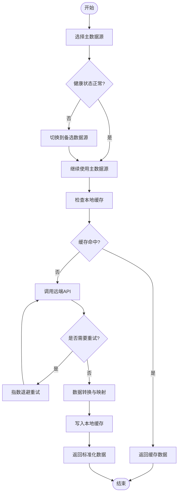
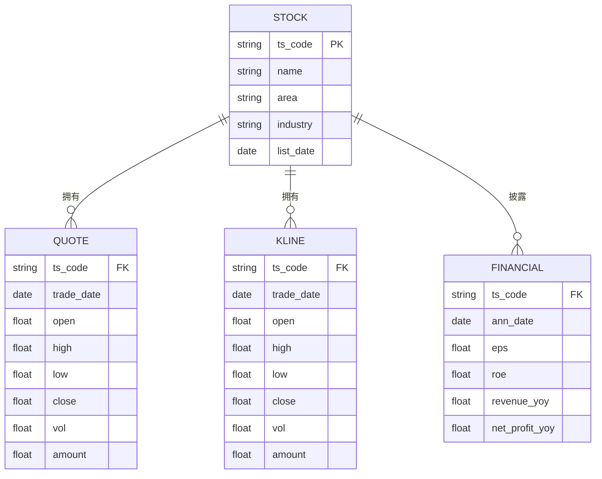
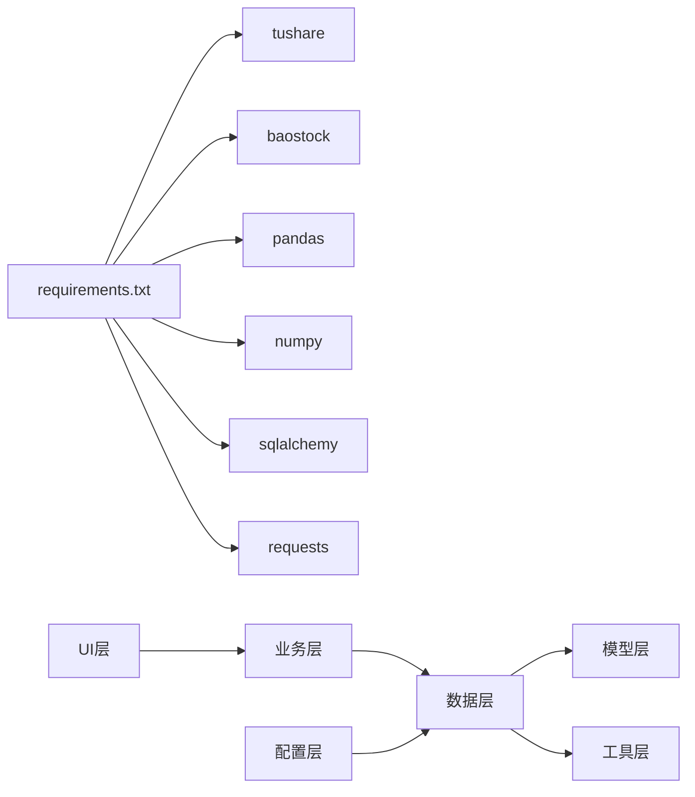

# Tushare数据源实现

<cite>
**本文引用的文件**
- [MODULE_DESIGN.md](file://docs/MODULE_DESIGN.md)
- [PRD.md](file://docs/PRD.md)
- [requirements.txt](file://requirements.txt)
- [data_fetcher.py](file://src/core/data_fetcher.py)
- [base_adapter.py](file://src/datasource/base_adapter.py)
- [tushare_adapter.py](file://src/datasource/tushare_adapter.py)
- [baostock_adapter.py](file://src/datasource/baostock_adapter.py)
- [data_source_manager.py](file://src/datasource/data_source_manager.py)
- [database.py](file://src/models/database.py)
- [stock.py](file://src/models/stock.py)
- [quote.py](file://src/models/quote.py)
- [kline.py](file://src/models/kline.py)
- [financial.py](file://src/models/financial.py)
- [cache.py](file://src/utils/cache.py)
- [decorators.py](file://src/utils/decorators.py)
- [logger.py](file://src/utils/logger.py)
- [settings.py](file://config/settings.py)
- [constants.py](file://config/constants.py)
- [stocksift.log](file://data/logs/stocksift.log)
</cite>

## 目录
1. [简介](#简介)
2. [项目结构](#项目结构)
3. [核心组件](#核心组件)
4. [架构总览](#架构总览)
5. [详细组件分析](#详细组件分析)
6. [依赖关系分析](#依赖关系分析)
7. [性能考虑](#性能考虑)
8. [故障排查指南](#故障排查指南)
9. [结论](#结论)
10. [附录](#附录)

## 简介
本文件面向StockSift项目中的Tushare数据源实现，系统化阐述其架构设计、组件职责、数据获取流程、缓存与存储策略、以及配置与使用方法。文档基于现有设计文档与模块结构进行归纳总结，并结合实际代码文件路径进行溯源标注，帮助开发者与使用者快速理解与正确使用Tushare数据源。

## 项目结构
StockSift采用分层架构，数据层位于核心业务之下，通过数据源适配器对接外部数据源（如Tushare、Baostock），并通过本地数据库与缓存实现数据持久化与加速访问。Tushare相关实现集中在数据层的datasource子目录，核心数据获取逻辑位于core层的data_fetcher模块。

**图表来源**
- [MODULE_DESIGN.md](file://docs/MODULE_DESIGN.md)
- [PRD.md](file://docs/PRD.md)

**章节来源**
- [MODULE_DESIGN.md](file://docs/MODULE_DESIGN.md)
- [PRD.md](file://docs/PRD.md)

## 核心组件
- 数据源适配器基类：定义统一的数据源接口规范，确保不同数据源（Tushare、Baostock）具备一致的调用方式与返回结构。
- Tushare适配器：具体实现Tushare Pro API的封装，负责token认证、请求限流、错误重试、数据转换与映射。
- Baostock适配器：作为另一个数据源的实现，用于多数据源协调与故障切换。
- 数据源管理器：协调多个数据源，按优先级与可用性进行调度，实现故障切换与降级策略。
- 数据模型与数据库：定义股票、行情、K线、财务等数据模型，并通过数据库模块进行连接与会话管理。
- 缓存与装饰器：提供内存缓存与重试、计时等通用装饰器，提升性能与可靠性。
- 配置与日志：设置模块管理应用配置，日志模块负责记录运行过程与调试信息。

**章节来源**
- [MODULE_DESIGN.md](file://docs/MODULE_DESIGN.md)
- [PRD.md](file://docs/PRD.md)

## 架构总览
Tushare数据源实现遵循“适配器模式 + 多数据源协调 + 本地缓存”的架构思路。UI层通过业务层调用统一的数据获取接口，业务层再委派给数据源管理器，最终由具体的适配器对接Tushare API。数据模型与数据库负责持久化，缓存与装饰器提供性能与稳定性保障。

**图表来源**
- [data_fetcher.py](file://src/core/data_fetcher.py)
- [data_source_manager.py](file://src/datasource/data_source_manager.py)
- [tushare_adapter.py](file://src/datasource/tushare_adapter.py)
- [database.py](file://src/models/database.py)

## 详细组件分析

### 数据源适配器基类（base_adapter.py）
- 职责：定义统一的接口契约，包括初始化、数据获取、错误处理、限流控制等抽象方法，确保各数据源实现的一致性。
- 设计要点：通过继承该基类，子类只需关注具体API的差异部分，降低耦合度，便于扩展新的数据源。

**章节来源**
- [base_adapter.py](file://src/datasource/base_adapter.py)
- [MODULE_DESIGN.md](file://docs/MODULE_DESIGN.md)

### Tushare适配器（tushare_adapter.py）
- 职责：封装Tushare Pro API，实现token认证、请求限流、错误重试、数据转换与映射。
- 认证机制：从配置模块读取API Key，建立全局或会话级认证上下文；在请求头中携带认证信息。
- 限流策略：根据Tushare配额限制，实现请求节流与队列等待；在高频请求场景下，采用退避算法与批量请求合并。
- 错误重试：对网络异常、超时、临时性错误进行指数退避重试；对不可恢复错误进行快速失败与告警。
- 数据转换：将Tushare返回的原始字段映射到内部数据模型，保证数据一致性与完整性。
- 增量同步：基于时间戳或版本号判断数据变更，仅同步新增或更新部分，减少重复传输。

**图表来源**
- [base_adapter.py](file://src/datasource/base_adapter.py)
- [tushare_adapter.py](file://src/datasource/tushare_adapter.py)

**章节来源**
- [tushare_adapter.py](file://src/datasource/tushare_adapter.py)
- [MODULE_DESIGN.md](file://docs/MODULE_DESIGN.md)

### Baostock适配器（baostock_adapter.py）
- 职责：作为备选数据源，提供与Tushare类似的接口实现，用于多数据源协调与故障切换。
- 设计要点：保持与基类一致的接口契约，便于在管理器中无缝替换与切换。

**章节来源**
- [baostock_adapter.py](file://src/datasource/baostock_adapter.py)
- [MODULE_DESIGN.md](file://docs/MODULE_DESIGN.md)

### 数据源管理器（data_source_manager.py）
- 职责：协调多个数据源，按优先级与可用性进行调度；在主数据源异常时自动切换至备选数据源；实现降级策略与熔断保护。
- 故障切换：监控各数据源的健康状态与响应时间，动态调整权重与优先级；对连续失败的数据源进行隔离。
- 降级策略：在高负载或网络不稳定时，优先使用本地缓存数据，保证界面响应与用户体验。

**图表来源**
- [data_source_manager.py](file://src/datasource/data_source_manager.py)
- [cache.py](file://src/utils/cache.py)
- [decorators.py](file://src/utils/decorators.py)

**章节来源**
- [data_source_manager.py](file://src/datasource/data_source_manager.py)
- [MODULE_DESIGN.md](file://docs/MODULE_DESIGN.md)

### 数据模型与数据库（database.py, stock.py, quote.py, kline.py, financial.py）
- 数据模型：定义股票、行情、K线、财务等实体模型，明确字段类型、约束与关系。
- 数据库：通过ORM管理数据库连接与会话，提供事务支持与并发安全；实现数据迁移与版本管理。
- 版本管理：为数据表增加版本字段或独立版本表，记录数据结构变更与迁移历史，确保升级兼容性。

**图表来源**
- [database.py](file://src/models/database.py)
- [stock.py](file://src/models/stock.py)
- [quote.py](file://src/models/quote.py)
- [kline.py](file://src/models/kline.py)
- [financial.py](file://src/models/financial.py)

**章节来源**
- [database.py](file://src/models/database.py)
- [stock.py](file://src/models/stock.py)
- [quote.py](file://src/models/quote.py)
- [kline.py](file://src/models/kline.py)
- [financial.py](file://src/models/financial.py)
- [MODULE_DESIGN.md](file://docs/MODULE_DESIGN.md)

### 缓存与装饰器（cache.py, decorators.py）
- 缓存策略：内存缓存用于短期高频访问，结合LRU或TTL策略；本地缓存用于跨进程与持久化需求。
- 装饰器：提供重试、计时、缓存装饰器，统一处理异常与性能监控；在适配器与管理器中广泛复用。

**章节来源**
- [cache.py](file://src/utils/cache.py)
- [decorators.py](file://src/utils/decorators.py)
- [MODULE_DESIGN.md](file://docs/MODULE_DESIGN.md)

### 配置与日志（settings.py, constants.py, stocksift.log）
- 配置管理：集中管理API Key、数据源优先级、缓存策略、日志级别等；支持用户自定义与环境变量覆盖。
- 日志记录：记录数据源注册、请求耗时、错误堆栈与重试次数，便于问题定位与性能分析。

**章节来源**
- [settings.py](file://config/settings.py)
- [constants.py](file://config/constants.py)
- [stocksift.log](file://data/logs/stocksift.log)
- [MODULE_DESIGN.md](file://docs/MODULE_DESIGN.md)

## 依赖关系分析
- 外部依赖：项目明确引入tushare与baostock作为数据源，pandas/numpy用于数据处理，SQLAlchemy用于数据库访问，requests用于网络请求。
- 内部依赖：UI层依赖业务层；业务层依赖数据层；数据层依赖模型层与工具层；配置层为全局提供参数与常量。

**图表来源**
- [requirements.txt](file://requirements.txt)
- [MODULE_DESIGN.md](file://docs/MODULE_DESIGN.md)

**章节来源**
- [requirements.txt](file://requirements.txt)
- [MODULE_DESIGN.md](file://docs/MODULE_DESIGN.md)

## 性能考虑
- 并发处理：在适配器与管理器中采用线程池或异步任务，避免阻塞UI线程；对Tushare API请求进行批量化与去重。
- 缓存优化：合理设置缓存失效时间与容量上限；对热点数据（如股票列表、实时行情）采用多级缓存。
- 网络优化：启用连接复用与超时控制；对慢查询进行日志记录与报警；在网络波动时自动降级。
- 数据压缩：对历史K线与财务数据进行压缩存储，减少IO开销；在传输层启用GZIP压缩。
- 监控与告警：通过装饰器与日志模块记录关键指标（成功率、延迟、重试次数），及时发现问题并优化。

[本节为通用性能建议，无需特定文件引用]

## 故障排查指南
- 认证失败：检查API Key是否正确配置，确认网络可达性与域名解析；查看日志中认证相关错误。
- 请求超时：增大超时阈值或启用重试；检查Tushare配额是否耗尽；必要时切换到备选数据源。
- 数据不一致：核对数据转换映射规则；检查数据库事务与并发写入；确认缓存失效策略。
- 性能瓶颈：分析日志中的慢查询与重试次数；优化批处理大小与并发度；清理无效缓存。
- 日志定位：通过日志文件与级别过滤，定位具体错误位置与上下文信息。

**章节来源**
- [logger.py](file://src/utils/logger.py)
- [stocksift.log](file://data/logs/stocksift.log)
- [decorators.py](file://src/utils/decorators.py)

## 结论
Tushare数据源实现通过适配器模式与多数据源协调机制，实现了高可靠、高性能的数据获取能力。结合本地缓存与数据库持久化，满足了实时性与稳定性双重需求。建议在生产环境中进一步完善配额监控、异常告警与自动化运维能力，持续优化并发与缓存策略，以应对更大规模的数据访问与更复杂的业务场景。

[本节为总结性内容，无需特定文件引用]

## 附录

### 初始化与配置步骤
- 安装依赖：确保已安装tushare、baostock、pandas、numpy、sqlalchemy、requests等依赖。
- 配置API Key：在配置模块中设置Tushare API Key与数据源优先级。
- 初始化数据库：启动应用时自动创建数据表与索引，确保数据库连接正常。
- 启动数据源：通过数据源管理器注册并启用Tushare适配器，观察日志确认初始化成功。

**章节来源**
- [requirements.txt](file://requirements.txt)
- [settings.py](file://config/settings.py)
- [database.py](file://src/models/database.py)
- [stocksift.log](file://data/logs/stocksift.log)

### 使用示例（路径指引）
- 初始化数据源管理器：参考数据源管理器的初始化与注册流程。
- 获取股票列表：调用数据获取接口，内部将通过适配器与管理器完成数据拉取与缓存更新。
- 实时行情更新：配置定时任务或事件驱动机制，周期性调用适配器获取最新行情。
- 增量同步：基于时间戳或版本号判断数据变更，仅同步新增或更新部分。

**章节来源**
- [data_source_manager.py](file://src/datasource/data_source_manager.py)
- [tushare_adapter.py](file://src/datasource/tushare_adapter.py)
- [data_fetcher.py](file://src/core/data_fetcher.py)