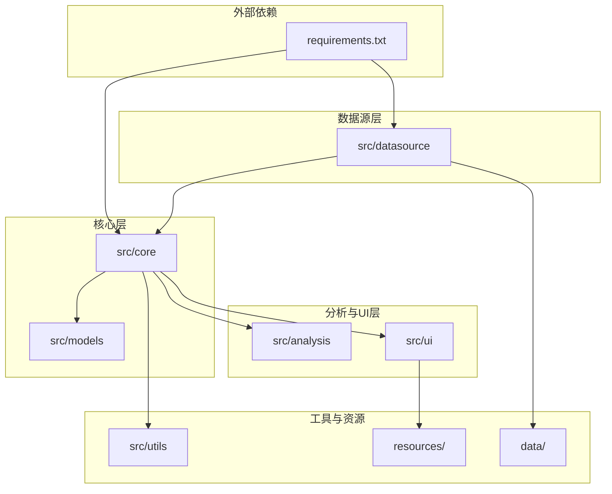
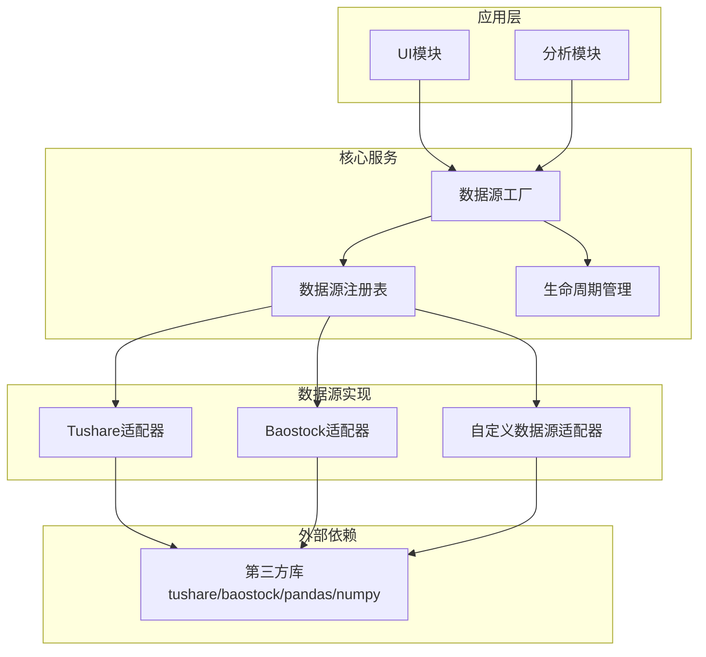
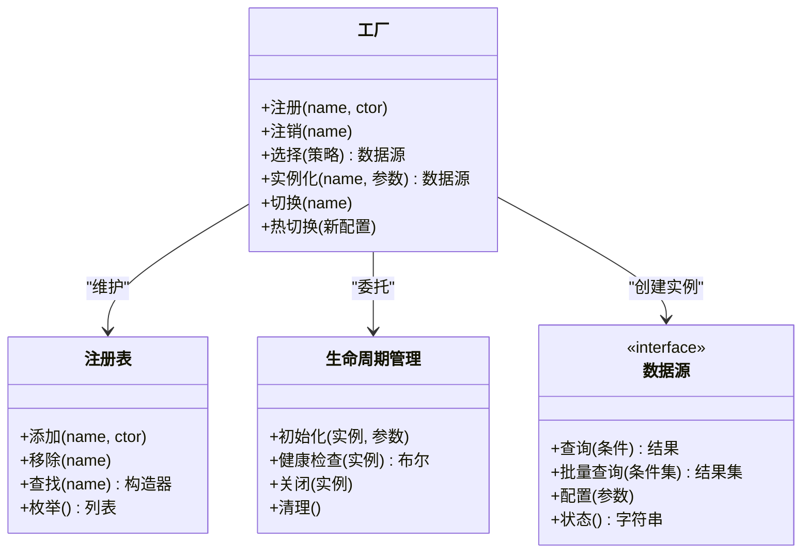
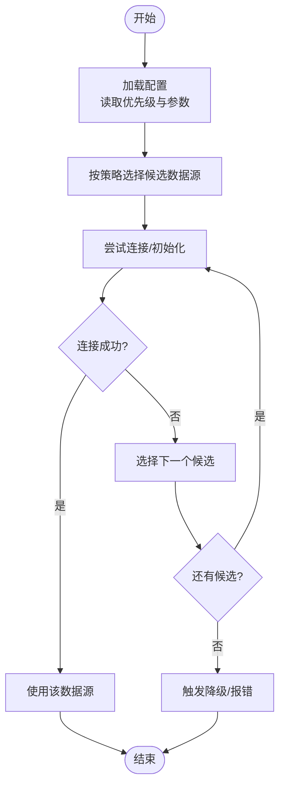
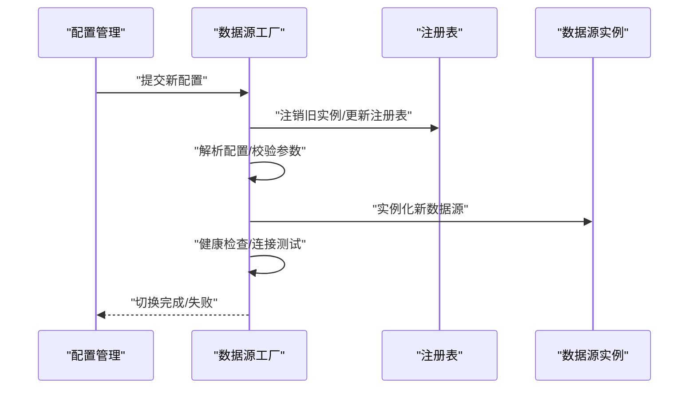
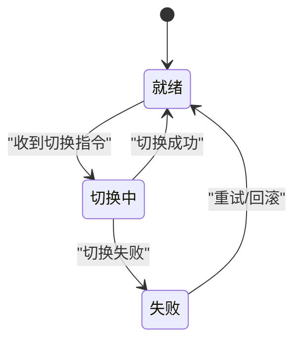
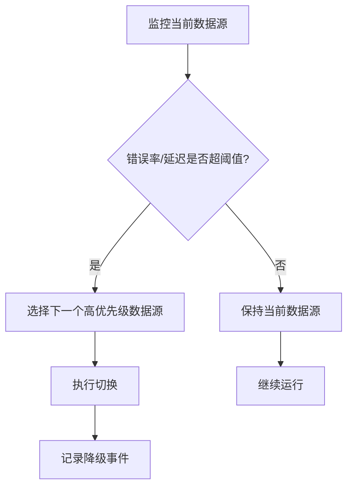
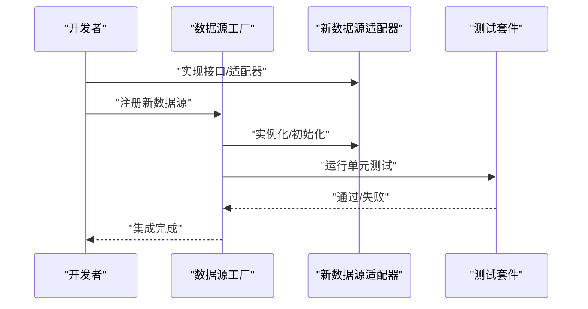
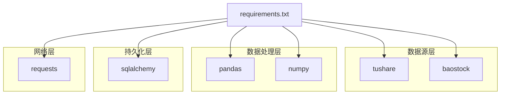

# 数据源工厂模式

<cite>
**本文档引用的文件**
- [requirements.txt](file://requirements.txt)
- [src/datasource](file://src/datasource)
- [src/models](file://src/models)
- [src/core](file://src/core)
</cite>

## 目录
1. [引言](#引言)
2. [项目结构](#项目结构)
3. [核心组件](#核心组件)
4. [架构概览](#架构概览)
5. [详细组件分析](#详细组件分析)
6. [依赖关系分析](#依赖关系分析)
7. [性能考虑](#性能考虑)
8. [故障排查指南](#故障排查指南)
9. [结论](#结论)
10. [附录](#附录)

## 引言
本文件围绕“数据源工厂模式”在项目中的设计与实现进行系统化技术文档化，重点阐述以下方面：
- 工厂模式在数据源管理中的应用：数据源选择策略、动态加载机制、配置管理
- 工厂类的设计与实现：数据源注册、实例化与生命周期管理
- 数据源切换机制：运行时配置变更与热切换能力
- 数据源优先级与故障转移策略：自动降级与手动切换
- 使用示例与最佳实践：如何扩展新的数据源实现
- 配置文件格式与参数传递机制

由于当前仓库中未发现明确的数据源工厂实现文件（如 factory.py 或 __init__.py），本文档将以现有依赖与目录结构为基础，结合工厂模式通用设计原则，给出可落地的架构建议与实施路径。

## 项目结构
项目采用按功能域分层的目录组织方式，其中与数据源直接相关的模块位于 src/datasource，其他模块为分析、模型、核心逻辑与工具等支撑性模块。

**图表来源**
- [requirements.txt:1-32](file://requirements.txt#L1-L32)
- [src/datasource](file://src/datasource)
- [src/models](file://src/models)
- [src/core](file://src/core)

**章节来源**
- [requirements.txt:1-32](file://requirements.txt#L1-L32)
- [src/datasource](file://src/datasource)
- [src/models](file://src/models)
- [src/core](file://src/core)

## 核心组件
基于现有依赖与目录结构，可抽象出以下与数据源工厂模式相关的核心组件：

- 数据源接口与实现
  - 定义统一的数据源接口，确保不同数据源（如 tushare、baostock）具备一致的行为契约
  - 实现具体数据源适配器，封装第三方库调用细节

- 工厂类
  - 负责数据源注册、实例化与生命周期管理
  - 提供数据源选择策略（优先级、故障转移）

- 配置管理
  - 统一的数据源配置格式与参数传递机制
  - 支持运行时配置变更与热切换

- 切换与降级
  - 运行时切换当前活跃数据源
  - 故障转移与自动降级策略

- 扩展机制
  - 新增数据源实现的最小改动路径
  - 插拔式注册与注销

上述组件在当前仓库中尚未以独立文件形式出现，但可通过后续开发逐步落地。

## 架构概览
下图展示了数据源工厂模式在项目中的预期架构：工厂负责注册与选择数据源，核心模块通过工厂获取数据源实例，UI层或分析模块消费数据。

[此图为概念性架构示意，不直接映射到具体源码文件，因此不提供图表来源]

## 详细组件分析

### 工厂类设计与实现
- 注册机制
  - 提供注册方法，接收数据源名称与构造器（或类型）
  - 维护注册表，支持查询与遍历
- 选择策略
  - 基于优先级列表进行选择
  - 支持按可用性与性能指标动态调整
- 实例化
  - 依据注册表与策略生成数据源实例
  - 参数透传与默认值处理
- 生命周期管理
  - 初始化、连接建立、健康检查、关闭与清理
  - 资源回收与异常处理

[此图为概念性类图，不直接映射到具体源码文件，因此不提供图表来源]

**章节来源**
- [requirements.txt:7-11](file://requirements.txt#L7-L11)

### 数据源选择策略
- 静态优先级
  - 在配置中定义数据源优先级顺序
  - 工厂按序尝试，首个可用即选中
- 动态权重
  - 基于延迟、成功率、错误率等指标动态调整权重
  - 支持滑动窗口统计与指数加权移动平均
- 回退策略
  - 当前数据源不可用时，自动切换至下一个候选
  - 可配置最大回退次数与冷却时间

[此图为概念性流程图，不直接映射到具体源码文件，因此不提供图表来源]

**章节来源**
- [requirements.txt:7-11](file://requirements.txt#L7-L11)

### 动态加载机制与配置管理
- 配置文件格式
  - JSON/YAML/INI：包含数据源列表、参数键值对、优先级、超时与重试策略
  - 示例字段：name、type、endpoint、token、timeout、retry、fallback
- 参数传递机制
  - 工厂接收配置对象，逐项解析并传递给对应数据源构造器
  - 支持环境变量与默认值合并
- 运行时配置变更
  - 监听配置文件变化或接收配置更新事件
  - 触发热切换流程，避免中断业务

[此图为概念性序列图，不直接映射到具体源码文件，因此不提供图表来源]

**章节来源**
- [requirements.txt:7-11](file://requirements.txt#L7-L11)

### 数据源切换机制与热切换
- 切换触发点
  - 定时任务：周期性健康检查与切换
  - 事件驱动：错误阈值触发、手动切换命令
- 热切换流程
  - 平滑关闭旧实例，保留会话状态
  - 初始化新实例，预热连接
  - 原子性替换引用，确保一致性
- 事务与幂等
  - 切换操作应具备幂等性，避免重复切换
  - 对外暴露只读视图，保证读写分离期间的一致性

[此图为概念性状态图，不直接映射到具体源码文件，因此不提供图表来源]

**章节来源**
- [requirements.txt:7-11](file://requirements.txt#L7-L11)

### 优先级与故障转移策略
- 优先级设定
  - 依据延迟、带宽、稳定性等指标设定静态或动态权重
- 自动降级
  - 当前数据源错误率超过阈值时，自动切换至备选
  - 记录降级原因与持续时间，用于后续优化
- 手动切换
  - 提供管理界面或命令行接口，允许管理员手动切换
  - 切换后记录日志，便于审计与追踪

[此图为概念性流程图，不直接映射到具体源码文件，因此不提供图表来源]

**章节来源**
- [requirements.txt:7-11](file://requirements.txt#L7-L11)

### 扩展新的数据源实现
- 接口契约
  - 实现统一的数据源接口，确保查询、批量查询、配置、状态等方法一致
- 适配器封装
  - 将第三方库调用封装为内部统一接口，屏蔽差异
- 注册与测试
  - 在工厂中注册新数据源，编写单元测试覆盖正常与异常场景
- 文档与参数
  - 提供配置参数说明与示例，便于集成与运维

[此图为概念性序列图，不直接映射到具体源码文件，因此不提供图表来源]

**章节来源**
- [requirements.txt:7-11](file://requirements.txt#L7-L11)

## 依赖关系分析
项目对外部库的依赖主要集中在数据源、数据处理与数据库访问等方面，这些依赖为数据源工厂模式提供了基础能力。

**图表来源**
- [requirements.txt:7-24](file://requirements.txt#L7-L24)

**章节来源**
- [requirements.txt:1-32](file://requirements.txt#L1-L32)

## 性能考虑
- 连接池与缓存
  - 为每个数据源维护连接池，减少握手开销
  - 缓存热点数据与查询结果，降低重复请求
- 超时与重试
  - 合理设置超时与重试策略，避免阻塞主线程
- 监控与告警
  - 指标采集：延迟、错误率、吞吐量
  - 告警阈值：自动降级与人工干预阈值

[本节为通用性能建议，不直接分析具体文件，因此不提供章节来源]

## 故障排查指南
- 常见问题
  - 数据源不可用：检查网络、认证信息与服务端状态
  - 查询超时：调整超时参数或切换数据源
  - 错误率上升：触发自动降级，定位慢查询与异常数据源
- 日志与追踪
  - 记录工厂切换、实例化与健康检查日志
  - 提供唯一请求ID，便于跨模块追踪
- 快速恢复
  - 热切换失败时回滚至上一个稳定版本
  - 手动切换到备用数据源，保障业务连续性

[本节为通用故障排查建议，不直接分析具体文件，因此不提供章节来源]

## 结论
数据源工厂模式为项目提供了统一、可扩展且具备弹性能力的数据访问层。通过注册表、选择策略、生命周期管理与热切换机制，可在保证稳定性的同时提升系统的可维护性与可扩展性。建议尽快在 src/datasource 下落地工厂实现，并配套完善配置管理与监控体系。

[本节为总结性内容，不直接分析具体文件，因此不提供章节来源]

## 附录
- 配置文件建议字段
  - name：数据源名称
  - type：数据源类型（tushare/baostock/custom）
  - endpoint/token：访问凭证与地址
  - timeout/retry/fallback：超时、重试与回退策略
  - priority：优先级权重
- 最佳实践
  - 严格遵循接口契约，确保兼容性
  - 为每个数据源编写单元测试与集成测试
  - 提供详尽的配置文档与参数说明
  - 建立完善的监控与告警体系

[本节为通用附录内容，不直接分析具体文件，因此不提供章节来源]