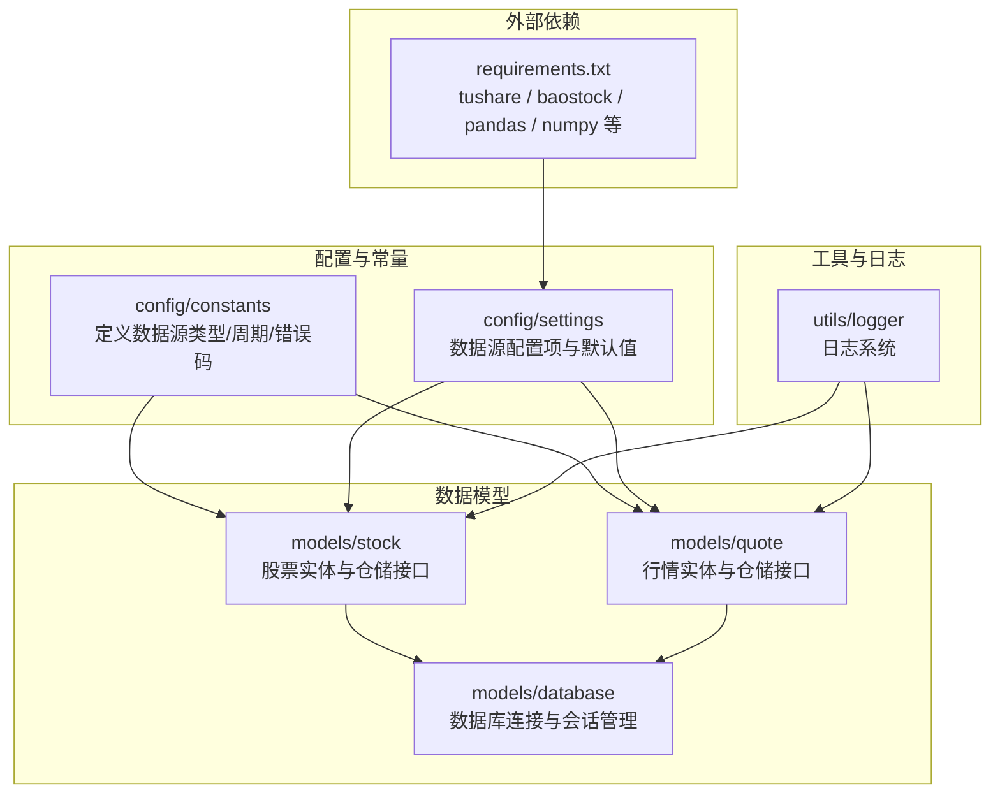
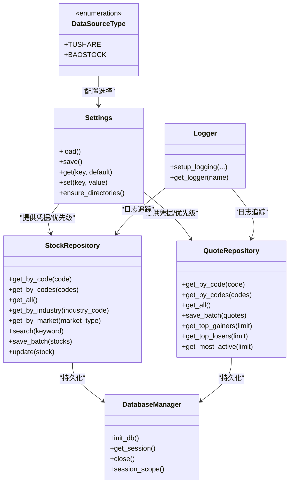
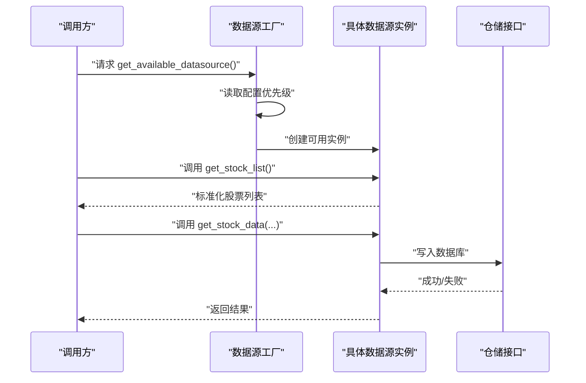
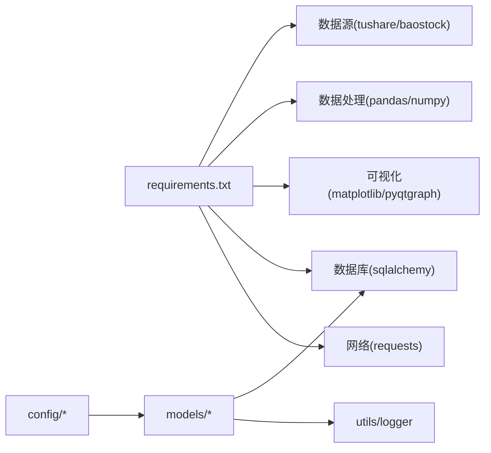

# 数据源抽象设计

<cite>
**本文引用的文件**
- [requirements.txt](file://requirements.txt)
- [config_constants.md](file://docs/modules/config_constants.md)
- [config_settings.md](file://docs/modules/config_settings.md)
- [models_stock.md](file://docs/modules/models_stock.md)
- [models_quote.md](file://docs/modules/models_quote.md)
- [models_database.md](file://docs/modules/models_database.md)
- [utils_logger.md](file://docs/modules/utils_logger.md)
</cite>

## 目录
1. [简介](#简介)
2. [项目结构](#项目结构)
3. [核心组件](#核心组件)
4. [架构总览](#架构总览)
5. [详细组件分析](#详细组件分析)
6. [依赖关系分析](#依赖关系分析)
7. [性能考量](#性能考量)
8. [故障排查指南](#故障排查指南)
9. [结论](#结论)
10. [附录](#附录)

## 简介
本文件围绕“数据源抽象接口设计”进行系统化技术文档编制，目标是：
- 解释 BaseDataSource 基类的设计理念与接口规范
- 统一数据获取方法、异常处理机制与生命周期管理
- 规范抽象方法定义与实现要求（如 get_stock_list、get_stock_data、get_index_data 等）
- 文档化数据源工厂模式的实现思路与使用方式
- 说明数据格式标准化与转换机制，确保不同数据源返回结构一致
- 提供扩展新数据源的开发指南与最佳实践

说明：当前仓库中未发现名为 BaseDataSource 的具体实现文件；但根据配置与模型文档可知，项目已内置对多个数据源（如 tushare、baostock）的支持意图与相关常量、配置项。本文将以现有资料为基础，构建可落地的抽象接口设计方案与实施建议。

## 项目结构
从仓库结构看，与数据源抽象直接相关的关键模块包括：
- 配置与常量：用于定义数据源类型、周期、错误码等
- 数据模型：定义股票与行情实体及仓储接口，体现数据标准化后的结构
- 工具与日志：提供日志能力与通用工具
- 依赖声明：明确数据源相关第三方库

**图示来源**
- [config_constants.md:1-135](file://docs/modules/config_constants.md#L1-L135)
- [config_settings.md:1-114](file://docs/modules/config_settings.md#L1-L114)
- [models_stock.md:1-109](file://docs/modules/models_stock.md#L1-L109)
- [models_quote.md:1-101](file://docs/modules/models_quote.md#L1-L101)
- [models_database.md:1-100](file://docs/modules/models_database.md#L1-L100)
- [utils_logger.md:1-79](file://docs/modules/utils_logger.md#L1-L79)
- [requirements.txt:1-32](file://requirements.txt#L1-L32)

**章节来源**
- [requirements.txt:1-32](file://requirements.txt#L1-L32)
- [config_constants.md:1-135](file://docs/modules/config_constants.md#L1-L135)
- [config_settings.md:1-114](file://docs/modules/config_settings.md#L1-L114)
- [models_stock.md:1-109](file://docs/modules/models_stock.md#L1-L109)
- [models_quote.md:1-101](file://docs/modules/models_quote.md#L1-L101)
- [models_database.md:1-100](file://docs/modules/models_database.md#L1-L100)
- [utils_logger.md:1-79](file://docs/modules/utils_logger.md#L1-L79)

## 核心组件
本节聚焦于数据源抽象接口设计所需的核心要素与现有仓库中的对应实现位置。

- 数据源类型与枚举
  - 在常量模块中定义了数据源类型枚举，用于标识不同数据源实现（如 tushare、baostock），便于工厂选择与配置管理。
  - 参考路径：[config_constants.md:84-102](file://docs/modules/config_constants.md#L84-L102)

- 数据周期与标准化
  - 周期常量与映射（如日K、周K、月K）为后续统一数据格式提供基础。
  - 参考路径：[config_constants.md:29-42](file://docs/modules/config_constants.md#L29-L42)

- 错误码体系
  - 定义网络错误、数据源错误、数据库错误等错误码，为异常处理与统一返回提供依据。
  - 参考路径：[config_constants.md:124-134](file://docs/modules/config_constants.md#L124-L134)

- 配置中心
  - 提供数据源 Token、用户凭据、优先级等配置项，支撑工厂按优先级选择可用数据源。
  - 参考路径：[config_settings.md:49-71](file://docs/modules/config_settings.md#L49-L71)

- 数据模型与仓储接口
  - 股票与行情实体定义了标准化字段，仓储接口明确了数据访问方法，为“数据格式标准化与转换”提供落点。
  - 参考路径：
    - [models_stock.md:14-74](file://docs/modules/models_stock.md#L14-L74)
    - [models_quote.md:14-71](file://docs/modules/models_quote.md#L14-L71)

- 数据库与会话管理
  - 提供数据库连接、会话生命周期与上下文管理器，保障数据持久化的一致性。
  - 参考路径：[models_database.md:26-47](file://docs/modules/models_database.md#L26-L47)

- 日志系统
  - 提供统一日志接口与异步写入能力，便于追踪数据源调用链与异常。
  - 参考路径：[utils_logger.md:37-55](file://docs/modules/utils_logger.md#L37-L55)

**章节来源**
- [config_constants.md:1-135](file://docs/modules/config_constants.md#L1-L135)
- [config_settings.md:1-114](file://docs/modules/config_settings.md#L1-L114)
- [models_stock.md:1-109](file://docs/modules/models_stock.md#L1-L109)
- [models_quote.md:1-101](file://docs/modules/models_quote.md#L1-L101)
- [models_database.md:1-100](file://docs/modules/models_database.md#L1-L100)
- [utils_logger.md:1-79](file://docs/modules/utils_logger.md#L1-L79)

## 架构总览
基于现有模块，可构建如下数据源抽象与工厂模式的总体架构：

**图示来源**
- [config_constants.md:84-102](file://docs/modules/config_constants.md#L84-L102)
- [config_settings.md:32-47](file://docs/modules/config_settings.md#L32-L47)
- [models_stock.md:60-74](file://docs/modules/models_stock.md#L60-L74)
- [models_quote.md:58-71](file://docs/modules/models_quote.md#L58-L71)
- [models_database.md:26-47](file://docs/modules/models_database.md#L26-L47)
- [utils_logger.md:37-55](file://docs/modules/utils_logger.md#L37-L55)

## 详细组件分析

### BaseDataSource 抽象接口设计
- 设计理念
  - 统一对外接口：无论底层数据源是 tushare、baostock 或未来新增的其他数据源，上层仅面向 BaseDataSource 编程
  - 生命周期管理：提供初始化、连接建立、会话/资源释放等生命周期钩子
  - 异常处理：以统一错误码与日志记录，屏蔽底层差异
  - 标准化输出：通过数据模型与仓储接口，保证返回结构一致

- 核心抽象方法（建议）
  - get_stock_list()：返回标准化的股票列表（包含代码、名称、交易所、板块等）
  - get_stock_data(code, period, start_date, end_date)：返回指定周期的K线数据
  - get_index_data(index_code, period, start_date, end_date)：返回指数或板块行情
  - get_realtime_quotes(codes)：批量获取实时行情
  - get_bars_from_date_range(code, start_date, end_date, freq)：按日期范围获取分K数据
  - health_check()：健康检查，返回可用性状态

- 实现要求
  - 参数校验：对周期、日期范围、代码集合进行合法性校验
  - 结果转换：将各数据源原始字段映射到标准化字段（参考 models_stock 与 models_quote 的字段）
  - 异常捕获：捕获网络/解析/权限等异常，转换为统一错误码并记录日志
  - 缓存策略：对高频查询（如股票列表）采用内存缓存，结合 TTL 与失效策略
  - 并发安全：在多线程/多进程环境下保证会话与连接安全

- 生命周期管理
  - 初始化：读取配置中心设置（如 Token、优先级），建立连接池
  - 请求阶段：按需获取会话/令牌，执行数据拉取
  - 归档阶段：将标准化数据写入数据库，必要时触发增量更新
  - 释放阶段：关闭会话、释放连接，清理临时资源

- 异常处理机制
  - 错误码映射：将底层异常映射到统一错误码（参考 config_constants.md 中的错误码定义）
  - 日志记录：使用日志模块记录请求参数、响应状态、耗时与异常堆栈
  - 重试策略：对网络瞬时错误进行指数退避重试
  - 回退机制：当主数据源不可用时，按优先级切换至备选数据源

**章节来源**
- [config_constants.md:124-134](file://docs/modules/config_constants.md#L124-L134)
- [config_settings.md:49-71](file://docs/modules/config_settings.md#L49-L71)
- [models_stock.md:14-74](file://docs/modules/models_stock.md#L14-L74)
- [models_quote.md:14-71](file://docs/modules/models_quote.md#L14-L71)
- [utils_logger.md:37-55](file://docs/modules/utils_logger.md#L37-L55)

### 数据源工厂模式
- 目标
  - 将“如何选择数据源”的逻辑集中到工厂，屏蔽上层对具体实现的依赖
  - 支持动态切换与优先级回退

- 工厂职责
  - 读取配置中心的优先级列表
  - 根据 DataSourceType 枚举创建具体数据源实例
  - 提供 get_available_datasource() 方法，返回可用实例
  - 提供 create_datasource(type) 方法，按类型创建实例

- 使用流程（序列图）

**图示来源**
- [config_constants.md:84-102](file://docs/modules/config_constants.md#L84-L102)
- [config_settings.md:49-71](file://docs/modules/config_settings.md#L49-L71)
- [models_stock.md:60-74](file://docs/modules/models_stock.md#L60-L74)
- [models_quote.md:58-71](file://docs/modules/models_quote.md#L58-L71)

### 数据格式标准化与转换
- 标准化字段
  - 股票：代码、名称、交易所、板块、行业、概念、上市信息等
  - 行情：时间戳、开盘/最高/最低/收盘、成交量/成交额、涨跌额/涨跌幅、市盈率/市净率/总/流通市值、换手率等
- 转换策略
  - 字段映射：将各数据源原始字段映射到上述标准字段
  - 类型统一：数值精度、日期格式、字符串编码统一
  - 缺失值处理：对缺失字段填充默认值或标注为空
  - 批量入库：使用仓储接口的批量写入方法，提升性能

**章节来源**
- [models_stock.md:14-74](file://docs/modules/models_stock.md#L14-L74)
- [models_quote.md:14-71](file://docs/modules/models_quote.md#L14-L71)

### 扩展新数据源的开发指南与最佳实践
- 新增步骤
  - 定义数据源类型枚举值（在常量模块）
  - 在配置中心添加该数据源的配置项（Token/账号/密码/优先级）
  - 实现 BaseDataSource 抽象接口的具体类，覆盖所有核心方法
  - 在工厂中注册该数据源类型与创建逻辑
  - 编写单元测试与集成测试，覆盖正常路径与异常路径
- 最佳实践
  - 严格遵守统一错误码与日志规范
  - 对高频接口进行缓存与批量化处理
  - 对网络请求设置超时与重试策略
  - 对返回数据进行二次校验与补全
  - 保持与仓储接口的解耦，便于替换与扩展

**章节来源**
- [config_constants.md:84-102](file://docs/modules/config_constants.md#L84-L102)
- [config_settings.md:49-71](file://docs/modules/config_settings.md#L49-L71)
- [models_stock.md:60-74](file://docs/modules/models_stock.md#L60-L74)
- [models_quote.md:58-71](file://docs/modules/models_quote.md#L58-L71)
- [utils_logger.md:37-55](file://docs/modules/utils_logger.md#L37-L55)

## 依赖关系分析
- 外部依赖
  - 数据源：tushare、baostock
  - 数据处理：pandas、numpy
  - 可视化：matplotlib、pyqtgraph
  - 数据库：sqlalchemy（< 2.0.0）
  - 网络：requests
  - 其他：jieba、snownlp、openpyxl

- 内部依赖
  - 配置与常量为所有模块提供统一约定
  - 数据模型与仓储接口为数据持久化提供统一入口
  - 日志模块贯穿所有模块，保障可观测性

**图示来源**
- [requirements.txt:1-32](file://requirements.txt#L1-L32)
- [config_constants.md:1-135](file://docs/modules/config_constants.md#L1-L135)
- [models_stock.md:1-109](file://docs/modules/models_stock.md#L1-L109)
- [models_quote.md:1-101](file://docs/modules/models_quote.md#L1-L101)
- [models_database.md:1-100](file://docs/modules/models_database.md#L1-L100)
- [utils_logger.md:1-79](file://docs/modules/utils_logger.md#L1-L79)

**章节来源**
- [requirements.txt:1-32](file://requirements.txt#L1-L32)
- [config_constants.md:1-135](file://docs/modules/config_constants.md#L1-L135)
- [models_stock.md:1-109](file://docs/modules/models_stock.md#L1-L109)
- [models_quote.md:1-101](file://docs/modules/models_quote.md#L1-L101)
- [models_database.md:1-100](file://docs/modules/models_database.md#L1-L100)
- [utils_logger.md:1-79](file://docs/modules/utils_logger.md#L1-L79)

## 性能考量
- 连接池与会话管理
  - 使用数据库连接池与上下文管理器，避免连接泄漏与频繁创建销毁
- 批量写入
  - 使用批量插入替代逐条写入，降低 IO 压力
- 缓存策略
  - 对股票列表、热门代码等高频数据进行内存缓存，结合 TTL 与失效策略
- 异步与并发
  - 对网络请求与数据库写入采用异步或并发策略，提升吞吐
- 索引与查询优化
  - 在常用查询字段上建立索引，减少查询耗时

**章节来源**
- [models_database.md:86-99](file://docs/modules/models_database.md#L86-L99)
- [models_stock.md:104-108](file://docs/modules/models_stock.md#L104-L108)
- [models_quote.md:95-100](file://docs/modules/models_quote.md#L95-L100)

## 故障排查指南
- 常见问题
  - 配置文件缺失或损坏：自动创建默认配置并备份原文件
  - 数据源凭据无效：记录错误日志并触发回退机制
  - 网络超时/限流：启用指数退避重试与熔断保护
  - 数据库锁定/连接断开：自动重连与会话泄漏防护
- 排查步骤
  - 检查配置中心的 Token/优先级是否正确
  - 查看日志文件中的请求参数、响应状态与异常堆栈
  - 验证数据库连接与表结构是否正常
  - 对高频接口进行缓存命中率与延迟分析

**章节来源**
- [config_settings.md:99-107](file://docs/modules/config_settings.md#L99-L107)
- [utils_logger.md:57-79](file://docs/modules/utils_logger.md#L57-L79)
- [models_database.md:93-99](file://docs/modules/models_database.md#L93-L99)

## 结论
通过引入 BaseDataSource 抽象接口与工厂模式，结合统一的错误码、日志与数据模型，可以有效屏蔽不同数据源的差异，实现：
- 统一的数据获取方法与生命周期管理
- 可靠的异常处理与回退机制
- 标准化的数据格式与高效的转换流程
- 易于扩展的新数据源接入路径

建议在后续迭代中补充具体实现文件（如 BaseDataSource 与工厂类），并在 CI 中增加对抽象接口的契约测试，确保扩展兼容性。

## 附录
- 关键接口与类的参考路径
  - 数据源类型枚举：[config_constants.md:84-102](file://docs/modules/config_constants.md#L84-L102)
  - 配置中心：[config_settings.md:32-71](file://docs/modules/config_settings.md#L32-L71)
  - 股票模型与仓储：[models_stock.md:14-74](file://docs/modules/models_stock.md#L14-L74)
  - 行情模型与仓储：[models_quote.md:14-71](file://docs/modules/models_quote.md#L14-L71)
  - 数据库管理：[models_database.md:26-47](file://docs/modules/models_database.md#L26-L47)
  - 日志系统：[utils_logger.md:37-55](file://docs/modules/utils_logger.md#L37-L55)