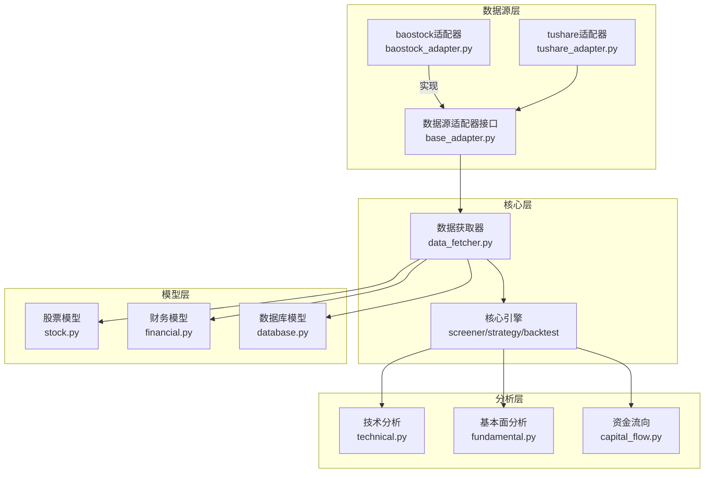
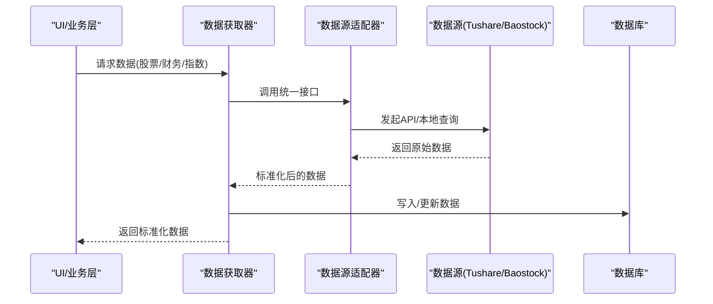
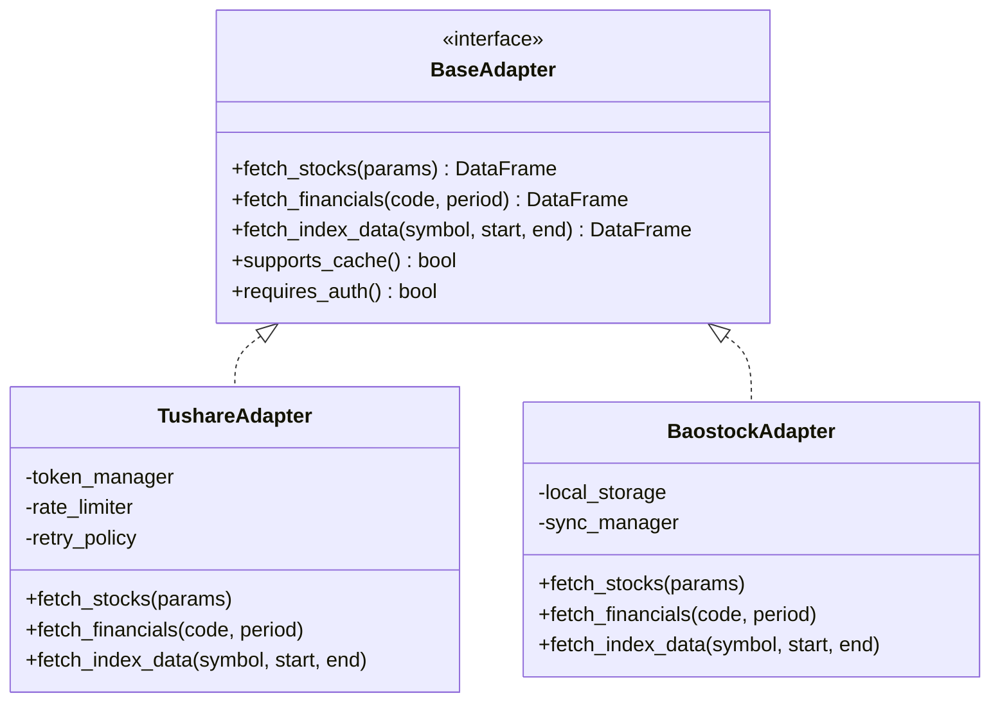
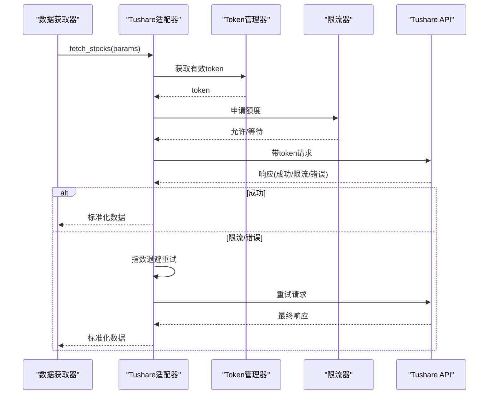
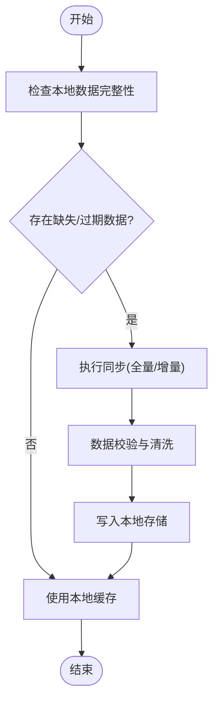
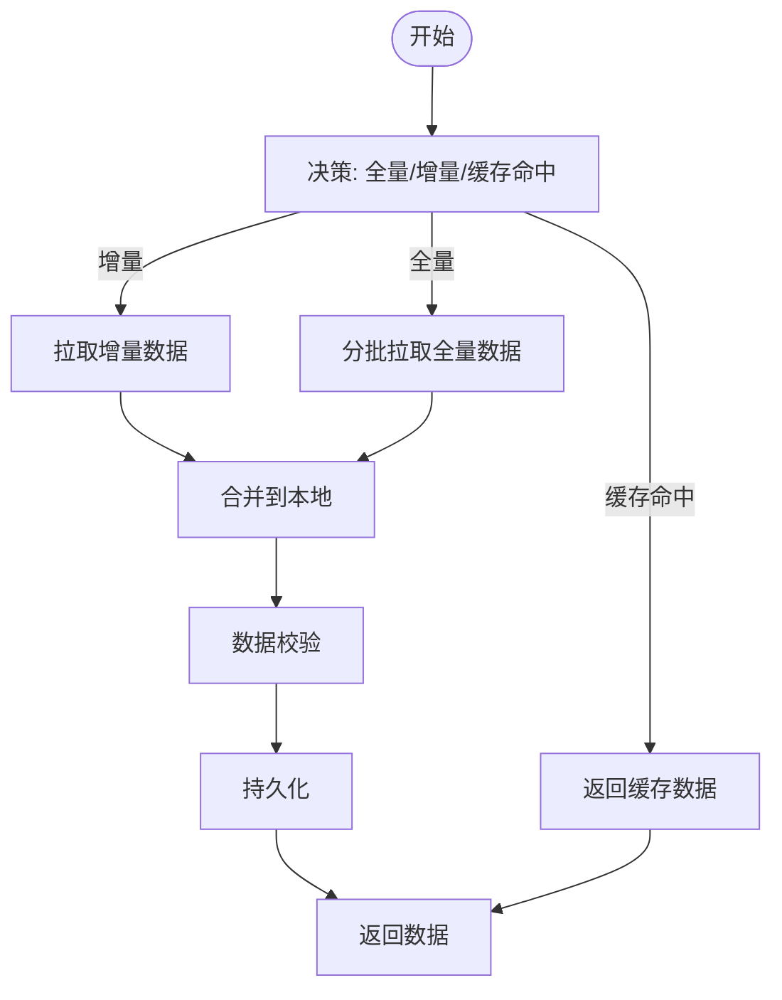
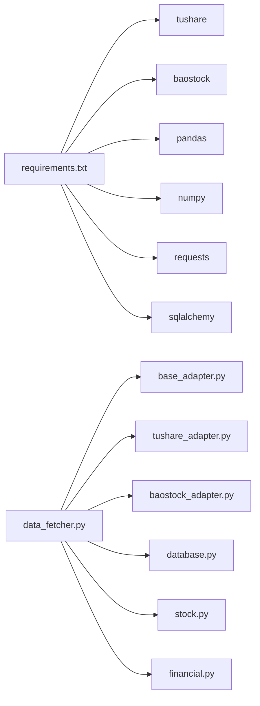
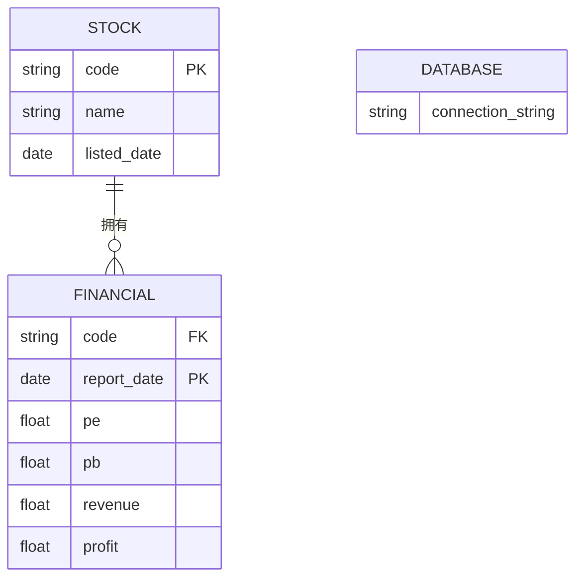

# 数据源接口模块

<cite>
**本文档引用的文件**
- [requirements.txt](file://requirements.txt)
- [PRD.md](file://docs/PRD.md)
- [base_adapter.py](file://src/datasource/base_adapter.py)
- [tushare_adapter.py](file://src/datasource/tushare_adapter.py)
- [baostock_adapter.py](file://src/datasource/baostock_adapter.py)
- [data_fetcher.py](file://src/core/data_fetcher.py)
- [stock.py](file://src/models/stock.py)
- [financial.py](file://src/models/financial.py)
- [database.py](file://src/models/database.py)
- [technical.py](file://src/analysis/technical.py)
- [fundamental.py](file://src/analysis/fundamental.py)
- [capital_flow.py](file://src/analysis/capital_flow.py)
</cite>

## 目录
1. [引言](#引言)
2. [项目结构](#项目结构)
3. [核心组件](#核心组件)
4. [架构总览](#架构总览)
5. [详细组件分析](#详细组件分析)
6. [依赖关系分析](#依赖关系分析)
7. [性能考虑](#性能考虑)
8. [故障排除指南](#故障排除指南)
9. [结论](#结论)
10. [附录](#附录)

## 引言
本文件系统化梳理数据源接口模块的设计与实现，覆盖数据源抽象接口设计、工厂模式实现、Tushare与Baostock数据源的API封装与认证机制、本地化数据同步策略、数据获取策略（增量更新、批量下载、缓存管理）、配置与切换方案、数据质量控制与异常处理、以及性能优化与并发获取模式。该模块为上层筛选、回测与分析引擎提供统一、可扩展、高可靠的数据访问能力。

## 项目结构
数据源模块位于 `src/datasource`，采用适配器模式对接不同数据源；核心数据获取逻辑位于 `src/core/data_fetcher.py`；数据模型位于 `src/models`；分析模块位于 `src/analysis`。依赖项在 `requirements.txt` 中声明，明确包含 `tushare` 和 `baostock` 作为数据源依赖。

图表来源
- [base_adapter.py](file://src/datasource/base_adapter.py)
- [tushare_adapter.py](file://src/datasource/tushare_adapter.py)
- [baostock_adapter.py](file://src/datasource/baostock_adapter.py)
- [data_fetcher.py](file://src/core/data_fetcher.py)
- [stock.py](file://src/models/stock.py)
- [financial.py](file://src/models/financial.py)
- [database.py](file://src/models/database.py)
- [technical.py](file://src/analysis/technical.py)
- [fundamental.py](file://src/analysis/fundamental.py)
- [capital_flow.py](file://src/analysis/capital_flow.py)

章节来源
- [requirements.txt:1-31](file://requirements.txt#L1-L31)
- [PRD.md:294-328](file://docs/PRD.md#L294-L328)

## 核心组件
- 数据源适配器接口：定义统一的数据获取方法签名，确保不同数据源（Tushare、Baostock）对外暴露一致的调用方式。
- Tushare适配器：封装Tushare API，负责token管理、请求限流与错误重试策略。
- Baostock适配器：封装本地化数据源，负责本地数据同步与一致性维护。
- 数据获取器：协调适配器执行数据拉取、缓存与持久化，支持增量更新与批量下载。
- 数据模型：定义股票、财务等实体模型，支撑数据存储与查询。
- 分析引擎：基于获取的数据进行技术分析、基本面分析与资金流向分析。

章节来源
- [base_adapter.py](file://src/datasource/base_adapter.py)
- [tushare_adapter.py](file://src/datasource/tushare_adapter.py)
- [baostock_adapter.py](file://src/datasource/baostock_adapter.py)
- [data_fetcher.py](file://src/core/data_fetcher.py)
- [stock.py](file://src/models/stock.py)
- [financial.py](file://src/models/financial.py)
- [database.py](file://src/models/database.py)
- [technical.py](file://src/analysis/technical.py)
- [fundamental.py](file://src/analysis/fundamental.py)
- [capital_flow.py](file://src/analysis/capital_flow.py)

## 架构总览
数据源模块通过适配器模式解耦具体数据源实现，核心数据获取器根据配置选择对应适配器，统一调度数据拉取流程。数据经由模型层持久化到数据库，并为分析引擎提供查询接口。

图表来源
- [data_fetcher.py](file://src/core/data_fetcher.py)
- [base_adapter.py](file://src/datasource/base_adapter.py)
- [tushare_adapter.py](file://src/datasource/tushare_adapter.py)
- [baostock_adapter.py](file://src/datasource/baostock_adapter.py)
- [database.py](file://src/models/database.py)

## 详细组件分析

### 数据源适配器接口设计
- 设计目标：屏蔽底层差异，向上层暴露一致的方法签名，便于切换与扩展。
- 关键方法：如 `fetch_stocks`, `fetch_financials`, `fetch_index_data` 等，返回标准化数据结构。
- 接口职责：参数校验、错误包装、数据格式转换、与核心层契约保持一致。

图表来源
- [base_adapter.py](file://src/datasource/base_adapter.py)
- [tushare_adapter.py](file://src/datasource/tushare_adapter.py)
- [baostock_adapter.py](file://src/datasource/baostock_adapter.py)

章节来源
- [base_adapter.py](file://src/datasource/base_adapter.py)

### Tushare数据源适配器
- 认证机制：通过token管理器集中管理访问令牌，支持刷新与失效处理。
- 请求限流：内置速率限制器，按Tushare API配额进行节流，避免触发限流阈值。
- 错误重试：针对网络瞬时错误、API限流与服务不可达场景，实施指数退避重试策略。
- 数据封装：将Tushare返回的原始字段映射为内部标准字段，保证后续处理一致性。

图表来源
- [tushare_adapter.py](file://src/datasource/tushare_adapter.py)

章节来源
- [tushare_adapter.py](file://src/datasource/tushare_adapter.py)

### Baostock数据源适配器
- 本地化实现：面向本地数据源，减少网络依赖，提升稳定性与速度。
- 数据同步：维护本地数据与远端/基准数据的一致性，支持全量与增量同步。
- 缓存策略：结合文件系统或轻量缓存，降低重复读取成本，提高响应速度。
- 校验与修复：对缺失字段、异常值进行清洗与修复，保障数据质量。

图表来源
- [baostock_adapter.py](file://src/datasource/baostock_adapter.py)

章节来源
- [baostock_adapter.py](file://src/datasource/baostock_adapter.py)

### 数据获取策略
- 增量更新：基于最后更新时间戳或版本号判断是否需要更新，仅拉取新增或变更部分，降低带宽与计算开销。
- 批量下载：对大量股票或历史数据采用分批下载与并行处理，提升吞吐量。
- 缓存管理：结合内存缓存与磁盘缓存，设置TTL与失效策略，平衡一致性与性能。
- 冲突解决：当并发写入冲突时，采用乐观锁或队列化写入，确保最终一致性。

图表来源
- [data_fetcher.py](file://src/core/data_fetcher.py)

章节来源
- [data_fetcher.py](file://src/core/data_fetcher.py)

### 数据质量控制与异常处理
- 网络错误：捕获连接超时、DNS解析失败、HTTP状态码异常等，实施重试与降级策略。
- API限制：识别429/5xx类错误，触发退避重试与备用策略（如切换数据源）。
- 数据格式验证：对关键字段进行类型、范围与一致性校验，异常数据记录日志并标记待人工复核。
- 异常传播：将底层异常包装为领域内统一的异常类型，保留上下文信息，便于上层处理。

章节来源
- [tushare_adapter.py](file://src/datasource/tushare_adapter.py)
- [baostock_adapter.py](file://src/datasource/baostock_adapter.py)
- [data_fetcher.py](file://src/core/data_fetcher.py)

### 配置与切换
- 配置项：数据源类型、认证参数（如token）、限流参数、缓存路径与TTL、同步策略等。
- 切换流程：通过工厂类或配置中心动态选择适配器实例，确保运行时可平滑切换。
- 扩展新数据源：实现 `BaseAdapter` 接口，注册到工厂，即可无缝接入现有数据获取流程。

章节来源
- [base_adapter.py](file://src/datasource/base_adapter.py)
- [data_fetcher.py](file://src/core/data_fetcher.py)

## 依赖关系分析
- 外部依赖：`tushare`、`baostock`、`pandas`、`numpy`、`requests`、`sqlalchemy` 等。
- 内部耦合：数据获取器依赖适配器接口；适配器依赖外部SDK与本地存储；模型层依赖数据库层；分析层依赖数据获取器输出。

图表来源
- [requirements.txt:1-31](file://requirements.txt#L1-L31)
- [data_fetcher.py](file://src/core/data_fetcher.py)
- [base_adapter.py](file://src/datasource/base_adapter.py)
- [tushare_adapter.py](file://src/datasource/tushare_adapter.py)
- [baostock_adapter.py](file://src/datasource/baostock_adapter.py)
- [database.py](file://src/models/database.py)
- [stock.py](file://src/models/stock.py)
- [financial.py](file://src/models/financial.py)

章节来源
- [requirements.txt:1-31](file://requirements.txt#L1-L31)

## 性能考虑
- 并发获取：对独立股票或指数并行请求，结合线程池/进程池与信号量控制并发度。
- 批处理：批量写入数据库，减少事务开销；分页拉取与背压控制避免内存峰值。
- 缓存优化：合理设置缓存层级与TTL，热点数据驻留内存，冷数据落盘。
- I/O优化：压缩传输、延迟加载、索引优化，提升查询效率。
- 监控与告警：埋点统计成功率、耗时分布、重试次数，及时发现性能瓶颈。

## 故障排除指南
- 常见问题
  - 认证失败：检查token有效性与过期时间，确认网络可达性。
  - 请求被限流：降低并发或延长重试间隔，必要时切换到备用数据源。
  - 数据不一致：检查同步策略与时间戳，清理脏数据后重新同步。
  - 写入冲突：启用幂等写入或队列化写入，避免竞态条件。
- 定位手段：查看日志文件、监控指标、重试链路与缓存命中率。
- 应急预案：快速回滚到上一个稳定版本，临时关闭高风险任务，启用降级策略。

章节来源
- [tushare_adapter.py](file://src/datasource/tushare_adapter.py)
- [baostock_adapter.py](file://src/datasource/baostock_adapter.py)
- [data_fetcher.py](file://src/core/data_fetcher.py)

## 结论
数据源接口模块通过适配器与工厂模式实现了对多数据源的统一抽象与灵活切换，结合完善的认证、限流、重试与缓存策略，保障了数据获取的可靠性与性能。建议持续完善监控体系与自动化测试，以进一步提升系统的可观测性与可维护性。

## 附录
- 数据模型ER关系示意（简化）

图表来源
- [stock.py](file://src/models/stock.py)
- [financial.py](file://src/models/financial.py)
- [database.py](file://src/models/database.py)