# 投资组合管理

<cite>
**本文档引用的文件**
- [portfolio_management.py](file://src/ui/pages/portfolio_management.py)
- [portfolio_optimizer.py](file://src/analysis/portfolio_optimizer.py)
- [risk_metrics.py](file://src/utils/risk_metrics.py)
- [portfolio.py](file://src/models/portfolio.py)
- [asset_selection.py](file://src/analysis/asset_selection.py)
- [rebalance_strategy.py](file://src/analysis/rebalance_strategy.py)
- [black_litterman.py](file://src/analysis/black_litterman.py)
- [mpt.py](file://src/analysis/mpt.py)
- [performance_report.py](file://src/ui/pages/performance_report.py)
- [datasource.py](file://src/datasource/datasource.py)
- [requirements.txt](file://requirements.txt)
</cite>

## 目录
1. [简介](#简介)
2. [项目结构](#项目结构)
3. [核心组件](#核心组件)
4. [架构总览](#架构总览)
5. [详细组件分析](#详细组件分析)
6. [依赖关系分析](#依赖关系分析)
7. [性能考虑](#性能考虑)
8. [故障排除指南](#故障排除指南)
9. [结论](#结论)
10. [附录](#附录)

## 简介
本项目为一个基于Python的投资组合管理模块，涵盖资产选择、权重分配、再平衡策略、风险度量与优化算法（包括现代投资组合理论MPT与Black-Litterman模型）、以及组合监控与报告功能。系统采用分层架构设计，将数据源、分析引擎、模型与UI进行解耦，便于扩展与维护。

## 项目结构
项目采用按功能域划分的目录结构，主要模块如下：
- 数据源层：负责市场数据获取与缓存
- 模型层：定义投资组合与资产等核心数据结构
- 分析层：实现资产选择、优化器、风险度量与再平衡策略
- 工具层：提供通用工具函数与指标计算
- UI层：提供页面与对话框，支持用户交互与可视化展示
- 配置与资源：存放配置文件与主题资源

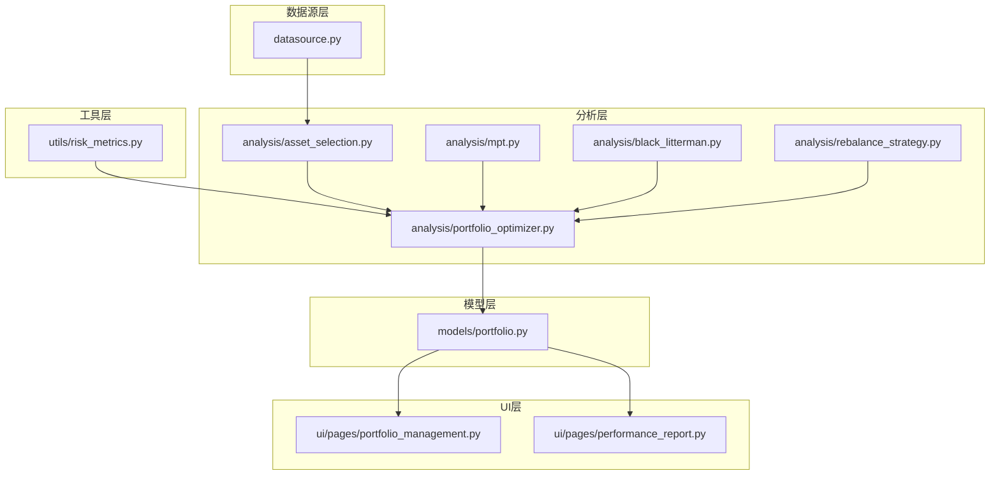

**图表来源**
- [portfolio_management.py](file://src/ui/pages/portfolio_management.py)
- [portfolio_optimizer.py](file://src/analysis/portfolio_optimizer.py)
- [risk_metrics.py](file://src/utils/risk_metrics.py)
- [portfolio.py](file://src/models/portfolio.py)
- [asset_selection.py](file://src/analysis/asset_selection.py)
- [rebalance_strategy.py](file://src/analysis/rebalance_strategy.py)
- [black_litterman.py](file://src/analysis/black_litterman.py)
- [mpt.py](file://src/analysis/mpt.py)
- [performance_report.py](file://src/ui/pages/performance_report.py)
- [datasource.py](file://src/datasource/datasource.py)

**章节来源**
- [portfolio_management.py](file://src/ui/pages/portfolio_management.py)
- [portfolio_optimizer.py](file://src/analysis/portfolio_optimizer.py)
- [risk_metrics.py](file://src/utils/risk_metrics.py)
- [portfolio.py](file://src/models/portfolio.py)
- [asset_selection.py](file://src/analysis/asset_selection.py)
- [rebalance_strategy.py](file://src/analysis/rebalance_strategy.py)
- [black_litterman.py](file://src/analysis/black_litterman.py)
- [mpt.py](file://src/analysis/mpt.py)
- [performance_report.py](file://src/ui/pages/performance_report.py)
- [datasource.py](file://src/datasource/datasource.py)

## 核心组件
- 投资组合模型：封装资产列表、权重向量、时间序列价格与收益等核心属性，提供基础操作接口。
- 资产选择模块：根据历史统计特征与约束条件筛选候选资产。
- 组合优化器：集成多种优化算法，包括马科维茨均值-方差优化与Black-Litterman模型。
- 风险度量工具：提供波动率、相关性矩阵、风险因子分解等指标计算。
- 再平衡策略：定义触发条件与执行逻辑，确保组合权重维持目标状态。
- UI页面：提供组合管理与绩效报告界面，支持可视化展示与交互。

**章节来源**
- [portfolio.py](file://src/models/portfolio.py)
- [asset_selection.py](file://src/analysis/asset_selection.py)
- [portfolio_optimizer.py](file://src/analysis/portfolio_optimizer.py)
- [risk_metrics.py](file://src/utils/risk_metrics.py)
- [rebalance_strategy.py](file://src/analysis/rebalance_strategy.py)
- [portfolio_management.py](file://src/ui/pages/portfolio_management.py)
- [performance_report.py](file://src/ui/pages/performance_report.py)

## 架构总览
系统采用“数据驱动 + 算法插件化”的架构模式。数据源层统一提供标准化数据；分析层通过可插拔的优化器与策略模块实现灵活的组合构建；模型层抽象投资组合实体；UI层负责展示与交互。

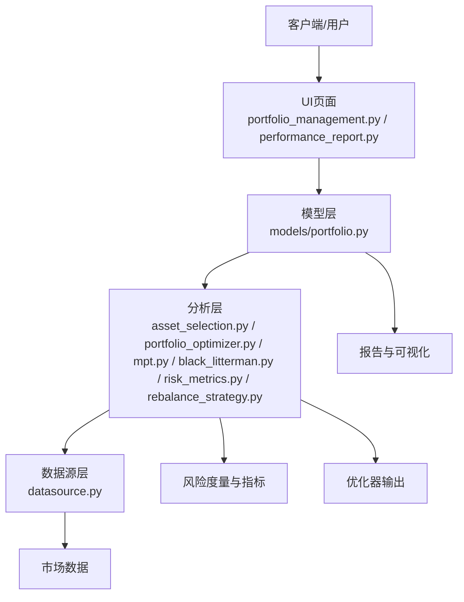

**图表来源**
- [portfolio_management.py](file://src/ui/pages/portfolio_management.py)
- [performance_report.py](file://src/ui/pages/performance_report.py)
- [portfolio.py](file://src/models/portfolio.py)
- [asset_selection.py](file://src/analysis/asset_selection.py)
- [portfolio_optimizer.py](file://src/analysis/portfolio_optimizer.py)
- [mpt.py](file://src/analysis/mpt.py)
- [black_litterman.py](file://src/analysis/black_litterman.py)
- [risk_metrics.py](file://src/utils/risk_metrics.py)
- [rebalance_strategy.py](file://src/analysis/rebalance_strategy.py)
- [datasource.py](file://src/datasource/datasource.py)

## 详细组件分析

### 投资组合模型（Portfolio）
- 职责：封装资产集合、权重、价格与收益序列，提供组合收益、波动率、相关性等计算入口。
- 关键接口：设置权重、更新价格、计算组合收益、计算协方差矩阵、计算风险贡献等。
- 复杂度：收益与波动率计算通常为O(N^2)，其中N为资产数；协方差矩阵计算为O(N^2)。

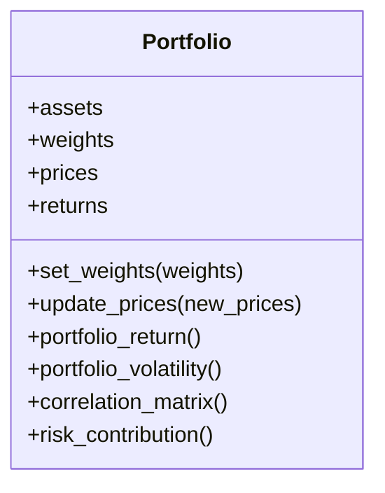

**图表来源**
- [portfolio.py](file://src/models/portfolio.py)

**章节来源**
- [portfolio.py](file://src/models/portfolio.py)

### 资产选择（Asset Selection）
- 职责：基于历史统计指标（如预期收益、波动率）与约束条件（行业限制、流动性要求）筛选候选资产。
- 实现要点：多因子评分、动量过滤、最小化共同因子暴露等。
- 复杂度：排序与过滤通常为O(N log N)。

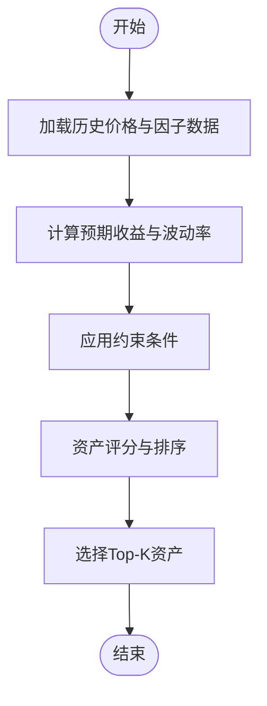

**图表来源**
- [asset_selection.py](file://src/analysis/asset_selection.py)

**章节来源**
- [asset_selection.py](file://src/analysis/asset_selection.py)

### 组合优化器（Portfolio Optimizer）
- 职责：根据目标函数与约束条件求解最优权重，支持多种优化算法与目标（最大化夏普比率、最小化方差、跟踪误差最小化等）。
- 接口：构造目标函数、设置边界与线性约束、调用求解器、返回权重结果。
- 复杂度：取决于具体算法，通常为O(N^3)到O(N^4)。

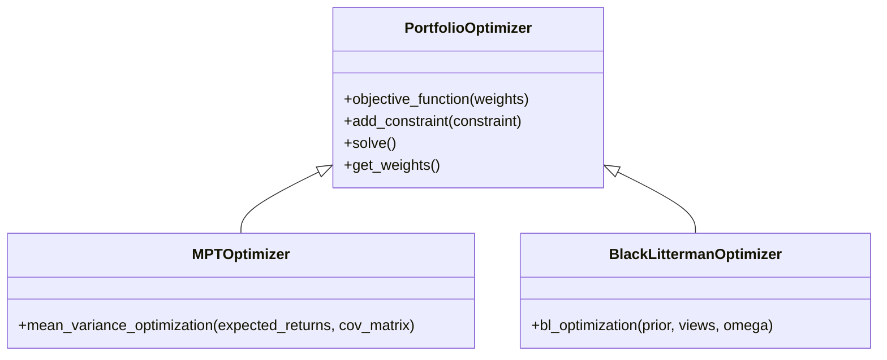

**图表来源**
- [portfolio_optimizer.py](file://src/analysis/portfolio_optimizer.py)
- [mpt.py](file://src/analysis/mpt.py)
- [black_litterman.py](file://src/analysis/black_litterman.py)

**章节来源**
- [portfolio_optimizer.py](file://src/analysis/portfolio_optimizer.py)
- [mpt.py](file://src/analysis/mpt.py)
- [black_litterman.py](file://src/analysis/black_litterman.py)

### 风险度量工具（Risk Metrics）
- 职责：提供波动率、相关性矩阵、风险因子分解、VaR/Expected Shortfall等指标。
- 实现要点：滚动窗口计算、指数加权移动平均、主成分分析（PCA）分解风险因子。
- 复杂度：滚动窗口为O(T·N)，PCA分解为O(N^3)。

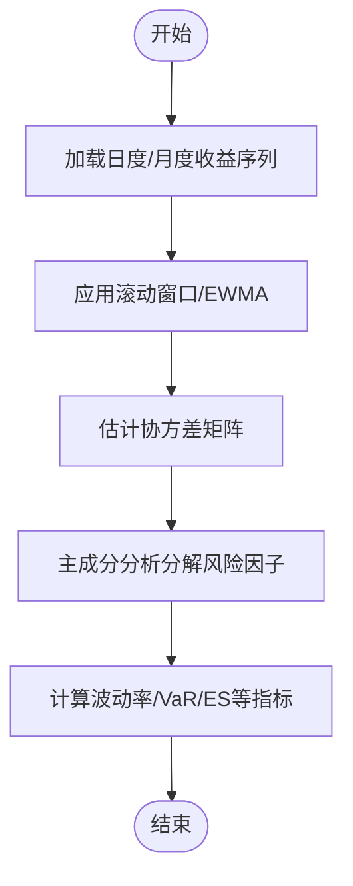

**图表来源**
- [risk_metrics.py](file://src/utils/risk_metrics.py)

**章节来源**
- [risk_metrics.py](file://src/utils/risk_metrics.py)

### 再平衡策略（Rebalance Strategy）
- 职责：定义再平衡触发条件（如权重偏离阈值、定期重置、事件驱动）与执行流程。
- 实现要点：目标权重与当前权重的偏差度量、交易成本建模、滑点处理。
- 复杂度：每次再平衡为O(N)。

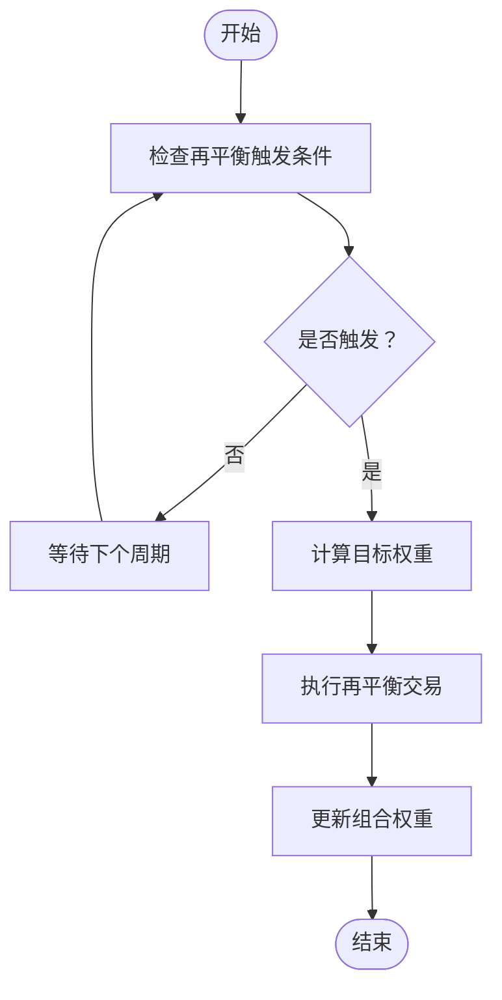

**图表来源**
- [rebalance_strategy.py](file://src/analysis/rebalance_strategy.py)

**章节来源**
- [rebalance_strategy.py](file://src/analysis/rebalance_strategy.py)

### 现代投资组合理论（MPT）应用
- 职责：实现马科维茨均值-方差优化，求解有效前沿与最优权重。
- 关键步骤：输入预期收益与协方差矩阵，设置预算与边界约束，求解二次规划问题。
- 输出：有效前沿上的最优组合权重与对应的风险-收益参数。

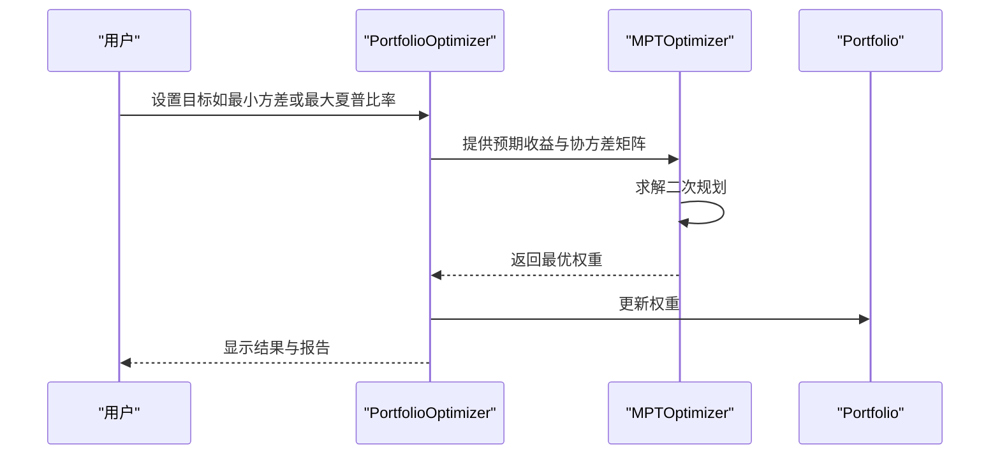

**图表来源**
- [mpt.py](file://src/analysis/mpt.py)
- [portfolio_optimizer.py](file://src/analysis/portfolio_optimizer.py)
- [portfolio.py](file://src/models/portfolio.py)

**章节来源**
- [mpt.py](file://src/analysis/mpt.py)
- [portfolio_optimizer.py](file://src/analysis/portfolio_optimizer.py)
- [portfolio.py](file://src/models/portfolio.py)

### Black-Litterman模型
- 职责：在先验分布（如市场均衡权重）与投资者观点（views）之间进行贝叶斯融合，得到后验权重。
- 关键步骤：设定观察矩阵、置信度矩阵、市场均衡隐含回报，迭代求解后验分布。
- 输出：更符合投资者偏好的稳健权重。

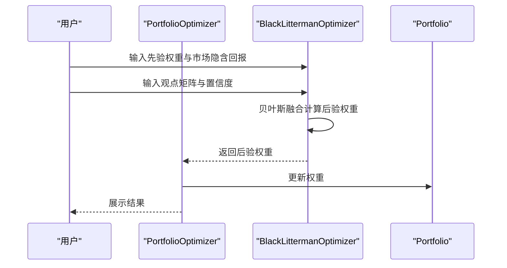

**图表来源**
- [black_litterman.py](file://src/analysis/black_litterman.py)
- [portfolio_optimizer.py](file://src/analysis/portfolio_optimizer.py)
- [portfolio.py](file://src/models/portfolio.py)

**章节来源**
- [black_litterman.py](file://src/analysis/black_litterman.py)
- [portfolio_optimizer.py](file://src/analysis/portfolio_optimizer.py)
- [portfolio.py](file://src/models/portfolio.py)

### 组合监控与报告（Performance Report）
- 职责：生成收益跟踪、风险监控与绩效评估报告，支持可视化展示。
- 功能：累计收益曲线、回撤分析、风险指标趋势、组合权重分布饼图等。
- 输出：PDF/HTML报告与实时仪表盘。

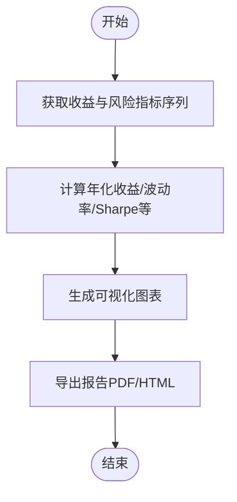

**图表来源**
- [performance_report.py](file://src/ui/pages/performance_report.py)

**章节来源**
- [performance_report.py](file://src/ui/pages/performance_report.py)

## 依赖关系分析
- 模块内聚：各分析模块职责清晰，与模型层通过接口耦合，降低耦合度。
- 外部依赖：通过requirements.txt声明第三方库（如pandas、numpy、scipy、matplotlib等），用于数值计算与可视化。
- 数据流：UI层触发业务流程，模型层承载状态，分析层提供算法能力，数据源层提供数据支撑。

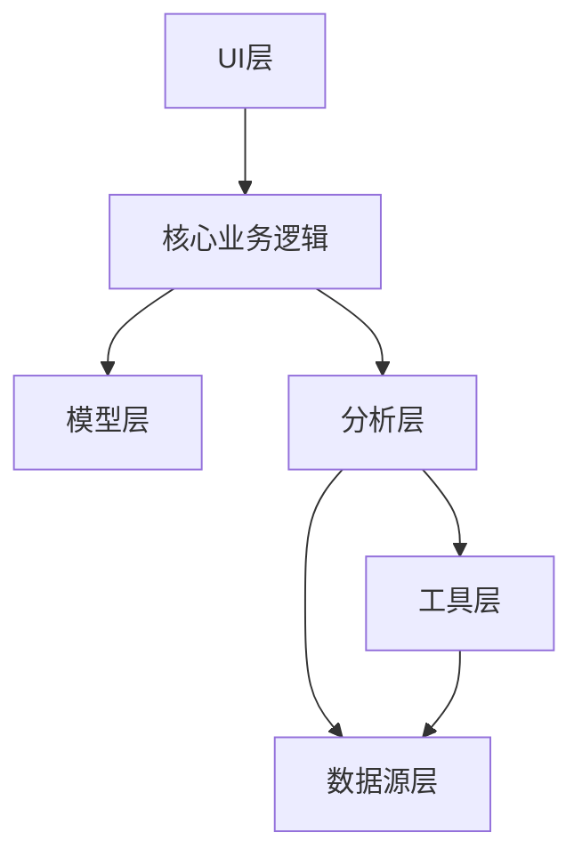

**图表来源**
- [portfolio_management.py](file://src/ui/pages/portfolio_management.py)
- [performance_report.py](file://src/ui/pages/performance_report.py)
- [portfolio.py](file://src/models/portfolio.py)
- [portfolio_optimizer.py](file://src/analysis/portfolio_optimizer.py)
- [risk_metrics.py](file://src/utils/risk_metrics.py)
- [datasource.py](file://src/datasource/datasource.py)

**章节来源**
- [requirements.txt](file://requirements.txt)

## 性能考虑
- 计算复杂度：协方差矩阵与优化问题的规模直接影响运行时间，建议对大组合采用稀疏矩阵与近似算法。
- 内存使用：滚动窗口与历史数据存储需控制长度，避免内存溢出。
- 并行化：在批量回测与蒙特卡洛模拟中可利用多进程提升效率。
- 缓存策略：对高频指标（如波动率、相关性）进行缓存，减少重复计算。

## 故障排除指南
- 数据缺失：检查数据源连接与时间序列完整性，确保无空值或异常值。
- 优化失败：调整约束范围、初始权重或求解器参数，必要时切换算法。
- 性能异常：定位高复杂度计算路径，优先优化协方差估计与优化求解过程。
- 可视化问题：确认绘图库版本兼容性与输出格式支持。

## 结论
该投资组合管理模块通过清晰的分层架构实现了从资产选择、优化到监控与报告的完整闭环。结合MPT与Black-Litterman模型，能够为不同风险偏好与约束条件下的投资组合提供科学的权重配置方案。建议在生产环境中进一步完善数据质量控制、性能基准测试与自动化回测框架。

## 附录
- 实际案例与配置示例可在各模块的单元测试与示例脚本中查找，建议参考以下文件路径：
  - [asset_selection.py](file://src/analysis/asset_selection.py)
  - [portfolio_optimizer.py](file://src/analysis/portfolio_optimizer.py)
  - [mpt.py](file://src/analysis/mpt.py)
  - [black_litterman.py](file://src/analysis/black_litterman.py)
  - [risk_metrics.py](file://src/utils/risk_metrics.py)
  - [portfolio_management.py](file://src/ui/pages/portfolio_management.py)
  - [performance_report.py](file://src/ui/pages/performance_report.py)
  - [datasource.py](file://src/datasource/datasource.py)
  - [requirements.txt](file://requirements.txt)