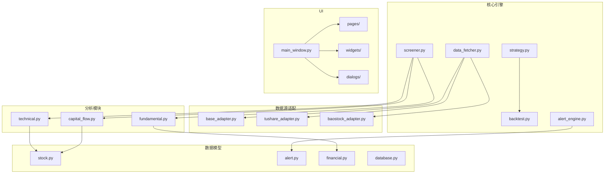
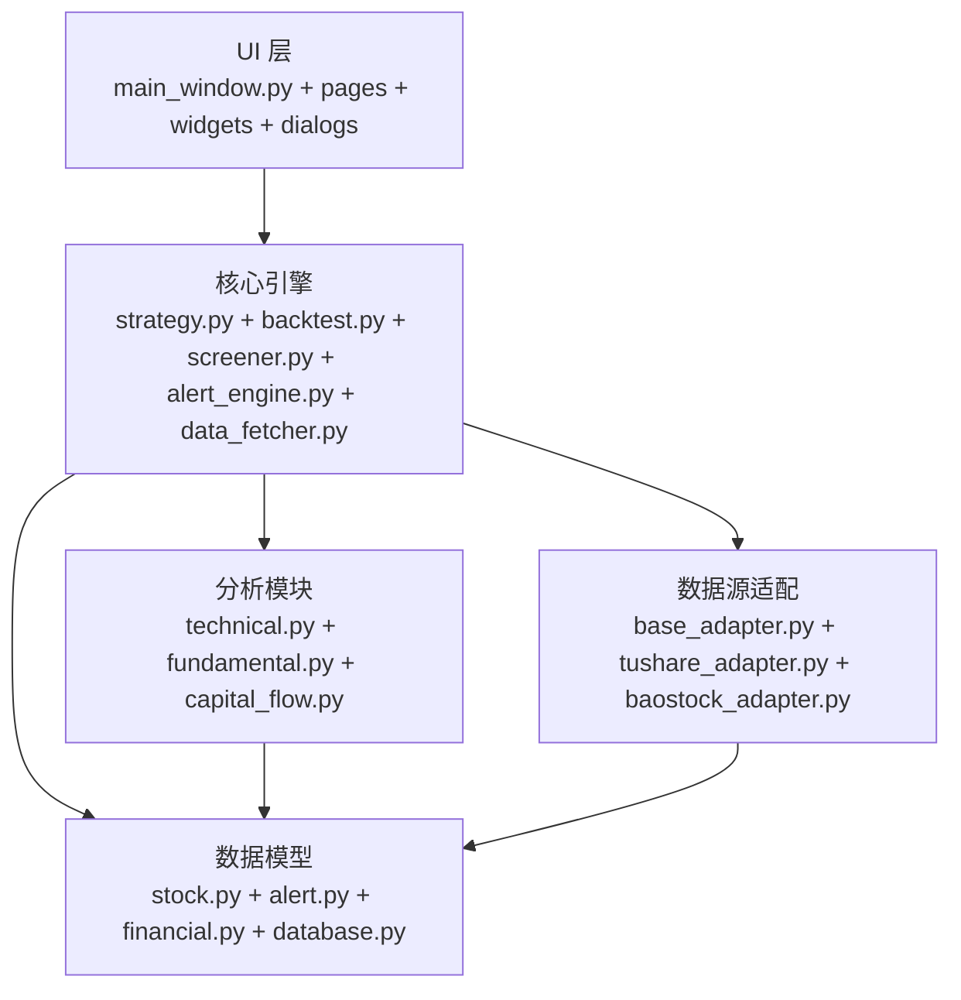
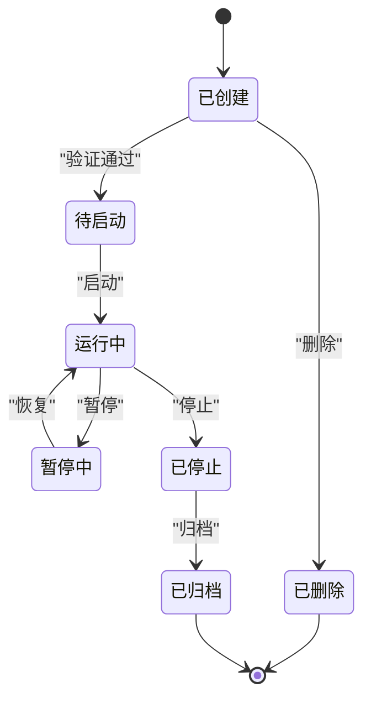
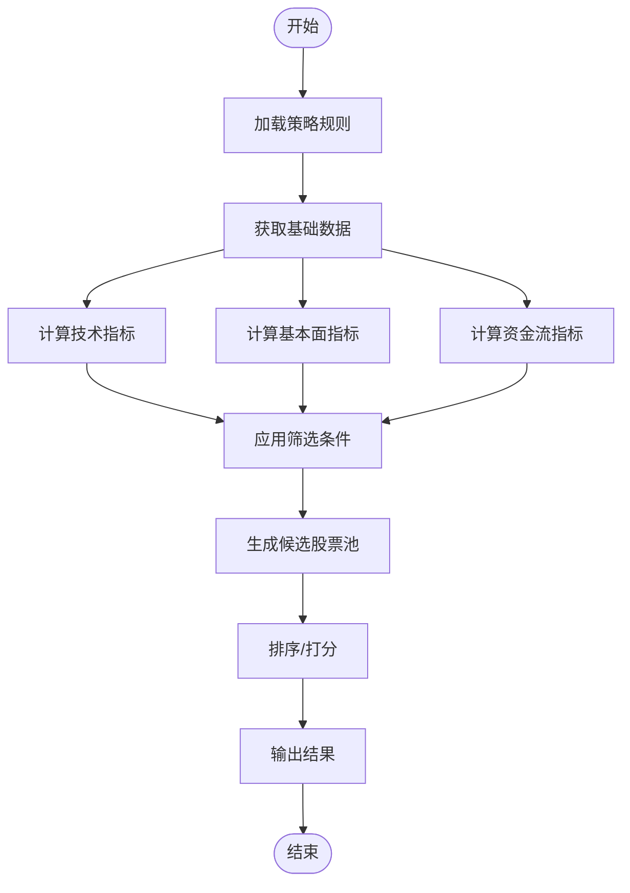
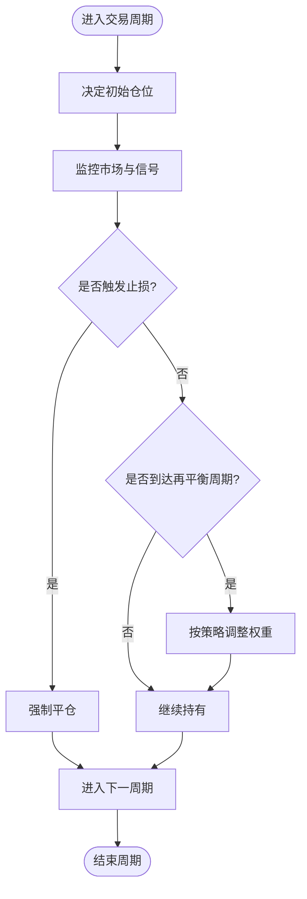
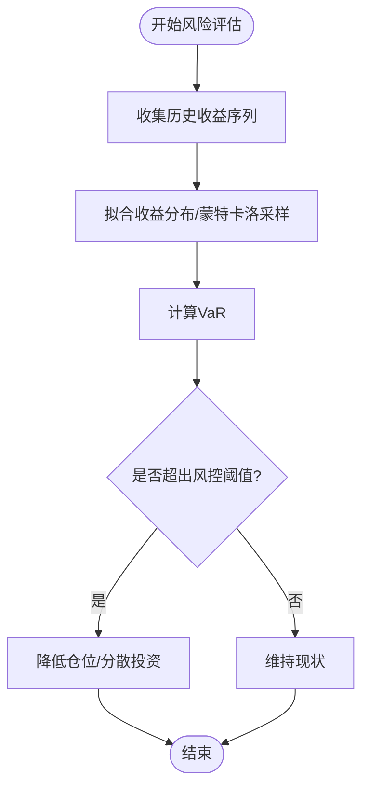
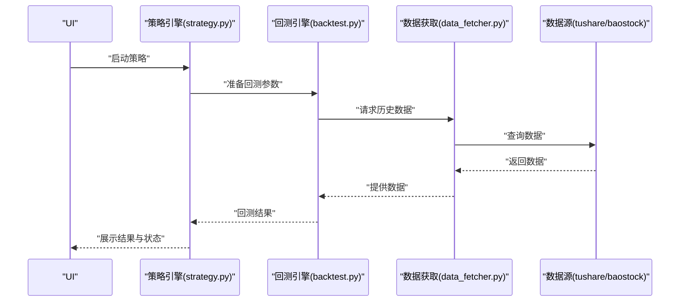
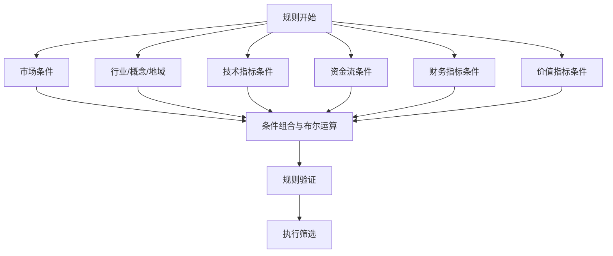
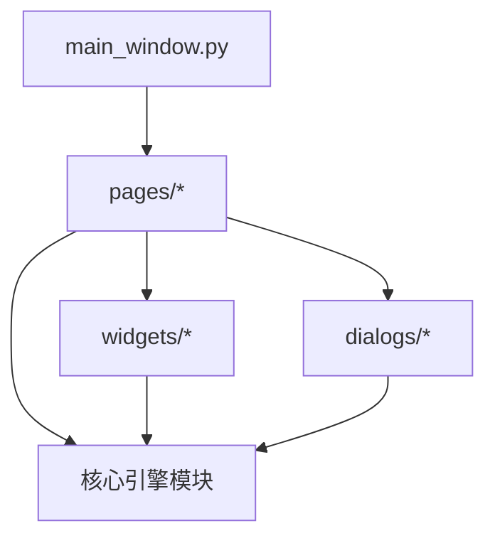
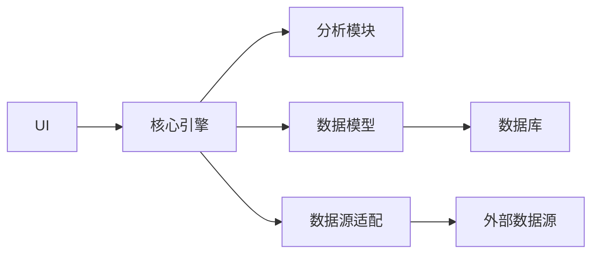

# 核心业务逻辑

<cite>
**本文引用的文件**
- [PRD.md](file://docs/PRD.md)
- [screener.py](file://src/core/screener.py)
- [strategy.py](file://src/core/strategy.py)
- [backtest.py](file://src/core/backtest.py)
- [alert_engine.py](file://src/core/alert_engine.py)
- [data_fetcher.py](file://src/core/data_fetcher.py)
- [base_adapter.py](file://src/datasource/base_adapter.py)
- [tushare_adapter.py](file://src/datasource/tushare_adapter.py)
- [baostock_adapter.py](file://src/datasource/baostock_adapter.py)
- [technical.py](file://src/analysis/technical.py)
- [fundamental.py](file://src/analysis/fundamental.py)
- [capital_flow.py](file://src/analysis/capital_flow.py)
- [stock.py](file://src/models/stock.py)
- [alert.py](file://src/models/alert.py)
- [financial.py](file://src/models/financial.py)
- [database.py](file://src/models/database.py)
- [main_window.py](file://src/ui/main_window.py)
- [pages/](file://src/ui/pages/)
- [widgets/](file://src/ui/widgets/)
- [dialogs/](file://src/ui/dialogs/)
- [requirements.txt](file://requirements.txt)
</cite>

## 目录
1. [引言](#引言)
2. [项目结构](#项目结构)
3. [核心组件](#核心组件)
4. [架构总览](#架构总览)
5. [详细组件分析](#详细组件分析)
6. [依赖分析](#依赖分析)
7. [性能考虑](#性能考虑)
8. [故障排查指南](#故障排查指南)
9. [结论](#结论)
10. [附录](#附录)

## 引言
本文件聚焦于系统核心业务逻辑模块，围绕策略引擎、选股执行、投资组合与风险管理、业务流程编排与状态管理、策略规则语法与配置、UI交互与错误恢复、并发与事务管理等方面进行系统化梳理。依据产品需求文档，系统提供股票筛选、技术与基本面分析、资金流分析、策略回测、预警等功能，核心模块位于 src/core、src/analysis、src/datasource、src/models、src/ui 等目录。

## 项目结构
系统采用按功能域分层的模块组织方式：
- 核心引擎：screener（筛选）、strategy（策略）、backtest（回测）、alert_engine（预警）、data_fetcher（数据获取）
- 数据源适配：base_adapter、tushare_adapter、baostock_adapter
- 分析模块：technical（技术分析）、fundamental（基本面分析）、capital_flow（资金流）
- 数据模型：stock、alert、financial、database
- 用户界面：main_window、pages、widgets、dialogs
- 配置与资源：config、resources、data/logs、data/db、data/cache

**图表来源**
- [screener.py](file://src/core/screener.py)
- [strategy.py](file://src/core/strategy.py)
- [backtest.py](file://src/core/backtest.py)
- [alert_engine.py](file://src/core/alert_engine.py)
- [data_fetcher.py](file://src/core/data_fetcher.py)
- [base_adapter.py](file://src/datasource/base_adapter.py)
- [tushare_adapter.py](file://src/datasource/tushare_adapter.py)
- [baostock_adapter.py](file://src/datasource/baostock_adapter.py)
- [technical.py](file://src/analysis/technical.py)
- [fundamental.py](file://src/analysis/fundamental.py)
- [capital_flow.py](file://src/analysis/capital_flow.py)
- [stock.py](file://src/models/stock.py)
- [alert.py](file://src/models/alert.py)
- [financial.py](file://src/models/financial.py)
- [database.py](file://src/models/database.py)
- [main_window.py](file://src/ui/main_window.py)

**章节来源**
- [PRD.md: 304-337:304-337](file://docs/PRD.md#L304-L337)

## 核心组件
- 策略引擎（策略管理与生命周期）：负责策略定义、加载、执行、监控与状态持久化，支持策略版本与配置管理。
- 选股引擎（筛选器）：基于多维条件（市场、行业、技术、资金流、财务、价值指标）进行快速筛选。
- 回测引擎：对策略历史回测，输出收益曲线、绩效指标与报告。
- 预警引擎：基于规则触发价格、涨跌幅、成交量、技术指标等预警。
- 数据获取与适配：统一抽象数据源接口，支持 tushare、baostock 等多数据源。
- 分析模块：技术分析、基本面分析、资金流分析，为筛选与回测提供指标基础。
- 数据模型：封装股票、预警、财务与数据库访问模型。
- UI 交互：主窗口与页面组件，承载策略配置、回测运行、结果展示与用户交互。

**章节来源**
- [PRD.md: 23-260:23-260](file://docs/PRD.md#L23-L260)

## 架构总览
系统采用“核心引擎 + 分析模块 + 数据源适配 + UI”的分层架构。核心引擎通过数据获取模块接入外部数据源，分析模块提供指标计算，UI 展示与交互，模型层负责数据持久化与实体建模。

**图表来源**
- [strategy.py](file://src/core/strategy.py)
- [backtest.py](file://src/core/backtest.py)
- [screener.py](file://src/core/screener.py)
- [alert_engine.py](file://src/core/alert_engine.py)
- [data_fetcher.py](file://src/core/data_fetcher.py)
- [technical.py](file://src/analysis/technical.py)
- [fundamental.py](file://src/analysis/fundamental.py)
- [capital_flow.py](file://src/analysis/capital_flow.py)
- [stock.py](file://src/models/stock.py)
- [alert.py](file://src/models/alert.py)
- [financial.py](file://src/models/financial.py)
- [database.py](file://src/models/database.py)
- [base_adapter.py](file://src/datasource/base_adapter.py)
- [tushare_adapter.py](file://src/datasource/tushare_adapter.py)
- [baostock_adapter.py](file://src/datasource/baostock_adapter.py)
- [main_window.py](file://src/ui/main_window.py)

## 详细组件分析

### 策略引擎与策略生命周期管理
策略引擎负责策略的定义、加载、执行、监控与状态管理。策略生命周期通常包括：创建/编辑、验证、启动、暂停、恢复、停止、归档等状态流转；执行过程中需要记录日志、指标、信号与交易事件；支持策略版本与配置变更追踪。

**图表来源**
- [strategy.py](file://src/core/strategy.py)

**章节来源**
- [strategy.py](file://src/core/strategy.py)

### 选股策略执行机制
选股策略以“条件集合”为核心，结合市场、行业、技术、资金流、财务与价值指标进行筛选。执行流程包括：解析策略规则、加载数据、计算指标、应用过滤条件、生成候选集、排序与输出。

**图表来源**
- [screener.py](file://src/core/screener.py)
- [technical.py](file://src/analysis/technical.py)
- [fundamental.py](file://src/analysis/fundamental.py)
- [capital_flow.py](file://src/analysis/capital_flow.py)

**章节来源**
- [screener.py](file://src/core/screener.py)
- [technical.py](file://src/analysis/technical.py)
- [fundamental.py](file://src/analysis/fundamental.py)
- [capital_flow.py](file://src/analysis/capital_flow.py)

### 投资组合管理与风险控制
- 资产配置：支持固定金额、固定比例、凯利公式等仓位管理策略；支持再平衡周期（如价值投资定期调仓）。
- 风险控制：止损机制（固定止损、跟踪止损）、最大回撤限制、单标的/组合集中度控制。
- 收益优化：基于指标的动态权重调整、夏普比率优化、目标波动率约束。

**图表来源**
- [backtest.py](file://src/core/backtest.py)

**章节来源**
- [backtest.py](file://src/core/backtest.py)

### 风险管理系统（止损、仓位、VaR）
- 止损机制：固定百分比止损、ATR止损、跟踪止损（移动止损）。
- 仓位控制：单标上限、组合集中度上限、最大回撤阈值。
- VaR 计算：历史模拟法或蒙特卡洛法估计在置信水平下的潜在损失。

**图表来源**
- [backtest.py](file://src/core/backtest.py)

**章节来源**
- [backtest.py](file://src/core/backtest.py)

### 业务流程编排与状态管理
- 策略编排：策略启动后，按时间轴驱动数据获取、指标计算、信号生成、交易执行与结果记录。
- 状态管理：使用状态机管理策略生命周期，持久化状态与日志，支持异常恢复与重放。
- 执行监控：实时监控策略运行状态、指标偏离、异常告警，必要时自动干预。

**图表来源**
- [strategy.py](file://src/core/strategy.py)
- [backtest.py](file://src/core/backtest.py)
- [data_fetcher.py](file://src/core/data_fetcher.py)
- [tushare_adapter.py](file://src/datasource/tushare_adapter.py)
- [baostock_adapter.py](file://src/datasource/baostock_adapter.py)

**章节来源**
- [strategy.py](file://src/core/strategy.py)
- [backtest.py](file://src/core/backtest.py)
- [data_fetcher.py](file://src/core/data_fetcher.py)

### 策略规则定义语法与配置示例
策略规则以“条件集合”形式表达，支持多条件组合与布尔运算。典型字段包括：市场（沪/深/创业板/科创板/北交所）、行业（一级/二级）、概念板块、地域、技术指标（MACD/KDJ/RSI/均线/布林带/成交量）、资金流（主力净流入/占比、超大单/大单）、财务指标（ROE/ROA/毛利率/负债率/流动比率/速动比率/利息保障倍数/周转率等）、价值指标（PE/PB/PEG/PCF/PS/股息率/机构持股比例等）。支持运算符：>, <, >=, <=, 区间、等于、金叉/死叉、多头/空头排列、突破、放量/缩量等。

**图表来源**
- [PRD.md: 27-108:27-108](file://docs/PRD.md#L27-L108)

**章节来源**
- [PRD.md: 27-108:27-108](file://docs/PRD.md#L27-L108)

### 业务逻辑与UI组件的交互模式
- 主窗口负责导航与页面切换，页面组件承载策略配置、回测运行、结果展示。
- 小部件与对话框用于参数输入、结果导出、设置与提示。
- UI 与核心引擎通过事件与回调交互，保证响应式与一致性。

**图表来源**
- [main_window.py](file://src/ui/main_window.py)
- [pages/](file://src/ui/pages/)
- [widgets/](file://src/ui/widgets/)
- [dialogs/](file://src/ui/dialogs/)
- [strategy.py](file://src/core/strategy.py)
- [backtest.py](file://src/core/backtest.py)

**章节来源**
- [main_window.py](file://src/ui/main_window.py)

### 错误处理与异常恢复机制
- 输入校验：规则语法与参数范围校验，非法输入直接拒绝。
- 运行时异常：捕获数据源异常、计算异常、IO 异常，记录日志并尝试重试或降级。
- 状态恢复：持久化策略状态与中间结果，异常中断后可从断点恢复。
- 用户反馈：通过对话框与状态栏提示错误原因与修复建议。

**章节来源**
- [strategy.py](file://src/core/strategy.py)
- [backtest.py](file://src/core/backtest.py)
- [data_fetcher.py](file://src/core/data_fetcher.py)

### 并发处理与事务管理
- 并发策略：多策略并行执行、数据批量获取、指标并行计算；使用线程池/进程池与队列协调。
- 事务管理：回测与交易执行中的数据库写入采用事务包裹，失败回滚；数据导入/导出采用原子性操作。
- 锁与同步：共享资源（缓存、配置）使用读写锁；避免死锁与竞态条件。

**章节来源**
- [backtest.py](file://src/core/backtest.py)
- [data_fetcher.py](file://src/core/data_fetcher.py)
- [database.py](file://src/models/database.py)

## 依赖分析
- 模块内聚：核心引擎内部高内聚，与分析模块、数据模型、UI 解耦。
- 外部依赖：pandas、numpy、pyqtgraph、matplotlib、SQLite（SQLAlchemy < 2.0）、数据源 SDK。
- 数据流：UI -> 核心引擎 -> 分析模块 -> 数据模型 -> 数据库/缓存；数据源适配器向上游屏蔽差异。

**图表来源**
- [requirements.txt](file://requirements.txt)
- [main_window.py](file://src/ui/main_window.py)
- [strategy.py](file://src/core/strategy.py)
- [technical.py](file://src/analysis/technical.py)
- [database.py](file://src/models/database.py)
- [base_adapter.py](file://src/datasource/base_adapter.py)

**章节来源**
- [requirements.txt](file://requirements.txt)

## 性能考虑
- 批量数据处理：分批读取与写入，减少内存峰值；索引与缓存命中优化。
- 指标计算：向量化计算优先；对高频指标采用滑动窗口与增量更新。
- I/O 优化：异步数据获取与回测结果落盘；压缩与增量更新。
- 并发与资源：合理设置并发度，避免 CPU/IO 瓶颈；线程池大小与任务粒度平衡。

## 故障排查指南
- 策略无法启动：检查规则语法与参数范围；查看状态日志与最近一次错误堆栈。
- 数据获取失败：确认数据源可用性与认证信息；检查网络与代理设置。
- 回测结果异常：核对起止日期、交易成本、滑点与再平衡周期；对比不同数据源结果。
- UI 无响应：检查主线程阻塞与事件循环；查看状态栏与对话框提示。

**章节来源**
- [strategy.py](file://src/core/strategy.py)
- [backtest.py](file://src/core/backtest.py)
- [data_fetcher.py](file://src/core/data_fetcher.py)

## 结论
本系统以“核心引擎 + 分析模块 + 数据源适配 + UI”的架构实现了从策略定义到执行回测、从风险控制到状态管理的完整闭环。通过清晰的模块边界与状态机设计，确保了策略生命周期的可控性与可观测性；通过多数据源适配与并行化处理，兼顾了灵活性与性能。建议持续完善规则语法的可视化与自动化校验、增强异常恢复与审计能力，并扩展更多风险度量与优化算法。

## 附录
- 关键模块职责概览
  - 策略引擎：策略生命周期、执行监控、状态持久化
  - 选股引擎：多维条件筛选、候选池生成与排序
  - 回测引擎：历史回测、收益与风险指标计算、报告输出
  - 预警引擎：规则触发、消息推送
  - 数据获取与适配：统一接口、多数据源支持
  - 分析模块：技术、基本面、资金流指标
  - 数据模型：实体建模与数据库访问
  - UI：页面、组件与对话框

**章节来源**
- [PRD.md: 304-337:304-337](file://docs/PRD.md#L304-L337)