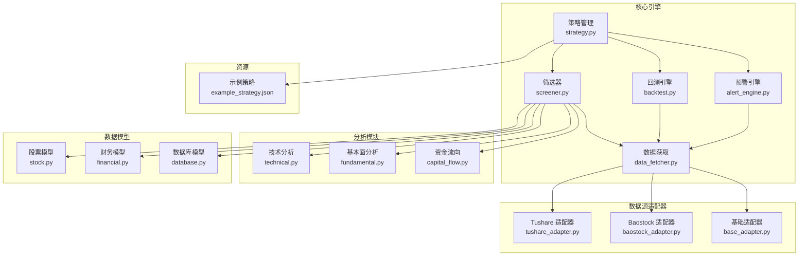
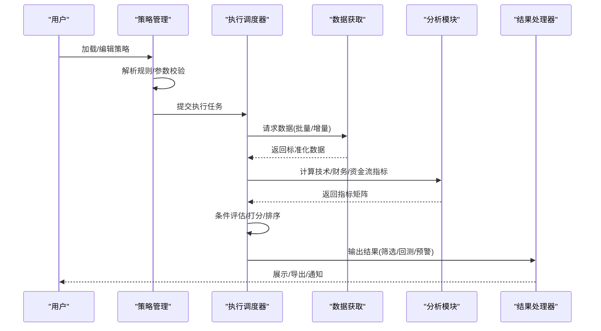
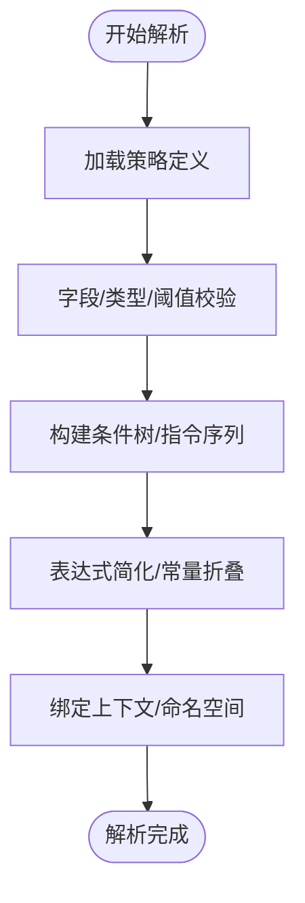
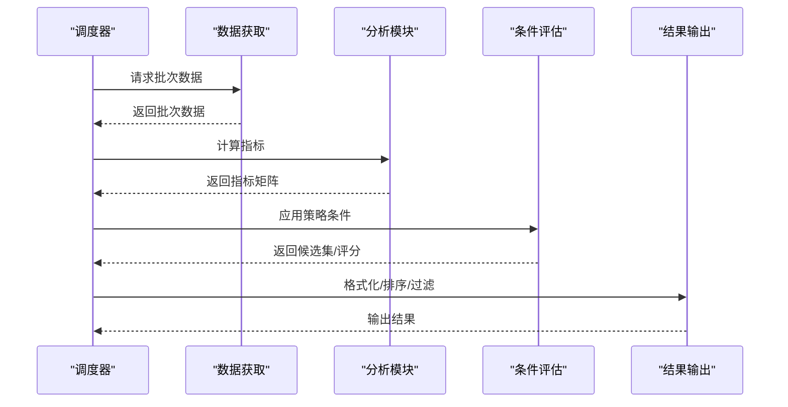
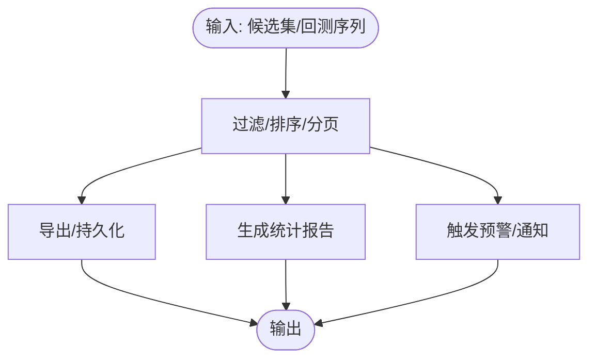
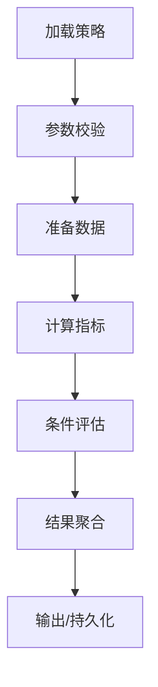
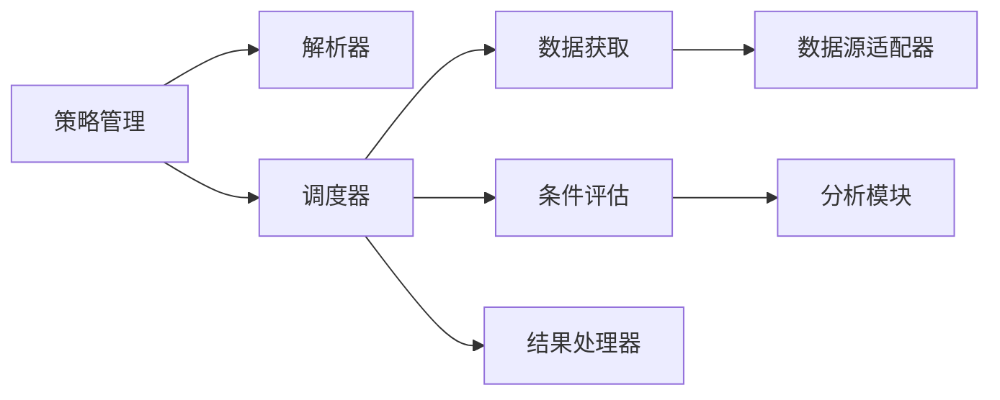

# 策略引擎

<cite>
**本文引用的文件**
- [PRD.md](file://docs/PRD.md)
- [screener.py](file://src/core/screener.py)
- [strategy.py](file://src/core/strategy.py)
- [backtest.py](file://src/core/backtest.py)
- [alert_engine.py](file://src/core/alert_engine.py)
- [data_fetcher.py](file://src/core/data_fetcher.py)
- [technical.py](file://src/analysis/technical.py)
- [fundamental.py](file://src/analysis/fundamental.py)
- [capital_flow.py](file://src/analysis/capital_flow.py)
- [stock.py](file://src/models/stock.py)
- [financial.py](file://src/models/financial.py)
- [database.py](file://src/models/database.py)
- [tushare_adapter.py](file://src/datasource/tushare_adapter.py)
- [baostock_adapter.py](file://src/datasource/baostock_adapter.py)
- [base_adapter.py](file://src/datasource/base_adapter.py)
- [example_strategy.json](file://resources/strategies/example_strategy.json)
</cite>

## 目录
1. [引言](#引言)
2. [项目结构](#项目结构)
3. [核心组件](#核心组件)
4. [架构总览](#架构总览)
5. [详细组件分析](#详细组件分析)
6. [依赖关系分析](#依赖关系分析)
7. [性能考虑](#性能考虑)
8. [故障排查指南](#故障排查指南)
9. [结论](#结论)
10. [附录](#附录)

## 引言
本文件系统化梳理策略引擎模块的设计与实现，覆盖策略解析器、执行调度器与结果处理器的职责边界；文档化策略规则定义语法（条件表达式、运算符、数据引用方式）；详述从策略加载、参数校验到结果计算的完整执行流程；解释策略缓存机制与性能优化策略；给出策略配置示例与最佳实践；提供调试与测试方法及常见问题解决方案。

## 项目结构
策略引擎位于核心模块 src/core，围绕“筛选器”“策略管理”“回测引擎”“预警引擎”“数据获取”五大子系统协同工作；分析模块 src/analysis 提供技术面、基本面、资金流等指标计算；数据模型 src/models 定义股票与财务实体；数据源适配器 src/datasource 支持多数据源接入；资源目录 resources/strategies 提供策略样例。

**图示来源**
- [PRD.md](file://docs/PRD.md)
- [screener.py](file://src/core/screener.py)
- [strategy.py](file://src/core/strategy.py)
- [backtest.py](file://src/core/backtest.py)
- [alert_engine.py](file://src/core/alert_engine.py)
- [data_fetcher.py](file://src/core/data_fetcher.py)
- [technical.py](file://src/analysis/technical.py)
- [fundamental.py](file://src/analysis/fundamental.py)
- [capital_flow.py](file://src/analysis/capital_flow.py)
- [stock.py](file://src/models/stock.py)
- [financial.py](file://src/models/financial.py)
- [database.py](file://src/models/database.py)
- [tushare_adapter.py](file://src/datasource/tushare_adapter.py)
- [baostock_adapter.py](file://src/datasource/baostock_adapter.py)
- [base_adapter.py](file://src/datasource/base_adapter.py)
- [example_strategy.json](file://resources/strategies/example_strategy.json)

**章节来源**
- [PRD.md](file://docs/PRD.md)

## 核心组件
- 策略解析器：负责将策略规则（JSON/DSL）解析为内部可执行的条件树或指令序列，支持字段引用、比较运算符、逻辑组合与函数调用。
- 执行调度器：协调数据获取、指标计算、条件评估与结果聚合，按时间窗口推进，支持批量与增量执行。
- 结果处理器：对筛选/回测/预警输出进行格式化、过滤、排序与持久化，生成报告或触发后续动作。
- 策略管理：策略生命周期管理（加载、校验、缓存、版本控制）、策略模板与参数注入、策略运行上下文构建。
- 回测引擎：基于历史数据执行策略，计算收益曲线、风险指标与统计摘要。
- 预警引擎：基于实时/准实时数据持续评估策略，触发通知或自动化动作。
- 数据获取：统一抽象多数据源接口，提供标准化数据访问与缓存层。

**章节来源**
- [PRD.md](file://docs/PRD.md)

## 架构总览
策略引擎采用“策略管理 + 执行调度 + 结果处理”的分层设计，结合分析模块与数据源适配器形成闭环。策略规则驱动筛选与回测，分析模块提供指标，数据源适配器提供数据，最终由结果处理器输出。

**图示来源**
- [PRD.md](file://docs/PRD.md)
- [strategy.py](file://src/core/strategy.py)
- [backtest.py](file://src/core/backtest.py)
- [alert_engine.py](file://src/core/alert_engine.py)
- [data_fetcher.py](file://src/core/data_fetcher.py)
- [technical.py](file://src/analysis/technical.py)
- [fundamental.py](file://src/analysis/fundamental.py)
- [capital_flow.py](file://src/analysis/capital_flow.py)

## 详细组件分析

### 策略解析器
- 规则结构：策略以 JSON/DSL 描述，包含条件集合、运算符、阈值、时间窗口、权重与动作。
- 字段引用：支持“基础字段”（如最新价、涨跌幅、换手率）与“派生字段”（如技术指标、财务比率、资金流指标）。
- 运算符体系：比较类（>, <, >=, <=, =, 区间）、逻辑类（AND/OR/NOT）、函数类（滑动窗口统计、标准化、归一化）。
- 上下文绑定：将字段名映射到数据模型属性或分析模块输出，确保跨模块一致性。
- 校验与优化：在解析阶段完成字段存在性检查、类型匹配、阈值范围校验与表达式简化。

**图示来源**
- [strategy.py](file://src/core/strategy.py)
- [stock.py](file://src/models/stock.py)
- [financial.py](file://src/models/financial.py)

**章节来源**
- [strategy.py](file://src/core/strategy.py)
- [stock.py](file://src/models/stock.py)
- [financial.py](file://src/models/financial.py)

### 执行调度器
- 任务编排：接收策略与时间窗口，拆分为数据请求、指标计算、条件评估、结果聚合等步骤。
- 并行化：对独立股票/指标计算进行并发调度，减少整体延迟。
- 增量执行：基于上次执行结果与当前时间点，仅处理新增或变更数据。
- 上下文管理：维护全局参数、局部变量、中间结果缓存与错误状态。

**图示来源**
- [screener.py](file://src/core/screener.py)
- [backtest.py](file://src/core/backtest.py)
- [data_fetcher.py](file://src/core/data_fetcher.py)
- [technical.py](file://src/analysis/technical.py)
- [fundamental.py](file://src/analysis/fundamental.py)
- [capital_flow.py](file://src/analysis/capital_flow.py)

**章节来源**
- [screener.py](file://src/core/screener.py)
- [backtest.py](file://src/core/backtest.py)
- [data_fetcher.py](file://src/core/data_fetcher.py)

### 结果处理器
- 筛选结果：按优先级/评分排序，支持分页、导出与自选股同步。
- 回测报告：生成净值曲线、最大回撤、夏普比率、胜率等统计指标。
- 预警推送：将触发条件的标的写入预警队列，支持消息通知或自动化交易接口对接。
- 可视化：为UI提供结构化数据，支撑图表渲染与交互。

**图示来源**
- [backtest.py](file://src/core/backtest.py)
- [alert_engine.py](file://src/core/alert_engine.py)

**章节来源**
- [backtest.py](file://src/core/backtest.py)
- [alert_engine.py](file://src/core/alert_engine.py)

### 策略规则定义语法
- 字段类别
  - 基础字段：最新价、涨跌幅、换手率、成交量、成交额、市盈率、市净率等。
  - 技术字段：基于时间序列的移动平均、MACD、KDJ、RSI、布林带等。
  - 财务字段：每股收益、净资产、ROE、负债率、营收/利润复合增速等。
  - 资金字段：主力净流入、超大单/大单/中单/小单流入、北向持股等。
- 运算符
  - 比较：>, <, >=, <=, =, 区间（区间包含/不包含）。
  - 逻辑：AND、OR、NOT；括号用于组合优先级。
  - 函数：滑动窗口统计（均值/标准差/偏度/峰度）、标准化、归一化、滞后/领先、分位数等。
- 数据引用
  - 使用统一命名空间引用字段，避免硬编码；支持相对时间引用（如 N 日前）与绝对时间窗口。
  - 对于派生指标，通过分析模块提供的接口进行引用，保证一致性与可扩展性。

**章节来源**
- [PRD.md](file://docs/PRD.md)
- [technical.py](file://src/analysis/technical.py)
- [fundamental.py](file://src/analysis/fundamental.py)
- [capital_flow.py](file://src/analysis/capital_flow.py)

### 策略执行流程
- 策略加载：从资源文件或数据库加载策略定义，解析并校验。
- 参数验证：检查阈值范围、字段存在性、表达式合法性与依赖关系。
- 数据准备：根据策略时间窗口与标的集合，请求所需历史/实时数据。
- 指标计算：调用分析模块计算所需技术/财务/资金流指标。
- 条件评估：对每个标的逐条应用策略条件，生成得分或布尔结果。
- 结果聚合：按策略要求进行排序、过滤、去重与合并。
- 输出与持久化：生成报告、导出数据、写入预警队列或自选股。

**图示来源**
- [strategy.py](file://src/core/strategy.py)
- [screener.py](file://src/core/screener.py)
- [backtest.py](file://src/core/backtest.py)
- [data_fetcher.py](file://src/core/data_fetcher.py)
- [technical.py](file://src/analysis/technical.py)
- [fundamental.py](file://src/analysis/fundamental.py)
- [capital_flow.py](file://src/analysis/capital_flow.py)

**章节来源**
- [strategy.py](file://src/core/strategy.py)
- [screener.py](file://src/core/screener.py)
- [backtest.py](file://src/core/backtest.py)

### 策略缓存机制与性能优化
- 数据缓存：对高频访问的基础数据与指标进行内存缓存；按时间窗口与标的集合建立索引，支持增量更新。
- 计算缓存：对函数型表达式（如滑动窗口统计）的结果进行缓存，避免重复计算；失效策略基于时间戳与窗口大小。
- 并行与批处理：对独立标的计算进行并发；对IO密集型数据请求进行异步批处理。
- 索引与预计算：对常用查询建立倒排索引；对热点策略进行预计算与预加载。
- 内存与磁盘：合理设置缓存容量与淘汰策略；对长期未命中数据落盘，降低内存压力。

**章节来源**
- [data_fetcher.py](file://src/core/data_fetcher.py)
- [technical.py](file://src/analysis/technical.py)

### 策略配置示例与最佳实践
- 示例策略：resources/strategies/example_strategy.json 提供基础模板，建议从简单条件开始，逐步增加复杂度与约束。
- 最佳实践
  - 将“稳定性”与“时效性”分离：先做稳健条件（如流动性、估值区间），再加时效性条件（如短期动量）。
  - 控制条件数量与权重：避免过度拟合，保持策略可解释性。
  - 明确时间窗口与频率：回测使用日频，实时预警使用分钟/小时频，避免跨周期错配。
  - 参数鲁棒性：对阈值进行敏感性测试，保留合理区间而非固定值。
  - 可复现实验：固定随机种子、数据源与时间窗口，确保结果可复现。

**章节来源**
- [example_strategy.json](file://resources/strategies/example_strategy.json)
- [PRD.md](file://docs/PRD.md)

### 调试与测试方法
- 单元测试：针对解析器、评估器与指标计算模块编写单元测试，覆盖边界条件与异常路径。
- 集成测试：构造典型策略与数据样本，验证端到端执行流程与输出一致性。
- 回测验证：使用历史数据验证策略收益与风险指标，绘制收益曲线与最大回撤。
- 性能压测：模拟高并发场景，评估缓存命中率、吞吐量与延迟。
- 日志与可观测性：在关键节点输出执行日志与性能指标，便于定位瓶颈。

**章节来源**
- [backtest.py](file://src/core/backtest.py)
- [screener.py](file://src/core/screener.py)

## 依赖关系分析
策略引擎各组件之间存在清晰的依赖边界：策略管理依赖解析器与调度器；调度器依赖数据获取与分析模块；结果处理器依赖调度器输出；数据源适配器向上提供统一接口。模块内聚高、耦合低，便于扩展与替换。

**图示来源**
- [strategy.py](file://src/core/strategy.py)
- [screener.py](file://src/core/screener.py)
- [backtest.py](file://src/core/backtest.py)
- [alert_engine.py](file://src/core/alert_engine.py)
- [data_fetcher.py](file://src/core/data_fetcher.py)
- [technical.py](file://src/analysis/technical.py)
- [fundamental.py](file://src/analysis/fundamental.py)
- [capital_flow.py](file://src/analysis/capital_flow.py)
- [tushare_adapter.py](file://src/datasource/tushare_adapter.py)
- [baostock_adapter.py](file://src/datasource/baostock_adapter.py)
- [base_adapter.py](file://src/datasource/base_adapter.py)

**章节来源**
- [PRD.md](file://docs/PRD.md)

## 性能考虑
- I/O 优化：合并请求、批量下载、压缩传输；对网络抖动与限流进行退避重试。
- 计算优化：向量化计算优先；对循环逻辑进行SIMD/并行化改造；缓存热点中间结果。
- 内存管理：分页处理大数据集；及时释放临时对象；监控峰值内存占用。
- 线程与进程：CPU密集型任务使用进程池；IO密集型使用事件循环；避免GIL竞争。
- 存储优化：列式存储优先；索引与分区策略；冷热数据分层。

[本节为通用指导，无需列出章节来源]

## 故障排查指南
- 策略解析失败：检查字段名拼写、阈值类型与表达式语法；确认字段是否在数据模型中定义。
- 数据缺失：核对数据源可用性与时间窗口；检查缓存是否过期；确认增量更新是否成功。
- 指标异常：验证计算参数（如窗口大小、平滑因子）；检查空值处理与异常值剔除。
- 性能瓶颈：分析日志中的耗时节点；识别热点函数与慢查询；评估缓存命中率。
- 回测偏差：确认样本外测试、滑点与手续费建模；检查数据前复权与成分股调整。

**章节来源**
- [strategy.py](file://src/core/strategy.py)
- [data_fetcher.py](file://src/core/data_fetcher.py)
- [technical.py](file://src/analysis/technical.py)

## 结论
策略引擎通过“解析—调度—处理”三层架构，结合分析模块与数据源适配器，实现了从规则到结果的高效闭环。遵循本文的语法规范、执行流程与优化策略，可构建稳定、可扩展且高性能的选股策略系统。

[本节为总结性内容，无需列出章节来源]

## 附录
- 关键文件清单与职责概览见“本文引用的文件”。
- 示例策略可参考 resources/strategies/example_strategy.json。
- 技术指标与财务字段定义详见 PRD 中的“技术指标筛选”与“财务指标”。

**章节来源**
- [PRD.md](file://docs/PRD.md)
- [example_strategy.json](file://resources/strategies/example_strategy.json)