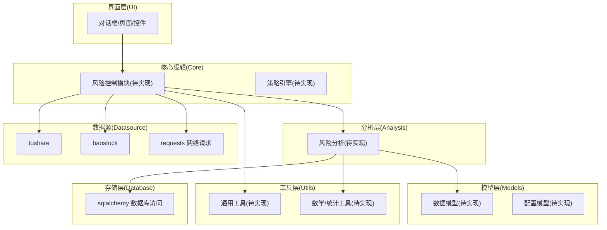
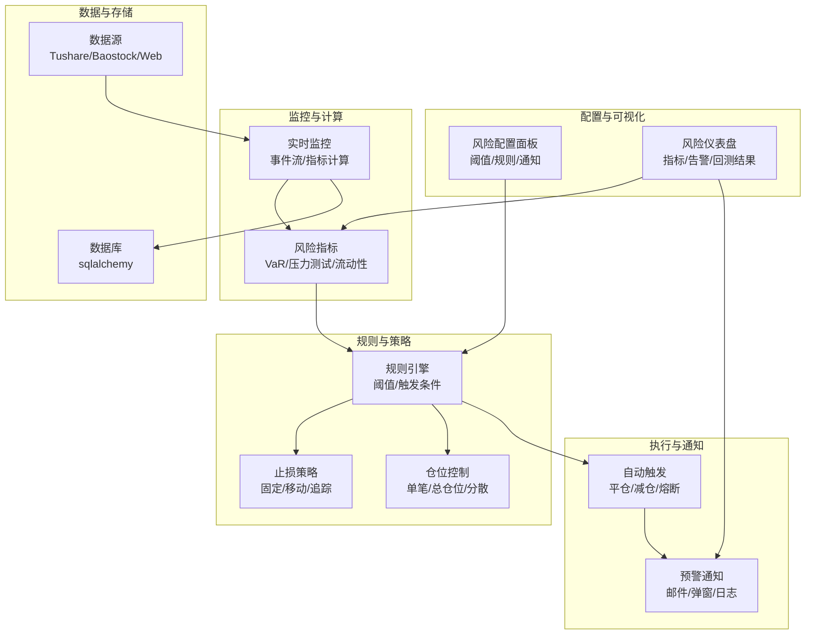
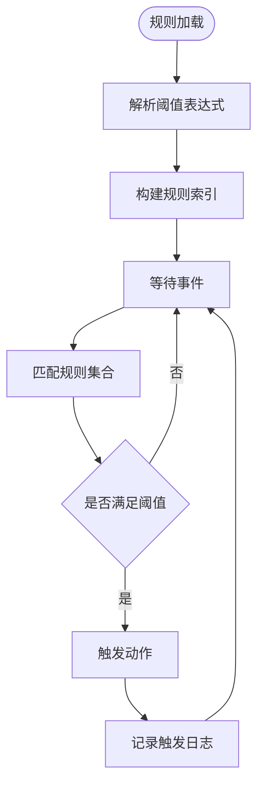
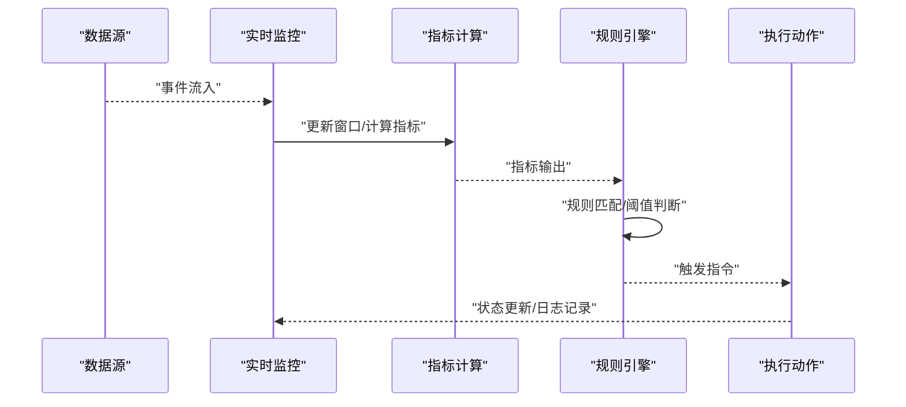
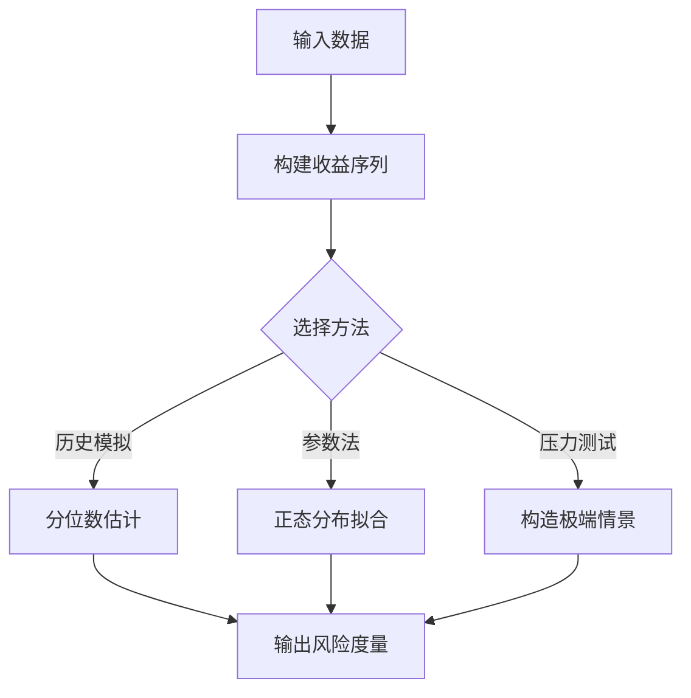
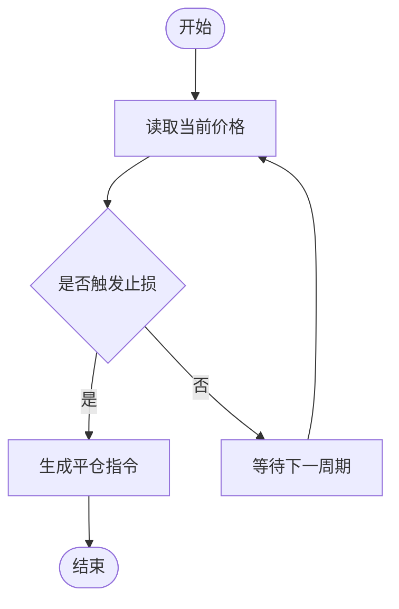
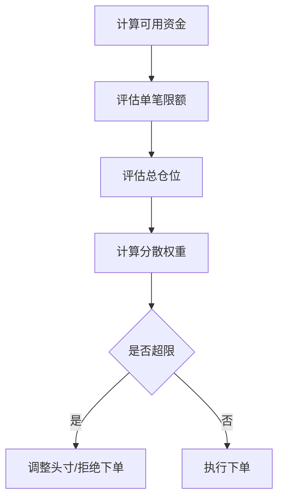
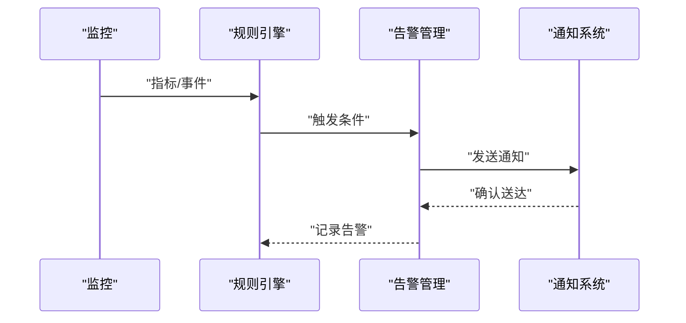
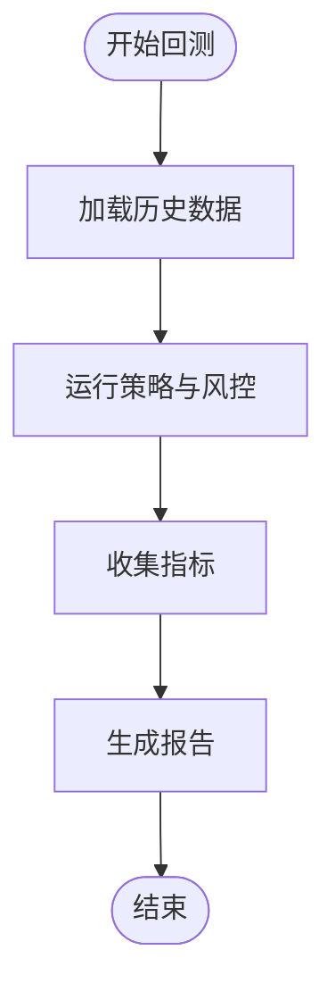
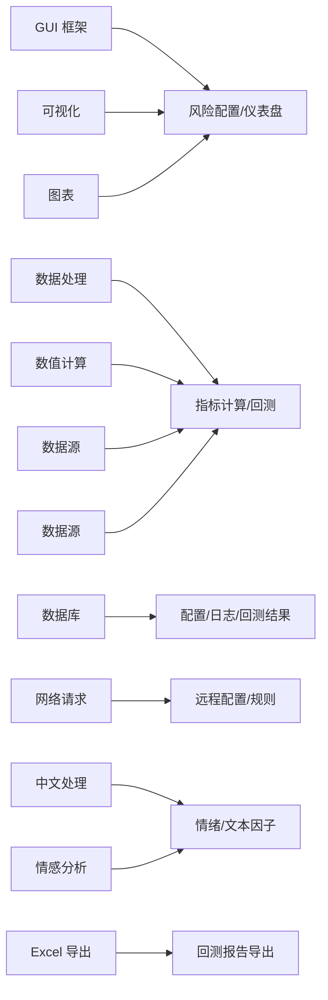

# 风险控制

<cite>
**本文引用的文件**
- [requirements.txt](file://requirements.txt)
- [README.md](file://README.md)
</cite>

## 目录
1. [引言](#引言)
2. [项目结构](#项目结构)
3. [核心组件](#核心组件)
4. [架构总览](#架构总览)
5. [详细组件分析](#详细组件分析)
6. [依赖分析](#依赖分析)
7. [性能考虑](#性能考虑)
8. [故障排查指南](#故障排查指南)
9. [结论](#结论)
10. [附录](#附录)

## 引言
本技术文档面向“风险控制系统”的设计与实现，聚焦于风险阈值设定、实时监控与自动触发机制；解释市场风险、信用风险与流动性风险的量化评估思路；给出止损策略（固定止损、移动止损、追踪止损）与仓位控制算法（单笔限制、总仓位管理、跨品种分散）的实现要点；并提供风险预警系统的配置与使用指南以及策略回测与验证方法。  
当前仓库中未发现直接的风险控制模块源码与配置文件，因此本文件以概念性与方法论为主，结合现有依赖与项目结构，给出可落地的实施建议与最佳实践。

## 项目结构
该项目为 A 股量化选股软件，采用分层组织：UI 层、数据源层、模型层、分析层、工具层与核心运行逻辑所在。从依赖清单可见，系统使用 PyQt6 进行界面开发，使用 pandas/numpy 进行数据处理，使用 tushare/baostock 等作为数据源，使用 matplotlib/pyqtgraph 进行可视化，使用 sqlalchemy 访问数据库，使用 requests 进行网络请求，使用 jieba/snownlp 进行中文文本处理，使用 openpyxl 导出 Excel。  
该结构为风险控制系统的扩展提供了良好的分层基础：可在“核心”“分析”“模型”“工具”等目录下按功能域新增风险控制模块，并通过 UI 层进行配置与展示。

**章节来源**
- [requirements.txt:1-32](file://requirements.txt#L1-L32)

## 核心组件
围绕风险控制目标，建议在现有项目结构中新增以下核心组件（概念性说明，非现有实现）：

- 风险阈值与规则引擎
  - 定义市场风险、信用风险、流动性风险的阈值与规则集，支持动态配置与热更新。
  - 提供规则解析器与执行器，统一调度各类风险指标计算与告警触发。
- 实时监控与事件流
  - 基于数据源的增量更新，构建事件流，驱动风险指标滚动计算与阈值比对。
  - 支持批量回放与实时模式切换，便于回测与实盘。
- 止损策略模块
  - 固定止损：基于入场价的固定百分比或点数阈值。
  - 移动止损：跟踪价格波动，动态调整止损能力。
  - 追踪止损：基于趋势与波动率的复合策略。
- 仓位控制模块
  - 单笔交易限制：按账户净值或单笔最大回撤比例限制单笔头寸。
  - 总仓位管理：按资产类别或策略维度汇总头寸，避免过度集中。
  - 跨品种分散：基于相关性与波动率矩阵进行分散化建仓。
- 风险预警系统
  - 报警规则：阈值、时间窗口、触发次数、冷却期等。
  - 通知机制：邮件/短信/弹窗/日志/仪表盘联动。
- 回测与验证
  - 构造历史场景，验证止损与风控规则在不同市场环境下的表现。
  - 使用统计指标（如最大回撤、胜率、夏普比率）评估策略鲁棒性。

## 架构总览
下图展示了风险控制系统的高层架构：UI 配置层、规则引擎、实时监控、策略执行、预警与通知、回测与验证、数据与存储。

## 详细组件分析

### 风险阈值与规则引擎
- 设计理念
  - 将阈值与规则解耦，支持多维阈值组合与优先级排序。
  - 规则可按品种、策略、时间窗口、市场状态（震荡/趋势）差异化配置。
- 实现要点
  - 规则解析：将阈值表达式转换为可执行的比较函数。
  - 执行调度：按事件流顺序执行规则，记录触发日志与上下文。
  - 热更新：监听配置文件变更，平滑替换规则集。
- 复杂度与性能
  - 规则匹配复杂度取决于规则数量与事件频率，可通过索引与缓存优化。

### 实时监控与事件流
- 设计理念
  - 以事件驱动的方式处理行情、订单、账户与风控信号。
  - 支持批量回放与实时模式，便于离线验证与在线运行。
- 实现要点
  - 事件类型：K线、报价、委托回报、成交回报、账户变更、风控信号。
  - 指标计算：滚动窗口内的统计量（均值、方差、分位数、最大回撤）。
  - 限流与背压：在高并发下保证系统稳定性。
- 复杂度与性能
  - 指标计算通常为 O(1)/O(logN)，窗口大小决定内存占用与刷新频率。

### 市场风险、信用风险与流动性风险量化
- 市场风险（VaR/压力测试）
  - 历史模拟法：基于历史收益率分布估计最大潜在损失。
  - 参数法：假设正态分布，用均值与标准差估算风险。
  - 压力测试：模拟极端市场情景，评估尾部风险。
- 信用风险（主体违约与集中度）
  - 违约概率与违约损失率结合，计算预期与非预期损失。
  - 集中度限额：对单一对手方或行业敞口设置上限。
- 流动性风险（买卖价差与换手）
  - 价差风险：基于买卖价差与滑点模拟。
  - 换手约束：限制单日换手率与跨日累计换手。
- 复杂度与性能
  - VaR 计算通常为 O(N) 或 O(N log N)，压力测试成本更高。

### 止损机制实现
- 固定止损
  - 基于入场价的固定百分比或点数阈值，适用于震荡市场。
- 移动止损
  - 跟踪价格波动，动态调整止损位，适用于趋势市场。
- 追踪止损
  - 结合趋势与波动率，采用 ATR 或自适应通道，降低假突破。
- 复杂度与性能
  - 止损判定为 O(1)，但需与订单执行系统协同，避免滑点与延迟。

### 仓位控制算法
- 单笔交易限制
  - 以账户净值或单笔最大回撤比例限制单笔头寸，避免单次重仓。
- 总仓位管理
  - 汇总各策略/资产类别的头寸，确保总敞口不超过限额。
- 跨品种分散
  - 基于相关性矩阵与波动率，进行等权/风险平价/最小方差分散。
- 复杂度与性能
  - 分散优化通常为凸优化问题，可采用二次规划或近似算法。

### 风险预警系统配置与使用
- 报警规则设置
  - 阈值类型：绝对值/相对值/比率。
  - 时间窗口：分钟/小时/日。
  - 触发次数与冷却期：防止频繁告警。
- 通知机制
  - 弹窗提示：用于实时干预。
  - 日志记录：审计与回溯。
  - 邮件/短信：重要风险事件的外部通知。
- 复杂度与性能
  - 规则匹配与通知发送为 O(R)，R 为规则数量。

### 回测与验证方法
- 场景构造
  - 历史回放：使用历史 K 线与成交数据验证策略与风控规则。
  - 随机扰动：加入噪声与滑点，评估鲁棒性。
- 统计指标
  - 最大回撤、年化收益/波动率、胜率、夏普比率、尾部损失。
- 可视化与报告
  - 仪表盘展示关键指标与回测路径，生成报告导出。

## 依赖分析
项目依赖与风险控制模块的适配关系如下：
- GUI 与可视化：PyQt6、matplotlib、pyqtgraph，可用于构建风险配置面板与仪表盘。
- 数据处理：pandas、numpy，用于指标计算与回测数据处理。
- 数据源：tushare、baostock，提供行情与财务数据，支撑风险指标计算。
- 存储：sqlalchemy，用于持久化配置、日志与回测结果。
- 网络：requests，用于外部接口或远程配置拉取。
- 文本处理：jieba、snownlp，可用于新闻情绪等替代风险因子。
- 导出：openpyxl，用于导出回测报告与配置。

**章节来源**
- [requirements.txt:1-32](file://requirements.txt#L1-L32)

## 性能考虑
- 指标计算
  - 使用向量化与缓存减少重复计算；对滚动窗口采用双端队列维护。
- 事件流
  - 采用异步事件循环与背压机制，避免积压与丢包。
- 规则匹配
  - 对规则建立索引（按指标类型、时间窗口），提升匹配效率。
- 存储与查询
  - 对高频指标与告警日志使用分区表与索引优化。
- 可扩展性
  - 将规则引擎与策略引擎解耦，支持插件化扩展。

## 故障排查指南
- 配置不生效
  - 检查配置文件格式与权限；确认热更新是否启用；核对规则 ID 与指标名称一致性。
- 指标异常
  - 核对数据源质量与缺失值处理；检查窗口长度与采样频率；验证计算方法与边界条件。
- 告警风暴
  - 调整触发次数与冷却期；增加告警去重逻辑；限制通知渠道频率。
- 回测偏差
  - 校验滑点与手续费模型；检查样本外测试；复核数据前复权与除权处理。
- 性能瓶颈
  - 分析热点函数与内存占用；引入缓存与批处理；优化数据库查询。

## 结论
本文件基于现有项目结构与依赖，提出了风险控制系统的概念性实现方案。建议在“核心”“分析”“模型”“工具”等目录下逐步落地规则引擎、实时监控、止损与仓位控制、预警与回测模块，并利用现有 GUI 与数据处理能力快速搭建原型。后续可根据业务需求迭代完善阈值体系、指标算法与自动化执行流程。

## 附录
- 快速上手步骤
  - 在 UI 中配置风险阈值与报警规则。
  - 启用实时监控并接入数据源。
  - 运行回测验证策略与风控规则。
  - 上线后持续观察仪表盘与告警日志，动态优化阈值与规则。