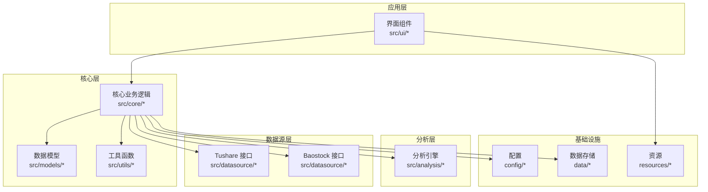
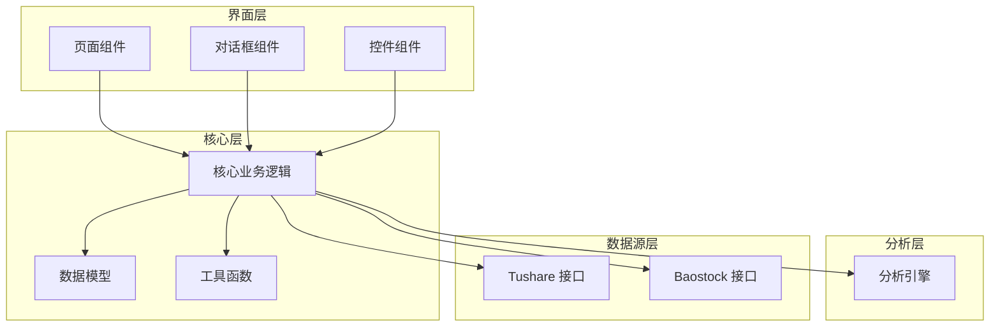
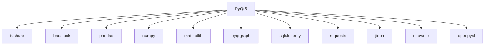

# 核心模块详解

<cite>
**本文档引用的文件**
- [requirements.txt](file://requirements.txt)
- [PRD.md](file://docs/PRD.md)
</cite>

## 目录
1. [简介](#简介)
2. [项目结构](#项目结构)
3. [核心组件](#核心组件)
4. [架构总览](#架构总览)
5. [详细组件分析](#详细组件分析)
6. [依赖分析](#依赖分析)
7. [性能考虑](#性能考虑)
8. [故障排除指南](#故障排除指南)
9. [结论](#结论)
10. [附录](#附录)

## 简介
本文件面向StockSift项目的开发者与维护者，系统性梳理核心模块的设计理念、职责边界与交互关系。根据现有仓库信息，项目采用分层架构：GUI层（PyQt6）、数据源层（tushare、baostock等）、分析与核心业务层、数据模型与工具层，并通过配置与资源目录支撑运行时行为。本文档旨在帮助读者快速理解系统内部工作机制，掌握扩展与自定义方法。

## 项目结构
仓库采用按功能域划分的目录组织方式：
- src：核心源码目录，包含analysis（分析引擎）、core（核心业务逻辑）、datasource（数据源接口）、models（数据模型）、ui（界面组件）、utils（工具函数）等子模块
- config：配置相关资源
- data：缓存、数据库与日志等运行时数据
- resources：图标、策略模板、主题等静态资源
- docs：产品需求文档（PRD）
- requirements.txt：第三方依赖清单

**图表来源**
- [requirements.txt](file://requirements.txt)
- [PRD.md](file://docs/PRD.md)

**章节来源**
- [requirements.txt](file://requirements.txt)
- [PRD.md](file://docs/PRD.md)

## 核心组件
本节概述各核心模块的职责与定位：
- 分析引擎（src/analysis）：负责技术指标计算、信号生成、回测框架与策略评估等分析任务
- 核心业务逻辑（src/core）：协调分析引擎与数据源，封装交易规则、组合管理与风险控制等业务流程
- 数据源接口（src/datasource）：抽象统一的数据接入层，屏蔽不同数据提供商差异，提供标准化数据访问
- 数据模型（src/models）：定义股票、财务、行情、用户偏好等实体模型及序列化规范
- 工具函数（src/utils）：通用算法、文本处理（中文分词、情感分析）、导出（Excel）等辅助能力
- 界面组件（src/ui）：基于PyQt6构建的页面、对话框与控件，承载用户交互与结果展示
- 配置与资源（config、resources）：运行参数、策略模板、主题与图标等静态资源
- 基础设施（data）：缓存、数据库与日志目录，支撑运行时数据持久化与可观测性

**章节来源**
- [requirements.txt](file://requirements.txt)
- [PRD.md](file://docs/PRD.md)

## 架构总览
下图展示了从界面到数据源的整体调用链路与模块间依赖：

**图表来源**
- [requirements.txt](file://requirements.txt)
- [PRD.md](file://docs/PRD.md)

## 详细组件分析

### 分析引擎（src/analysis）
- 职责
  - 技术指标计算：如移动平均、MACD、RSI等
  - 信号生成：基于指标阈值与交叉规则生成买卖信号
  - 回测框架：支持多标的、多周期回测，输出收益曲线与统计指标
  - 策略评估：提供夏普比率、最大回撤、胜率等评估指标
- 设计要点
  - 输入输出标准化：统一时间序列格式与索引约定
  - 可插拔策略：通过配置或注册机制扩展新策略
  - 并行化优化：对多标的/多周期场景进行向量化与并行加速
- 扩展建议
  - 新增策略：遵循统一接口，确保输入输出契约一致
  - 自定义指标：提供可配置参数与边界校验
  - 结果可视化：结合图表组件输出分析报告

**章节来源**
- [PRD.md](file://docs/PRD.md)

### 核心业务逻辑（src/core）
- 职责
  - 组合管理：构建与维护候选池、权重分配与动态调整
  - 交易规则：下单、止盈止损、风控限额与滑点模拟
  - 风险控制：集中度、波动率与流动性约束
  - 流程编排：串联数据拉取、清洗、分析与决策
- 设计要点
  - 事务一致性：保证下单与持仓更新原子性
  - 参数化：通过配置驱动策略参数与风控阈值
  - 错误隔离：异常捕获与降级策略，避免单点故障扩散
- 扩展建议
  - 新增风控维度：在统一风控框架内扩展约束类型
  - 多市场适配：抽象跨市场接口，复用核心流程

**章节来源**
- [PRD.md](file://docs/PRD.md)

### 数据源接口（src/datasource）
- 职责
  - 统一抽象：屏蔽Tushare与Baostock差异，提供一致的查询接口
  - 数据清洗：标准化字段、填充缺失、处理停牌与复权
  - 缓存策略：热点数据本地缓存，降低外部依赖压力
- 设计要点
  - 接口契约：明确输入参数、返回格式与异常语义
  - 超时与重试：网络不稳定场景下的健壮性保障
  - 版本兼容：针对不同数据提供商的版本差异做适配
- 扩展建议
  - 新增数据源：实现统一接口，完成字段映射与清洗规则
  - 增量更新：支持按日期范围增量拉取，减少全量压力

**章节来源**
- [requirements.txt](file://requirements.txt)
- [PRD.md](file://docs/PRD.md)

### 数据模型（src/models）
- 职责
  - 实体建模：股票、财务、行情、用户偏好等核心领域对象
  - 序列化：JSON/数据库映射，支持导出与持久化
  - 校验：字段类型、取值范围与业务约束验证
- 设计要点
  - 不可变性：优先使用不可变对象，降低并发问题
  - 映射清晰：字段命名与业务含义一致，避免歧义
- 扩展建议
  - 新增实体：补充序列化与校验逻辑
  - 关系演进：通过外键与关联查询表达复杂业务关系

**章节来源**
- [PRD.md](file://docs/PRD.md)

### 工具函数（src/utils）
- 职责
  - 文本处理：中文分词、关键词提取、情感分析
  - 导出能力：Excel导出、图表生成与报告模板
  - 通用算法：排序、聚类、回归等基础算法封装
- 设计要点
  - 性能优先：对高频操作进行向量化与缓存
  - 可测试性：提供独立单元测试入口
- 扩展建议
  - 新增算法：提供基准测试与性能对比
  - 可视化增强：与图表组件联动，提升报告质量

**章节来源**
- [requirements.txt](file://requirements.txt)
- [PRD.md](file://docs/PRD.md)

### 界面组件（src/ui）
- 职责
  - 页面：策略配置页、回测结果页、设置页
  - 对话框：参数配置、确认提示、错误弹窗
  - 控件：列表、表格、图表、按钮与输入框
- 设计要点
  - 响应式布局：适配不同分辨率与主题
  - 事件驱动：通过信号槽解耦界面与业务逻辑
- 扩展建议
  - 新页面：遵循现有路由与状态管理模式
  - 主题扩展：通过资源目录与样式表实现主题切换

**章节来源**
- [requirements.txt](file://requirements.txt)
- [PRD.md](file://docs/PRD.md)

## 依赖分析
第三方依赖与模块关系如下：
- GUI框架：PyQt6用于界面开发
- 数据源：tushare、baostock提供行情与财务数据
- 数据处理：pandas、numpy用于数值计算与数据结构
- 可视化：matplotlib、pyqtgraph用于图表绘制
- 数据库：sqlalchemy（低于2.0）用于ORM与连接管理
- 网络请求：requests用于HTTP调用
- 中文处理：jieba、snownlp用于文本分析
- Excel导出：openpyxl用于报表导出

**图表来源**
- [requirements.txt](file://requirements.txt)

**章节来源**
- [requirements.txt](file://requirements.txt)

## 性能考虑
- 向量化与并行：利用pandas/numpy进行批量计算，必要时引入多进程/多线程
- 缓存策略：热点数据本地缓存，减少重复拉取；合理设置过期策略
- I/O优化：批量写入数据库，合并HTTP请求，启用连接池
- 可视化渲染：延迟加载与虚拟滚动，避免一次性渲染大量数据
- 内存管理：及时释放大对象引用，使用生成器与迭代器处理大数据集

## 故障排除指南
- 网络超时与限流
  - 现象：数据拉取失败、响应缓慢
  - 处理：增加超时重试、熔断降级、切换备用数据源
- 数据不一致
  - 现象：字段缺失、格式异常、停牌处理不当
  - 处理：完善清洗规则、增加校验与告警
- GUI卡顿
  - 现象：界面无响应、图表渲染慢
  - 处理：异步加载、分页显示、禁用非关键功能
- 导出失败
  - 现象：Excel写入异常、文件损坏
  - 处理：检查权限与路径、分块写入、异常回滚

## 结论
StockSift通过清晰的分层架构与模块化设计，实现了从数据接入、分析计算到界面展示的完整闭环。核心模块职责明确、接口稳定、可扩展性强。建议在新增功能时严格遵循现有契约与最佳实践，确保系统整体稳定性与可维护性。

## 附录
- 使用模式
  - 数据接入：通过数据源接口统一拉取，经清洗后进入分析引擎
  - 分析执行：按策略配置运行分析，产出信号与回测报告
  - 业务编排：核心业务逻辑协调分析结果与风控规则，驱动下单与调仓
  - 界面呈现：UI组件绑定业务状态，提供交互与可视化
- 扩展路径
  - 新增数据源：实现统一接口，完善字段映射与清洗规则
  - 新增策略：在分析引擎注册新策略，提供参数化与评估指标
  - 新增页面：在UI层添加页面与对话框，绑定业务逻辑与状态管理