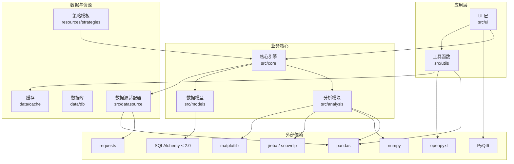
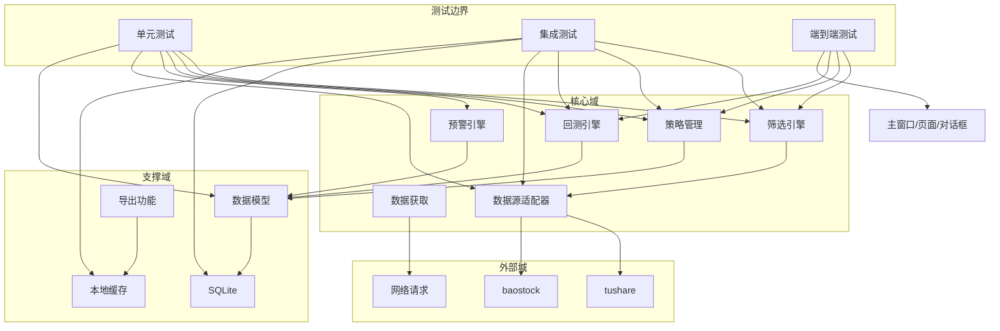
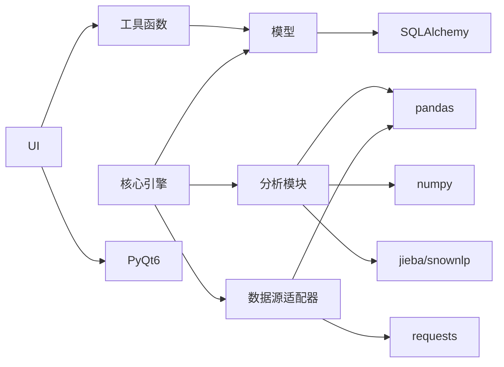

# 测试策略

<cite>
**本文引用的文件**
- [requirements.txt](file://requirements.txt)
- [PRD.md](file://docs/PRD.md)
- [src/core](file://src/core)
- [src/datasource](file://src/datasource)
- [src/models](file://src/models)
- [src/ui](file://src/ui)
- [src/utils](file://src/utils)
- [data/db](file://data/db)
- [data/cache](file://data/cache)
- [resources/strategies](file://resources/strategies)
</cite>

## 目录
1. [引言](#引言)
2. [项目结构](#项目结构)
3. [核心组件](#核心组件)
4. [架构总览](#架构总览)
5. [详细组件分析](#详细组件分析)
6. [依赖分析](#依赖分析)
7. [性能考虑](#性能考虑)
8. [故障排查指南](#故障排查指南)
9. [结论](#结论)
10. [附录](#附录)

## 引言
本测试策略文档面向StockSift项目的测试工程师与开发者，旨在建立覆盖单元测试、集成测试与端到端测试的质量保证体系。结合项目技术栈与模块架构，明确测试数据准备、测试环境搭建、测试用例设计规范、自动化测试流程、持续集成配置以及测试覆盖率目标，并给出测试驱动开发最佳实践与代码质量检查标准，帮助团队在Python 3.8 + PyQt6 + 多数据源环境下稳定交付高质量产品。

## 项目结构
StockSift采用分层模块化组织：核心引擎（core）、数据源适配器（datasource）、分析模块（analysis）、模型定义（models）、用户界面（ui）与工具函数（utils）。数据与资源分别位于data与resources目录。下图展示与测试相关的关键目录与职责映射：

**图表来源**
- [PRD.md:214-247](file://docs/PRD.md#L214-L247)
- [requirements.txt:4-31](file://requirements.txt#L4-L31)

**章节来源**
- [PRD.md:204-247](file://docs/PRD.md#L204-L247)
- [requirements.txt:1-32](file://requirements.txt#L1-L32)

## 核心组件
围绕测试目标，以下核心组件是测试策略的重点对象：
- 核心引擎：筛选引擎、策略管理、回测引擎、预警引擎、数据获取
- 数据源适配器：基础适配器、tushare适配器、baostock适配器
- 分析模块：技术分析、基本面分析、资金流向、情绪分析
- 数据模型：股票、预警、财务、数据库
- UI层：主窗口、页面、对话框、组件
- 工具函数：通用数据处理、导出、缓存、日志等

这些组件涉及高频I/O（网络请求、数据库读写）、复杂计算（技术指标、回测）、状态管理（自选股、策略状态）与图形渲染（图表），对稳定性与正确性要求高，需分层设计测试策略。

**章节来源**
- [PRD.md:214-247](file://docs/PRD.md#L214-L247)

## 架构总览
下图展示测试视角下的系统交互关系，强调测试隔离边界与依赖注入点，便于Mock与桩件替换。

**图表来源**
- [PRD.md:214-247](file://docs/PRD.md#L214-L247)

## 详细组件分析

### 单元测试（Unit Tests）
目标：验证独立函数、类方法与小规模逻辑的正确性；快速反馈、高可维护性；通过Mock隔离外部依赖。

- 测试范围
  - 工具函数：数据清洗、格式转换、导出、缓存操作
  - 模型类：数据验证、序列化/反序列化、约束校验
  - 分析算法：技术指标计算、信号生成、统计量计算
  - 核心逻辑：策略规则解析、条件判断、异常路径

- 设计原则
  - 每个函数/方法至少覆盖正常路径与典型边界条件
  - 使用参数化测试覆盖多输入组合
  - 对随机性逻辑进行种子固定或统计显著性检验
  - 对I/O依赖使用Mock对象替代（网络、文件、数据库）

- 用例设计规范
  - 输入/期望输出明确标注
  - 边界值：空值、极值、越界、非法字符
  - 异常路径：抛出异常类型、错误码、日志级别
  - 可重复性：确定性行为、时间相关逻辑需可控

- 覆盖率要求
  - 关键路径与分支覆盖率不低于80%
  - 模型与工具函数不低于85%

- 示例关注点（不展示代码）
  - 工具函数：数据导出、缓存读写、日志格式化
  - 模型类：字段校验、默认值、序列化一致性
  - 技术分析：移动平均、RSI、MACD等指标的数值稳定性
  - 策略规则：条件表达式求值、优先级与短路逻辑

**章节来源**
- [src/utils](file://src/utils)
- [src/models](file://src/models)
- [src/analysis](file://src/analysis)

### 集成测试（Integration Tests）
目标：验证模块间协作、数据流与接口契约；重点覆盖数据源适配、数据库交互与导出流程。

- 测试范围
  - 数据源适配器：适配器选择、API Key配置、失败重试与降级
  - 数据库：Schema初始化、事务一致性、并发读写
  - 导出流程：Excel生成、文件完整性、编码与格式
  - 缓存：命中率、过期策略、磁盘空间占用

- 设计原则
  - 使用内存数据库或临时数据库实例，避免污染生产数据
  - 通过桩件模拟外部服务，控制响应时延与错误场景
  - 关注跨模块调用链：从数据获取到存储再到UI展示

- 用例设计规范
  - 正向流程：完整链路端到端通过
  - 容错流程：断网、限流、超时、部分数据缺失
  - 并发场景：多线程/多进程同时读写
  - 性能门槛：批量导入/导出的吞吐与时延

- 覆盖率要求
  - 接口契约与数据流转覆盖率不低于70%

- 示例关注点（不展示代码）
  - 适配器：API Key轮换、自动切换、错误码映射
  - 数据库：迁移脚本、索引有效性、锁竞争
  - 导出：列宽、公式、样式、大文件分片

**章节来源**
- [src/datasource](file://src/datasource)
- [src/models](file://src/models)
- [data/db](file://data/db)
- [data/cache](file://data/cache)

### 端到端测试（E2E Tests）
目标：模拟真实用户场景，验证主流程闭环与UI一致性；确保关键业务路径可用。

- 测试范围
  - 主流程：启动应用、登录/配置、股票筛选、策略回测、导出报告
  - UI一致性：主题切换、布局适配、控件状态
  - 数据流：从数据源到界面渲染的全链路

- 设计原则
  - 使用最小化前置数据集，确保可重复执行
  - 通过虚拟显示或headless模式运行UI测试
  - 将外部依赖Mock化，聚焦业务逻辑与交互

- 用例设计规范
  - 场景驱动：典型用户任务列表
  - 失败恢复：异常中断后的重启与状态恢复
  - 性能观测：关键页面加载时延、首屏时间

- 覆盖率要求
  - 关键业务路径通过率100%，UI回归通过率不低于95%

- 示例关注点（不展示代码）
  - 主窗口：菜单栏、工具栏、侧边栏导航
  - 页面：筛选页、回测页、自选股页
  - 对话框：设置、导入/导出、错误提示

**章节来源**
- [src/ui](file://src/ui)
- [resources/strategies](file://resources/strategies)

### 测试数据准备
- 结构化数据
  - 股票行情：OHLCV、财务报表、概念板块
  - 自选股：用户ID-股票ID映射
  - 策略规则：JSON/模板文件，含条件表达式与权重
- 非结构化数据
  - 新闻文本：用于情绪分析
  - 图表数据：用于可视化回归
- Mock数据
  - 适配器响应：成功、失败、超时、限流
  - 数据库快照：初始化脚本与基准数据
- 数据管理
  - 使用临时目录存放测试数据库与缓存
  - 清理策略：测试结束后删除临时文件

**章节来源**
- [resources/strategies](file://resources/strategies)
- [data/db](file://data/db)
- [data/cache](file://data/cache)

### 测试环境搭建
- 运行时环境
  - Python 3.8 + PyQt6 + 必要依赖（见依赖清单）
  - 可选：虚拟显示（Xvfb）用于headless UI测试
- 配置项
  - 数据库：SQLite内存模式或临时文件
  - 缓存：临时目录，禁用持久化
  - 日志：测试级别，输出到控制台或临时文件
- 外部服务
  - 代理/桩：tushare/baostock响应桩
  - API Key：测试专用密钥或占位符

**章节来源**
- [requirements.txt:1-32](file://requirements.txt#L1-L32)

### 测试用例设计规范
- 可读性
  - 用例命名清晰表达前提、动作与期望
  - 断言信息明确指出失败原因
- 可维护性
  - 参数化与共享Fixture减少重复
  - 明确的前置条件与清理步骤
- 可靠性
  - 时间敏感逻辑使用可控时钟或固定种子
  - 随机性逻辑进行统计检验
- 可追踪性
  - 关联需求ID与缺陷编号
  - 记录失败上下文（输入、环境变量、日志）

**章节来源**
- [src/analysis](file://src/analysis)
- [src/models](file://src/models)

### 自动化测试流程与持续集成
- 流程
  - 提交触发：单元测试优先，失败即停
  - 集成测试：通过后执行，覆盖关键模块
  - 端到端测试：夜间或PR合并前执行
  - 覆盖率报告：生成并上传至覆盖率平台
- 触发策略
  - 分支保护：master/main受保护，需通过测试
  - PR策略：最小必要测试集，全量回归按需触发
- 覆盖率阈值
  - 代码行覆盖率不低于80%，分支覆盖率不低于70%
- 报告与归档
  - 测试报告与日志归档，失败重试策略

**章节来源**
- [requirements.txt:1-32](file://requirements.txt#L1-L32)

### 测试驱动开发（TDD）最佳实践
- 行为驱动
  - 先写失败用例，再实现最小逻辑
  - 逐步细化边界与异常路径
- 重构保障
  - 用例作为安全网，保持稳定性
  - 保持用例简洁，避免过度耦合
- 文档化
  - 用例即规格说明，减少额外文档
  - 注释解释为何测试而非仅描述如何测试

**章节来源**
- [src/core](file://src/core)
- [src/analysis](file://src/analysis)

### 代码质量检查标准
- 静态检查
  - 类型注解：函数签名、返回值、属性
  - 复杂度：圈复杂度不超过10
  - 命名：模块、类、函数、变量符合PEP8
- 动态检查
  - 内存泄漏检测：长时运行场景
  - 线程安全：共享状态加锁或无共享
  - I/O瓶颈：批量操作与异步化
- 可观测性
  - 关键路径埋点与采样日志
  - 错误分类与告警分级

**章节来源**
- [src/utils](file://src/utils)
- [src/models](file://src/models)

## 依赖分析
- 内聚与耦合
  - 工具函数与模型类内聚高、对外依赖少，适合单元测试
  - 核心引擎与UI耦合度中等，需通过接口抽象降低耦合
  - 数据源适配器与外部服务耦合度高，需强Mock
- 外部依赖
  - 网络请求：使用超时与重试策略，避免阻塞
  - 数据库：使用连接池与事务封装，避免竞态
  - 可视化：离线渲染与截图对比，避免平台差异

**图表来源**
- [requirements.txt:4-31](file://requirements.txt#L4-L31)
- [PRD.md:204-247](file://docs/PRD.md#L204-L247)

**章节来源**
- [requirements.txt:1-32](file://requirements.txt#L1-L32)
- [PRD.md:204-247](file://docs/PRD.md#L204-L247)

## 性能考虑
- 单元测试
  - 避免真实I/O，使用Mock与内存数据
  - 批量参数化测试时注意执行时长
- 集成测试
  - 使用轻量数据库与缓存，缩短初始化时间
  - 并发测试时控制线程数与连接数
- 端到端测试
  - headless模式与虚拟显示，减少资源消耗
  - 关键页面截图对比，避免逐像素比对
- 回归效率
  - 增量测试：基于变更集选择测试子集
  - 并行执行：合理拆分测试套件

[本节为通用指导，无需列出具体文件来源]

## 故障排查指南
- 常见问题
  - 网络请求失败：检查代理、超时与重试配置
  - 数据库锁冲突：优化事务粒度与索引
  - UI测试不稳定：固定窗口尺寸与主题，禁用动画
  - 覆盖率异常：确认覆盖率工具与Python版本兼容
- 排查步骤
  - 重现最小化用例
  - 查看日志与断言失败详情
  - 分层定位：工具函数 -> 模块 -> 适配器 -> 外部服务
- 修复建议
  - 为易变逻辑增加桩件与可配置参数
  - 为关键路径添加可观测性埋点

**章节来源**
- [src/datasource](file://src/datasource)
- [src/models](file://src/models)
- [src/ui](file://src/ui)

## 结论
通过分层测试策略与严格的覆盖率与质量标准，StockSift可在多数据源与复杂UI交互场景下保持高质量交付。建议优先完善单元测试与工具函数测试，再扩展到集成与端到端测试，配合CI流水线与覆盖率监控，持续提升测试效率与信心。

[本节为总结性内容，无需列出具体文件来源]

## 附录
- 测试清单（示例）
  - 工具函数：数据导出、缓存、日志
  - 模型类：字段校验、序列化
  - 技术分析：指标计算、信号生成
  - 策略管理：规则解析、执行调度
  - 数据源适配：API Key、重试、降级
  - 数据库：迁移、事务、并发
  - 导出：Excel生成、完整性校验
  - UI：主窗口、页面、对话框、主题切换
- 覆盖率目标（建议）
  - 单元测试：行覆盖率≥80%，分支覆盖率≥70%
  - 集成测试：接口契约与数据流覆盖率≥70%
  - 端到端测试：关键业务路径100%，UI回归≥95%

[本节为补充性内容，无需列出具体文件来源]