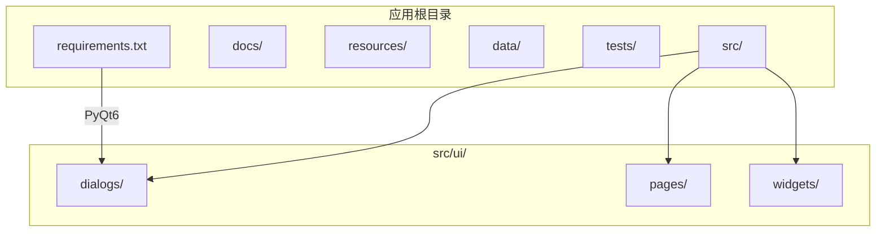
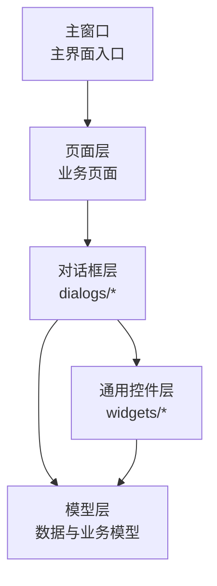
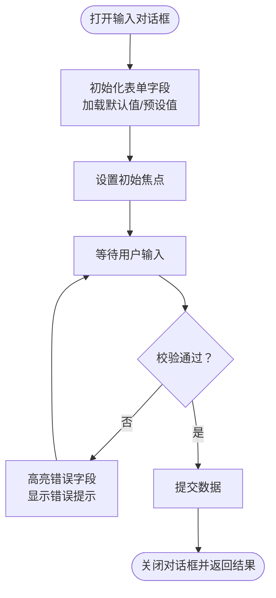
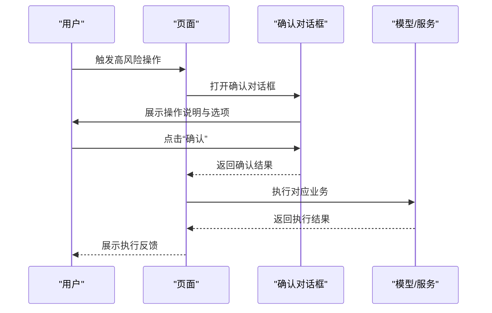
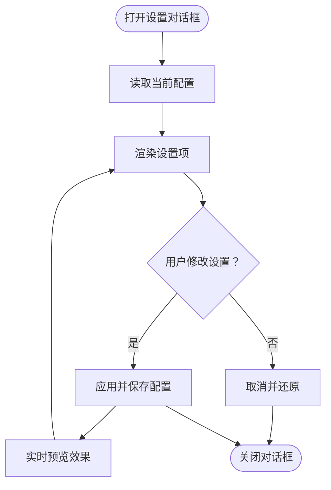
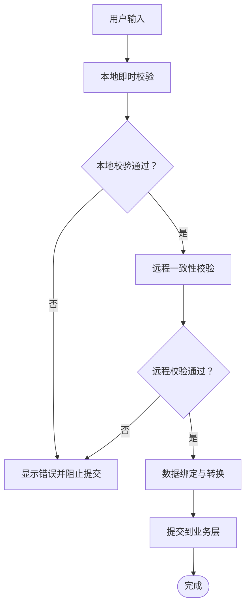
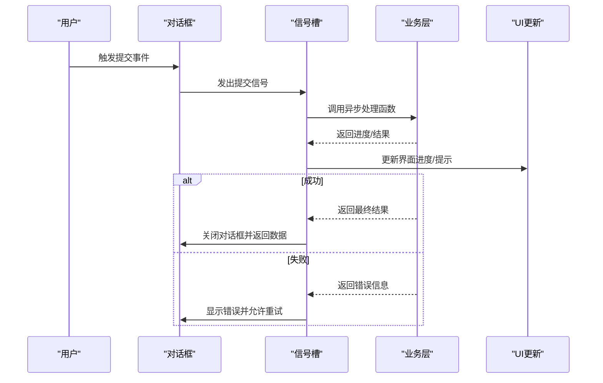
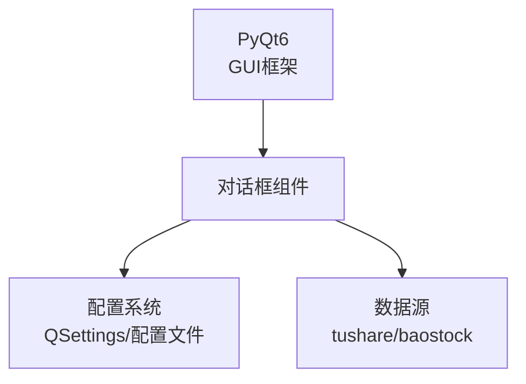

# 对话框组件

<cite>
**本文引用的文件**
- [requirements.txt](file://requirements.txt)
- [PRD.md](file://docs/PRD.md)
</cite>

## 目录
1. [简介](#简介)
2. [项目结构](#项目结构)
3. [核心组件](#核心组件)
4. [架构总览](#架构总览)
5. [详细组件分析](#详细组件分析)
6. [依赖分析](#依赖分析)
7. [性能考虑](#性能考虑)
8. [故障排查指南](#故障排查指南)
9. [结论](#结论)
10. [附录](#附录)

## 简介
本文件围绕 StockSift 的“对话框组件”进行系统化文档整理，目标是为开发者提供一套可复用、可维护且用户体验友好的对话框开发指南。根据仓库现有信息，StockSift 使用 PyQt6 作为 GUI 框架，对话框位于 UI 层的 dialogs 目录中。本文将从架构、组件关系、数据流、处理逻辑、集成点、错误处理与性能特性等方面展开，并结合 PRD 中的功能需求，给出可落地的实现建议与最佳实践。

## 项目结构
- StockSift 采用分层架构，UI 层包含 pages、widgets、dialogs 三个子目录，其中 dialogs 专门用于承载各类对话框组件。
- 依赖方面，项目明确使用 PyQt6 作为 GUI 框架，这决定了对话框的实现风格与交互模式（如模态/非模态、事件循环、信号槽等）。

**图表来源**
- [requirements.txt:1-31](file://requirements.txt#L1-L31)

**章节来源**
- [requirements.txt:1-31](file://requirements.txt#L1-L31)

## 核心组件
基于 PRD 的功能描述，StockSift 的对话框组件应覆盖以下典型场景：
- 数据输入对话框：用于收集筛选条件、回测参数、导出设置等复杂表单数据。
- 确认对话框：用于关键操作的二次确认（如删除、清空、退出等）。
- 设置对话框：用于系统配置、数据源配置、主题切换等设置项的集中管理。

这些对话框在实现时需统一遵循以下原则：
- 模态处理：阻塞父窗口交互，确保用户完成或取消操作后再回到主流程。
- 焦点管理：合理设置初始焦点，提升键盘可达性与效率。
- 键盘快捷键：提供 Enter 提交、Esc 取消等标准快捷键，必要时提供帮助提示。
- 表单验证：在提交前进行必填校验、格式校验与业务规则校验。
- 数据绑定与错误处理：将用户输入与内部模型解耦，通过清晰的错误反馈引导修正。
- 样式定制与动画：在不牺牲可用性的前提下，适度使用过渡与高亮以增强反馈。
- 事件处理与回调：通过信号槽或回调函数解耦 UI 与业务逻辑，支持异步操作与进度反馈。

**章节来源**
- [PRD.md:23-257](file://docs/PRD.md#L23-L257)

## 架构总览
对话框组件在系统中的位置与职责如下：
- 位置：位于 UI 层的 dialogs 目录，作为页面与组件的补充，承载临时性、交互性强的操作。
- 职责：封装用户输入、确认与设置等交互，向上游页面提供标准化的数据与状态变更接口。
- 依赖：依赖 PyQt6 的对话框基类与事件系统；与页面层通过信号/回调进行解耦；与模型层通过数据绑定进行交互。

[此图为概念性架构示意，不直接映射具体源码文件，故无“图表来源”]

## 详细组件分析

### 数据输入对话框
- 设计要点
  - 表单布局：采用分组与栅格布局，将相关字段归类到不同区域，减少认知负担。
  - 输入类型：数字输入、日期选择、下拉选择、多选框、文本输入等，按需启用校验与格式化。
  - 必填与联动：根据 PRD 中的筛选条件，对部分字段设置必填与互斥/联动规则。
- 实现建议
  - 使用 PyQt6 的 QFormLayout/QGridLayout 组织布局。
  - 通过 QLineEdit/QDateEdit/QComboBox/QCheckBox 等控件承载输入。
  - 在提交按钮处统一触发校验，失败时高亮错误字段并弹出提示。
- 交互细节
  - Enter 提交、Esc 取消；Tab/F6 焦点切换；F1 帮助。
  - 支持撤销/重做（如适用），避免误操作造成损失。

[此图为概念性流程示意，不直接映射具体源码文件，故无“图表来源”]

**章节来源**
- [PRD.md:23-257](file://docs/PRD.md#L23-L257)

### 确认对话框
- 设计要点
  - 明确操作后果：在对话框中简述即将执行的动作及其影响。
  - 二选一：提供“确认/取消”两个选项，强调“取消”的安全性。
  - 关键操作：仅对高风险操作使用确认对话框，避免过度打断。
- 实现建议
  - 使用 QMessageBox 或自定义对话框，提供标准图标与按钮布局。
  - 默认焦点指向“取消”，Esc 直接取消，Enter 确认。
  - 对可逆操作提供“不再提示”选项，减少重复确认。

[此图为概念性序列示意，不直接映射具体源码文件，故无“图表来源”]

**章节来源**
- [PRD.md:246-257](file://docs/PRD.md#L246-L257)

### 设置对话框
- 设计要点
  - 分类组织：将设置项按“数据源”、“界面主题”、“行为偏好”等分组。
  - 实时预览：对主题、字体、颜色等即时生效的设置提供预览。
  - 默认值与重置：提供恢复默认值按钮，便于快速回退。
- 实现建议
  - 使用 QGroupBox/QTabWidget 等容器组织分组与标签页。
  - 通过 QSettings 或配置文件持久化设置，避免每次启动重新配置。
  - 对敏感设置（如 API Key）提供加密存储或安全提示。

[此图为概念性流程示意，不直接映射具体源码文件，故无“图表来源”]

**章节来源**
- [PRD.md:341-346](file://docs/PRD.md#L341-L346)

### 表单验证机制、数据绑定与错误处理
- 验证策略
  - 前端即时校验：输入时进行格式与范围校验，及时反馈。
  - 后端一致性校验：提交时再次校验，确保与后端约束一致。
  - 业务规则校验：如筛选条件的互斥、依赖关系等。
- 数据绑定
  - 将控件与数据模型解耦，通过中间层进行转换与校验。
  - 对复杂对象使用结构化数据绑定，避免手动拼装。
- 错误处理
  - 显示明确的错误文案与位置指示，避免模糊提示。
  - 对网络/数据库异常提供重试与降级策略。

[此图为概念性流程示意，不直接映射具体源码文件，故无“图表来源”]

**章节来源**
- [PRD.md:23-257](file://docs/PRD.md#L23-L257)

### 样式定制、动画效果与用户体验优化
- 样式定制
  - 基于资源文件与主题系统，统一按钮、输入框、提示框的视觉风格。
  - 对错误状态使用高对比度色彩与图标，确保可识别性。
- 动画效果
  - 轻量过渡：如打开/关闭时的淡入淡出、尺寸变化的缓动。
  - 避免干扰：动画时长适中，不影响关键操作的响应速度。
- 用户体验优化
  - 键盘可达性：Tab 顺序合理，焦点可见，快捷键提示清晰。
  - 反馈及时：提交过程显示进度，成功/失败有明确提示。
  - 可访问性：为屏幕阅读器提供语义化标签与描述。

[此节为通用指导，不直接分析具体文件，故无“章节来源”]

### 事件处理、回调函数与异步操作
- 事件处理
  - 使用 PyQt6 的信号槽连接控件事件与处理函数，保持 UI 与逻辑分离。
  - 对提交、取消、回车、Esc 等关键事件进行统一处理。
- 回调函数
  - 将业务结果通过回调传递给调用方，避免阻塞主线程。
  - 对批量操作提供进度回调与中断机制。
- 异步操作
  - 对网络请求、文件写入、大数据计算等耗时任务使用异步处理。
  - 在对话框中提供进度条与取消按钮，防止用户误以为程序卡死。

[此图为概念性序列示意，不直接映射具体源码文件，故无“图表来源”]

**章节来源**
- [requirements.txt:1-31](file://requirements.txt#L1-L31)

## 依赖分析
- 框架依赖：PyQt6 是对话框实现的基础，提供了窗口、控件、事件系统与布局管理。
- 第三方库：tushare/baostock 用于数据获取，可能在对话框中触发数据刷新或导出。
- 数据持久化：QSettings 或配置文件用于保存用户设置，对话框负责读写与同步。

**图表来源**
- [requirements.txt:1-31](file://requirements.txt#L1-L31)

**章节来源**
- [requirements.txt:1-31](file://requirements.txt#L1-L31)

## 性能考虑
- 渲染性能：避免在对话框中进行大规模一次性渲染，采用延迟加载与虚拟化列表（如适用）。
- 事件吞吐：对高频输入事件进行防抖/节流，减少不必要的校验与更新。
- 内存占用：及时释放未使用的资源，避免对话框关闭后仍持有大量对象引用。
- 网络与 I/O：对网络请求与文件操作使用异步方式，避免阻塞 UI 线程。

[本节为通用指导，不直接分析具体文件，故无“章节来源”]

## 故障排查指南
- 常见问题
  - 对话框无法关闭：检查是否正确发出关闭信号或调用 accept/reject。
  - 焦点丢失：确保在初始化时设置初始焦点，避免用户需要额外点击。
  - 校验不生效：确认校验逻辑在提交前被调用，错误提示与字段高亮一致。
  - 设置未保存：检查配置写入流程与异常捕获，必要时提供重试或回滚。
- 排查步骤
  - 使用最小可复现示例定位问题范围。
  - 查看日志与异常堆栈，关注网络/权限/路径等问题。
  - 对比默认配置与用户配置，排除冲突项。

[本节为通用指导，不直接分析具体文件，故无“章节来源”]

## 结论
StockSift 的对话框组件应以“可用性优先、一致性保障、可扩展性良好”为目标，结合 PyQt6 的特性与 PRD 的功能需求，构建统一的交互语言与数据流。通过规范的表单验证、清晰的错误处理、合理的事件与回调设计，以及适度的样式与动画优化，可以显著提升用户的操作效率与满意度。

## 附录
- 开发建议清单
  - 统一对话框基类与样式模板，减少重复代码。
  - 为每个对话框编写单元测试与集成测试，覆盖正常与异常路径。
  - 对关键对话框增加可访问性标签与键盘快捷键提示。
  - 记录对话框的生命周期与状态，便于调试与维护。

[本节为通用指导，不直接分析具体文件，故无“章节来源”]