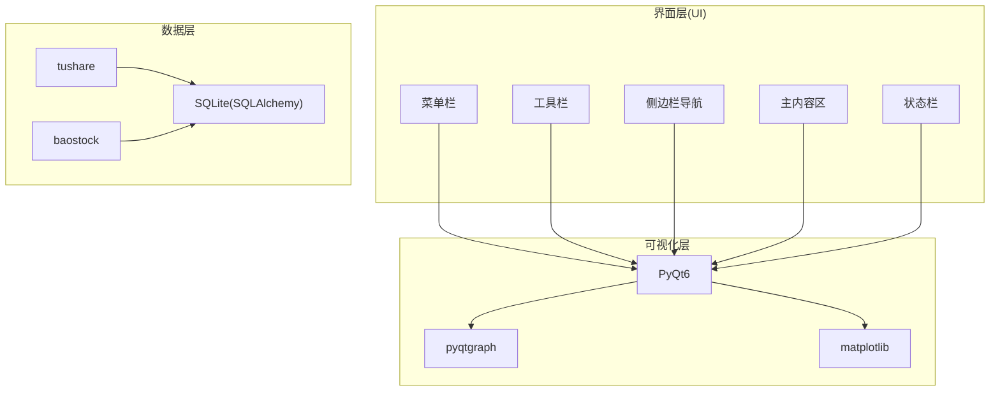
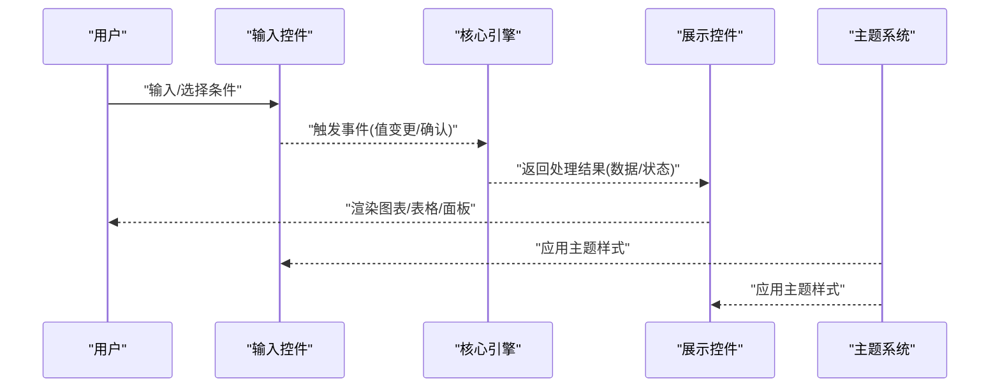
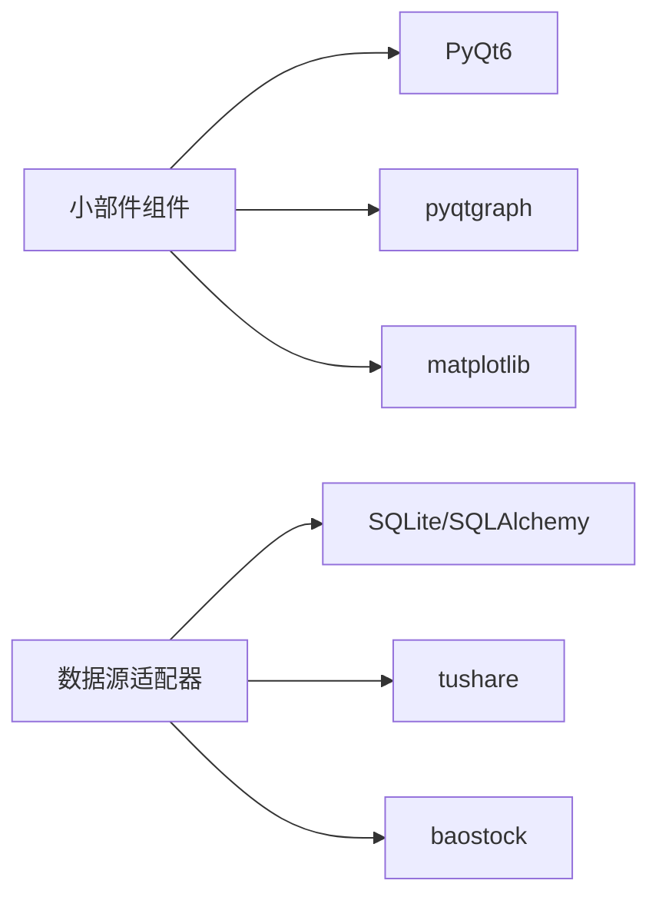

# 小部件组件

<cite>
**本文引用的文件**
- [requirements.txt](file://requirements.txt)
- [PRD.md](file://docs/PRD.md)
</cite>

## 目录
1. [简介](#简介)
2. [项目结构](#项目结构)
3. [核心组件](#核心组件)
4. [架构总览](#架构总览)
5. [组件详细分析](#组件详细分析)
6. [依赖关系分析](#依赖关系分析)
7. [性能考虑](#性能考虑)
8. [故障排查指南](#故障排查指南)
9. [结论](#结论)
10. [附录](#附录)

## 简介
本文件聚焦StockSift中小部件组件的设计与实现，目标是为开发者提供一套可复用界面元素的完整指南，涵盖自定义控件、图表组件与数据展示控件；阐明状态管理、属性配置与事件处理机制；解释样式定制、主题适配与CSS样式支持；并给出组合模式、嵌套使用与布局管理策略。同时，结合项目实际采用的技术栈与界面需求，提供性能优化、内存管理与渲染优化的实践建议。

## 项目结构
StockSift采用模块化的分层架构，前端界面基于PyQt6构建，数据可视化依赖pyqtgraph与matplotlib。根据PRD描述，界面包含菜单栏、工具栏、侧边栏导航、主内容区与状态栏的整体布局；支持浅色/深色主题切换。小部件作为界面的基础组成单元，承担输入控制、数据展示与交互反馈等职责。

**章节来源**
- [PRD.md: 263–291:263-291](file://docs/PRD.md#L263-L291)
- [requirements.txt: 5, 17–18:5-5](file://requirements.txt#L5-L5)
- [requirements.txt: 17–18:17-18](file://requirements.txt#L17-L18)

## 核心组件
- 输入控件：用于接收用户输入的条件或参数，如文本框、数字框、日期选择器、下拉选择器、开关按钮等。这些控件应具备清晰的属性配置接口（默认值、取值范围、是否必填）与事件回调（值变更、确认提交）。
- 展示控件：用于呈现数据与图表，如表格、标签页、信息面板、K线图、趋势图、饼图等。控件需支持数据绑定、增量更新与交互（缩放、平移、提示）。
- 布局控件：用于组织子控件的空间关系，如网格布局、堆叠布局、分割面板、滚动区域等。布局应响应窗口尺寸变化，保证在不同分辨率下的可用性。
- 主题控件：负责主题切换与样式应用，确保浅色/深色主题下文字、背景、边框、图标的一致性与可读性。

上述组件在PRD中与具体页面（如股票筛选、K线图表、资金流向、财务面板等）紧密关联，后续章节将结合这些页面进一步细化。

**章节来源**
- [PRD.md: 263–291:263-291](file://docs/PRD.md#L263-L291)

## 架构总览
小部件体系围绕“输入—处理—展示”的数据流展开：输入控件收集用户条件，经由核心引擎（筛选、回测、预警等）处理后，通过展示控件输出到界面。主题系统贯穿所有控件，统一视觉风格。

[此图为概念性流程示意，无需图表来源]

## 组件详细分析

### 输入控件族
- 设计要点
  - 属性配置：提供默认值、最小/最大值、步长、单位、是否允许空值等配置项。
  - 状态管理：区分“编辑中”“已确认”“验证失败”等状态，必要时提供撤销/重做。
  - 事件处理：支持值变更、确认提交、焦点离开、清空等事件；对非法输入进行即时校验与提示。
- 典型场景
  - 数值范围选择器：用于价格、涨跌幅、成交量、财务指标等筛选条件。
  - 多选/单选下拉框：用于市场、行业、概念、时间周期等选项。
  - 开关/按钮：用于启用/禁用某类指标或切换图表叠加项。
- 组合与嵌套
  - 将多个输入控件组合为“条件组”，支持“与/或”逻辑连接；在主内容区以折叠面板或标签页组织。
- 布局策略
  - 使用网格布局对齐标签与输入框；在窄屏下采用纵向堆叠布局。
- 样式与主题
  - 通过主题系统统一边框颜色、背景色、字体大小；错误状态使用警示色。
- 性能与内存
  - 对高频变更事件进行节流/防抖；避免在每次变更时触发重型计算。
  - 控件销毁时清理信号槽与定时器，防止内存泄漏。

[本节为通用设计指导，未直接分析具体文件，故无章节来源]

### 展示控件族
- 设计要点
  - 数据绑定：支持从核心引擎获取原始数据并转换为图表/表格所需格式。
  - 交互能力：K线图支持缩放、平移、十字光标；趋势图支持区域选择与导出。
  - 增量更新：仅更新发生变化的数据片段，减少重绘开销。
- 典型场景
  - K线图表：支持日线/周线/月线，叠加MA/MACD/KDJ/RSI/布林带，成交量柱状图。
  - 资金流向图：饼图展示当日资金构成，折线图展示多日趋势。
  - 财务面板：以表格与趋势图结合的方式展示关键财务指标。
- 组合与嵌套
  - 将多个图表控件放入标签页或分割面板，便于对比分析。
- 布局策略
  - 使用QSplitter实现可拖拽的面板分割；在移动端适配时采用单列布局。
- 样式与主题
  - 通过主题系统切换线条颜色、填充色、网格线与标注样式。
- 性能与内存
  - 对大数据集采用采样或分页加载；及时释放不再使用的图像资源与图元对象。

[本节为通用设计指导，未直接分析具体文件，故无章节来源]

### 布局控件族
- 设计要点
  - 网格布局：用于对齐标签与控件，保证视觉一致性。
  - 滚动区域：当内容超出可视区域时提供滚动条。
  - 分割面板：允许用户调整各区域大小，提升可用性。
- 布局策略
  - 侧边栏固定宽度，主内容区自适应；在小屏设备上隐藏次要面板或折叠为抽屉式。
- 主题适配
  - 边框与分割线颜色随主题变化；滚动条样式与主题一致。

[本节为通用设计指导，未直接分析具体文件，故无章节来源]

### 主题系统与样式定制
- 设计要点
  - 提供浅色/深色主题变量，覆盖文字、背景、边框、强调色等。
  - 支持运行时切换，即时应用到所有控件。
- 与可视化的关系
  - 图表颜色（K线涨跌、指标线、背景网格）与主题联动。
- 与CSS的关系
  - 在PyQt6中可通过样式表（QSS）实现主题样式；也可通过动态设置Palette与Brush实现更细粒度控制。

**章节来源**
- [PRD.md: 287–290:287-290](file://docs/PRD.md#L287-L290)

## 依赖关系分析
- 技术栈依赖
  - GUI框架：PyQt6
  - 可视化：pyqtgraph（高性能图形绘制）、matplotlib（静态图表与导出）
  - 数据源：tushare、baostock
  - 数据库：SQLite（SQLAlchemy）
- 小部件与外部库的耦合
  - 图表控件依赖pyqtgraph与matplotlib；输入/展示控件依赖PyQt6基础控件。
  - 数据获取与存储通过数据源适配器与数据库层完成，小部件仅消费数据。

**图表来源**
- [requirements.txt: 5:5-5](file://requirements.txt#L5-L5)
- [requirements.txt: 17–18:17-18](file://requirements.txt#L17-L18)

**章节来源**
- [requirements.txt: 5, 17–18, 21:5-5](file://requirements.txt#L5-L5)
- [requirements.txt: 17–18:17-18](file://requirements.txt#L17-L18)
- [requirements.txt: 21:21-21](file://requirements.txt#L21-L21)

## 性能考虑
- 渲染优化
  - 图表渲染：对大量数据采用分段渲染与缓存策略；在缩放/平移时优先显示概览，再按需加载细节。
  - 表格渲染：启用虚拟滚动与延迟加载；仅在可见区域内渲染单元格。
- 事件处理
  - 对频繁触发的事件（如鼠标移动、窗口大小改变）进行节流/防抖，降低主线程压力。
- 内存管理
  - 控件销毁时断开信号槽、释放图像资源与图元对象；避免循环引用。
- 数据更新
  - 采用增量更新策略，仅推送变化的数据；对历史数据访问使用缓存。
- 主题切换
  - 主题切换时批量更新样式，避免逐个控件单独重绘带来的抖动。

[本节为通用性能指导，未直接分析具体文件，故无章节来源]

## 故障排查指南
- 图表不显示或显示异常
  - 检查数据格式与范围是否符合图表要求；确认主题颜色未导致对比度不足。
- 交互无响应
  - 排查事件连接是否正确；确认控件未被禁用或遮挡。
- 性能问题
  - 关注高频事件的处理逻辑；检查是否存在不必要的重绘或重复计算。
- 主题错乱
  - 确认主题变量已正确应用到控件；检查是否有局部样式覆盖全局主题。

[本节为通用排查指导，未直接分析具体文件，故无章节来源]

## 结论
StockSift的小部件组件应遵循“高内聚、低耦合”的原则，围绕输入、处理、展示三大环节构建。通过合理的状态管理、属性配置与事件处理机制，配合主题系统与布局策略，可实现一致且高效的用户体验。在性能方面，应重点关注渲染优化、内存管理与数据更新策略，确保在大数据量与复杂交互场景下的流畅运行。

[本节为总结性内容，未直接分析具体文件，故无章节来源]

## 附录
- 相关界面需求与页面
  - 股票筛选、K线图表、资金流向、财务面板、价值投资面板等页面对小部件有明确的使用场景与交互要求。
- 技术栈参考
  - GUI框架、可视化库、数据源与数据库的选择直接影响小部件的实现方式与性能表现。

**章节来源**
- [PRD.md: 110–148:110-148](file://docs/PRD.md#L110-L148)
- [PRD.md: 168–194:168-194](file://docs/PRD.md#L168-L194)
- [PRD.md: 220–245:220-245](file://docs/PRD.md#L220-L245)