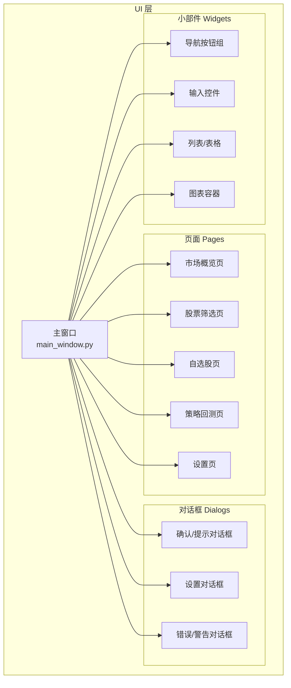
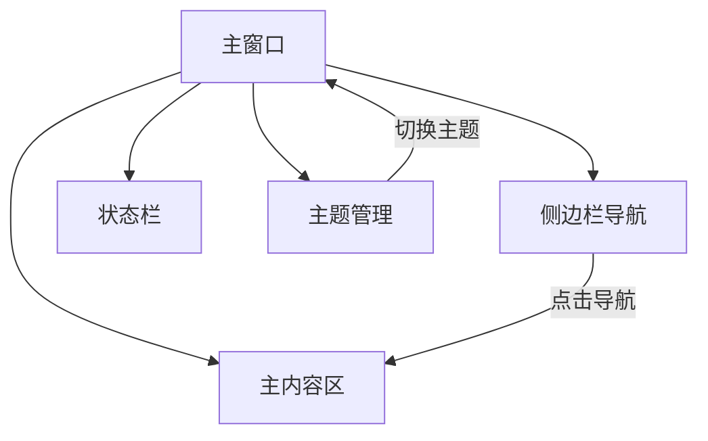
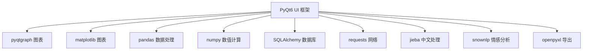

# 用户界面组件

<cite>
**本文引用的文件**
- [requirements.txt](file://requirements.txt)
- [PRD.md](file://docs/PRD.md)
- [main_window.py](file://src/ui/main_window.py)
- [pages 目录](file://src/ui/pages/)
- [widgets 目录](file://src/ui/widgets/)
- [dialogs 目录](file://src/ui/dialogs/)
</cite>

## 目录
1. [简介](#简介)
2. [项目结构](#项目结构)
3. [核心组件](#核心组件)
4. [架构总览](#架构总览)
5. [详细组件分析](#详细组件分析)
6. [依赖分析](#依赖分析)
7. [性能考虑](#性能考虑)
8. [故障排除指南](#故障排除指南)
9. [结论](#结论)
10. [附录](#附录)

## 简介
本文件面向StockSift的UI开发者与维护者，系统性梳理PyQt6用户界面组件的设计与实现要点，覆盖页面组件、对话框组件与小部件组件的功能特性、使用方式与可定制项；解释布局设计、响应式设计考量与用户体验优化策略；提供组件属性配置、事件处理与样式定制的实践路径；总结组件组合模式、状态管理与性能优化技巧，帮助快速构建稳定、一致且高性能的桌面应用界面。

## 项目结构
StockSift采用模块化UI组织方式，核心入口位于主窗口，页面、对话框与通用小部件分别按功能域划分，便于扩展与复用。根据PRD描述，整体布局包含菜单栏、工具栏、侧边栏导航、主内容区与状态栏，支持浅色/深色主题切换。

**图示来源**
- [PRD.md:174-201](file://docs/PRD.md#L174-L201)
- [main_window.py](file://src/ui/main_window.py)

**章节来源**
- [PRD.md:174-201](file://docs/PRD.md#L174-L201)
- [requirements.txt:4-6](file://requirements.txt#L4-L6)

## 核心组件
- 主窗口：承载菜单栏、工具栏、侧边栏、主内容区与状态栏，负责页面路由与全局状态协调。
- 页面组件：按业务域划分的页面容器，负责渲染具体视图与交互逻辑。
- 对话框组件：用于确认、设置、错误提示等交互场景，提供统一的模态交互体验。
- 小部件组件：可复用的基础UI元素，如导航按钮、输入框、列表、表格与图表容器，提供一致的视觉与行为规范。

**章节来源**
- [PRD.md:174-201](file://docs/PRD.md#L174-L201)
- [main_window.py](file://src/ui/main_window.py)

## 架构总览
UI层以主窗口为中心，通过页面组件实现动态内容切换；对话框组件提供跨页面的交互能力；小部件组件在页面内复用，保证一致性与可维护性。主题系统贯穿UI层，支持浅色/深色主题即时切换。

**图示来源**
- [PRD.md:174-201](file://docs/PRD.md#L174-L201)

## 详细组件分析

### 页面组件（Pages）
- 设计目标：承载各业务域的视图与交互，支持动态加载与懒初始化，减少启动开销。
- 功能特性：
  - 市场概览：展示大盘指数、板块轮动与热点事件。
  - 股票筛选：提供多条件筛选、排序与结果展示。
  - 自选股：收藏与管理自选股票，支持批量操作。
  - 策略回测：配置参数、执行回测与查看报告。
  - 设置：数据源配置、主题切换、偏好设置。
- 使用方法：
  - 在主窗口中通过导航触发页面切换。
  - 页面内部通过小部件组件完成输入与展示。
- 自定义选项：
  - 可配置列宽、排序规则、分页大小等。
  - 支持主题色系映射，确保在不同主题下保持可读性与对比度。

**章节来源**
- [PRD.md:190-196](file://docs/PRD.md#L190-L196)

### 对话框组件（Dialogs）
- 设计目标：提供统一的确认、设置与错误提示交互，保证一致性与可访问性。
- 功能特性：
  - 确认/提示对话框：用于关键操作确认与信息提示。
  - 设置对话框：集中管理偏好设置与数据源配置。
  - 错误/警告对话框：标准化错误信息展示与引导修复。
- 使用方法：
  - 通过主窗口或页面触发，传入上下文参数与回调。
  - 对话框内部通过小部件组件收集用户输入或展示结果。
- 自定义选项：
  - 可配置标题、图标、按钮文案与快捷键。
  - 支持多语言与主题适配。

**章节来源**
- [PRD.md:197-200](file://docs/PRD.md#L197-L200)

### 小部件组件（Widgets）
- 设计目标：提供高内聚、低耦合的UI基础单元，支持复用与扩展。
- 功能特性：
  - 导航按钮组：侧边栏导航与页面切换。
  - 输入控件：文本输入、日期选择、数值输入与下拉选择。
  - 列表/表格：数据展示、排序、筛选与批量操作。
  - 图表容器：集成技术分析图表，支持缩放、平移与指标叠加。
- 使用方法：
  - 在页面中组合使用，遵循栅格或流式布局。
  - 通过信号槽机制与页面/对话框通信。
- 自定义选项：
  - 可配置尺寸、颜色、字体与图标。
  - 支持主题变量映射，确保在不同主题下视觉一致。

**章节来源**
- [PRD.md:174-188](file://docs/PRD.md#L174-L188)

### 主窗口（Main Window）
- 设计目标：作为UI层的中枢，协调导航、内容与状态，提供统一的主题与布局。
- 功能特性：
  - 菜单栏：提供文件、编辑、视图、帮助等菜单项。
  - 工具栏：常用操作的快捷入口。
  - 侧边栏：导航与快速跳转。
  - 主内容区：动态加载页面组件。
  - 状态栏：显示当前状态、进度与提示信息。
  - 主题切换：即时切换浅色/深色主题。
- 使用方法：
  - 初始化时装配各子区域与组件。
  - 通过事件与回调更新状态栏与页面内容。
- 自定义选项：
  - 可配置菜单项、工具栏按钮与侧边栏项。
  - 支持全屏、最大化与窗口尺寸记忆。

**章节来源**
- [PRD.md:174-188](file://docs/PRD.md#L174-L188)

## 依赖分析
- GUI框架：PyQt6作为核心UI框架，提供窗口、控件、事件与绘图能力。
- 可视化：pyqtgraph与matplotlib用于图表绘制与交互。
- 数据处理：pandas与numpy用于数据清洗、计算与转换。
- 数据库：SQLAlchemy（版本小于2.0）用于数据持久化。
- 网络请求：requests用于外部接口调用。
- 文本处理：jieba与snownlp用于中文分词与情感分析。
- 导出：openpyxl用于Excel导出。

**图示来源**
- [requirements.txt:4-31](file://requirements.txt#L4-L31)

**章节来源**
- [requirements.txt:4-31](file://requirements.txt#L4-L31)

## 性能考虑
- 懒加载与延迟初始化：页面组件按需加载，避免启动时一次性渲染大量内容。
- 表格与列表优化：启用虚拟滚动、分页与增量加载，减少内存占用与重绘次数。
- 图表渲染：限制同时叠加指标数量，使用缓存与节流控制缩放/平移频率。
- 事件处理：合理使用信号槽，避免频繁触发重绘；对高频事件进行去抖/节流。
- 主题切换：采用样式表变量与动态资源替换，避免全量重建组件。
- I/O与网络：异步执行数据获取与导出任务，配合进度条与取消机制提升响应性。

[本节为通用指导，无需列出章节来源]

## 故障排除指南
- 主题切换无效：
  - 检查主题变量是否正确映射到组件样式。
  - 确认样式表更新顺序与资源路径。
- 页面切换卡顿：
  - 排查页面初始化是否包含阻塞操作。
  - 启用懒加载与后台线程处理。
- 图表渲染异常：
  - 检查数据格式与时间序列对齐。
  - 控制指标数量与刷新频率。
- 对话框无法关闭：
  - 确认模态层级与事件循环状态。
  - 检查按钮回调与关闭信号连接。
- 导出失败：
  - 校验文件路径与权限。
  - 捕获并记录异常，提供用户可理解的提示。

[本节为通用指导，无需列出章节来源]

## 结论
StockSift的UI组件体系以主窗口为核心，通过页面、对话框与小部件的清晰分层，实现了高内聚、低耦合与强复用。结合主题系统与合理的性能策略，能够在保证良好用户体验的同时，提升开发效率与维护性。建议在后续迭代中持续完善组件抽象、统一事件与状态管理，并引入自动化测试与可访问性校验，进一步提升质量与稳定性。

[本节为总结性内容，无需列出章节来源]

## 附录
- 组件组合模式：
  - 页面内组合小部件组件，形成视图单元。
  - 页面通过主窗口路由进行切换，实现动态内容加载。
  - 对话框作为独立容器，通过回调与主窗口/页面通信。
- 状态管理：
  - 主窗口集中管理全局状态（如当前页面、主题、用户偏好）。
  - 页面与对话框通过信号槽与主窗口同步状态变化。
- 最佳实践：
  - 统一命名与目录结构，明确职责边界。
  - 使用样式表与主题变量，避免硬编码颜色与尺寸。
  - 对复杂交互编写单元测试与集成测试。
  - 提供键盘快捷键与无障碍支持。

[本节为通用指导，无需列出章节来源]