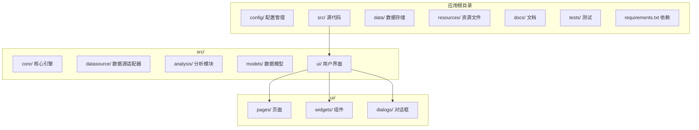
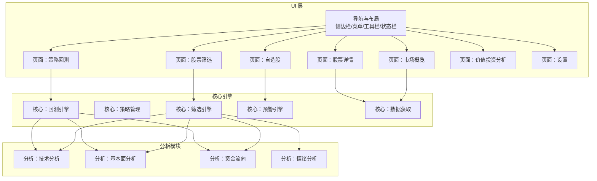
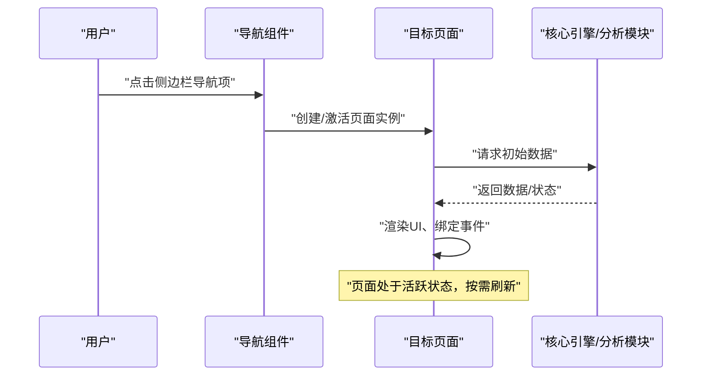
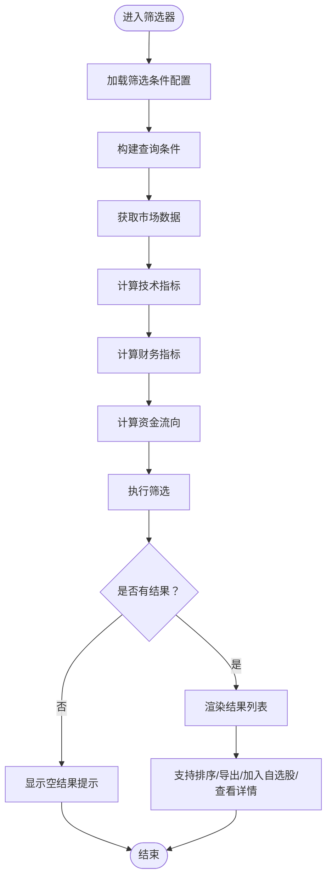
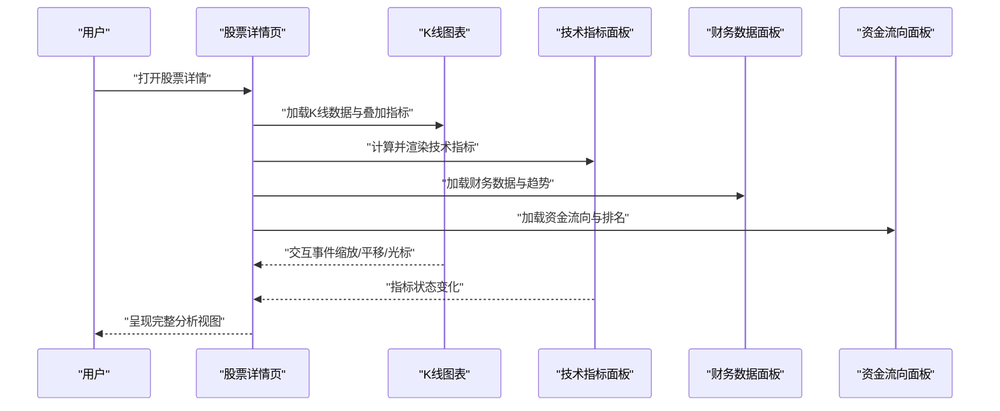
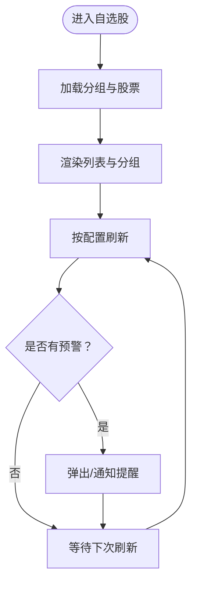
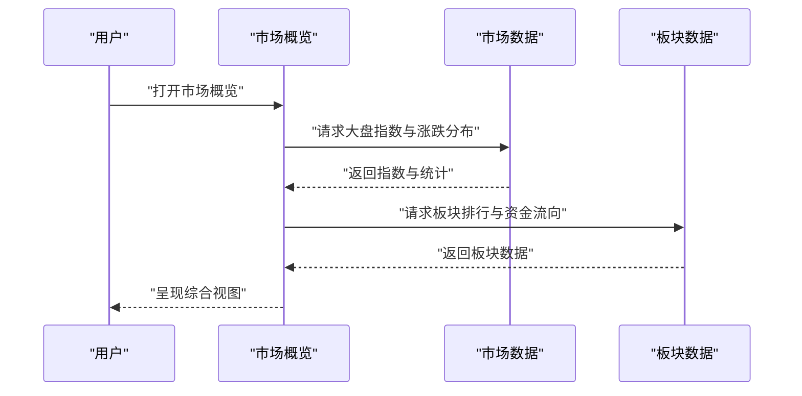
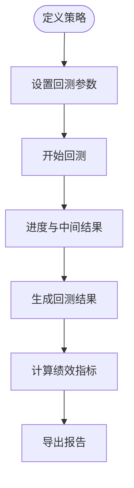
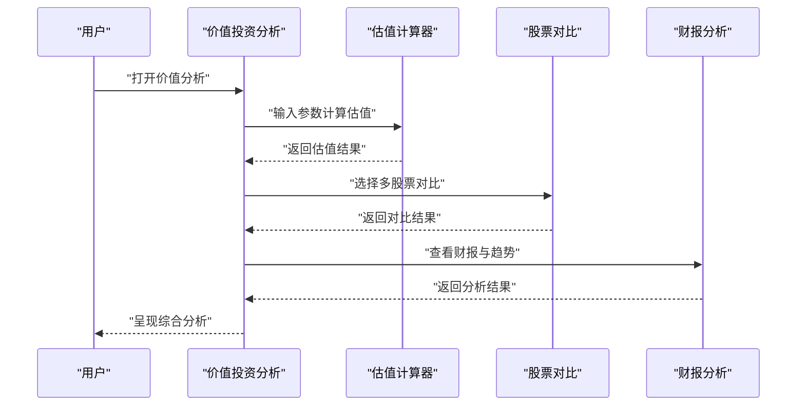
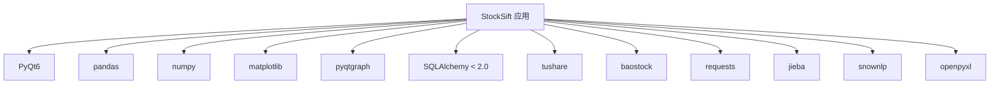

# 页面组件

<cite>
**本文引用的文件**
- [PRD.md](file://docs/PRD.md)
- [requirements.txt](file://requirements.txt)
</cite>

## 目录
1. [简介](#简介)
2. [项目结构](#项目结构)
3. [核心组件](#核心组件)
4. [架构总览](#架构总览)
5. [详细组件分析](#详细组件分析)
6. [依赖分析](#依赖分析)
7. [性能考虑](#性能考虑)
8. [故障排查指南](#故障排查指南)
9. [结论](#结论)
10. [附录](#附录)

## 简介
本章节围绕StockSift的“页面组件”进行系统化文档化，目标是帮助开发者理解主界面布局、功能页面设计与页面导航机制；掌握页面组件的生命周期管理、状态保存与恢复；明确页面间通信、数据传递与事件处理方式；给出布局设计原则、响应式布局实现与用户体验优化策略；并提供页面组件的自定义配置、主题适配与国际化支持的实践示例与最佳实践。

## 项目结构
根据现有资料，StockSift采用模块化的分层架构，其中UI层包含pages（页面）、widgets（通用控件）与dialogs（对话框）。PRD对各功能页面的职责、布局与交互进行了详细描述，为页面组件的设计与实现提供了蓝图。

**图表来源**
- [PRD.md:304-337](file://docs/PRD.md#L304-L337)

**章节来源**
- [PRD.md:304-337](file://docs/PRD.md#L304-L337)

## 核心组件
- 页面容器与导航
  - 侧边栏导航：提供“市场概览、股票筛选、自选股、策略回测、价值投资、设置”等入口，用于页面切换与上下文导航。
  - 主内容区：动态承载各功能页面，支持页面切换、状态保持与返回栈管理。
  - 菜单栏与工具栏：提供全局操作入口（如刷新、导出、设置等），与页面内容联动。
  - 状态栏：显示系统状态、加载进度、错误提示等。
- 页面类型与职责
  - 股票筛选器：多维度条件组合筛选，支持技术、资金流、财务与价值投资指标。
  - 股票详情页：K线图表、技术指标、资金流向、财务数据、价值投资面板。
  - 自选股管理：分组、列表、预警。
  - 市场概览：大盘指数、板块热点、涨跌分布、资金流向总览、估值概览。
  - 策略回测：策略定义、回测参数、回测结果可视化与报告导出。
  - 价值投资分析工具：股票对比、估值计算器、财报分析、优质股票池。
  - 设置：主题切换、数据源配置、刷新间隔等个性化选项。
- 主题与国际化
  - 支持浅色/深色主题切换，即时生效。
  - PRD未明确国际化字段，建议在页面组件层预留键名与翻译映射接口。

**章节来源**
- [PRD.md:263-292](file://docs/PRD.md#L263-L292)
- [PRD.md:28-109](file://docs/PRD.md#L28-L109)
- [PRD.md:110-148](file://docs/PRD.md#L110-L148)
- [PRD.md:149-167](file://docs/PRD.md#L149-L167)
- [PRD.md:168-194](file://docs/PRD.md#L168-L194)
- [PRD.md:195-218](file://docs/PRD.md#L195-L218)
- [PRD.md:219-245](file://docs/PRD.md#L219-L245)
- [PRD.md:287-291](file://docs/PRD.md#L287-L291)

## 架构总览
页面组件在UI层内通过容器与导航协调工作，与核心引擎（筛选、策略、回测、预警）以及分析模块（技术、基本面、资金流、情绪）协作，形成“页面-服务-数据”的闭环。

**图表来源**
- [PRD.md:304-337](file://docs/PRD.md#L304-L337)

## 详细组件分析

### 页面容器与导航组件
- 设计要点
  - 采用“侧边栏导航 + 主内容区动态渲染”的布局，确保导航与内容分离，便于扩展与维护。
  - 菜单栏与工具栏提供统一的操作入口，减少页面重复代码。
  - 状态栏承载系统状态与错误提示，提升用户感知。
- 生命周期与状态管理
  - 页面进入：初始化数据模型、订阅事件、启动定时刷新。
  - 页面退出：停止定时任务、释放资源、保存当前视图状态。
  - 返回栈：支持后退到上一页面，避免重复实例化。
- 状态保存与恢复
  - 关键状态：筛选条件、图表参数、分组与排序、刷新间隔、主题偏好。
  - 保存策略：使用配置中心或持久化存储，页面激活时恢复。
- 导航机制
  - 侧边栏点击触发页面切换，支持高亮当前页面。
  - 支持从“股票筛选”直接跳转到“股票详情”，携带股票标识。
  - 支持从“自选股”列表点击进入“股票详情”。

**图表来源**
- [PRD.md:263-292](file://docs/PRD.md#L263-L292)

**章节来源**
- [PRD.md:263-292](file://docs/PRD.md#L263-L292)

### 股票筛选器页面
- 功能要点
  - 市场、行业、概念、地域等基础条件。
  - 技术指标（MACD、KDJ、RSI、均线、布林带、成交量）。
  - 资金流向（主力净流入、占比、连续净流入天数）。
  - 财务指标（ROE、ROA、毛利率、负债率、现金流等）。
  - 价值投资指标（PEG、市现率、市销率、内在价值估算等）。
- 状态与交互
  - 条件组合与运算符选择，支持区间输入。
  - 实时预览筛选结果，支持排序与导出。
  - 支持将结果加入自选股或进入详情页。
- 性能与体验
  - 使用增量更新与缓存，避免全量重算。
  - 提供“快速筛选”与“深度分析”两种模式。

**图表来源**
- [PRD.md:25-109](file://docs/PRD.md#L25-L109)

**章节来源**
- [PRD.md:25-109](file://docs/PRD.md#L25-L109)

### 股票详情页
- 功能要点
  - K线图表：支持日线/周线/月线，叠加MA、MACD、KDJ、RSI、布林带，支持缩放、平移、十字光标。
  - 基本信息面板：名称、代码、行业、实时行情、五档盘口。
  - 技术指标面板：当前数值与状态（超买/超卖/金叉/死叉等）。
  - 资金流向面板：当日资金流向饼图与趋势图、主力净流入/流出排名。
  - 财务数据面板：主要指标、近期财报、趋势图、同行业对比、财务健康度评分。
  - 价值投资面板：估值指标、历史估值百分位、内在价值估算、安全边际、股息与股东结构。
- 状态与交互
  - 图表参数（周期、叠加指标）持久化。
  - 支持收藏/取消收藏至自选股。
  - 支持分享截图与导出报告片段。
- 性能与体验
  - 图表懒加载与虚拟滚动，避免大数据集卡顿。
  - 指标计算与渲染分离，异步更新。

**图表来源**
- [PRD.md:110-148](file://docs/PRD.md#L110-L148)

**章节来源**
- [PRD.md:110-148](file://docs/PRD.md#L110-L148)

### 自选股管理页面
- 功能要点
  - 分组管理：支持多分组，股票可归属多个分组。
  - 列表展示：代码、名称、最新价、涨跌幅、换手率等，支持排序与筛选。
  - 预警功能：价格、涨跌幅、成交量、技术指标等预警。
- 状态与交互
  - 实时刷新（可配置刷新间隔）。
  - 支持批量操作（删除、移动分组、导出）。
  - 点击进入详情页。
- 性能与体验
  - 列表虚拟化渲染，支持大数据集。
  - 预警事件推送与去重。

**图表来源**
- [PRD.md:149-167](file://docs/PRD.md#L149-L167)

**章节来源**
- [PRD.md:149-167](file://docs/PRD.md#L149-L167)

### 市场概览页面
- 功能要点
  - 大盘指数：上证、深证、创业板、科创50，涨跌家数统计。
  - 板块热点：行业/概念板块涨幅排行、资金流向。
  - 涨跌分布：涨跌家数饼图、涨跌停家数统计。
  - 资金流向总览：市场整体资金流向、北向资金流向。
  - 估值概览：整体PE/PB、指数估值百分位、行业估值分布、破净股与高股息池。
- 状态与交互
  - 支持切换时间窗口与指数组合。
  - 点击板块进入个股筛选或详情。
- 性能与体验
  - 使用聚合数据与缓存，降低实时请求压力。

**图表来源**
- [PRD.md:168-194](file://docs/PRD.md#L168-L194)

**章节来源**
- [PRD.md:168-194](file://docs/PRD.md#L168-L194)

### 策略回测页面
- 功能要点
  - 策略定义：基于筛选条件创建策略，支持多条件组合与买入/卖出条件。
  - 回测参数：时间范围、初始资金、仓位管理（固定金额/比例/凯利公式）、交易费率、滑点、再平衡周期。
  - 回测结果：收益曲线、绩效指标（总收益、年化、最大回撤、夏普比率、胜率）、年度/月度分布与报告导出。
- 状态与交互
  - 参数校验与预演，支持一键运行与暂停/继续。
  - 结果可视化与交互式探索。
- 性能与体验
  - 异步回测与进度反馈，支持断点续跑。

**图表来源**
- [PRD.md:195-218](file://docs/PRD.md#L195-L218)

**章节来源**
- [PRD.md:195-218](file://docs/PRD.md#L195-L218)

### 价值投资分析工具页面
- 功能要点
  - 股票对比：财务指标对比、估值水平对比、盈利能力与成长性对比。
  - 估值计算器：DCF、格雷厄姆、彼得林奇PEG、历史估值区间参考。
  - 财报分析：报表可视化、指标趋势、异常预警、同行业排名。
  - 优质股票池：高ROE、低估值、高股息、成长股、白马股池。
- 状态与交互
  - 多股票并列对比，支持切换对比维度。
  - 估值计算参数可调，结果可导出。
- 性能与体验
  - 对比数据聚合与缓存，提高对比效率。

**图表来源**
- [PRD.md:219-245](file://docs/PRD.md#L219-L245)

**章节来源**
- [PRD.md:219-245](file://docs/PRD.md#L219-L245)

### 设置页面
- 功能要点
  - 主题切换：浅色/深色即时生效。
  - 数据源配置：优先级、API Key管理。
  - 刷新间隔：全局与页面级刷新策略。
  - 导出与备份：筛选结果、自选股、回测报告。
- 状态与交互
  - 配置变更立即生效或提示重启。
  - 支持导入/导出配置文件。
- 性能与体验
  - 配置验证与默认值回退。

**章节来源**
- [PRD.md:287-291](file://docs/PRD.md#L287-L291)
- [PRD.md:246-260](file://docs/PRD.md#L246-L260)

## 依赖分析
- 技术栈与依赖
  - GUI框架：PyQt6
  - 数据处理：pandas、numpy
  - 可视化：pyqtgraph、matplotlib
  - 数据库：SQLite（SQLAlchemy < 2.0）
  - 数据源：tushare、baostock
  - 网络请求：requests
  - 中文处理与情感分析：jieba、snownlp
  - Excel导出：openpyxl

**图表来源**
- [requirements.txt:1-31](file://requirements.txt#L1-L31)

**章节来源**
- [requirements.txt:1-31](file://requirements.txt#L1-L31)

## 性能考虑
- 页面渲染
  - 列表与表格：采用虚拟化渲染，限制一次性渲染数量。
  - 图表：延迟加载、按需渲染叠加指标，避免全量重绘。
- 数据访问
  - 缓存热点数据与中间结果，减少重复计算。
  - 增量更新策略，仅刷新变化部分。
- 事件与定时任务
  - 合理设置刷新间隔，避免频繁IO与网络请求。
  - 在页面不可见时暂停或降频刷新。
- 资源释放
  - 页面销毁时释放图表句柄、停止定时器、关闭数据连接。
- 回测与分析
  - 异步执行回测，分阶段输出进度；结果分页展示与懒加载。

## 故障排查指南
- 页面无法切换
  - 检查导航事件绑定与页面实例化逻辑。
  - 确认返回栈管理与状态恢复流程。
- 图表渲染异常
  - 校验数据格式与时间序列完整性。
  - 检查叠加指标计算是否越界或为空。
- 数据缺失或过期
  - 核对数据源配置与API Key有效性。
  - 检查缓存策略与增量更新逻辑。
- 性能问题
  - 使用性能分析工具定位CPU/内存瓶颈。
  - 优化列表渲染与图表绘制频率。
- 主题切换无效
  - 确认样式应用顺序与覆盖规则。
  - 检查主题变量与CSS/样式表映射。

## 结论
StockSift的页面组件以清晰的导航与布局为核心，围绕“筛选—分析—回测—价值评估”的主线展开。通过合理的生命周期管理、状态保存与恢复、页面间通信与数据传递机制，结合性能优化与用户体验策略，能够为用户提供高效、直观且可扩展的A股分析体验。建议在后续迭代中完善国际化与无障碍支持，并持续优化图表与回测性能。

## 附录
- 开发最佳实践
  - 将页面状态与UI逻辑分离，便于测试与复用。
  - 统一事件总线与消息机制，降低耦合。
  - 为每个页面提供最小可用状态集，支持快速恢复。
  - 为图表与回测提供“暂停/继续/断点续跑”能力。
- 主题适配
  - 使用变量化颜色与尺寸，集中管理主题样式。
  - 为暗色主题提供对比度充足的配色方案。
- 国际化支持
  - 在页面组件层预留键名与翻译映射接口，避免硬编码文本。
  - 为日期、数字、货币等格式化提供本地化支持。