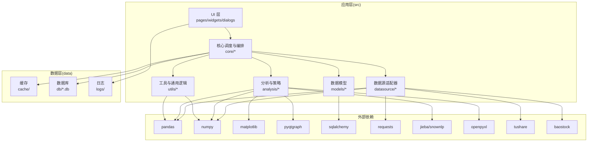
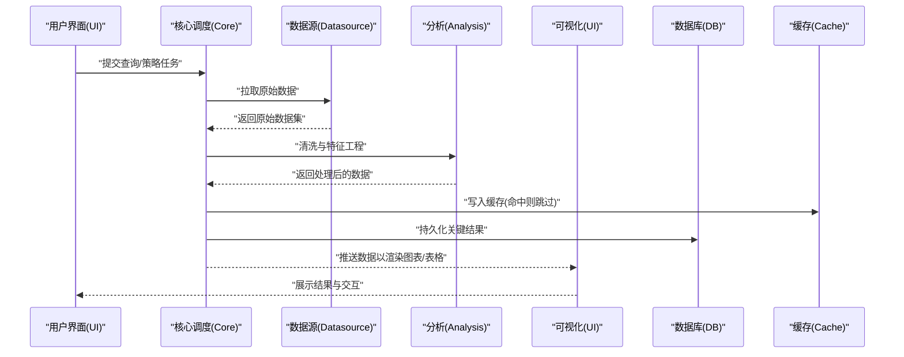
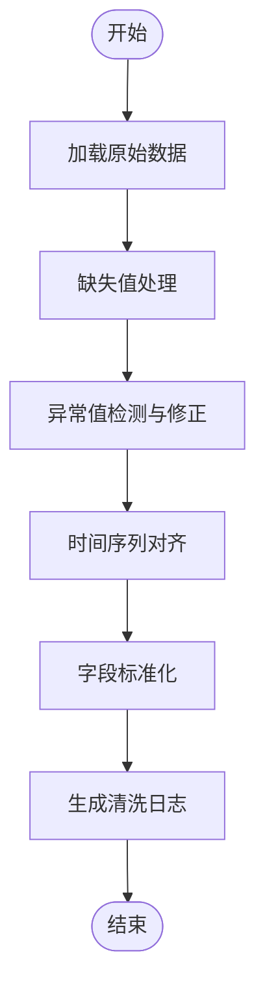
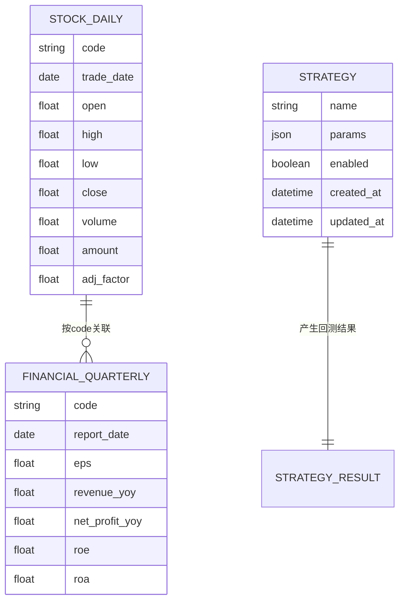
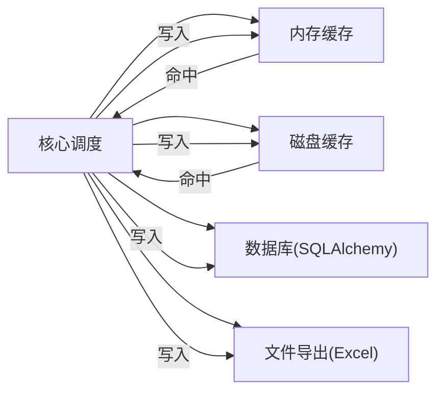
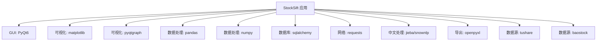

# 数据流设计

<cite>
**本文引用的文件**
- [requirements.txt](file://requirements.txt)
</cite>

## 目录
1. [引言](#引言)
2. [项目结构](#项目结构)
3. [核心组件](#核心组件)
4. [架构总览](#架构总览)
5. [详细组件分析](#详细组件分析)
6. [依赖关系分析](#依赖关系分析)
7. [性能考虑](#性能考虑)
8. [故障排查指南](#故障排查指南)
9. [结论](#结论)
10. [附录](#附录)

## 引言
本设计文档聚焦StockSift项目的数据流设计，系统性阐述从数据获取、清洗、处理到可视化的完整数据流程。文档覆盖数据在各模块间的传递方式（同步与异步）、处理管道、缓存策略、数据模型设计（股票数据、财务数据、用户策略）、数据库与文件存储策略，以及数据一致性、并发访问控制与安全措施的设计思路与实现要点。

## 项目结构
仓库采用按功能域分层的组织方式：src下划分analysis、core、datasource、models、ui、utils等子模块；data目录用于存放缓存、数据库与日志；resources目录提供图标、策略模板与主题资源；config目录承载配置项；tests目录用于测试用例。

**图表来源**
- [requirements.txt:1-32](file://requirements.txt#L1-L32)

**章节来源**
- [requirements.txt:1-32](file://requirements.txt#L1-L32)

## 核心组件
- 数据源层(datasource): 负责对接第三方数据接口（如tushare、baostock），拉取原始行情、财务与新闻资讯数据，进行基础校验与格式化。
- 处理与分析层(analysis): 基于pandas/numpy进行数据清洗、特征工程、指标计算与策略评估，输出可被可视化消费的数据结构。
- 模型层(models): 定义数据模型（如股票、财务、策略）的字段、约束与序列化规则，支撑持久化与跨模块传输。
- 核心调度(core): 协调数据流，决定同步/异步执行路径，管理缓存与数据库写入，驱动UI更新。
- 工具层(utils): 提供通用函数（如时间序列处理、文本分析、导出Excel等），被其他模块复用。
- UI层(ui): 接收处理结果并渲染图表与表格，支持用户交互与策略配置。
- 数据层(data): 缓存中间结果、持久化历史数据、记录运行日志。

**章节来源**
- [requirements.txt:1-32](file://requirements.txt#L1-L32)

## 架构总览
下图展示典型的数据流：UI触发任务 -> 核心调度 -> 数据源拉取 -> 清洗与处理 -> 可视化/导出 -> 缓存与数据库落盘。

**图表来源**
- [requirements.txt:1-32](file://requirements.txt#L1-L32)

## 详细组件分析

### 数据获取与数据源适配
- 设计要点
  - 支持多数据源（tushare、baostock等），通过统一接口抽象，屏蔽底层差异。
  - 对外暴露“拉取”方法，输入参数为时间范围、标的列表、字段集合；输出标准化的DataFrame。
  - 在失败重试、超时控制、限流与错误码映射方面具备健壮性。
- 同步/异步模式
  - UI交互场景优先采用同步模式，确保响应及时。
  - 批量或长时间任务采用异步模式，避免阻塞主线程。
- 错误处理
  - 网络异常、数据为空、字段缺失等情况需捕获并回退至缓存或本地备份数据。

**章节来源**
- [requirements.txt:1-32](file://requirements.txt#L1-L32)

### 数据清洗与预处理
- 设计要点
  - 统一时间戳对齐、缺失值填充/剔除、异常值检测与修正。
  - 字段规范化（如价格单位、百分比格式），确保后续分析一致性。
  - 时间序列对齐到交易日历，处理停牌与节假日空窗。
- 处理管道
  - 输入：原始DataFrame
  - 输出：清洗后DataFrame与清洗日志
  - 关键步骤：去重、排序、插值/填充、异常检测、标准化

**图表来源**
- [requirements.txt:1-32](file://requirements.txt#L1-L32)

**章节来源**
- [requirements.txt:1-32](file://requirements.txt#L1-L32)

### 数据处理与策略评估
- 设计要点
  - 基于pandas/numpy进行向量化计算，支持多因子合成、动量/反转/波动率等指标。
  - 策略评估：回测框架（时间窗口、滑点、手续费）、收益曲线、最大回撤、夏普比率等指标。
  - 文本分析：利用jieba/snownlp对研报/新闻进行关键词提取与情感打分，辅助事件驱动策略。
- 输出
  - 结果数据帧（含信号、评分、回测指标）
  - 可导出为Excel（openpyxl）

**章节来源**
- [requirements.txt:1-32](file://requirements.txt#L1-L32)

### 可视化与用户交互
- 设计要点
  - 使用matplotlib/pyqtgraph绘制K线、指标叠加图、收益曲线与散点图。
  - UI页面按功能拆分（首页、策略页、回测页、设置页），组件化复用。
  - 支持交互式筛选、动态刷新与导出报表。
- 数据传递
  - 核心调度将处理结果以结构化对象传给UI，避免直接操作底层数据结构。

**章节来源**
- [requirements.txt:1-32](file://requirements.txt#L1-L32)

### 数据模型设计
- 股票数据模型
  - 关键字段：股票代码、日期、开盘价、最高价、最低价、收盘价、成交量、成交额、前复权/后复权价等。
  - 约束：主键组合（股票代码+日期），唯一索引，数值字段非负校验。
- 财务数据模型
  - 关键字段：报告期、每股指标、营收/利润、负债与资产、ROE/ROA等。
  - 约束：报告期唯一性，同比/环比字段的计算一致性。
- 用户策略模型
  - 关键字段：策略名称、参数集合、启用状态、创建/更新时间、关联的因子与阈值。
  - 约束：参数校验、策略唯一标识、版本控制（便于回测对比）。

**图表来源**
- [requirements.txt:1-32](file://requirements.txt#L1-L32)

**章节来源**
- [requirements.txt:1-32](file://requirements.txt#L1-L32)

### 缓存策略与数据库设计
- 缓存策略
  - LRU/容量限制：热点数据（近期行情、常用因子）驻留内存缓存。
  - 分层缓存：短期（分钟级）与长期（日线/月线）缓存分离。
  - 命中/失效策略：基于TTL与依赖字段变更触发失效。
- 数据库设计
  - ORM：sqlalchemy（版本限制在2.0以下）。
  - 表结构：按主题分表（行情、财务、策略、回测结果），建立复合索引与分区策略。
  - 写入：批量插入、事务封装，避免脏读与重复写入。
- 文件存储
  - 导出：Excel（openpyxl）作为离线归档与分享介质。
  - 日志：结构化日志写入data/logs，按日期切分与轮转。

**图表来源**
- [requirements.txt:1-32](file://requirements.txt#L1-L32)

**章节来源**
- [requirements.txt:1-32](file://requirements.txt#L1-L32)

### 并发访问控制与数据安全
- 并发控制
  - 读写锁：高频读场景下允许多读，写入时独占。
  - 任务队列：异步任务按优先级排队，避免资源争用。
  - 事务隔离：数据库写入使用事务，失败回滚并记录日志。
- 数据安全
  - 敏感参数（如密钥）通过环境变量注入，不在代码中硬编码。
  - 网络传输：HTTPS请求，必要时启用代理与证书校验。
  - 数据脱敏：导出前对个人身份信息进行脱敏处理。

**章节来源**
- [requirements.txt:1-32](file://requirements.txt#L1-L32)

## 依赖关系分析
- 外部库与用途
  - GUI与可视化：PyQt6、matplotlib、pyqtgraph
  - 数据处理：pandas、numpy
  - 数据库：sqlalchemy（<2.0.0）
  - 网络请求：requests
  - 中文处理：jieba、snownlp
  - 导出：openpyxl
  - 数据源：tushare、baostock

**图表来源**
- [requirements.txt:1-32](file://requirements.txt#L1-L32)

**章节来源**
- [requirements.txt:1-32](file://requirements.txt#L1-L32)

## 性能考虑
- I/O瓶颈
  - 数据源拉取采用并发连接池与限流，避免被风控。
  - 缓存命中率优化：热点数据预热、失效策略与淘汰算法。
- 计算瓶颈
  - 向量化计算优先，减少循环与条件判断。
  - 回测批量化：分块处理与增量更新，降低内存峰值。
- 存储瓶颈
  - 数据库索引与分区策略，批量写入与压缩存储。
  - 导出任务异步化，避免阻塞UI线程。

## 故障排查指南
- 常见问题
  - 数据为空：检查数据源可用性、网络代理与认证参数。
  - 回测异常：核对时间窗口、滑点与手续费设置是否合理。
  - 导出失败：确认openpyxl版本兼容与目标路径权限。
- 日志定位
  - 查看data/logs中的结构化日志，定位具体模块与时间点。
- 快速恢复
  - 切换备用数据源、清空缓存后重试、回滚数据库到最近一次一致快照。

**章节来源**
- [requirements.txt:1-32](file://requirements.txt#L1-L32)

## 结论
StockSift的数据流设计以“模块解耦、数据标准化、缓存与数据库协同、可视化友好”为核心原则。通过清晰的处理管道与严格的并发/安全策略，系统能够在保证数据一致性的同时，满足实时性与可扩展性的需求。建议持续优化缓存命中率与回测性能，并完善监控告警体系以提升可观测性。

## 附录
- 术语
  - 行情数据：股票每日开盘/收盘/最高/最低价与成交量等。
  - 财务数据：公司季度/年度财务报表中的关键指标。
  - 策略：由因子、阈值与规则组成的选股/择时方案。
- 版本与兼容
  - Python 3.8兼容要求，部分依赖（如akshare）暂不适用。