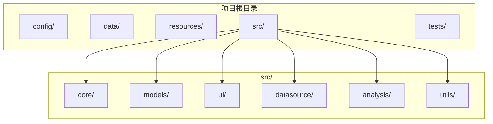
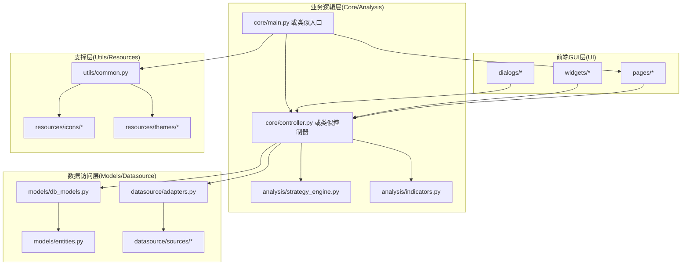
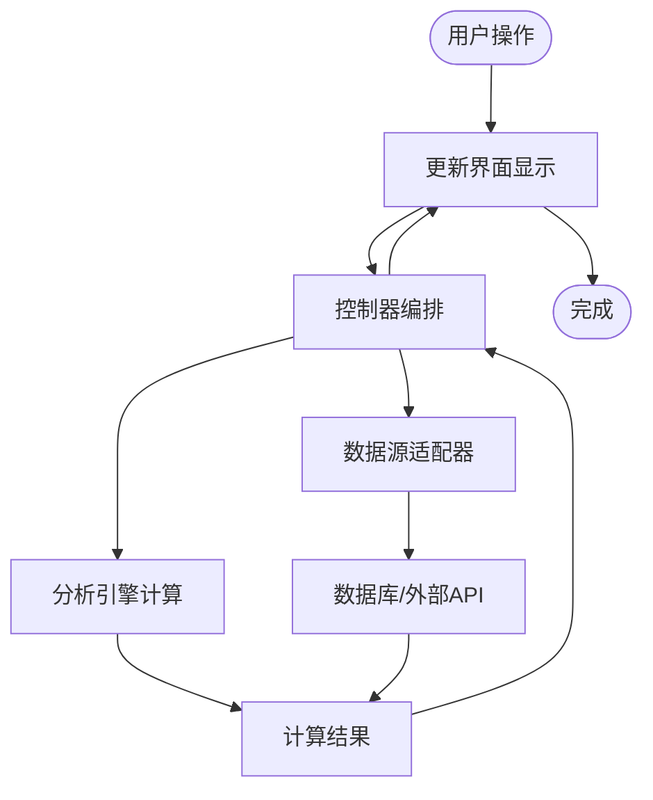
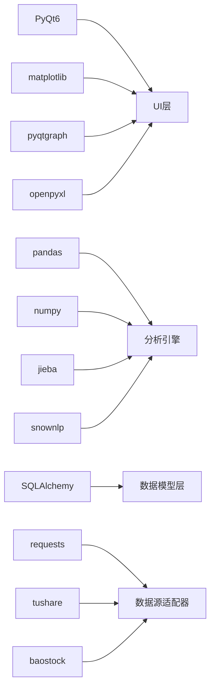

# 整体架构概览

<cite>
**本文档引用的文件**
- [requirements.txt](file://requirements.txt)
- [README.md](file://README.md)
</cite>

## 目录
1. [引言](#引言)
2. [项目结构](#项目结构)
3. [核心组件](#核心组件)
4. [架构总览](#架构总览)
5. [详细组件分析](#详细组件分析)
6. [依赖分析](#依赖分析)
7. [性能考虑](#性能考虑)
8. [故障排除指南](#故障排除指南)
9. [结论](#结论)
10. [附录](#附录)

## 引言
本文件为StockSift的整体架构概览文档，面向开发者与产品团队，系统化阐述系统的高层架构设计、核心设计理念与分层边界。StockSift是一个A股智能选股软件，采用MVC（Model-View-Controller）分层架构，结合Python生态中的成熟库实现数据采集、处理、存储与可视化展示。

系统以“前端GUI层-业务逻辑层-数据访问层”为主线进行分层解耦，通过清晰的模块边界与依赖方向，确保功能扩展与维护的可演进性。技术选型方面，采用PyQt6作为GUI框架、pandas/numpy进行数据处理、SQLAlchemy进行数据库抽象、tushare/baostock等作为数据源适配器，并辅以matplotlib/pyqtgraph用于图表可视化。

## 项目结构
仓库采用按职责域划分的模块化组织方式，主要目录如下：
- config：配置管理与环境变量加载
- data：运行时数据与缓存、日志、数据库文件存放
- resources：图标、策略模板、主题资源
- src：核心源码，按领域分层组织
  - analysis：策略分析与计算引擎
  - core：应用核心控制流与主入口
  - datasource：数据源适配器与采集接口
  - models：数据模型与领域实体定义
  - ui：用户界面组件（pages、widgets、dialogs）
  - utils：通用工具与辅助函数
- tests：单元测试与集成测试



**章节来源**
- [requirements.txt:1-32](file://requirements.txt#L1-L32)

## 核心组件
- 前端GUI层（UI层）
  - 职责：负责用户交互、页面导航、控件渲染与事件响应；提供策略配置、结果展示、图表可视化等界面能力。
  - 组成：pages（页面级容器）、widgets（可复用控件）、dialogs（对话框）。
- 业务逻辑层（Core/Analysis）
  - 职责：编排数据采集、清洗、策略计算与结果聚合；协调UI与数据访问层之间的业务流程。
  - 组成：core（应用主控制器与生命周期管理）、analysis（策略引擎与指标计算）。
- 数据访问层（Models/Datasource）
  - 职责：封装数据持久化与外部数据源访问；提供统一的数据模型与查询接口。
  - 组成：models（领域模型与ORM映射）、datasource（数据源适配器与API封装）。
- 工具与支撑层（Utils/Resources）
  - 职责：提供通用工具函数、资源管理与配置加载，支撑上层业务稳定运行。

**章节来源**
- [requirements.txt:1-32](file://requirements.txt#L1-L32)

## 架构总览
系统采用MVC分层与模块化职责划分，形成“前端GUI-业务逻辑-数据访问”的三层协作关系。下图展示了主要模块间的依赖与交互方向：



**图示来源**
- [requirements.txt:1-32](file://requirements.txt#L1-L32)

## 详细组件分析
### MVC模式在系统中的应用
- Model（数据模型层）
  - 职责：定义领域实体、数据结构与持久化映射；提供数据约束与校验规则。
  - 位置：models/ 下的实体与ORM模型文件。
- View（用户界面层）
  - 职责：呈现数据与交互元素；接收用户输入并触发控制器动作。
  - 位置：ui/pages、ui/widgets、ui/dialogs。
- Controller（控制逻辑层）
  - 职责：协调Model与View，编排业务流程；处理用户事件、调用分析引擎与数据源适配器。
  - 位置：core/ 控制器与主入口。

```mermaid
classDiagram
class ModelLayer {
"领域实体定义"
"数据模型与ORM映射"
}
class ViewLayer {
"页面容器"
"控件集合"
"对话框"
}
class ControllerLayer {
"业务编排"
"事件处理"
"流程调度"
}
class AnalysisLayer {
"策略引擎"
"指标计算"
}
class DatasourceLayer {
"数据源适配器"
"外部API封装"
}
ControllerLayer --> ModelLayer : "读写数据"
ControllerLayer --> ViewLayer : "更新界面"
ControllerLayer --> AnalysisLayer : "触发计算"
ControllerLayer --> DatasourceLayer : "拉取数据"
```

**图示来源**
- [requirements.txt:1-32](file://requirements.txt#L1-L32)

### 分层架构的设计思路与边界
- 前端GUI层
  - 边界：仅负责界面渲染与事件传递，不直接参与业务决策与数据持久化。
  - 交互：通过控制器暴露的接口进行数据绑定与状态更新。
- 业务逻辑层
  - 边界：集中处理业务流程与策略编排，向上承接UI请求，向下协调数据访问与分析引擎。
  - 交互：对外提供统一的业务方法，内部通过依赖注入或模块导入完成协作。
- 数据访问层
  - 边界：屏蔽底层数据库与外部数据源差异，提供一致的数据读写接口。
  - 交互：被业务逻辑层调用，返回标准化的数据对象或执行结果。



**图示来源**
- [requirements.txt:1-32](file://requirements.txt#L1-L32)

### 技术选型与原因
- GUI框架：PyQt6
  - 原因：跨平台桌面应用开发成熟、控件丰富、信号槽机制便于事件驱动编程；与Python生态契合度高。
- 数据处理：pandas + numpy
  - 原因：高性能数值计算与灵活的数据结构，适合金融时间序列与多维指标处理。
- 可视化：matplotlib + pyqtgraph
  - 原因：matplotlib适合静态图表与学术风格，pyqtgraph适合实时曲线与交互式图表。
- 数据库：SQLAlchemy（<2.0.0）
  - 原因：ORM抽象降低数据库切换成本，支持多种后端；版本限制保证兼容性。
- 数据源：tushare + baostock
  - 原因：覆盖A股主流行情与财务数据，适配国内数据生态。
- 网络与文本：requests、jieba、snownlp
  - 原因：requests用于HTTP请求，jieba与snownlp用于中文文本处理与情感分析。
- 导出：openpyxl
  - 原因：Excel导出需求常见，openpyxl提供稳定的读写能力。

**章节来源**
- [requirements.txt:1-32](file://requirements.txt#L1-L32)

### 可扩展性设计原则与未来演进方向
- 设计原则
  - 单一职责：每个模块聚焦特定领域，避免交叉污染。
  - 开闭原则：通过接口与适配器模式扩展新数据源与策略。
  - 依赖倒置：上层依赖抽象而非具体实现，降低耦合。
  - 可测试性：将业务逻辑与UI分离，便于单元测试与集成测试。
- 未来演进方向
  - 微服务化：将分析引擎与数据源适配器抽取为独立服务，提升弹性与可扩展性。
  - 多语言支持：引入国际化框架，支持多语言界面与报告输出。
  - 实时流式计算：接入流式数据源与增量计算引擎，支持动态策略回测。
  - 插件化策略：开放策略插件接口，允许第三方贡献策略模块。

## 依赖分析
系统依赖关系以“上层调用下层、横向弱耦合”为原则，核心依赖链路如下：



**图示来源**
- [requirements.txt:1-32](file://requirements.txt#L1-L32)

**章节来源**
- [requirements.txt:1-32](file://requirements.txt#L1-L32)

## 性能考虑
- 数据处理性能
  - 利用pandas的向量化操作与numpy的数值计算，减少循环开销；对大规模数据采用分块读取与内存映射。
- 图表渲染性能
  - 对于高频更新曲线，优先使用pyqtgraph；静态图表使用matplotlib，避免重复重绘。
- 数据库访问性能
  - 使用SQLAlchemy连接池与批量写入，减少I/O往返；对热点数据建立索引与缓存。
- 界面响应性
  - 将耗时任务放入后台线程，避免阻塞UI主线程；通过信号槽异步更新界面状态。

## 故障排除指南
- GUI无响应或卡顿
  - 检查是否存在长时间阻塞在UI线程的任务；将耗时逻辑迁移至工作线程。
- 数据加载失败
  - 核查网络请求超时与重试策略；确认数据源API可用性与认证信息。
- 数据库异常
  - 检查连接字符串与权限；确认ORM映射字段与数据库结构一致。
- 图表显示异常
  - 确认数据格式与范围；检查图表控件的刷新时机与数据更新频率。

## 结论
StockSift通过清晰的MVC分层与模块化设计，实现了前端交互、业务逻辑与数据访问的有效解耦。依托成熟的Python生态，系统在数据处理、可视化与跨平台GUI方面具备良好性能与可维护性。未来可在微服务化、插件化与流式计算等方面持续演进，进一步提升系统的可扩展性与智能化水平。

## 附录
- 术语说明
  - MVC：Model（模型）、View（视图）、Controller（控制器）的分层架构模式。
  - ORM：对象关系映射，用于将数据库记录映射为对象实例。
  - 适配器：对不同数据源提供统一接口的封装层。
- 参考资料
  - PyQt6官方文档与示例
  - pandas/numpy官方文档
  - SQLAlchemy官方文档
  - tushare/baostock官方文档
  - matplotlib/pyqtgraph官方文档