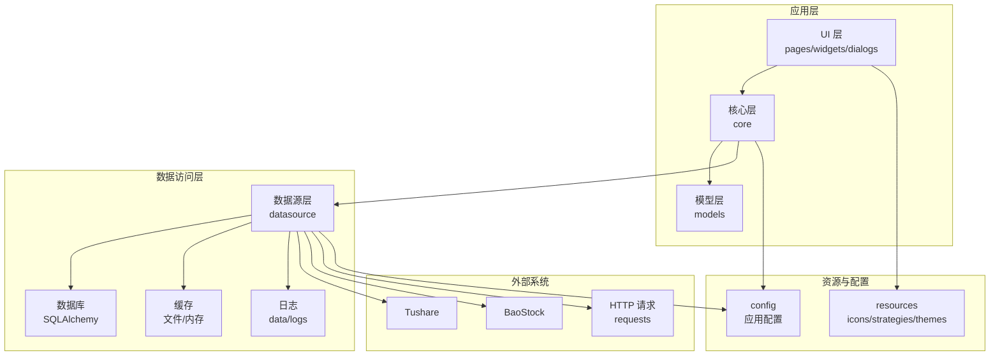
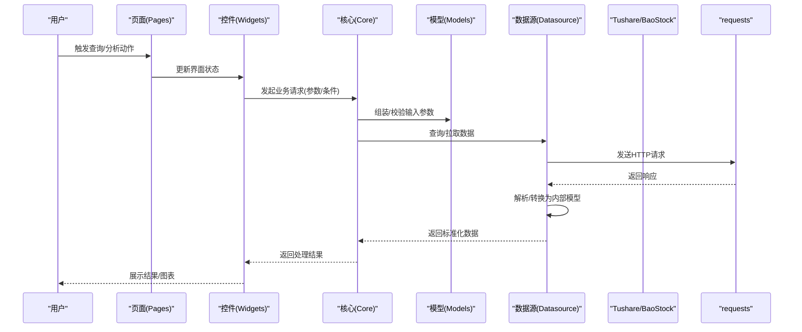
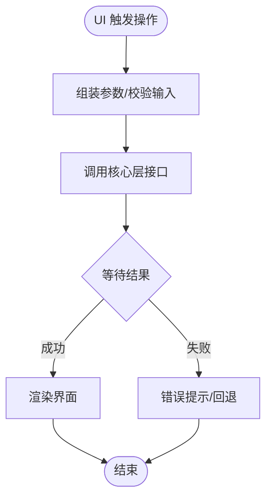
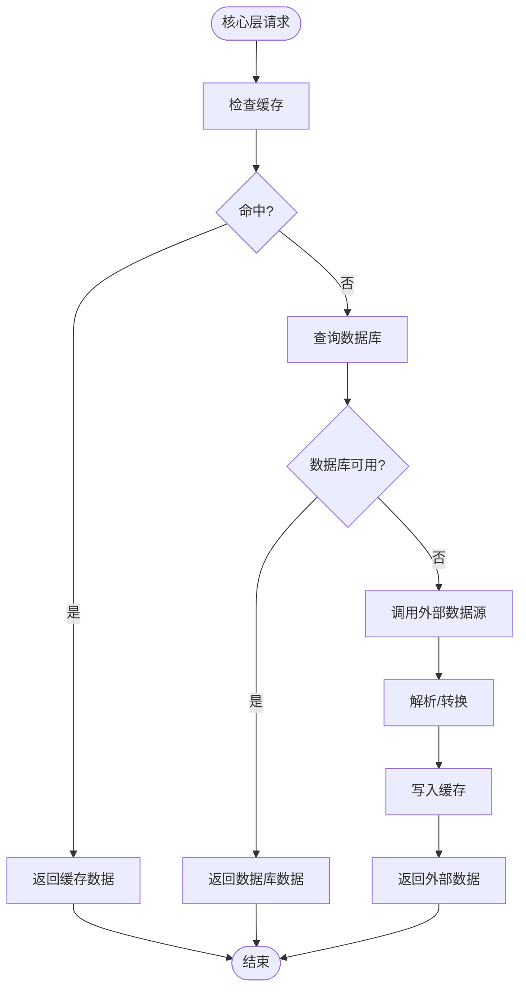
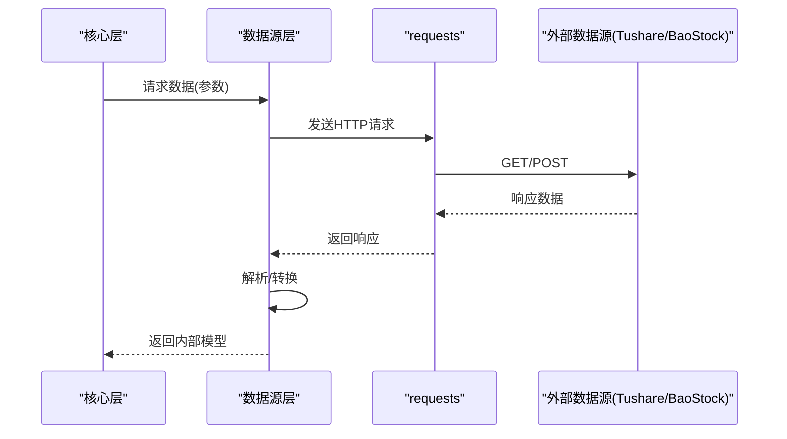
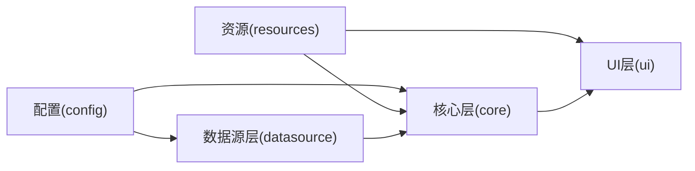
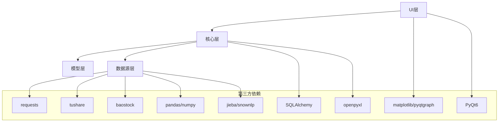

# 模块交互关系

<cite>
**本文引用的文件**
- [requirements.txt](file://requirements.txt)
</cite>

## 目录
1. [简介](#简介)
2. [项目结构](#项目结构)
3. [核心组件](#核心组件)
4. [架构总览](#架构总览)
5. [详细组件分析](#详细组件分析)
6. [依赖分析](#依赖分析)
7. [性能考虑](#性能考虑)
8. [故障排查指南](#故障排查指南)
9. [结论](#结论)
10. [附录](#附录)

## 简介
本文件面向StockSift项目，聚焦于模块交互关系的系统化梳理，旨在阐明UI层、业务逻辑层、数据访问层以及外部数据源之间的依赖与协作机制。文档同时覆盖模块初始化顺序、生命周期管理与错误传播路径，帮助开发者与维护者快速理解系统的整体运行方式。

由于当前工作区中未发现src/core、src/ui、src/models、src/datasource、src/analysis、src/utils等子目录的具体实现文件，本文基于现有依赖清单与目录结构进行概念性建模与流程说明，避免对不存在或未提供的具体代码片段进行断言。

## 项目结构
仓库采用按职责分层的目录组织方式：
- config：配置相关（如应用参数、策略配置）
- data：本地数据存储（缓存、数据库、日志）
- resources：资源文件（图标、策略模板、主题）
- src：源代码主体，按功能域划分
  - analysis：分析算法与策略封装
  - core：核心业务逻辑与协调器
  - datasource：数据源适配器与接入层
  - models：领域模型与数据结构
  - ui：用户界面（pages、widgets、dialogs）
  - utils：通用工具与辅助方法
- tests：测试用例
- requirements.txt：第三方依赖清单

图表来源
- [requirements.txt:1-32](file://requirements.txt#L1-L32)

章节来源
- [requirements.txt:1-32](file://requirements.txt#L1-L32)

## 核心组件
- UI层：负责用户交互、页面导航与控件展示，向上承接核心层的业务结果，向下触发事件与状态变更。
- 核心层：协调业务流程，编排模型与数据源，提供统一的业务入口与错误聚合。
- 模型层：承载领域数据结构与规则，作为UI与数据源之间的契约。
- 数据源层：封装不同外部数据源（如Tushare、BaoStock）与本地缓存/数据库的访问逻辑。
- 资源与配置：提供图标、主题、策略模板等静态资源，以及应用运行时配置。
- 工具层：提供通用方法（如网络请求、文本处理、Excel导出等），被其他层复用。

章节来源
- [requirements.txt:1-32](file://requirements.txt#L1-L32)

## 架构总览
下图展示了从UI到数据源的典型调用链路与数据流：

图表来源
- [requirements.txt:1-32](file://requirements.txt#L1-L32)

## 详细组件分析

### UI层与业务逻辑层交互
- 交互模式：UI层通过事件驱动向核心层发起请求；核心层完成业务编排后返回结果或错误。
- 松耦合设计：UI仅依赖核心层暴露的业务接口，不直接感知数据源细节。
- 生命周期：页面初始化时注册回调与订阅；页面销毁时取消订阅与释放资源。

图表来源
- [requirements.txt:1-32](file://requirements.txt#L1-L32)

### 业务逻辑层与数据访问层交互
- 协调策略：核心层根据业务需求选择合适的数据源与缓存策略，决定是否重用历史数据。
- 错误聚合：对数据源异常进行捕获与包装，向上抛出统一的业务异常类型。
- 缓存与数据库：优先读取缓存，未命中则查询数据库或外部数据源，并写入缓存以提升后续性能。

图表来源
- [requirements.txt:1-32](file://requirements.txt#L1-L32)

### 数据访问层与外部数据源交互
- 外部数据源：通过HTTP请求访问Tushare或BaoStock，解析响应并转换为内部模型。
- 网络与超时：统一使用requests进行网络请求，设置合理的超时与重试策略。
- 日志与监控：记录请求日志与错误信息，便于问题定位与性能分析。

图表来源
- [requirements.txt:1-32](file://requirements.txt#L1-L32)

### 配置管理与资源管理
- 配置管理：集中管理应用参数（如数据源凭据、缓存策略、日志级别），供核心层与数据源层读取。
- 资源管理：提供图标、主题与策略模板，UI层按需加载，确保界面一致性与可扩展性。
- 交互方式：核心层在启动阶段读取配置，数据源层在初始化时加载凭据；UI层在渲染前加载主题与图标。

图表来源
- [requirements.txt:1-32](file://requirements.txt#L1-L32)

## 依赖分析
- 第三方依赖：GUI框架（PyQt6）、数据处理（pandas、numpy）、可视化（matplotlib、pyqtgraph）、数据库（SQLAlchemy）、网络（requests）、中文处理（jieba、snownlp）、Excel导出（openpyxl）、股票数据源（tushare、baostock）。
- 模块间依赖：UI依赖核心层；核心层依赖模型层与数据源层；数据源层依赖requests与外部数据源；所有层共享配置与资源。

图表来源
- [requirements.txt:1-32](file://requirements.txt#L1-L32)

章节来源
- [requirements.txt:1-32](file://requirements.txt#L1-L32)

## 性能考虑
- 缓存策略：优先使用内存/文件缓存，减少重复网络请求与解析开销。
- 批量与异步：对高频查询采用批量请求与异步处理，避免阻塞UI线程。
- 数据压缩与序列化：对外部数据进行必要的压缩与结构化存储，降低I/O成本。
- 可视化优化：图表渲染采用增量更新与懒加载，提升大体量数据展示性能。

## 故障排查指南
- 网络异常：检查requests超时与重试配置，确认代理与防火墙设置。
- 数据源不可用：切换备用数据源或启用降级策略，记录错误日志以便追踪。
- 缓存污染：定期清理过期缓存，确保缓存键与版本号一致。
- UI卡顿：避免在主线程执行耗时任务，使用后台线程与信号槽更新界面。
- 配置错误：核对配置文件路径与权限，确保凭据与参数正确无误。

## 结论
StockSift通过清晰的分层架构实现了UI、业务逻辑、数据访问与外部数据源的解耦。配置与资源模块为各层提供统一支撑，配合缓存与异步策略，能够在保证用户体验的同时提升系统稳定性与可维护性。建议在后续开发中补充核心模块的具体实现文件，以便进一步细化模块间的接口契约与调用细节。

## 附录
- 初始化顺序建议：配置与资源加载 → 数据源初始化 → 核心层初始化 → UI层初始化
- 生命周期管理：页面/窗口创建时注册事件与订阅；销毁时注销订阅并释放资源
- 错误传播：数据源层捕获底层异常并转换为业务异常，核心层统一处理并反馈给UI层