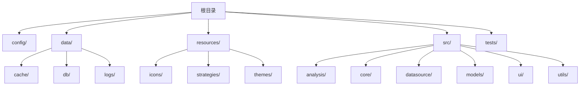
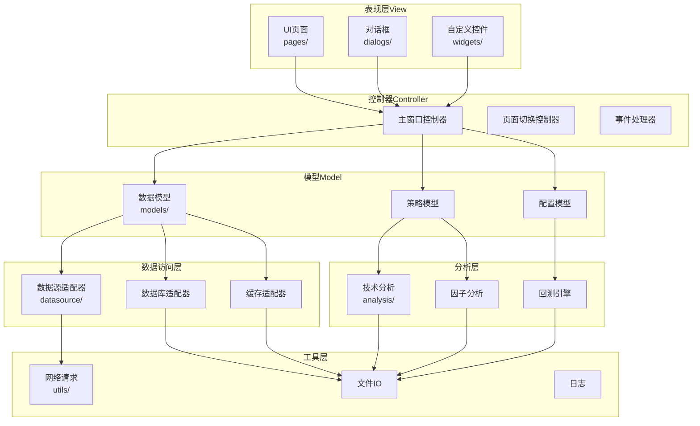
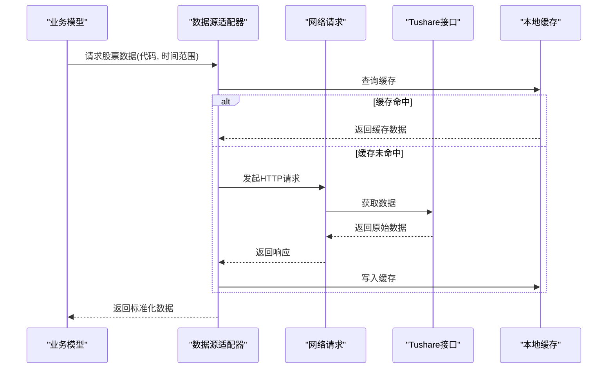
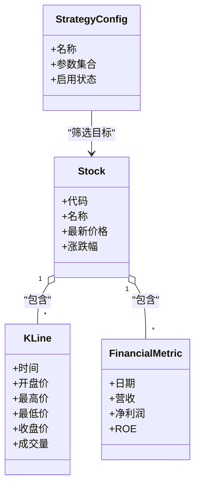
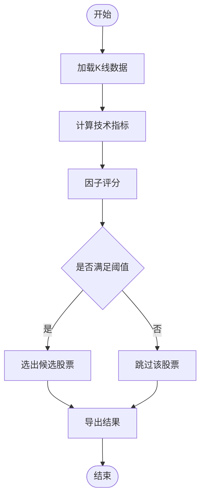
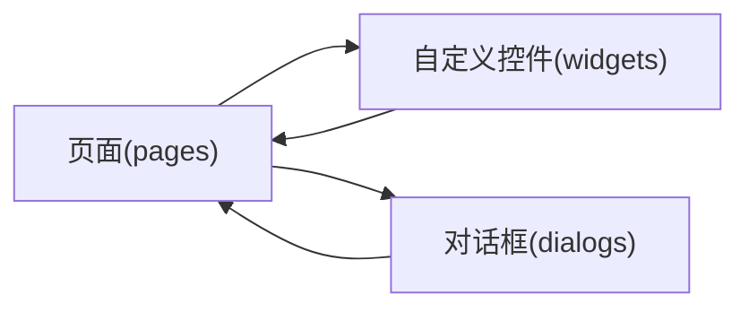
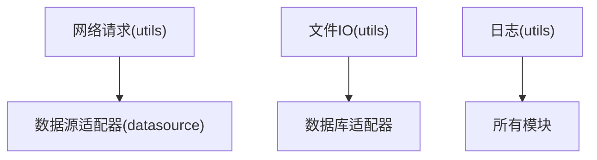
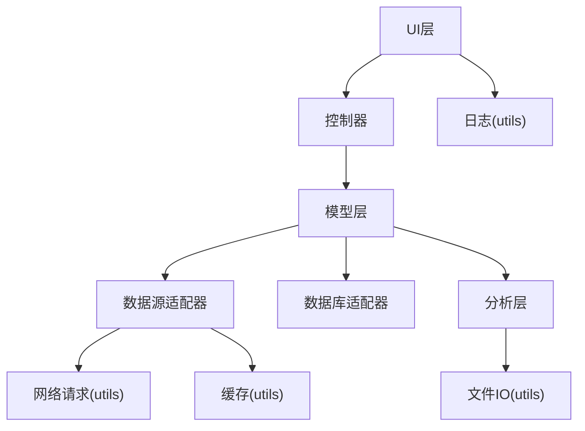

# 系统架构设计

<cite>
**本文档引用的文件**
- [requirements.txt](file://requirements.txt)
- [config/](file://config/)
- [data/cache/](file://data/cache/)
- [data/db/](file://data/db/)
- [data/logs/](file://data/logs/)
- [resources/icons/](file://resources/icons/)
- [resources/strategies/](file://resources/strategies/)
- [resources/themes/](file://resources/themes/)
</cite>

## 目录
1. [引言](#引言)
2. [项目结构](#项目结构)
3. [核心组件](#核心组件)
4. [架构总览](#架构总览)
5. [详细组件分析](#详细组件分析)
6. [依赖分析](#依赖分析)
7. [性能考虑](#性能考虑)
8. [故障排除指南](#故障排除指南)
9. [结论](#结论)
10. [附录](#附录)

## 引言
本架构设计文档面向StockSift项目，旨在系统化阐述其整体架构模式与设计原则。StockSift是一个A股选股软件，基于Python构建，采用分层架构与MVC思想组织代码，结合GUI层、业务逻辑层与数据访问层的职责分离，实现从数据采集、处理、分析到可视化的完整流程。本文档将重点说明：
- 分层架构与MVC模式的应用
- 各模块间交互关系与数据流
- 核心设计决策与技术选型
- 系统边界与可扩展性设计
- 性能与安全相关考量

## 项目结构
仓库采用按功能域划分的目录结构，主要模块包括：
- config：配置管理（如数据库连接、策略参数等）
- data：应用运行时产生的数据，包括缓存、数据库文件与日志
- resources：资源文件，包含图标、策略模板与主题样式
- src：源代码，按领域拆分为analysis、core、datasource、models、ui、utils等子包
- tests：测试用例（当前未提供具体文件）

图表来源
- [config/](file://config/)
- [data/](file://data/)
- [resources/](file://resources/)
- [src/](file://src/)

章节来源
- [requirements.txt:1-32](file://requirements.txt#L1-L32)

## 核心组件
根据依赖清单与目录结构，StockSift的核心技术栈与模块职责如下：
- GUI框架：PyQt6，用于构建桌面端用户界面
- 数据源：tushare、baostock，提供A股行情与财务数据
- 数据处理：pandas、numpy，支持高效的数据清洗、计算与统计
- 可视化：matplotlib、pyqtgraph，用于图表绘制与实时图形展示
- 数据库：sqlalchemy（版本限制），用于ORM与数据库抽象
- 网络请求：requests，用于HTTP数据拉取
- 中文处理：jieba、snownlp，用于文本分词与情感分析
- 导出：openpyxl，用于Excel导出

这些组件共同支撑了从数据采集、存储、分析到可视化的全链路能力。

章节来源
- [requirements.txt:4-32](file://requirements.txt#L4-L32)

## 架构总览
StockSift采用分层架构与MVC思想相结合的设计：
- 表现层（View）：由PyQt6构建的UI组件负责用户交互与展示
- 控制器（Controller）：协调UI事件与业务逻辑，驱动模型更新与视图刷新
- 模型（Model）：封装数据结构、业务规则与持久化逻辑
- 数据访问层：通过datasource与数据库/文件系统交互
- 分析层：analysis模块提供策略与指标计算
- 工具层：utils提供通用工具函数

图表来源
- [src/ui/](file://src/ui/)
- [src/models/](file://src/models/)
- [src/datasource/](file://src/datasource/)
- [src/analysis/](file://src/analysis/)
- [src/utils/](file://src/utils/)

## 详细组件分析

### 数据源适配层（datasource）
职责
- 封装不同数据源（tushare、baostock）的接入细节
- 提供统一的数据读取接口，屏蔽底层差异
- 支持增量更新、错误重试与超时控制

交互关系
- 被业务模型调用以获取历史行情、财务数据或实时数据
- 通过网络请求模块进行HTTP访问，并将结果转换为内部数据结构

图表来源
- [src/datasource/](file://src/datasource/)
- [src/utils/](file://src/utils/)
- [data/cache/](file://data/cache/)

### 数据模型层（models）
职责
- 定义核心实体（如股票、K线、财务指标）的数据结构
- 维护数据一致性与校验规则
- 提供序列化/反序列化能力，便于持久化与传输

交互关系
- 为UI提供数据绑定与状态管理
- 为分析层提供标准化输入
- 为数据访问层提供持久化接口

图表来源
- [src/models/](file://src/models/)

### 分析层（analysis）
职责
- 实现技术分析指标（如均线、MACD、布林带等）
- 提供因子分析与多因子打分能力
- 支持回测框架，评估策略收益与风险

交互关系
- 输入来自数据模型与数据源适配器
- 输出用于UI展示与策略配置

图表来源
- [src/analysis/](file://src/analysis/)
- [src/models/](file://src/models/)

### UI层（ui）
职责
- 页面（pages）：承载主要功能区域（如选股页、回测页、设置页）
- 对话框（dialogs）：处理确认、输入、提示等交互
- 自定义控件（widgets）：复用的可视化组件（如K线图、列表、过滤器）

交互关系
- 通过控制器接收用户操作
- 订阅模型变化以自动刷新视图
- 调用分析层与数据访问层获取数据

图表来源
- [src/ui/pages/](file://src/ui/pages/)
- [src/ui/dialogs/](file://src/ui/dialogs/)
- [src/ui/widgets/](file://src/ui/widgets/)

### 工具层（utils）
职责
- 网络请求：封装HTTP客户端，统一错误处理与重试
- 文件IO：读写CSV、Excel、JSON等格式
- 日志：集中式日志记录，支持级别与文件滚动

交互关系
- 为数据访问层与分析层提供基础设施能力

图表来源
- [src/utils/](file://src/utils/)
- [src/datasource/](file://src/datasource/)
- [src/models/](file://src/models/)

## 依赖分析
技术栈与模块耦合关系
- GUI与业务解耦：UI仅依赖控制器与模型接口，避免直接访问数据源
- 数据访问抽象：通过适配器屏蔽具体数据源差异
- 分析与数据解耦：分析层仅消费标准化数据模型
- 工具层作为基础设施，被广泛复用

图表来源
- [requirements.txt:4-32](file://requirements.txt#L4-L32)
- [src/ui/](file://src/ui/)
- [src/core/](file://src/core/)
- [src/models/](file://src/models/)
- [src/datasource/](file://src/datasource/)
- [src/analysis/](file://src/analysis/)
- [src/utils/](file://src/utils/)

章节来源
- [requirements.txt:4-32](file://requirements.txt#L4-L32)

## 性能考虑
- 缓存策略：优先查询本地缓存，减少重复网络请求；对高频数据建立LRU缓存
- 批量处理：对大量K线与财务数据采用分批读取与内存映射，降低峰值内存占用
- 并行计算：利用numpy/pandas向量化运算，避免显式循环；必要时使用多进程加速回测
- 可视化优化：pyqtgraph适合大数据量实时渲染；对历史数据采用降采样策略
- I/O优化：使用异步网络请求与连接池，减少阻塞；对导出任务进行后台执行

## 故障排除指南
常见问题与定位建议
- 数据拉取失败：检查网络请求模块的日志与重试策略；确认数据源接口可用性
- 缓存异常：清理data/cache目录后重试；核对缓存键与过期策略
- 回测耗时过长：启用并行回测；减少样本区间或指标数量
- GUI卡顿：避免在主线程执行I/O与重计算；将耗时任务移至工作线程
- 数据库锁：合理设置事务隔离级别；避免长时间持有游标

章节来源
- [src/utils/](file://src/utils/)
- [data/cache/](file://data/cache/)
- [data/logs/](file://data/logs/)

## 结论
StockSift通过清晰的分层架构与MVC思想，实现了GUI、业务与数据的职责分离。以PyQt6为界面框架、以pandas/numpy为数据处理核心、以sqlalchemy为数据库抽象、以tushare/baostock为数据源，配合analysis与utils模块，构建了从数据采集到可视化的完整闭环。该架构具备良好的可扩展性与可维护性，便于后续引入更多数据源、分析算法与UI组件。

## 附录
- 系统边界
  - 外部依赖：tushare、baostock、数据库、文件系统
  - 内部边界：UI层、控制器、模型层、数据访问层、分析层、工具层
- 资源与配置
  - 配置：config目录存放系统参数与策略配置
  - 资源：resources目录存放图标、策略模板与主题样式
  - 运行数据：data目录下cache/db/logs分别存放缓存、数据库与日志

章节来源
- [config/](file://config/)
- [resources/icons/](file://resources/icons/)
- [resources/strategies/](file://resources/strategies/)
- [resources/themes/](file://resources/themes/)
- [data/cache/](file://data/cache/)
- [data/db/](file://data/db/)
- [data/logs/](file://data/logs/)