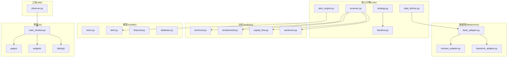
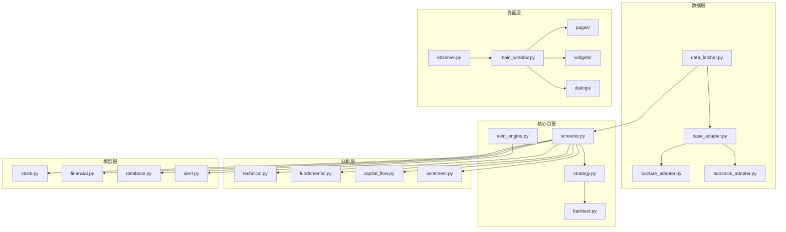
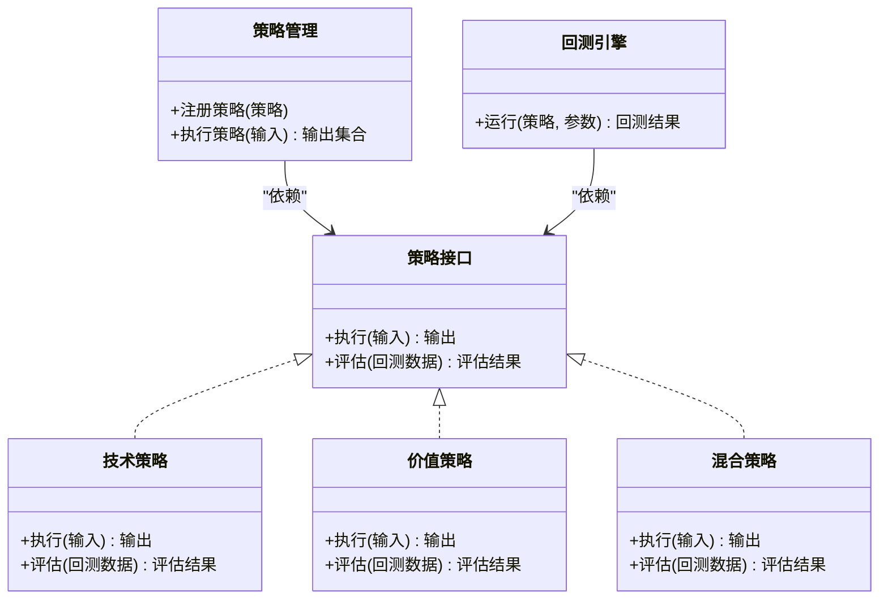
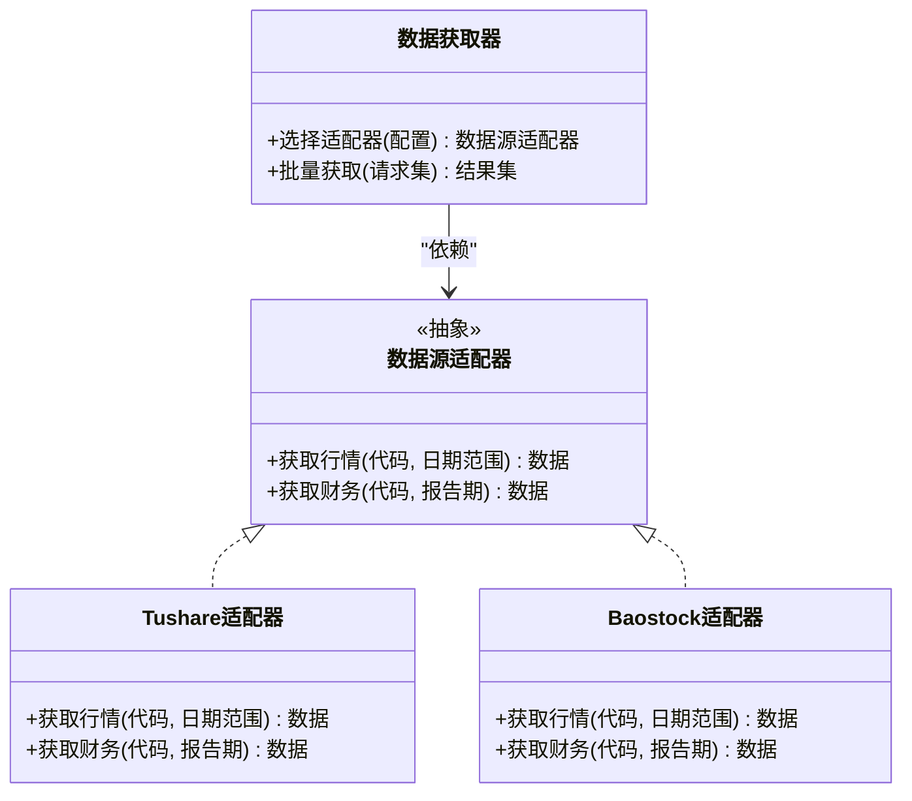
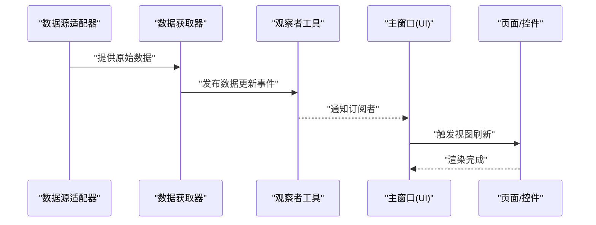
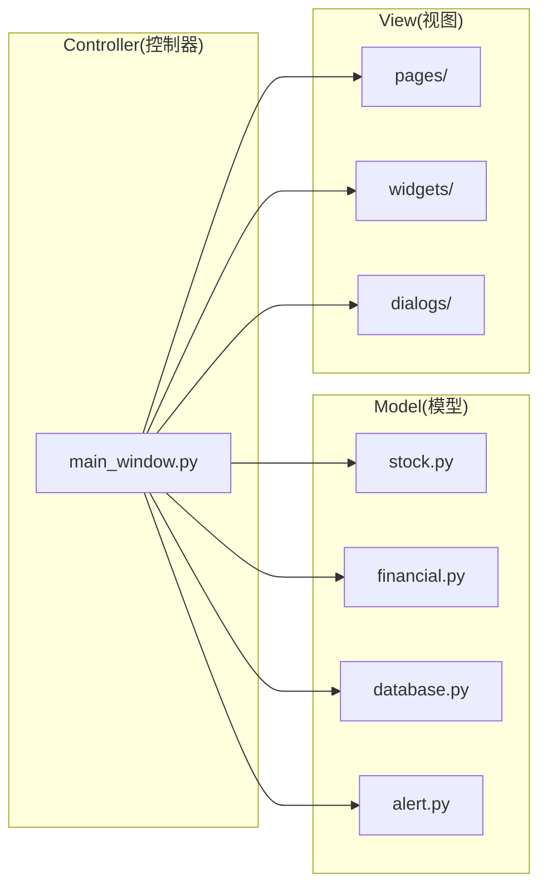
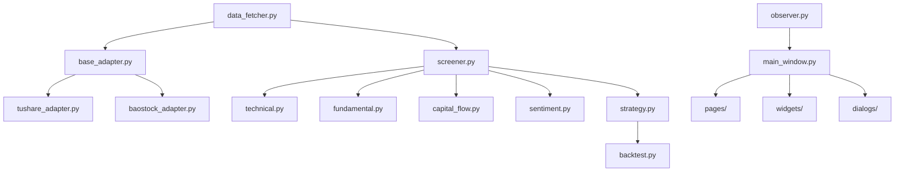

# 设计模式应用

<cite>
**本文引用的文件**
- [PRD.md](file://docs/PRD.md)
- [screener.py](file://src/core/screener.py)
- [strategy.py](file://src/core/strategy.py)
- [backtest.py](file://src/core/backtest.py)
- [alert_engine.py](file://src/core/alert_engine.py)
- [data_fetcher.py](file://src/core/data_fetcher.py)
- [base_adapter.py](file://src/datasource/base_adapter.py)
- [tushare_adapter.py](file://src/datasource/tushare_adapter.py)
- [baostock_adapter.py](file://src/datasource/baostock_adapter.py)
- [stock.py](file://src/models/stock.py)
- [alert.py](file://src/models/alert.py)
- [financial.py](file://src/models/financial.py)
- [database.py](file://src/models/database.py)
- [main_window.py](file://src/ui/main_window.py)
- [pages/](file://src/ui/pages/)
- [widgets/](file://src/ui/widgets/)
- [dialogs/](file://src/ui/dialogs/)
- [technical.py](file://src/analysis/technical.py)
- [fundamental.py](file://src/analysis/fundamental.py)
- [capital_flow.py](file://src/analysis/capital_flow.py)
- [sentiment.py](file://src/analysis/sentiment.py)
- [observer.py](file://src/utils/observer.py)
</cite>

## 目录
1. [引言](#引言)
2. [项目结构](#项目结构)
3. [核心组件](#核心组件)
4. [架构总览](#架构总览)
5. [详细组件分析](#详细组件分析)
6. [依赖分析](#依赖分析)
7. [性能考虑](#性能考虑)
8. [故障排查指南](#故障排查指南)
9. [结论](#结论)
10. [附录](#附录)

## 引言
本文件聚焦StockSift项目中设计模式的应用实践，围绕以下目标展开：
- 策略模式在选股策略引擎中的应用，使策略可插拔、可扩展、易测试；
- 工厂模式在数据源适配器创建中的使用，统一接口、屏蔽差异；
- 观察者模式在数据更新通知中的实现，解耦数据变更与订阅方；
- MVC模式在UI层的具体落地，明确Model/View/Controller职责边界。

同时，结合PRD对功能模块的描述，给出与代码结构相对应的模式映射与可视化说明，帮助读者从架构层面理解系统设计思路与可维护性、可扩展性、可测试性的提升路径。

## 项目结构
StockSift采用按功能域划分的模块化组织方式，核心模块包括：
- core：核心引擎（筛选、策略、回测、预警、数据获取）
- datasource：数据源适配器（抽象基类与具体实现）
- analysis：分析模块（技术、基本面、资金流、情绪）
- models：数据模型（股票、预警、财务、数据库）
- ui：用户界面（主窗口、页面、控件、对话框）
- utils：通用工具（如观察者）
- docs：产品需求与架构说明

**图表来源**
- [PRD.md:304-337](file://docs/PRD.md#L304-L337)
- [screener.py](file://src/core/screener.py)
- [strategy.py](file://src/core/strategy.py)
- [backtest.py](file://src/core/backtest.py)
- [alert_engine.py](file://src/core/alert_engine.py)
- [data_fetcher.py](file://src/core/data_fetcher.py)
- [base_adapter.py](file://src/datasource/base_adapter.py)
- [tushare_adapter.py](file://src/datasource/tushare_adapter.py)
- [baostock_adapter.py](file://src/datasource/baostock_adapter.py)
- [technical.py](file://src/analysis/technical.py)
- [fundamental.py](file://src/analysis/fundamental.py)
- [capital_flow.py](file://src/analysis/capital_flow.py)
- [sentiment.py](file://src/analysis/sentiment.py)
- [stock.py](file://src/models/stock.py)
- [alert.py](file://src/models/alert.py)
- [financial.py](file://src/models/financial.py)
- [database.py](file://src/models/database.py)
- [main_window.py](file://src/ui/main_window.py)
- [observer.py](file://src/utils/observer.py)

**章节来源**
- [PRD.md:304-337](file://docs/PRD.md#L304-L337)

## 核心组件
本节从设计模式视角梳理关键组件与其职责：
- 策略模式：在策略管理与回测引擎中，通过“策略接口”与“具体策略实现”分离，实现策略的可插拔与可替换。
- 工厂模式：在数据源适配器中，通过抽象基类与具体实现类，配合工厂或简单构造逻辑，屏蔽不同数据源的差异。
- 观察者模式：在数据更新流程中，通过发布/订阅机制通知订阅者刷新视图或执行后续动作。
- MVC模式：在UI层，主窗口作为控制器协调视图与模型；页面与控件负责视图渲染；模型封装数据与业务实体。

上述职责划分与PRD中的模块划分一致，便于后续深入分析。

**章节来源**
- [PRD.md:304-337](file://docs/PRD.md#L304-L337)

## 架构总览
下图展示了StockSift在数据获取、策略执行、分析与UI交互之间的整体关系，体现策略模式、工厂模式与观察者模式的协同：

**图表来源**
- [data_fetcher.py](file://src/core/data_fetcher.py)
- [base_adapter.py](file://src/datasource/base_adapter.py)
- [tushare_adapter.py](file://src/datasource/tushare_adapter.py)
- [baostock_adapter.py](file://src/datasource/baostock_adapter.py)
- [screener.py](file://src/core/screener.py)
- [strategy.py](file://src/core/strategy.py)
- [backtest.py](file://src/core/backtest.py)
- [alert_engine.py](file://src/core/alert_engine.py)
- [technical.py](file://src/analysis/technical.py)
- [fundamental.py](file://src/analysis/fundamental.py)
- [capital_flow.py](file://src/analysis/capital_flow.py)
- [sentiment.py](file://src/analysis/sentiment.py)
- [stock.py](file://src/models/stock.py)
- [financial.py](file://src/models/financial.py)
- [database.py](file://src/models/database.py)
- [alert.py](file://src/models/alert.py)
- [main_window.py](file://src/ui/main_window.py)
- [observer.py](file://src/utils/observer.py)

## 详细组件分析

### 策略模式：选股策略引擎
- 模式要点
  - 将“策略接口”与“具体策略实现”解耦，策略可按需组合与替换；
  - 在策略管理与回测引擎中，通过统一的策略对象进行执行与评估；
  - 便于新增策略类型（技术策略、价值策略、混合策略）且不影响现有代码。
- 代码映射
  - 策略管理与回测引擎位于核心模块，策略定义与执行流程在PRD中有明确描述。
- 设计收益
  - 提升可维护性：策略独立演进；
  - 提升可扩展性：新增策略无需修改既有策略；
  - 提升可测试性：策略可单独单元测试。

**图表来源**
- [strategy.py](file://src/core/strategy.py)
- [backtest.py](file://src/core/backtest.py)

**章节来源**
- [PRD.md:195-218](file://docs/PRD.md#L195-L218)

### 工厂模式：数据源适配器创建
- 模式要点
  - 抽象基类定义统一接口，具体实现类屏蔽不同数据源差异；
  - 通过工厂或简单构造逻辑选择合适的数据源适配器；
  - 便于扩展新的数据源，保持调用方稳定。
- 代码映射
  - 抽象基类与具体适配器分别位于datasource目录；
  - 数据获取模块依赖抽象基类，从而解耦具体实现。
- 设计收益
  - 提升可维护性：新增数据源仅需实现接口；
  - 提升可扩展性：调用方不感知具体实现；
  - 提升可测试性：可通过Mock适配器隔离外部依赖。

**图表来源**
- [base_adapter.py](file://src/datasource/base_adapter.py)
- [tushare_adapter.py](file://src/datasource/tushare_adapter.py)
- [baostock_adapter.py](file://src/datasource/baostock_adapter.py)
- [data_fetcher.py](file://src/core/data_fetcher.py)

**章节来源**
- [PRD.md:341-346](file://docs/PRD.md#L341-L346)

### 观察者模式：数据更新通知
- 模式要点
  - 发布者维护订阅者列表，在数据更新时广播通知；
  - 订阅者根据通知执行刷新或回调逻辑；
  - 解耦数据变更与UI或其他消费方。
- 代码映射
  - 观察者工具位于utils目录；
  - UI主窗口作为订阅者接收通知并驱动视图更新。
- 设计收益
  - 提升可维护性：订阅/发布逻辑集中；
  - 提升可扩展性：新增订阅者无需改动发布者；
  - 提升可测试性：可注入Mock观察者验证通知链路。

**图表来源**
- [observer.py](file://src/utils/observer.py)
- [main_window.py](file://src/ui/main_window.py)

**章节来源**
- [PRD.md:246-260](file://docs/PRD.md#L246-L260)

### MVC模式：Model-View-Controller实现
- Model层
  - 股票、财务、数据库、预警等模型封装数据与业务实体；
  - 屏蔽底层存储与计算细节，向上提供稳定接口。
- View层
  - 页面、控件、对话框负责界面展示与交互；
  - 通过订阅通知或轮询方式获取最新数据。
- Controller层
  - 主窗口承担控制器职责，协调页面切换、事件处理与业务逻辑；
  - 与核心引擎交互，驱动筛选、回测、预警等流程。
- 设计收益
  - 提升可维护性：职责清晰，便于定位问题；
  - 提升可扩展性：新增页面/控件不影响其他层；
  - 提升可测试性：可对Controller与Model进行单元测试。

**图表来源**
- [stock.py](file://src/models/stock.py)
- [financial.py](file://src/models/financial.py)
- [database.py](file://src/models/database.py)
- [alert.py](file://src/models/alert.py)
- [main_window.py](file://src/ui/main_window.py)
- [pages/](file://src/ui/pages/)
- [widgets/](file://src/ui/widgets/)
- [dialogs/](file://src/ui/dialogs/)

**章节来源**
- [PRD.md:263-292](file://docs/PRD.md#L263-L292)

## 依赖分析
- 模块内聚与耦合
  - 数据源适配器与核心引擎解耦，通过抽象接口连接；
  - 策略管理与回测引擎通过策略接口解耦；
  - UI层通过观察者与控制器解耦，降低对Model的直接依赖。
- 关键依赖链
  - 数据获取器 -> 数据源适配器（工厂/选择逻辑）
  - 筛选器 -> 技术/基本面/资金流/情绪分析模块
  - 策略管理 -> 回测引擎
  - 主窗口 -> 页面/控件/对话框（MVC）
  - 观察者 -> 主窗口（通知）

**图表来源**
- [data_fetcher.py](file://src/core/data_fetcher.py)
- [base_adapter.py](file://src/datasource/base_adapter.py)
- [tushare_adapter.py](file://src/datasource/tushare_adapter.py)
- [baostock_adapter.py](file://src/datasource/baostock_adapter.py)
- [screener.py](file://src/core/screener.py)
- [technical.py](file://src/analysis/technical.py)
- [fundamental.py](file://src/analysis/fundamental.py)
- [capital_flow.py](file://src/analysis/capital_flow.py)
- [sentiment.py](file://src/analysis/sentiment.py)
- [strategy.py](file://src/core/strategy.py)
- [backtest.py](file://src/core/backtest.py)
- [main_window.py](file://src/ui/main_window.py)
- [observer.py](file://src/utils/observer.py)

**章节来源**
- [PRD.md:304-337](file://docs/PRD.md#L304-L337)

## 性能考虑
- 策略模式
  - 通过策略接口减少重复计算，避免在调用端做过多分支判断；
  - 回测阶段建议缓存中间结果，降低重复计算开销。
- 工厂模式
  - 适配器实例化与选择逻辑应尽量轻量，避免阻塞主线程；
  - 对高频数据请求可引入连接池与并发限制。
- 观察者模式
  - 通知频率与粒度需权衡，避免频繁重绘导致UI卡顿；
  - 可采用节流/去抖策略，合并短时间内的多次通知。
- MVC模式
  - 控制器应避免在UI线程执行耗时任务，必要时异步处理；
  - Model层尽量提供增量更新接口，减少View层全量刷新。

## 故障排查指南
- 策略模式相关
  - 若策略执行异常，检查策略接口实现是否完整，以及回测参数配置是否正确。
- 工厂模式相关
  - 若数据源无法获取数据，确认适配器选择逻辑与配置项是否匹配，网络与鉴权是否正常。
- 观察者模式相关
  - 若UI未刷新，检查通知发布链路与订阅注册是否生效，是否存在异常中断。
- MVC模式相关
  - 若页面切换异常，检查控制器事件绑定与页面生命周期管理，确保Model数据一致性。

## 结论
StockSift通过策略模式、工厂模式与观察者模式的协同应用，实现了策略可插拔、数据源可替换、通知解耦与UI职责清晰的架构目标。结合PRD的功能模块划分，该设计在可维护性、可扩展性与可测试性方面均有显著提升，为后续迭代与功能扩展提供了良好的基础。

## 附录
- 术语说明
  - 策略模式：将算法族封装为对象，使它们可以相互替换；
  - 工厂模式：定义创建对象的接口，让子类决定实例化哪一个类；
  - 观察者模式：定义对象间一对多依赖，当一个对象状态改变时，通知所有依赖方；
  - MVC：Model（数据与业务）、View（界面展示）、Controller（业务控制）三层分离。