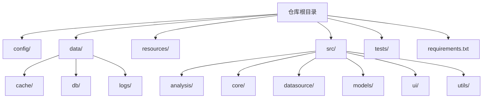
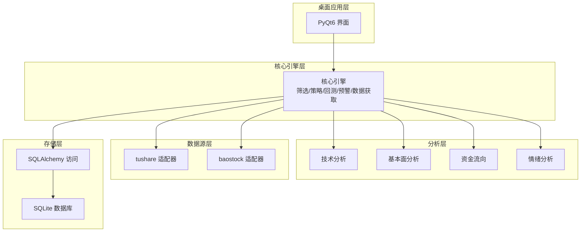
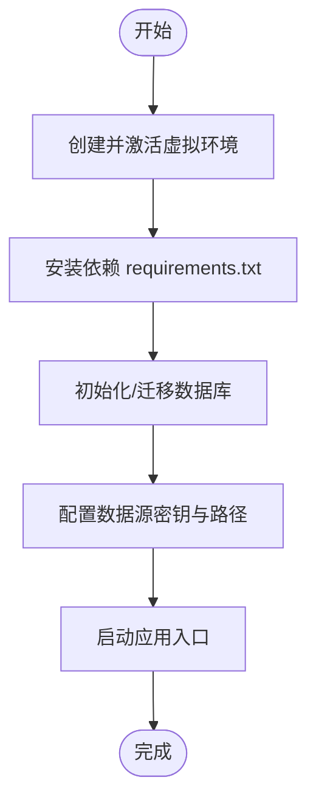
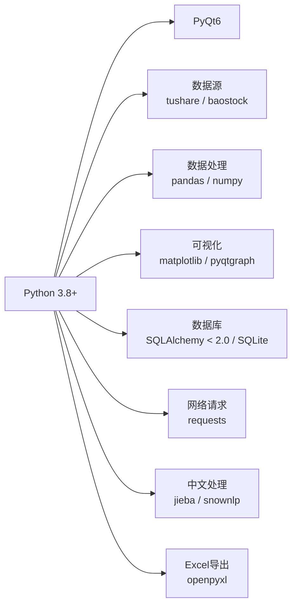

# 部署与运维

<cite>
**本文引用的文件**
- [requirements.txt](file://requirements.txt)
- [PRD.md](file://docs/PRD.md)
</cite>

## 目录
1. [简介](#简介)
2. [项目结构](#项目结构)
3. [核心组件](#核心组件)
4. [架构总览](#架构总览)
5. [详细组件分析](#详细组件分析)
6. [依赖分析](#依赖分析)
7. [性能考虑](#性能考虑)
8. [故障排查指南](#故障排查指南)
9. [结论](#结论)
10. [附录](#附录)

## 简介
本文件面向运维与平台工程团队，提供StockSift的部署与运维实践指南。内容覆盖环境准备、依赖安装、打包分发、性能监控、日志与故障诊断、安全与备份恢复等运维关键环节。由于仓库中未包含实际源代码文件，本文以PRD中的技术架构与模块划分作为设计依据，并结合依赖清单给出可执行的运维建议。

## 项目结构
仓库采用按功能域分层的目录组织方式，核心目录如下：
- config：配置管理（预留）
- data：运行时数据（缓存、数据库、日志）
- resources：资源文件（图标、策略模板、主题）
- src：源代码（analysis、core、datasource、models、ui、utils）
- tests：测试用例
- requirements.txt：Python依赖清单

**章节来源**
- [PRD.md: 294-328:294-328](file://docs/PRD.md#L294-L328)

## 核心组件
根据PRD的技术架构与模块划分，StockSift的核心组件包括：
- 核心引擎：筛选引擎、策略管理、回测引擎、预警引擎、数据获取
- 数据源适配器：tushare、baostock适配器
- 分析模块：技术分析、基本面分析、资金流向、情绪分析
- 数据模型：股票、预警、财务、数据库
- UI与交互：主窗口、对话框、页面、控件
- 工具与通用：日志、缓存、配置、网络请求

这些组件共同构成桌面端A股选股分析工具的完整运行链路。

**章节来源**
- [PRD.md: 294-328:294-328](file://docs/PRD.md#L294-L328)

## 架构总览
StockSift采用桌面应用架构，前端使用PyQt6构建图形界面，后端通过数据源适配器对接第三方数据接口，分析模块负责技术与基本面计算，核心引擎协调各模块完成筛选、回测与预警，数据持久化采用SQLite并通过SQLAlchemy进行访问。

**章节来源**
- [PRD.md: 294-328:294-328](file://docs/PRD.md#L294-L328)

## 详细组件分析

### 1) 环境与依赖准备
- Python版本：3.8+（兼容性要求）
- GUI框架：PyQt6
- 数据源：tushare、baostock
- 数据处理：pandas、numpy
- 可视化：matplotlib、pyqtgraph
- 数据库：SQLite + SQLAlchemy < 2.0
- 网络请求：requests
- 中文处理与情感分析：jieba、snownlp
- Excel导出：openpyxl

建议在隔离环境中安装依赖，避免与系统Python冲突；生产部署建议锁定具体版本号。

**章节来源**
- [requirements.txt: 1-32:1-32](file://requirements.txt#L1-L32)
- [PRD.md: 296-302:296-302](file://docs/PRD.md#L296-L302)

### 2) 部署步骤（通用流程）
- 创建虚拟环境并激活
- 安装依赖（requirements.txt）
- 初始化数据库（首次运行或迁移）
- 配置数据源密钥（如需）
- 运行应用入口（UI主窗口）

[此图为通用流程示意，无需“图示来源”]

### 3) 打包与分发
- 使用打包工具（如PyInstaller）将应用打包为独立可执行文件
- 针对Windows/Linux/macOS分别生成安装包或便携版
- 在CI/CD流水线中自动化构建与签名
- 发布至内部制品库或应用商店

[本节为通用实践说明，无需“章节来源”]

### 4) 版本管理策略
- 语义化版本（MAJOR.MINOR.PATCH）
- 通过Git标签标记发布版本
- 保留变更日志，记录破坏性变更与修复
- 对关键依赖（如SQLAlchemy、PyQt6）制定升级窗口

[本节为通用实践说明，无需“章节来源”]

### 5) 性能监控与优化
- CPU/内存：监控主线程阻塞、图表渲染帧率
- I/O：数据库读写延迟、网络请求耗时
- 数据源：tushare/baostock限流与重试策略
- 可视化：pyqtgraph渲染优化、批量更新
- 缓存：本地缓存策略与失效机制

[本节为通用实践说明，无需“章节来源”]

### 6) 日志与告警
- 日志级别：INFO/WARNING/ERROR/DEBUG
- 日志落盘：data/logs/目录
- 关键事件：启动、数据更新、异常、回测完成
- 告警：网络失败、数据库异常、回测异常

[本节为通用实践说明，无需“章节来源”]

### 7) 安全配置
- 依赖审计：定期扫描漏洞
- 证书与网络：HTTPS访问、代理配置
- 数据保护：敏感信息加密存储、最小权限原则
- 输入校验：防止注入与异常输入

[本节为通用实践说明，无需“章节来源”]

### 8) 备份与灾难恢复
- 数据备份：数据库文件与配置文件定期备份
- 快照策略：每日全量+增量
- 恢复演练：验证备份可用性与恢复时间目标
- 灾备：异地备份与故障切换

[本节为通用实践说明，无需“章节来源”]

## 依赖分析
从依赖清单可见，项目依赖关系清晰，主要分为GUI、数据源、数据处理、可视化、数据库、网络、中文处理与Excel导出等类别。建议在生产环境锁定版本，避免上游依赖升级导致的不兼容。

**章节来源**
- [requirements.txt: 1-32:1-32](file://requirements.txt#L1-L32)

## 性能考虑
- 渲染优化：减少UI线程阻塞，使用异步加载与分页展示
- 数据缓存：热点数据与历史K线缓存，降低重复请求
- 查询优化：索引与查询计划，避免全表扫描
- 并发控制：网络请求并发限制与重试退避
- 资源释放：及时关闭数据库连接与文件句柄

[本节为通用实践说明，无需“章节来源”]

## 故障排查指南
- 启动失败：检查Python版本与依赖安装、虚拟环境激活状态
- 数据加载异常：核对数据源密钥、网络连通性、接口限流
- 图表渲染卡顿：检查数据量、渲染频率、pyqtgraph参数
- 数据库错误：确认数据库文件权限、锁文件、迁移脚本
- 日志定位：查看data/logs/下的日志文件，定位异常堆栈

[本节为通用实践说明，无需“章节来源”]

## 结论
本文基于PRD与依赖清单，给出了StockSift的部署与运维实践建议。由于仓库未包含实际源代码，本文以模块划分与技术栈为依据，提供可落地的运维方案。建议在具备真实源码后，进一步细化各模块的启动流程、配置项与监控指标。

## 附录
- 术语
  - PRD：产品需求文档，描述功能与技术架构
  - 桌面应用：基于PyQt6的本地GUI应用
  - 数据源适配器：统一接入tushare与baostock的适配层

[本节为通用说明，无需“章节来源”]