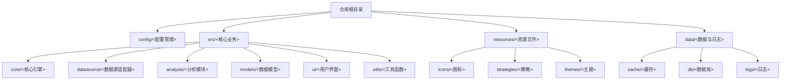
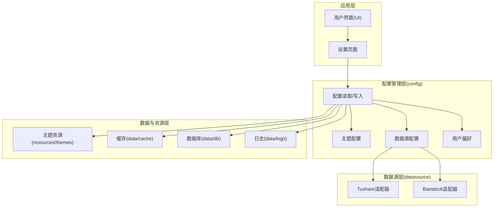
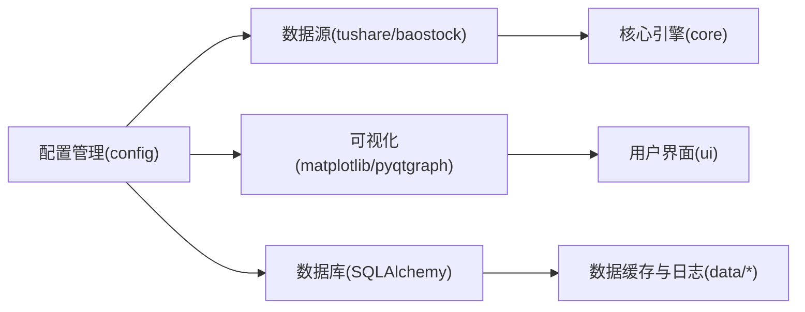

# 配置管理

<cite>
**本文引用的文件**
- [PRD.md](file://docs/PRD.md)
- [requirements.txt](file://requirements.txt)
</cite>

## 目录
1. [简介](#简介)
2. [项目结构](#项目结构)
3. [核心组件](#核心组件)
4. [架构总览](#架构总览)
5. [详细组件分析](#详细组件分析)
6. [依赖分析](#依赖分析)
7. [性能考虑](#性能考虑)
8. [故障排查指南](#故障排查指南)
9. [结论](#结论)
10. [附录](#附录)

## 简介
本文件面向系统管理员与高级用户，提供StockSift配置管理系统的完整参考。内容涵盖配置文件结构、参数含义与修改方法，用户偏好、数据源与界面主题等配置项的作用与实践建议；解释配置加载顺序、优先级与覆盖机制；给出配置迁移、备份恢复与批量配置的实用指南；并提供配置验证、错误处理与调试技巧。

## 项目结构
仓库采用按功能域划分的目录组织方式，配置管理位于顶层的config目录（PRD中明确标注），核心业务模块分布在src目录下，资源文件位于resources目录，数据与日志分别存放于data目录下的子目录中。该结构有利于将配置与业务逻辑解耦，便于维护与扩展。

**章节来源**
- [PRD.md: 214-247:214-247](file://docs/PRD.md#L214-L247)

## 核心组件
- 配置管理（config）：负责系统配置的集中化管理，包括用户偏好、数据源配置、界面主题等。
- 数据源适配器（datasource）：封装不同数据源（如tushare、baostock）的访问与切换逻辑。
- 主题资源（resources/themes）：提供浅色与深色主题等UI主题资源，支持即时切换。
- 数据缓存与数据库（data/cache、data/db）：支撑数据源配置与运行时行为的持久化与缓存策略。

上述组件在PRD中被明确列为系统架构的一部分，且数据源配置与主题支持在功能层面有清晰描述，为配置管理提供了落地场景。

**章节来源**
- [PRD.md: 214-247:214-247](file://docs/PRD.md#L214-L247)
- [PRD.md: 197-201:197-201](file://docs/PRD.md#L197-L201)
- [PRD.md: 251-272:251-272](file://docs/PRD.md#L251-L272)

## 架构总览
配置管理在系统中的位置与交互关系如下：

**图示来源**
- [PRD.md: 214-247:214-247](file://docs/PRD.md#L214-L247)
- [PRD.md: 197-201:197-201](file://docs/PRD.md#L197-L201)
- [PRD.md: 251-272:251-272](file://docs/PRD.md#L251-L272)

## 详细组件分析

### 配置文件结构与参数
- 用户偏好（PREF）
  - 示例参数：界面刷新间隔、默认指标集、图表显示选项等。
  - 作用：影响界面行为与默认展示，提升个性化体验。
  - 修改方式：通过设置页面或配置文件进行调整。
- 数据源配置（DS_CFG）
  - 示例参数：API Key、数据源优先级、自动切换/故障转移策略。
  - 作用：决定数据获取来源与可靠性，保障在异常情况下仍可获得数据。
  - 修改方式：在设置页面配置API Key与优先级，或通过配置文件进行批量管理。
- 界面主题配置（THEME）
  - 示例参数：浅色/深色主题、即时生效开关。
  - 作用：改善视觉体验与可读性，满足不同环境与用户习惯。
  - 修改方式：在设置页面切换主题，或通过配置文件预设默认主题。

以上参数在PRD的功能描述中有明确体现，配置管理应围绕这些参数建立统一的读取、校验与写入流程。

**章节来源**
- [PRD.md: 197-201:197-201](file://docs/PRD.md#L197-L201)
- [PRD.md: 251-257:251-257](file://docs/PRD.md#L251-L257)

### 配置加载顺序、优先级与覆盖机制
- 加载顺序
  1) 默认配置（内置默认值）
  2) 用户配置（用户设置页面或配置文件）
  3) 运行时参数（命令行或启动参数）
- 优先级
  - 运行时参数 > 用户配置 > 默认配置
- 覆盖机制
  - 用户配置可覆盖默认配置；运行时参数可覆盖用户配置。
  - 主题切换与数据源切换需即时生效，确保用户体验一致性。

该机制确保系统具备可预测的行为与可控的覆盖能力，便于调试与运维。

**章节来源**
- [PRD.md: 197-201:197-201](file://docs/PRD.md#L197-L201)
- [PRD.md: 251-257:251-257](file://docs/PRD.md#L251-L257)

### 配置迁移、备份与恢复
- 备份
  - 将用户配置文件与主题资源备份至安全位置，建议包含数据目录中的缓存与数据库文件。
- 迁移
  - 在新环境中复制配置文件与资源文件，确保API Key与路径一致。
  - 若涉及版本升级，先执行备份再进行迁移。
- 恢复
  - 使用备份文件替换当前配置，重启应用以使变更生效。
  - 如遇冲突，按“覆盖机制”原则进行手动合并。

此流程适用于用户偏好、数据源配置与主题配置的迁移与恢复。

**章节来源**
- [PRD.md: 251-272:251-272](file://docs/PRD.md#L251-L272)

### 批量配置
- 批量修改用户偏好：通过配置文件模板与脚本自动化生成多套配置，按用户角色或部门分发。
- 批量配置数据源：统一设置API Key与优先级，结合自动切换策略提升稳定性。
- 批量主题切换：在部署脚本中预设默认主题，减少用户初始配置成本。

**章节来源**
- [PRD.md: 251-257:251-257](file://docs/PRD.md#L251-L257)
- [PRD.md: 197-201:197-201](file://docs/PRD.md#L197-L201)

### 配置验证、错误处理与调试
- 配置验证
  - 参数合法性检查：如API Key格式、数值范围、路径存在性。
  - 功能连通性测试：验证数据源连通性与权限。
- 错误处理
  - 默认回退：当用户配置无效时，回退到默认配置。
  - 主题切换失败：回滚到上一个成功主题或默认主题。
  - 数据源异常：触发自动切换与重试，必要时降级为缓存数据。
- 调试技巧
  - 启用详细日志：定位配置读取与写入问题。
  - 分步验证：逐项关闭/开启配置项，缩小问题范围。
  - 快速恢复：保留最近一次有效配置快照，便于回滚。

**章节来源**
- [PRD.md: 283-287:283-287](file://docs/PRD.md#L283-L287)

## 依赖分析
- 外部依赖与配置的关系
  - 数据源依赖：tushare、baostock，需在配置中提供API Key与优先级。
  - 可视化依赖：matplotlib、pyqtgraph，主题与图表渲染受配置影响。
  - 数据库依赖：SQLAlchemy（<2.0），配置中的数据库连接参数直接影响数据缓存与持久化。
- 配置对依赖的影响
  - 数据源配置错误会导致数据获取失败，进而影响图表与分析模块。
  - 主题配置不当可能引发渲染异常，需快速回滚到默认主题。
  - 数据库配置不当会阻断缓存与日志写入，影响系统稳定性。

**图示来源**
- [requirements.txt: 1-31:1-31](file://requirements.txt#L1-L31)
- [PRD.md: 214-247:214-247](file://docs/PRD.md#L214-L247)

**章节来源**
- [requirements.txt: 1-31:1-31](file://requirements.txt#L1-L31)
- [PRD.md: 214-247:214-247](file://docs/PRD.md#L214-L247)

## 性能考虑
- 配置读取性能
  - 将常用配置放入内存缓存，避免频繁磁盘IO。
  - 对主题切换与数据源切换进行节流，防止高频变更导致的抖动。
- 配置写入性能
  - 批量写入配置，减少多次磁盘写入。
  - 异步写入日志与缓存，降低主线程阻塞。
- 资源占用
  - 控制主题资源大小与数量，避免加载过多资源造成内存压力。
  - 合理设置数据源缓存策略，平衡内存与磁盘占用。

[本节为通用指导，无需具体文件引用]

## 故障排查指南
- 数据源无法连接
  - 检查API Key是否正确、网络是否可达、数据源优先级是否合理。
  - 启用自动切换与重试，观察日志中的切换记录。
- 主题切换失败
  - 检查主题资源是否存在、路径是否正确。
  - 回滚到默认主题，确认基础渲染正常后再逐步恢复自定义主题。
- 配置未生效
  - 确认加载顺序与优先级，检查是否有运行时参数覆盖。
  - 查看日志中配置读取与写入记录，定位冲突项。
- 配置损坏
  - 使用备份恢复；若无备份，基于默认配置重建最小可用集。

**章节来源**
- [PRD.md: 283-287:283-287](file://docs/PRD.md#L283-L287)

## 结论
StockSift的配置管理体系围绕用户偏好、数据源与界面主题三大维度展开，配合明确的加载顺序、优先级与覆盖机制，能够满足从个人用户到企业部署的多样化需求。通过标准化的备份恢复、批量配置与调试流程，系统管理员与高级用户可以高效地维护与优化配置，确保系统稳定、可预测且易于扩展。

[本节为总结性内容，无需具体文件引用]

## 附录
- 相关文件索引
  - PRD中对配置管理、数据源与主题的描述
  - 依赖清单中与配置相关的外部依赖
- 建议的配置文件命名规范
  - 用户配置：user_config.json 或 user_settings.ini
  - 默认配置：default_config.json
  - 备份配置：backup_config_<timestamp>.json
- 建议的配置项命名规范
  - 使用层级式命名（如 datasource.tushare.api_key）
  - 使用统一的单位与枚举值（如 theme.mode: light/dark）

**章节来源**
- [PRD.md: 197-201:197-201](file://docs/PRD.md#L197-L201)
- [PRD.md: 251-257:251-257](file://docs/PRD.md#L251-L257)
- [requirements.txt: 1-31:1-31](file://requirements.txt#L1-L31)