# 项目概述

<cite>
**本文引用的文件**
- [requirements.txt](file://requirements.txt)
- [PRD.md](file://docs/PRD.md)
</cite>

## 目录
1. [引言](#引言)
2. [项目结构](#项目结构)
3. [核心组件](#核心组件)
4. [架构总览](#架构总览)
5. [详细组件分析](#详细组件分析)
6. [依赖关系分析](#依赖关系分析)
7. [性能考量](#性能考量)
8. [故障排查指南](#故障排查指南)
9. [结论](#结论)
10. [附录](#附录)

## 引言
StockSift 是一款面向个人投资者的 A 股桌面选股分析工具，旨在通过多维度筛选、实时分析与可视化展示，帮助用户在短时间内高效发现投资机会。项目以 PyQt6 为 GUI 框架，结合多种数据源与分析算法，构建从“数据获取—分析筛选—策略回测—可视化呈现”的完整闭环，覆盖基础筛选、技术指标、资金流向、财务指标、自选股管理、市场概览与策略回测等核心能力。

设计理念围绕以下三点展开：
- 快速筛选：支持多条件组合，实现秒级全市场股票筛选。
- 实时分析：技术指标实时计算，资金流向追踪，辅助决策。
- 直观展示：K 线图表、数据表格与可视化面板，提升信息密度与可读性。
- 策略回测：验证选股策略的历史表现，输出收益曲线与关键绩效指标。

发展历程与阶段规划体现为四个阶段：MVP 基础功能、技术指标与预警完善、策略回测与多数据源扩展、性能与体验优化。该规划确保产品从最小可行版本逐步演进到具备专业分析能力的成熟工具。

应用场景涵盖：
- 个人投资者日常跟踪与筛选
- 短线/波段交易者的信号捕捉
- 量化爱好者策略开发与验证
- 研究员与分析师的数据整理与可视化

未来规划包括：多数据源接入、策略系统扩展、主题切换、数据导出、性能与用户体验持续优化。

## 项目结构
仓库采用按功能域划分的目录组织方式，核心目录与职责如下：
- config：配置管理（如数据源密钥、缓存策略、界面主题等）
- src：源码主体
  - core：核心引擎（筛选、策略、回测、预警、数据获取）
  - datasource：数据源适配器（抽象与具体实现）
  - analysis：分析模块（技术分析、基本面分析、资金流向、情绪分析）
  - models：数据模型（股票、预警、财务、数据库等）
  - ui：用户界面（主窗口、页面、对话框、组件）
  - utils：工具函数（通用方法）
- data：数据存储（缓存、数据库、日志）
- resources：资源文件（图标、策略模板、主题）
- tests：测试用例
- requirements.txt：运行依赖清单

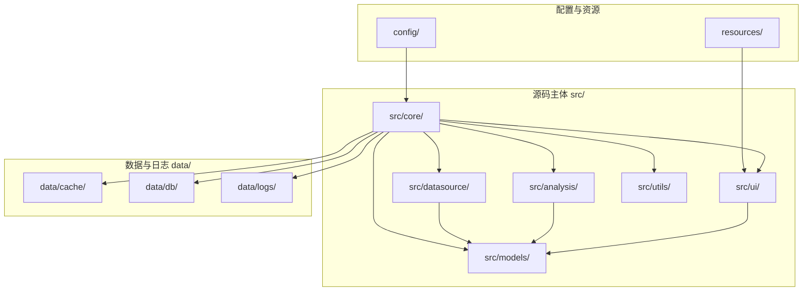

**图示来源**
- [PRD.md:214-247](file://docs/PRD.md#L214-L247)

**章节来源**
- [PRD.md:214-247](file://docs/PRD.md#L214-L247)

## 核心组件
- 筛选引擎（Screener）：支持市场、行业、概念、地域等基础条件，以及技术指标、资金流向、财务指标等多维筛选。
- 策略管理（Strategy）：基于筛选条件定义策略，支持多条件组合与买卖触发条件。
- 回测引擎（Backtest）：提供回测时间范围、初始资金、仓位管理与交易成本设置，输出收益曲线、交易记录与关键指标。
- 预警引擎（Alert Engine）：对价格、涨跌幅、成交量、技术指标等设置阈值，提供弹窗与声音提醒。
- 数据获取（Data Fetcher）：统一调度数据源，支持增量更新与故障转移。
- 数据源适配器（Datasource Adapter）：抽象基类与具体实现（如 tushare、baostock），便于扩展与切换。
- 分析模块（Analysis）：技术分析、资金流向、情绪分析、基本面分析等子模块。
- 数据模型（Models）：股票、财务、预警、数据库等模型，支撑数据持久化与查询。
- 用户界面（UI）：主窗口、页面、对话框与组件，提供交互与可视化。
- 工具函数（Utils）：通用工具方法，贯穿各模块。

**章节来源**
- [PRD.md:214-247](file://docs/PRD.md#L214-L247)

## 架构总览
StockSift 的整体架构遵循“数据驱动 + 模块解耦”的设计原则。核心流程包括：数据源接入 → 数据清洗与缓存 → 分析计算 → 筛选与回测 → 结果可视化与交互。GUI 层通过 PyQt6 提供流畅的桌面体验；分析层通过 pandas/numpy/matplotlib/pyqtgraph 等库实现高性能数据处理与可视化；数据层采用 SQLite 缓存与本地文件存储，兼顾离线可用与扩展性。

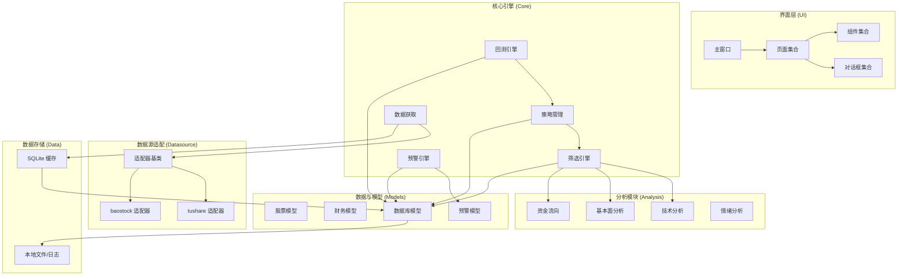

**图示来源**
- [PRD.md:214-247](file://docs/PRD.md#L214-L247)

## 详细组件分析

### 筛选引擎（Screener）
- 职责：接收用户筛选条件，调用分析模块计算技术/资金/财务指标，返回符合条件的股票集合。
- 输入：基础条件（市场/行业/概念/地域）、技术指标条件、资金流向条件、财务指标条件。
- 输出：筛选结果集（股票列表、排序、分页）。
- 特点：支持多条件组合与区间筛选，具备性能优化与缓存策略，满足秒级响应。

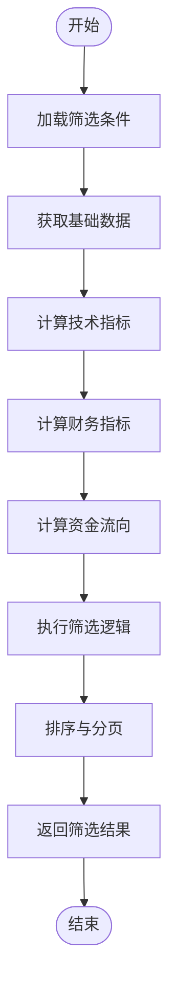

**图示来源**
- [PRD.md:23-74](file://docs/PRD.md#L23-L74)

**章节来源**
- [PRD.md:23-74](file://docs/PRD.md#L23-L74)

### 策略管理（Strategy）
- 职责：将筛选条件封装为可执行策略，定义买入/卖出触发条件，支持策略保存与复用。
- 输入：筛选条件、买卖触发规则、时间窗口。
- 输出：策略对象与回测输入参数。
- 特点：策略可组合、可扩展，便于后续回测与实盘对接。

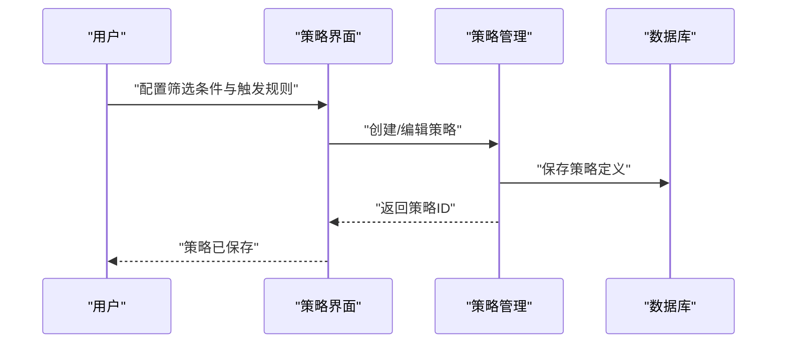

**图示来源**
- [PRD.md:141-158](file://docs/PRD.md#L141-L158)

**章节来源**
- [PRD.md:141-158](file://docs/PRD.md#L141-L158)

### 回测引擎（Backtest）
- 职责：基于策略与历史数据进行回测，生成收益曲线、交易记录与绩效指标。
- 输入：策略、时间范围、初始资金、交易成本、仓位管理。
- 输出：回测报告（图表与指标）。
- 特点：支持参数敏感性分析与报告导出。

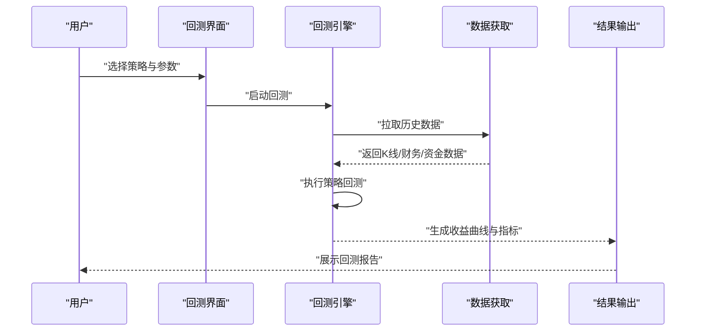

**图示来源**
- [PRD.md:141-158](file://docs/PRD.md#L141-L158)

**章节来源**
- [PRD.md:141-158](file://docs/PRD.md#L141-L158)

### 预警引擎（Alert Engine）
- 职责：对自选股设置多维预警，实时监控并推送通知。
- 输入：股票池、预警规则（价格/涨跌幅/成交量/技术指标）。
- 输出：预警事件与通知。
- 特点：支持多规则并发、去重与静默时段设置。

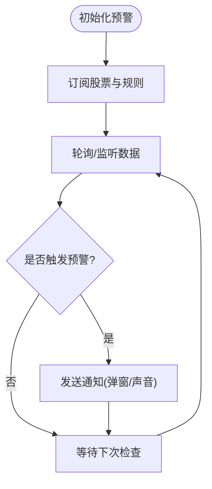

**图示来源**
- [PRD.md:114-119](file://docs/PRD.md#L114-L119)

**章节来源**
- [PRD.md:114-119](file://docs/PRD.md#L114-L119)

### 数据获取（Data Fetcher）
- 职责：统一调度数据源，实现增量更新、失败重试与自动切换。
- 输入：数据类型（股票列表、日线、实时、财务、资金）、时间范围、优先级。
- 输出：标准化数据流。
- 特点：抽象适配器模式，便于扩展新数据源。

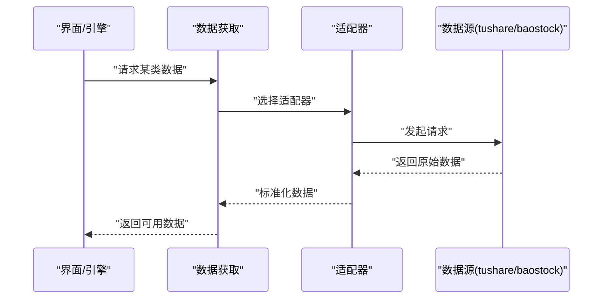

**图示来源**
- [PRD.md:251-272](file://docs/PRD.md#L251-L272)

**章节来源**
- [PRD.md:251-272](file://docs/PRD.md#L251-L272)

### 数据源适配器（Datasource Adapter）
- 职责：屏蔽不同数据源差异，提供统一接口。
- 设计：抽象基类定义标准方法，具体适配器实现 tushare 与 baostock 接口。
- 特点：支持优先级与故障转移，保障稳定性。

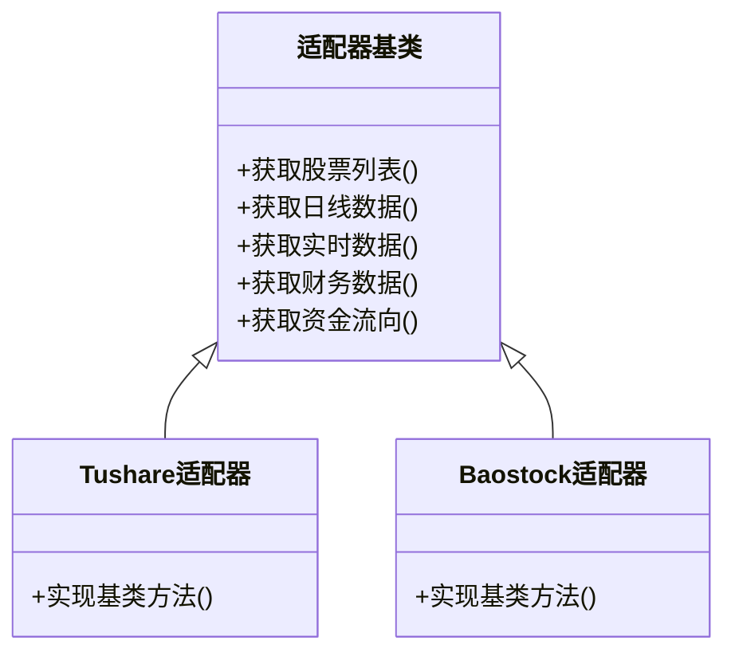

**图示来源**
- [PRD.md:225-228](file://docs/PRD.md#L225-L228)

**章节来源**
- [PRD.md:225-228](file://docs/PRD.md#L225-L228)

### 分析模块（Analysis）
- 技术分析：MA、MACD、KDJ、RSI、布林带、成交量等。
- 资金流向：主力净流入、超大单/大单/中单/小单流向、区间统计。
- 情绪分析：基于新闻与评论的中文文本处理与情感分析。
- 基本面分析：财务指标（营收/净利润增长率、ROE、毛利率、净利率、资产负债率等）。

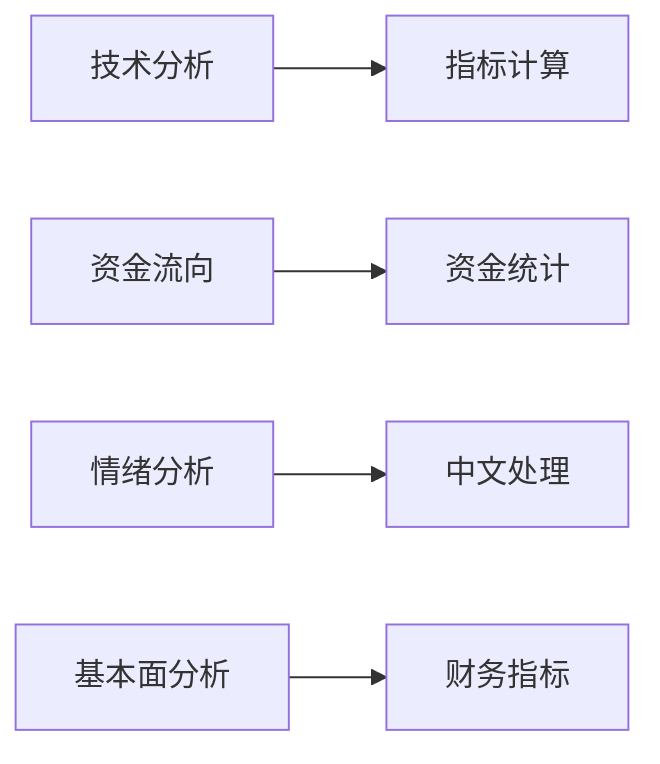

**图示来源**
- [PRD.md:229-233](file://docs/PRD.md#L229-L233)

**章节来源**
- [PRD.md:229-233](file://docs/PRD.md#L229-L233)

### 数据模型（Models）
- 股票模型：代码、名称、行业、地域等。
- 财务模型：季度/年度财务数据。
- 预警模型：规则、状态、通知历史。
- 数据库模型：表结构与关系，支撑缓存与持久化。

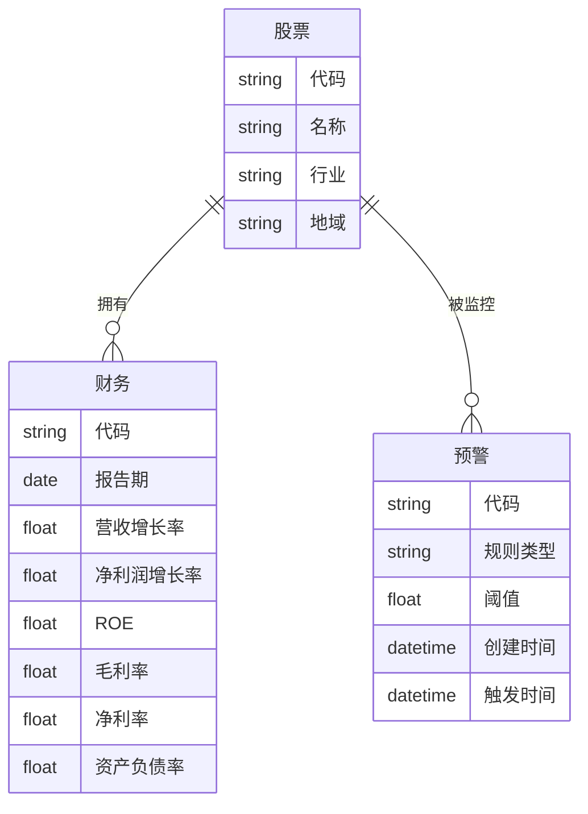

**图示来源**
- [PRD.md:234-238](file://docs/PRD.md#L234-L238)

**章节来源**
- [PRD.md:234-238](file://docs/PRD.md#L234-L238)

### 用户界面（UI）
- 主窗口：菜单、工具栏、状态栏与页面容器。
- 页面：股票筛选器、详情页、自选股、市场概览、策略回测、设置等。
- 组件：图表控件（K线、技术指标叠加）、表格、输入控件、按钮与对话框。
- 特点：基于 PyQt6，支持主题切换与高分辨率适配。

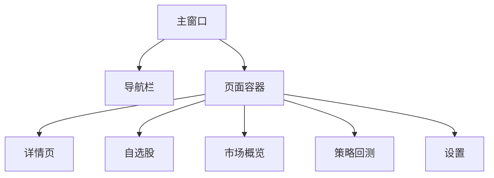

**图示来源**
- [PRD.md:239-244](file://docs/PRD.md#L239-L244)

**章节来源**
- [PRD.md:239-244](file://docs/PRD.md#L239-L244)

## 依赖关系分析
项目依赖以“功能域”为核心进行解耦，核心依赖包括：
- GUI 框架：PyQt6
- 数据源：tushare、baostock
- 数据处理：pandas、numpy
- 可视化：matplotlib、pyqtgraph
- 数据库：sqlalchemy（限定版本）
- 网络请求：requests
- 中文处理与情感分析：jieba、snownlp
- Excel 导出：openpyxl

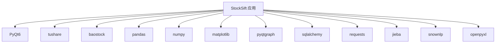

**图示来源**
- [requirements.txt:4-31](file://requirements.txt#L4-L31)

**章节来源**
- [requirements.txt:4-31](file://requirements.txt#L4-L31)

## 性能考量
- 筛选性能：通过多条件组合与缓存策略，确保全市场筛选响应时间小于 3 秒。
- 实时监控：支持同时监控 100+ 自选股，内存占用控制在 500MB 以内。
- 数据更新：采用增量更新与本地缓存，减少重复网络请求与计算开销。
- 可靠性：数据源异常时自动重试与切换，本地缓存保障离线可用。
- 可扩展性：模块化设计便于新增数据源与分析指标，策略系统支持自定义扩展。

**章节来源**
- [PRD.md:275-298](file://docs/PRD.md#L275-L298)

## 故障排查指南
- 数据源异常
  - 现象：筛选或详情页加载缓慢、数据为空。
  - 排查：检查 API Key 配置、网络连通性、数据源优先级与故障转移设置。
  - 处理：切换备用数据源、查看缓存是否可用、重试或手动更新。
- 界面卡顿
  - 现象：页面切换延迟、图表渲染慢。
  - 排查：检查筛选条件复杂度、图表叠加指标数量、内存占用。
  - 处理：简化筛选条件、减少叠加指标、关闭不必要的页面。
- 回测结果异常
  - 现象：收益曲线与预期不符、交易记录缺失。
  - 排查：核对策略参数、时间范围、交易成本与滑点设置。
  - 处理：调整参数、扩大样本期、导出中间结果对比。
- 预警不生效
  - 现象：未收到通知或重复通知。
  - 排查：检查规则阈值、静默时段、通知权限。
  - 处理：修正规则、清理历史事件、重启服务。

**章节来源**
- [PRD.md:283-286](file://docs/PRD.md#L283-L286)

## 结论
StockSift 以 PyQt6 桌面应用为基础，结合多数据源与分析算法，构建了从“数据获取—筛选—回测—可视化”的完整分析链路。其模块化设计与清晰的功能边界，既满足初学者快速上手的需求，也为有经验的开发者提供了扩展空间。随着多数据源接入、策略系统完善与性能优化的推进，StockSift 将逐步成为 A 股智能选股领域的专业工具。

## 附录
- 发展历程与阶段规划
  - MVP：基础框架、数据源接入、基础筛选器、股票详情页、自选股管理。
  - 第二阶段：技术指标筛选、资金流向分析、预警功能、市场概览。
  - 第三阶段：策略回测系统、财务指标筛选、多数据源支持、主题切换。
  - 第四阶段：数据导出功能、性能优化、用户体验优化。
- 应用场景
  - 个人投资者日常跟踪与筛选
  - 短线/波段交易者的信号捕捉
  - 量化爱好者策略开发与验证
  - 研究员与分析师的数据整理与可视化

**章节来源**
- [PRD.md:301-327](file://docs/PRD.md#L301-L327)